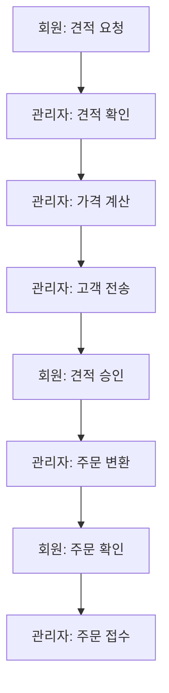
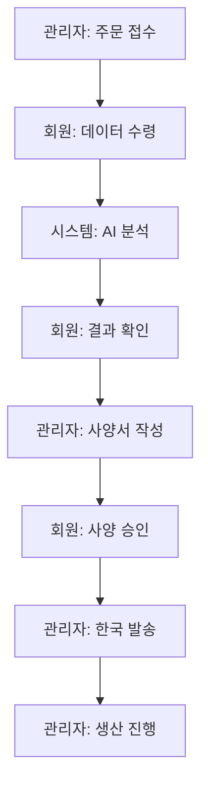
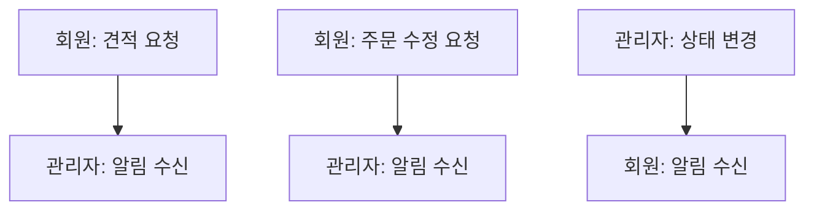
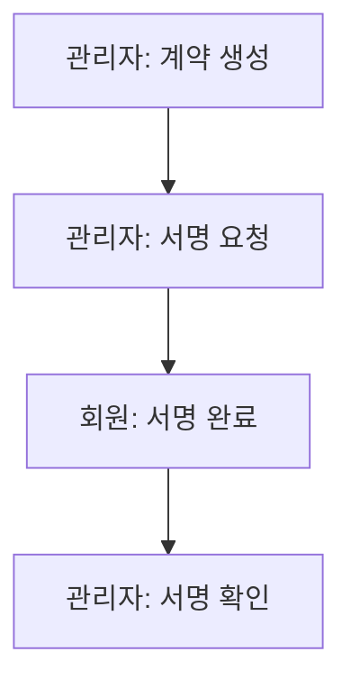
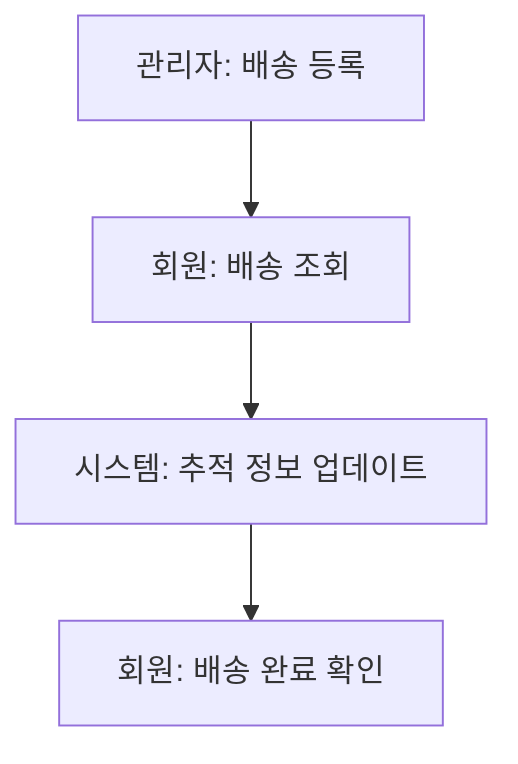

# Epackage Lab 기능 검증 테스트 시나리오

> **작성일**: 2026-02-11
> **검증 대상**: Epackage Lab B2B Packaging Solution 전체 기능
> **테스트 환경**: [개발/스테이징/프로덕션]

---

## 테스트 계정

| 역할 | 이메일 | 비밀번호 |
|------|--------|----------|
| **관리자** | admin@epackage-lab.com | Admin123! |
| **회원** | arwg22@gmail.com | Test1234@ |

---

## 목차

1. [공개 페이지 검증](#1-공개-페이지-검증)
2. [로그인 기능 검증](#2-로그인-기능-검증)
3. [회원 화면 검증](#3-회원-화면-검증)
4. [관리자 화면 검증](#4-관리자-화면-검증)
5. [상호 작용 워크플로우 검증](#5-상호-작용-워크플로우-검증)
6. [API 엔드포인트 검증](#6-api-엔드포인트-검증)
7. [보안 검증](#7-보안-검증)

---

## 1. 공개 페이지 검증

### 1.1 기본 페이지 접근 테스트

| 순서 | 페이지 | URL | 검증 항목 | 예상 결과 | 테스트 결과 |
|------|--------|-----|-----------|-----------|-------------|
| 1 | 홈페이지 | `/` | 페이지 로딩, 히어로 섹션, CTA 버튼 | 정상 표시 | ⬜ / ❌ |
| 2 | 카탈로그 | `/catalog` | 제품 목록, 필터링, 검색 | 정상 표시 | ⬜ / ❌ |
| 3 | 제품 상세 | `/catalog/[slug]` | 제품 정보, 이미지, 가격 | 정상 표시 | ⬜ / ❌ |
| 4 | 가격 페이지 | `/pricing` | 가격 플랜, 비교표 | 정상 표시 | ⬜ / ❌ |
| 5 | 서비스 | `/service` | 서비스 설명, 기능 목록 | 정상 표시 | ⬜ / ❌ |
| 6 | 샘플 요청 | `/samples` | 샘플 요청 폼 | 정상 표시 | ⬜ / ❌ |
| 7 | 문의하기 | `/contact` | 문의 폼, 유효성 검사 | 정상 표시 | ⬜ / ❌ |
| 8 | 회사 소개 | `/about` | 회사 정보 | 정상 표시 | ⬜ / ❌ |
| 9 | 이용약관 | `/terms` | 약관 표시 | 정상 표시 | ⬜ / ❌ |
| 10 | 개인정보처리방침 | `/privacy` | 프라이버시 정책 | 정상 표시 | ⬜ / ❌ |

### 1.2 업계 페이지 테스트

| 순서 | 페이지 | URL | 검증 항목 | 테스트 결과 |
|------|--------|-----|-----------|-------------|
| 1 | 화장품 | `/industry/cosmetics` | 업계 특화 콘텐츠 | ⬜ / ❌ |
| 2 | 식품 제조 | `/industry/food-manufacturing` | 업계 특화 콘텐츠 | ⬜ / ❌ |
| 3 | 제약 | `/industry/pharmaceutical` | 업계 특화 콘텐츠 | ⬜ / ❌ |
| 4 | 전자기기 | `/industry/electronics` | 업계 특화 콘텐츠 | ⬜ / ❌ |

---

## 2. 로그인 기능 검증

### 2.1 관리자 로그인

```bash
# 테스트 계정
이메일: admin@epackage-lab.com
비밀번호: Admin123!
```

| 순서 | 단계 | 검증 항목 | 예상 결과 | 테스트 결과 |
|------|------|-----------|-----------|-------------|
| 1 | 로그인 페이지 접속 | `/auth/signin` | 로그인 폼 표시 | ⬜ / ❌ |
| 2 | 이메일 입력 | admin@epackage-lab.com | 유효성 검사 통과 | ⬜ / ❌ |
| 3 | 비밀번호 입력 | Admin123! | 입력 가능 | ⬜ / ❌ |
| 4 | 로그인 버튼 클릭 | | 인증 처리 | ⬜ / ❌ |
| 5 | 리다이렉트 | `/admin/dashboard` | 대시보드로 이동 | ⬜ / ❌ |
| 6 | 세션 확인 | | HttpOnly Cookie 설정 | ⬜ / ❌ |

### 2.2 회원 로그인

```bash
# 테스트 계정
이메일: arwg22@gmail.com
비밀번호: Test1234@
```

| 순서 | 단계 | 검증 항목 | 예상 결과 | 테스트 결과 |
|------|------|-----------|-----------|-------------|
| 1 | 로그인 페이지 접속 | `/auth/signin` | 로그인 폼 표시 | ⬜ / ❌ |
| 2 | 이메일 입력 | arwg22@gmail.com | 유효성 검사 통과 | ⬜ / ❌ |
| 3 | 비밀번호 입력 | Test1234@ | 입력 가능 | ⬜ / ❌ |
| 4 | 로그인 버튼 클릭 | | 인증 처리 | ⬜ / ❌ |
| 5 | 리다이렉트 | `/member/dashboard` | 대시보드로 이동 | ⬜ / ❌ |
| 6 | 세션 확인 | | HttpOnly Cookie 설정 | ⬜ / ❌ |

### 2.3 로그아웃 테스트

| 순서 | 역할 | 검증 항목 | 예상 결과 | 테스트 결과 |
|------|------|-----------|-----------|-------------|
| 1 | 관리자 | `/auth/signout` | 로그아웃 처리 | ⬜ / ❌ |
| 2 | 홈으로 리다이렉트 | `/` | 세션 삭제 확인 | ⬜ / ❌ |
| 3 | 회원 | `/auth/signout` | 로그아웃 처리 | ⬜ / ❌ |
| 4 | 홈으로 리다이렉트 | `/` | 세션 삭제 확인 | ⬜ / ❌ |

### 2.4 비밀번호 재설정

| 순서 | 단계 | 검증 항목 | 예상 결과 | 테스트 결과 |
|------|------|-----------|-----------|-------------|
| 1 | 비밀번호 찾기 접속 | `/auth/forgot-password` | 폼 표시 | ⬜ / ❌ |
| 2 | 이메일 입력 | | 이메일 전송 | ⬜ / ❌ |
| 3 | 재설정 링크 클릭 | 이메일에서 | `/auth/reset-password` | ⬜ / ❌ |
| 4 | 새 비밀번호 입력 | | 강도 검사 | ⬜ / ❌ |
| 5 | 비밀번호 변경 | | 변경 완료 | ⬜ / ❌ |

---

## 3. 회원 화면 검증

> **테스트 계정**: arwg22@gmail.com / Test1234@

### 3.1 대시보드 (`/member/dashboard`)

| 순서 | 검증 항목 | 세부 내용 | 테스트 결과 |
|------|-----------|----------|-------------|
| 1 | 통계 카드 | 주문 수, 견적 수, 알림 수 표시 | ⬜ / ❌ |
| 2 | 빠른 작업 | 새 견적, 새 주문 버튼 | ⬜ / ❌ |
| 3 | 최근 주문 | 최근 주문 목록 표시 | ⬜ / ❌ |
| 4 | 알림 | 미읽음 알림 표시 | ⬜ / ❌ |

### 3.2 견적 관리

| 순서 | 페이지 | 검증 항목 | 테스트 결과 |
|------|--------|-----------|-------------|
| 1 | 견적 목록 | `/member/quotations` | 목록 표시, 필터링 | ⬜ / ❌ |
| 2 | 새 견적 | `/member/quotations/request` | 제품 선택, 수량 입력 | ⬜ / ❌ |
| 3 | 견적 확인 | `/member/quotations/[id]/confirm` | 확인 화면 표시 | ⬜ / ❌ |
| 4 | 견적 상세 | `/member/quotations/[id]` | 상세 정보 표시 | ⬜ / ❌ |
| 5 | PDF 다운로드 | | PDF 생성 | ⬜ / ❌ |

### 3.3 주문 관리

| 순서 | 페이지 | 검증 항목 | 테스트 결과 |
|------|--------|-----------|-------------|
| 1 | 주문 목록 | `/member/orders` | 목록 표시, 필터링 | ⬜ / ❌ |
| 2 | 새 주문 | `/member/orders/new` | 주문 생성 폼 | ⬜ / ❌ |
| 3 | 주문 확인 | `/member/orders/[id]/confirmation` | 확인 화면 | ⬜ / ❌ |
| 4 | 주문 준비 | `/member/orders/[id]/preparation` | 준비 화면 | ⬜ / ❌ |
| 5 | 재주문 | `/member/orders/reorder` | 이전 주문 복제 | ⬜ / ❌ |
| 6 | 주문 상세 | `/member/orders/[id]` | 상세 정보 표시 | ⬜ / ❌ |
| 7 | 데이터 수령 | `/member/orders/[id]/data-receipt` | 파일 업로드 | ⬜ / ❌ |
| 8 | 사양 승인 | `/member/orders/[id]/spec-approval` | 승인/거절 | ⬜ / ❌ |
| 9 | 주문 수정 | 수정 요청 제출 | ⬜ / ❌ |

### 3.4 주소 관리

| 순서 | 페이지 | 검증 항목 | 테스트 결과 |
|------|--------|-----------|-------------|
| 1 | 청구지 주소 | `/member/billing-addresses` | 목록, 추가, 편집 | ⬜ / ❌ |
| 2 | 배송지 주소 | `/member/deliveries` | 목록, 추가, 편집 | ⬜ / ❌ |

### 3.5 기타 기능

| 순서 | 페이지 | 검증 항목 | 테스트 결과 |
|------|--------|-----------|-------------|
| 1 | 견적서 | `/member/invoices` | 청구서 목록 | ⬜ / ❌ |
| 2 | 계약 | `/member/contracts` | 계약 목록, 전자 서명 | ⬜ / ❌ |
| 3 | 배송 | `/member/shipments` | 배송 조회 | ⬜ / ❌ |
| 4 | 알림 | `/member/notifications` | 알림 목록, 읽음 처리 | ⬜ / ❌ |
| 5 | 프로필 | `/member/profile` | 프로필 표시 | ⬜ / ❌ |
| 6 | 편집 | `/member/edit` | 정보 수정 | ⬜ / ❌ |
| 7 | 설정 | `/member/settings` | 알림 설정, 언어 설정 | ⬜ / ❌ |
| 8 | 샘플 | `/member/samples` | 샘플 요청 | ⬜ / ❌ |
| 9 | 문의 | `/member/inquiries` | 문의 제출 | ⬜ / ❌ |

---

## 4. 관리자 화면 검증

> **테스트 계정**: admin@epackage-lab.com / Admin123!

### 4.1 대시보드 (`/admin/dashboard`)

| 순서 | 검증 항목 | 세부 내용 | 테스트 결과 |
|------|-----------|----------|-------------|
| 1 | 통계 카드 | 주문, 견적, 회원, 매출 | ⬜ / ❌ |
| 2 | 알림 위젯 | 만료 견적, 승인 대기 | ⬜ / ❌ |
| 3 | 빠른 작업 | 승인, 확인 페이지 링크 | ⬜ / ❌ |

### 4.2 주문 관리

| 순서 | 페이지 | 검증 항목 | 테스트 결과 |
|------|--------|-----------|-------------|
| 1 | 주문 목록 | `/admin/orders` | 목록, 필터, 검색 | ⬜ / ❌ |
| 2 | 주문 상세 | `/admin/orders/[id]` | 탭별 정보 표시 | ⬜ / ❌ |
| 3 | 상태 관리 | 상태 변경, 내역 | ⬜ / ❌ |
| 4 | 데이터 수령 | 파일 확인, AI 추출 | ⬜ / ❌ |
| 5 | 수정 파일 | `/admin/orders/[id]/correction-upload` | 파일 업로드 | ⬜ / ❌ |
| 6 | 한국 발송 | 발송 상태 확인 | ⬜ / ❌ |
| 7 | 결제 확인 | 결제 승인 | ⬜ / ❌ |

### 4.3 견적 관리

| 순서 | 페이지 | 검증 항목 | 테스트 결과 |
|------|--------|-----------|-------------|
| 1 | 견적 목록 | `/admin/quotations` | 목록, 필터 | ⬜ / ❌ |
| 2 | 견적 상세 | `/admin/quotations/[id]` | 상세, 비용 내역 | ⬜ / ❌ |
| 3 | PDF 출력 | | PDF 생성 | ⬜ / ❌ |
| 4 | 주문 변환 | 변환 처리 | ⬜ / ❌ |

### 4.4 회원 승인 (`/admin/approvals`)

| 순서 | 검증 항목 | 테스트 결과 |
|------|-----------|-------------|
| 1 | 대기 목록 | `/api/admin/users/pending` | ⬜ / ❌ |
| 2 | 사용자 상세 | 정보 표시 | ⬜ / ❌ |
| 3 | 승인 | `/api/admin/users/[id]/approve` | ⬜ / ❌ |
| 4 | 거절 | `/api/admin/users/reject` | ⬜ / ❌ |
| 5 | 일괄 승인 | `/api/admin/users/approve` | ⬜ / ❌ |

### 4.5 계약 관리

| 순서 | 페이지 | 검증 항목 | 테스트 결과 |
|------|--------|-----------|-------------|
| 1 | 계약 목록 | `/admin/contracts` | 목록, 상태 필터 | ⬜ / ❌ |
| 2 | 계약 상세 | `/admin/contracts/[id]` | 계약 내용 | ⬜ / ❌ |
| 3 | PDF 다운로드 | `/api/admin/contracts/[id]/download` | ⬜ / ❌ |
| 4 | 서명 전송 | `/api/admin/contracts/[id]/send-signature` | ⬜ / ❌ |
| 5 | 리마인더 | `/api/admin/contracts/send-reminder` | ⬜ / ❌ |

### 4.6 고객 관리

| 순서 | 페이지 | 검증 항목 | 테스트 결과 |
|------|--------|-----------|-------------|
| 1 | 고객 목록 | `/admin/customers` | 목록, 필터, 검색 | ⬜ / ❌ |
| 2 | 고객 관리 | `/admin/customers/management` | 관리 기능 | ⬜ / ❌ |
| 3 | 프로필 | `/admin/customers/profile` | 프로필 정보 | ⬜ / ❌ |
| 4 | 주문 | `/admin/customers/orders` | 주문 내역 | ⬜ / ❌ |
| 5 | 문서 | `/admin/customers/documents` | 관련 문서 | ⬜ / ❌ |
| 6 | 지원 | `/admin/customers/support` | 문의 내역 | ⬜ / ❌ |
| 7 | 내보내기 | `/api/admin/customers/management/export` | CSV 다운로드 | ⬜ / ❌ |

### 4.7 생산 관리

| 순서 | 페이지 | 검증 항목 | 테스트 결과 |
|------|--------|-----------|-------------|
| 1 | 생산 작업 | `/api/admin/production/jobs` | 작업 목록 | ⬜ / ❌ |
| 2 | 작업 상세 | `/api/admin/production/jobs/[id]` | 상세 정보 | ⬜ / ❌ |
| 3 | 상태 업데이트 | `/api/admin/production/update-status` | 상태 변경 | ⬜ / ❌ |

### 4.8 배송 관리

| 순서 | 페이지 | 검증 항목 | 테스트 결과 |
|------|--------|-----------|-------------|
| 1 | 배송 목록 | `/admin/shipments` | 목록 표시 | ⬜ / ❌ |
| 2 | 배송 상세 | `/admin/shipments/[id]` | 배송 정보 | ⬜ / ❌ |
| 3 | 추적 | `/api/admin/shipping/tracking/[id]` | 추적 정보 | ⬜ / ❌ |
| 4 | 완료 처리 | `/api/admin/shipping/deliveries/complete` | 완료 처리 | ⬜ / ❌ |
| 5 | 라벨 | `/api/shipments/[id]/label` | 라벨 출력 | ⬜ / ❌ |
| 6 | 픽업 예약 | `/api/shipments/[id]/schedule-pickup` | 예약 처리 | ⬜ / ❌ |

### 4.9 재고 관리

| 순서 | 페이지 | 검증 항목 | 테스트 결과 |
|------|--------|-----------|-------------|
| 1 | 재고 목록 | `/api/admin/inventory/items` | 재고 목록 | ⬜ / ❌ |
| 2 | 입고 기록 | `/api/admin/inventory/receipts` | 입고 처리 | ⬜ / ❌ |
| 3 | 재고 조정 | `/api/admin/inventory/adjust` | 조정 처리 | ⬜ / ❌ |
| 4 | 재고 내역 | `/api/admin/inventory/history/[productId]` | 변경 내역 | ⬜ / ❌ |

### 4.10 알림 관리

| 순서 | 페이지 | 검증 항목 | 테스트 결과 |
|------|--------|-----------|-------------|
| 1 | 알림 목록 | `/admin/notifications` | 목록 표시 | ⬜ / ❌ |
| 2 | 새 알림 | `/api/admin/notifications/create` | 알림 작성 | ⬜ / ❌ |
| 3 | 테스트 메일 | `/api/admin/test-email` | 메일 전송 | ⬜ / ❌ |

### 4.11 설정 관리

| 순서 | 페이지 | 검증 항목 | 테스트 결과 |
|------|--------|-----------|-------------|
| 1 | 시스템 설정 | `/admin/settings` | 설정 표시 | ⬜ / ❌ |
| 2 | 고객 마진 | `/api/admin/settings/customer-markup` | 마진 설정 | ⬜ / ❌ |
| 3 | 캐시 무효화 | `/api/admin/settings/cache/invalidate` | 캐시 삭제 | ⬜ / ❌ |

### 4.12 쿠폰 관리

| 순서 | 페이지 | 검증 항목 | 테스트 결과 |
|------|--------|-----------|-------------|
| 1 | 쿠폰 목록 | `/admin/coupons` | 목록 표시 | ⬜ / ❌ |
| 2 | 쿠폰 생성 | 코드, 할인, 유효기간 | ⬜ / ❌ |
| 3 | 쿠폰 편집 | `/api/admin/coupons/[id]/route` | 편집 처리 | ⬜ / ❌ |

---

## 5. 상호 작용 워크플로우 검증

> **중요**: 이 섹션에서는 회원과 관리자 간의 데이터 연동을 검증합니다.
> 두 계정을 번갈아가며 로그인하여 데이터가 제대로 공유되는지 확인합니다.

### 5.1 견적 → 주문 상호 작용 워크플로우



| 순서 | 역할 | 단계 | 페이지 | 검증 항목 | 테스트 결과 |
|------|------|------|--------|-----------|-------------|
| 1 | **회원** | 견적 요청 | `/member/quotations/request` | 제품 선택, 수량 입력 후 제출 | ⬜ / ❌ |
| 2 | **회원** | 견적 확인 | `/member/quotations` | 내 견적이 목록에 표시됨 | ⬜ / ❌ |
| 3 | **전환** | → 관리자 로그인 | `/auth/signout` → `/auth/signin` | admin@epackage-lab.com으로 로그인 | ⬜ / ❌ |
| 4 | **관리자** | 견적 알림 확인 | `/admin/dashboard` | 새 견적 알림 표시됨 | ⬜ / ❌ |
| 5 | **관리자** | 견적 목록 확인 | `/admin/quotations` | 회원이 요청한 견적이 보임 | ⬜ / ❌ |
| 6 | **관리자** | 견적 상세 | `/admin/quotations/[id]` | 회원이 입력한 내용 확인됨 | ⬜ / ❌ |
| 7 | **관리자** | 가격 계산 | 비용 내역 확인 | 가격 계산 완료 | ⬜ / ❌ |
| 8 | **관리자** | 고객 전송 | 전송 버튼 클릭 | 회원에게 알림 전송 | ⬜ / ❌ |
| 9 | **전환** | → 회원 로그인 | `/auth/signout` → `/auth/signin` | arwg22@gmail.com으로 로그인 | ⬜ / ❌ |
| 10 | **회원** | 견적 확인 | `/member/quotations/[id]/confirm` | 관리자가 보낸 견적 확인됨 | ⬜ / ❌ |
| 11 | **회원** | 견적 승인 | 승인 버튼 클릭 | 승인 완료 | ⬜ / ❌ |
| 12 | **전환** | → 관리자 로그인 | `/auth/signout` → `/auth/signin` | admin@epackage-lab.com으로 로그인 | ⬜ / ❌ |
| 13 | **관리자** | 주문 변환 | `/api/admin/convert-to-order` | 견적을 주문으로 변환 | ⬜ / ❌ |
| 14 | **관리자** | 주문 확인 | `/admin/orders` | 변환된 주문이 목록에 보임 | ⬜ / ❌ |
| 15 | **전환** | → 회원 로그인 | `/auth/signout` → `/auth/signin` | arwg22@gmail.com으로 로그인 | ⬜ / ❌ |
| 16 | **회원** | 주문 확인 | `/member/orders` | 주문이 목록에 표시됨 | ⬜ / ❌ |
| 17 | **회원** | 주문 상세 | `/member/orders/[id]` | 견적 내용이 주문으로 반영됨 | ⬜ / ❌ |

### 5.2 주문 생산 상호 작용 워크플로우



| 순서 | 역할 | 단계 | 페이지 | 검증 항목 | 테스트 결과 |
|------|------|------|--------|-----------|-------------|
| 1 | **관리자** | 주문 접수 | `/admin/orders/[id]` | 주문 상태 확인 | ⬜ / ❌ |
| 2 | **관리자** | 상태 변경 | 데이터 수령 대기 상태로 변경 | ⬜ / ❌ |
| 3 | **전환** | → 회원 로그인 | arwg22@gmail.com | ⬜ / ❌ |
| 4 | **회원** | 데이터 수령 | `/member/orders/[id]/data-receipt` | 파일 업로드 폼 표시 | ⬜ / ❌ |
| 5 | **회원** | 파일 업로드 | 디자인 파일 업로드 | 업로드 완료 | ⬜ / ❌ |
| 6 | **회원** | AI 추출 확인 | 추출 결과 표시됨 | ⬜ / ❌ |
| 7 | **회원** | 추출 승인 | 승인 버튼 클릭 | ⬜ / ❌ |
| 8 | **전환** | → 관리자 로그인 | admin@epackage-lab.com | ⬜ / ❌ |
| 9 | **관리자** | 데이터 확인 | `/admin/orders/[id]` | 회원이 업로드한 파일 보임 | ⬜ / ❌ |
| 10 | **관리자** | AI 추출 결과 | 추출된 데이터 표시됨 | ⬜ / ❌ |
| 11 | **관리자** | 사양서 생성 | `/api/member/spec-sheets/generate` | 사양서 생성 | ⬜ / ❌ |
| 12 | **전환** | → 회원 로그인 | arwg22@gmail.com | ⬜ / ❌ |
| 13 | **회원** | 사양서 확인 | `/member/orders/[id]/spec-approval` | 사양서 표시됨 | ⬜ / ❌ |
| 14 | **회원** | 사양 승인 | 승인 버튼 클릭 | ⬜ / ❌ |
| 15 | **전환** | → 관리자 로그인 | admin@epackage-lab.com | ⬜ / ❌ |
| 16 | **관리자** | 승인 확인 | `/admin/orders/[id]` | 회원 승인 상태 표시됨 | ⬜ / ❌ |
| 17 | **관리자** | 한국 발송 | `/api/admin/orders/[id]/send-to-korea` | 발송 처리 | ⬜ / ❌ |
| 18 | **관리자** | 발송 상태 | `/api/admin/orders/[id]/korea-send-status` | 발송 상태 확인 | ⬜ / ❌ |
| 19 | **전환** | → 회원 로그인 | arwg22@gmail.com | ⬜ / ❌ |
| 20 | **회원** | 생산 진행 확인 | `/member/orders/[id]` | 생산 진행 상태 표시됨 | ⬜ / ❌ |

### 5.3 실시간 알림 상호 작용 테스트



| 순서 | 역할 | 액션 | 검증 항목 | 테스트 결과 |
|------|------|------|-----------|-------------|
| 1 | **회원** | 견적 요청 | `/member/quotations/request`에서 제출 | ⬜ / ❌ |
| 2 | **전환** | → 관리자 | `/admin/notifications` 접속 | ⬜ / ❌ |
| 3 | **관리자** | 알림 확인 | 새 견적 알림 표시됨 | ⬜ / ❌ |
| 4 | **전환** | → 회원 | 주문 수정 요청 제출 | ⬜ / ❌ |
| 5 | **전환** | → 관리자 | `/admin/notifications` 접속 | ⬜ / ❌ |
| 6 | **관리자** | 알림 확인 | 수정 요청 알림 표시됨 | ⬜ / ❌ |
| 7 | **관리자** | 상태 변경 | 주문 상태 변경 | ⬜ / ❌ |
| 8 | **전환** | → 회원 | `/member/notifications` 접속 | ⬜ / ❌ |
| 9 | **회원** | 알림 확인 | 상태 변경 알림 표시됨 | ⬜ / ❌ |

### 5.4 계약 서명 상호 작용 워크플로우



| 순서 | 역할 | 단계 | 페이지 | 검증 항목 | 테스트 결과 |
|------|------|------|--------|-----------|-------------|
| 1 | **관리자** | 계약 생성 | `/admin/contracts` | 계약 작성 | ⬜ / ❌ |
| 2 | **관리자** | 서명 요청 | `/api/admin/contracts/[id]/send-signature` | 서명 요청 전송 | ⬜ / ❌ |
| 3 | **전환** | → 회원 로그인 | arwg22@gmail.com | ⬜ / ❌ |
| 4 | **회원** | 계약 확인 | `/member/contracts` | 서명 대기 계약 표시됨 | ⬜ / ❌ |
| 5 | **회원** | 서명 완료 | 전자 서명 완료 | ⬜ / ❌ |
| 6 | **전환** | → 관리자 로그인 | admin@epackage-lab.com | ⬜ / ❌ |
| 7 | **관리자** | 서명 확인 | `/admin/contracts/[id]` | 서명 완료 상태 표시됨 | ⬜ / ❌ |

### 5.5 배송 추적 상호 작용 워크플로우



| 순서 | 역할 | 단계 | 페이지 | 검증 항목 | 테스트 결과 |
|------|------|------|--------|-----------|-------------|
| 1 | **관리자** | 배송 등록 | `/admin/shipments` | 배송 정보 입력 | ⬜ / ❌ |
| 2 | **관리자** | 송장 번호 | 송장 번호 등록 | ⬜ / ❌ |
| 3 | **전환** | → 회원 로그인 | arwg22@gmail.com | ⬜ / ❌ |
| 4 | **회원** | 배송 조회 | `/member/shipments` | 배송 정보 표시됨 | ⬜ / ❌ |
| 5 | **회원** | 추적 확인 | `/api/member/shipments` | 송장 번호로 추적 | ⬜ / ❌ |
| 6 | **전환** | → 관리자 로그인 | admin@epackage-lab.com | ⬜ / ❌ |
| 7 | **관리자** | 배송 완료 | `/api/admin/shipping/deliveries/complete` | 완료 처리 | ⬜ / ❌ |
| 8 | **전환** | → 회원 로그인 | arwg22@gmail.com | ⬜ / ❌ |
| 9 | **회원** | 완료 확인 | 배송 완료 상태 표시됨 | ⬜ / ❌ |

### 5.6 상태 변경 연동 테스트

| 순서 | 관리자 액션 | 페이지 | 회원 확인 | 페이지 | 테스트 결과 |
|------|-------------|--------|-----------|--------|-------------|
| 1 | 주문 생성 | `/admin/orders` | 주문 표시 | `/member/orders` | ⬜ / ❌ |
| 2 | 상태: 생산 시작 | 상태 변경 | 생산 중 표시 | 주문 상세 | ⬜ / ❌ |
| 3 | 상태: 생산 완료 | 상태 변경 | 생산 완료 표시 | 주문 상세 | ⬜ / ❌ |
| 4 | 상태: 배송 중 | 상태 변경 | 배송 중 표시 | 주문 상세 | ⬜ / ❌ |
| 5 | 상태: 완료 | 상태 변경 | 완료 표시 | 주문 상세 | ⬜ / ❌ |

---

## 6. API 엔드포인트 검증

### 6.1 인증 API

| 엔드포인트 | 메서드 | 검증 항목 | 테스트 결과 |
|------------|--------|-----------|-------------|
| `/api/auth/signin` | POST | 로그인 처리 | ⬜ / ❌ |
| `/api/auth/signout` | POST | 로그아웃 처리 | ⬜ / ❌ |
| `/api/auth/forgot-password` | POST | 비밀번호 재설정 메일 | ⬜ / ❌ |
| `/api/auth/reset-password` | POST | 비밀번호 재설정 | ⬜ / ❌ |

### 6.2 관리자 API

| 카테고리 | 엔드포인트 | 메서드 | 테스트 결과 |
|----------|------------|--------|-------------|
| 대시보드 | `/api/admin/dashboard/unified-stats` | GET | ⬜ / ❌ |
| 주문 | `/api/admin/orders/route` | GET/POST | ⬜ / ❌ |
| 주문 | `/api/admin/orders/[id]/route` | GET/PATCH | ⬜ / ❌ |
| 주문 | `/api/admin/orders/[id]/status` | GET/PATCH | ⬜ / ❌ |
| 주문 | `/api/admin/orders/[id]/send-to-korea` | POST | ⬜ / ❌ |
| 견적 | `/api/admin/quotations/route` | GET | ⬜ / ❌ |
| 견적 | `/api/admin/convert-to-order` | POST | ⬜ / ❌ |
| 계약 | `/api/admin/contracts/workflow` | GET/POST | ⬜ / ❌ |
| 사용자 | `/api/admin/users/pending` | GET | ⬜ / ❌ |
| 사용자 | `/api/admin/users/[id]/approve` | POST | ⬜ / ❌ |
| 알림 | `/api/admin/notifications/route` | GET/POST | ⬜ / ❌ |

### 6.3 회원 API

| 카테고리 | 엔드포인트 | 메서드 | 테스트 결과 |
|----------|------------|--------|-------------|
| 대시보드 | `/api/member/dashboard/unified-stats` | GET | ⬜ / ❌ |
| 주문 | `/api/member/orders/route` | GET/POST | ⬜ / ❌ |
| 주문 | `/api/member/orders/[id]/data-receipt` | POST | ⬜ / ❌ |
| 주문 | `/api/member/orders/[id]/spec-approval` | POST | ⬜ / ❌ |
| 견적 | `/api/member/quotations/route` | GET/POST | ⬜ / ❌ |
| 견적 | `/api/member/quotations/[id]/approve` | POST | ⬜ / ❌ |
| 주소 | `/api/member/addresses/billing` | GET/POST | ⬜ / ❌ |
| 주소 | `/api/member/addresses/delivery` | GET/POST | ⬜ / ❌ |
| 알림 | `/api/member/notifications/route` | GET/POST | ⬜ / ❌ |
| 설정 | `/api/member/settings` | GET/PATCH | ⬜ / ❌ |

---

## 7. 보안 검증

### 7.1 인증/인가

| 항목 | 검증 내용 | 테스트 결과 |
|------|----------|-------------|
| 비밀번호 강도 | 최소 8자, 특수문자 포함 | ⬜ / ❌ |
| 세션 | HttpOnly, Secure, SameSite | ⬜ / ❌ |
| RBAC | 역할별 접근 제어 | ⬜ / ❌ |
| 라우트 보호 | 미인증 접근 거부 | ⬜ / ❌ |
| API 인증 | JWT 토큰 검증 | ⬜ / ❌ |

### 7.2 입력 유효성 검사

| 항목 | 검증 내용 | 테스트 결과 |
|------|----------|-------------|
| SQL 인젝션 | 프리페어드 스테이트먼트 | ⬜ / ❌ |
| XSS | 이스케이프 처리 | ⬜ / ❌ |
| CSRF | 토큰 검증 | ⬜ / ❌ |
| 파일 업로드 | 형식, 크기 제한 | ⬜ / ❌ |

---

## 8. 테스트 결과 요약

### 8.1 테스트 기록

| 일자 | 기능 | 담당 | 결과 | 비고 |
|------|------|------|------|------|
| YYYY-MM-DD | [기능명] | [이름] | ⬜ 통과 / ❌ 실패 | 상세 |
| | | | | |

### 8.2 통계

| 카테고리 | 전체 | 통과 | 실패 | 진행중 |
|----------|------|------|------|--------|
| 공개 페이지 | - | - | - | - |
| 로그인 기능 | - | - | - | - |
| 회원 화면 | - | - | - | - |
| 관리자 화면 | - | - | - | - |
| 상호 작용 워크플로우 | - | - | - | - |
| **합계** | - | - | - | - |

---

## 9. 버그 보고서

### 버그 보고서

| ID | 발견일 | 심각도 | 제목 | 상태 | 담당 |
|----|--------|--------|------|------|------|
| BUG-001 | YYYY-MM-DD | P0/P1/P2/P3 | [버그 제목] | [열림/진행중/해결] | [이름] |

### 버그 상세 템플릿

```markdown
## BUG-[ID]

### 발견일
YYYY-MM-DD

### 심각도
- [ ] P0 (크리티컬)
- [ ] P1 (중요)
- [ ] P2 (일반)
- [ ] P3 (사소)

### 제목
[버그 제목]

### 재현 단계
1. 단계 1
2. 단계 2
3. 단계 3

### 예상 동작
[예상되는 정상 동작]

### 실제 동작
[실제로 발생한 동작]

### 스크린샷
[스크린샷 또는 로그]

### 환경
- 브라우저:
- OS:
- 기타:

### 담당자
[이름]

### 상태
- [ ] 열림
- [ ] 진행중
- [ ] 해결됨
- [ ] 재현 불가
```

---

## 10. 테스트 완료 체크리스트

### 릴리스 전 확인

- [ ] 모든 P0 버그 해결
- [ ] P1 버그 80% 이상 해결
- [ ] P2-P3 버그 50% 이상 해결
- [ ] 상호 작용 워크플로우 전체 검증 완료
- [ ] 견적 → 주문 연동 검증 완료
- [ ] 주문 생산 연동 검증 완료
- [ ] 실시간 알림 연동 검증 완료
- [ ] 계약 서명 연동 검증 완료
- [ ] 배송 추적 연동 검증 완료
- [ ] 상태 변경 연동 검증 완료

---

## 부록: 테스트 실행 방법

### 수동 테스트

1. 각 페이지에 접근하여 표시 확인
2. 각 폼에 입력하여 유효성 검사 확인
3. 각 버튼 클릭하여 동작 확인
4. 에러 케이스 테스트

### 상호 작용 테스트 팁

```
1. 두 브라우저를 사용하세요:
   - 브라우저 1: 회원 계정 (arwg22@gmail.com)
   - 브라우저 2: 관리자 계정 (admin@epackage-lab.com)

2. 시나리오:
   - 회원이 견적을 요청 → 관리자가 확인
   - 관리자가 주문 상태 변경 → 회원이 확인
   - 양쪽의 알림 센터를 주기적으로 확인

3. 데이터 확인:
   - 회원이 생성한 데이터가 관리자에게 보이는지
   - 관리자가 변경한 상태가 회원에게 보이는지
   - 알림이 실시간으로 전달되는지
```

---

## 테스트 계정 로그인 순서

### 회원 먼저 테스트할 때

```bash
1. 브라우저 1: arwg22@gmail.com / Test1234@ 로그인
2. 견적 요청 생성
3. 브라우저 2: admin@epackage-lab.com / Admin123! 로그인
4. 견적 확인 및 가격 계산
5. 브라우저 1: 견적 승인
6. 브라우저 2: 주문 변환
7. 브라우저 1: 주문 확인
```

### 관리자 먼저 테스트할 때

```bash
1. 브라우저 2: admin@epackage-lab.com / Admin123! 로그인
2. 대시보드 상태 확인
3. 브라우저 1: arwg22@gmail.com / Test1234@ 로그인
4. 견적/주문 생성
5. 브라우저 2: 데이터 확인 및 처리
6. 브라우저 1: 변경 사항 확인
```

---

**테스트 완료 후 이 문서를 저장하고 결과를 보고해 주세요.**
