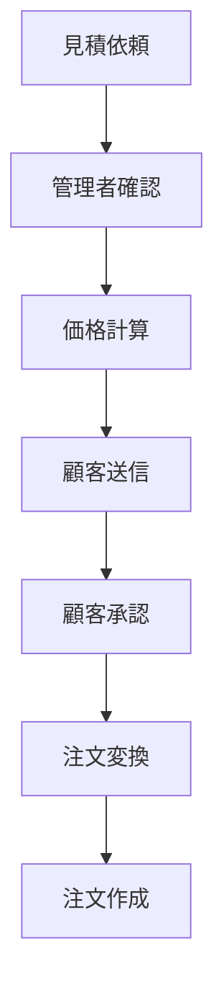
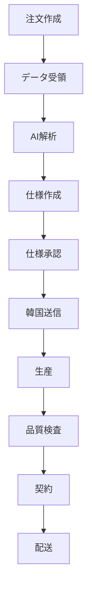
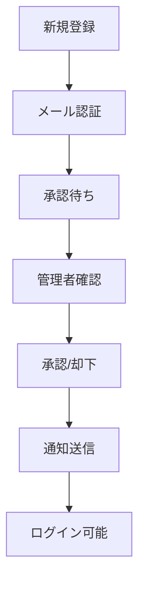
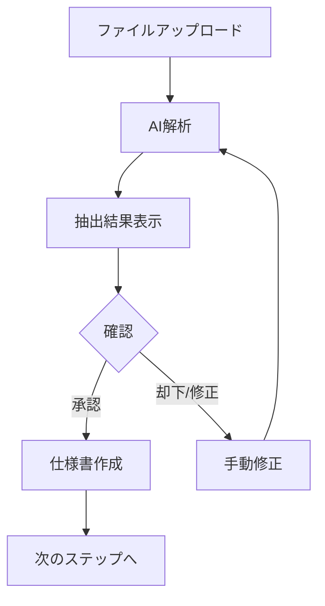
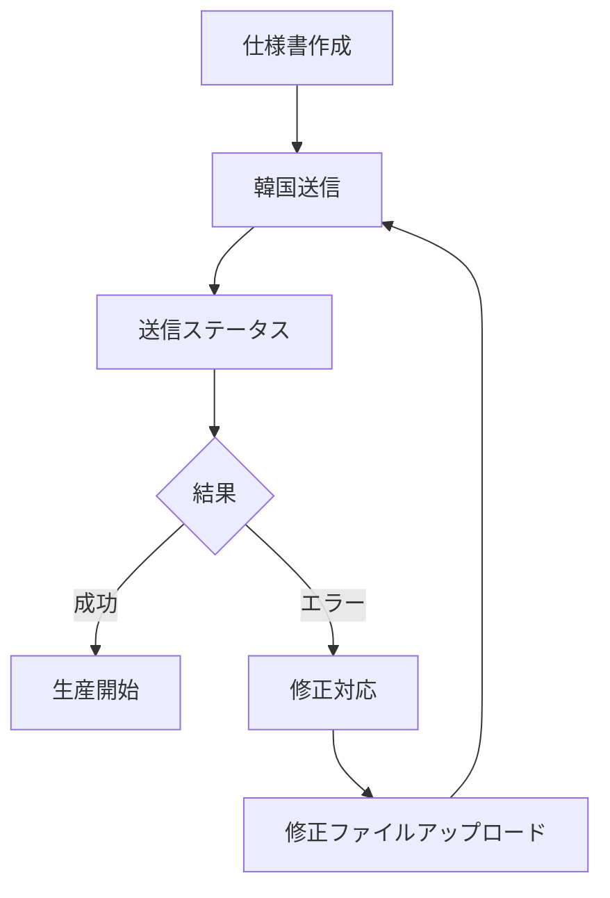
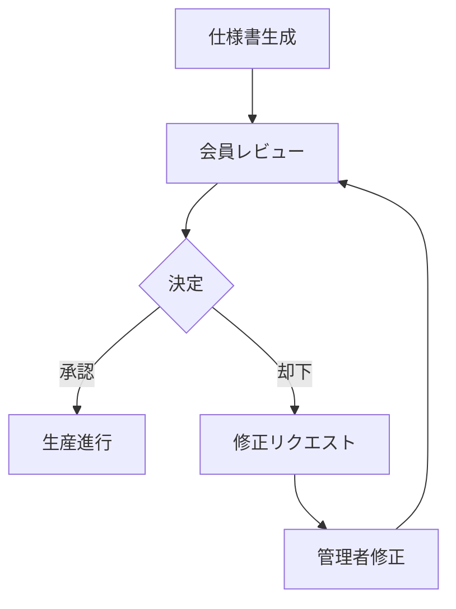

# Epackage Lab 機能検証チェックリスト

> **作成日**: 2026-02-11
> **対象**: Epackage Lab B2B Packaging Solution 全機能

---

## 目次

1. [パブリックページ検証](#1-パブリックページ検証)
2. [認証機能検証](#2-認証機能検証)
3. [会員画面検証](#3-会員画面検証)
4. [管理画面検証](#4-管理画面検証)
5. [API エンドポイント検証](#5-api-エンドポイント検証)
6. [ワークフロー検証](#6-ワークフロー検証)
7. [セキュリティ検証](#7-セキュリティ検証)
8. [パフォーマンス検証](#8-パフォーマンス検証)
9. [AI抽出・データ解析検証](#9-ai抽出データ解析検証)
10. [在庫管理検証](#10-在庫管理検証)
11. [契約署名詳細検証](#11-契約署名詳細検証)
12. [配送管理詳細検証](#12-配送管理詳細検証)

---

## 1. パブリックページ検証

### 1.1 基本ページ

| ページ | パス | 検証項目 |
|--------|------|----------|
| ホームページ | `/` | ページ表示、ヒーローセクション、CTAボタン、製品紹介 |
| カタログ | `/catalog` | 製品一覧表示、フィルタリング、検索機能 |
| 製品詳細 | `/catalog/[slug]` | 製品情報、画像、価格、関連製品 |
| 価格ページ | `/pricing` | 価格プラン表示、比較表 |
| サービス | `/service` | サービス説明、機能一覧 |
| サンプル依頼 | `/samples` | サンプルリクエストフォーム |
| お問い合わせ | `/contact` | お問い合わせフォーム、バリデーション |
| お問い合わせ完了 | `/contact/thank-you` | サンクスページ表示 |
| 会社概要 | `/about` | 会社情報、チーム紹介 |
| 法的情報 | `/legal` | 法的情報表示 |
| 利用規約 | `/terms` | 利用規約の表示とアクセシビリティ |
| プライバシー | `/privacy` | プライバシーポリシー表示 |
| CSR | `/csr` | CSR活動情報 |
| ニュース | `/news` | ニュース一覧、詳細ページ |
| アーカイブ | `/archives` | アーカイブコンテンツ |

### 1.2 業界ページ

| ページ | パス | 検証項目 |
|--------|------|----------|
| 化粧品 | `/industry/cosmetics` | 業界特化コンテンツ、製品案内 |
| 食品製造 | `/industry/food-manufacturing` | 業界特化コンテンツ |
| 医薬品 | `/industry/pharmaceutical` | 業界特化コンテンツ |
| 電子機器 | `/industry/electronics` | 業界特化コンテンツ |

### 1.3 ガイドページ

| ページ | パス | 検証項目 |
|--------|------|----------|
| ガイドTOP | `/guide` | ガイド一覧 |
| サイズガイド | `/guide/size` | サイズ選択ガイド |
| カラーガイド | `/guide/color` | 色見本、選択肢 |
| 画像ガイド | `/guide/image` | 画像仕様 |
| しろはん | `/guide/shirohan` | 特殊ガイド |
| 環境表示 | `/guide/environmentaldisplay` | 環境表示ガイド |

### 1.4 機能ページ

| 機能 | パス | 検証項目 |
|------|------|----------|
| 会員ページ | `/members` | 会員情報、登録案内 |
| プレミアムコンテンツ | `/premium-content` | コンテンツアクセス制御 |
| 見積シミュレーター | `/quote-simulator` | 見積計算機能 |
| データテンプレート | `/data-templates` | テンプレートダウンロード |
| 印刷 | `/print` | 印刷プレビュー |
| デザインシステム | `/design-system` | デザインガイドライン |
| フロー | `/flow` | ワークフロー説明 |
| 比較 | `/compare` | 製品比較機能 |
| 比較共有 | `/compare/shared` | 共有リンク機能 |
| カート | `/cart` | カート機能、追加・削除 |

---

## 2. 認証機能検証

### 2.1 新規登録フロー

| ステップ | 検証項目 |
|----------|----------|
| **登録フォーム** (`/auth/register`) | |
| - フォーム表示 | 全項目表示、プレースホルダー |
| - 入力バリデーション | メール形式、パスワード強度、必須項目 |
| - 重複チェック | 既存メールアドレス検出 |
| **プロフィール作成** | |
| - 会社情報入力 | 会社名、部署、役職 |
| - 連絡先情報 | 電話番号、住所 |
| **メール認証** | |
| - 認証メール送信 | `/api/auth/verify-email` |
| - 認証リンク | 有効期限、トークン検証 |
| - 再送機能 | `/api/auth/resend-verification` |
| **管理者承認** | |
| - 承認待ち状態 | `/auth/pending` 表示 |
| - 承認通知 | メール通知 |
| **承認後ログイン** | ダッシュボードリダイレクト |

### 2.2 ログイン機能

| 機能 | 検証項目 |
|------|----------|
| **フォームログイン** (`/auth/signin`) | |
| - メール/パスワード入力 | バリデーション |
| - 認証処理 | `/api/auth/signin` |
| - セッション管理 | HttpOnly Cookie |
| - エラーハンドリング | 認証失敗メッセージ |
| **リダイレクト処理** | |
| - 管理者 → `/admin/dashboard` |
| - 会員 → `/member/dashboard` |
| - 保留中 → `/auth/pending` |
| - 停止中 → `/auth/suspended` |
| **ログアウト** (`/auth/signout`) | |
| - セッション破棄 | `/api/auth/signout` |
| - Cookie 削除 |
| - ホームへリダイレクト |

### 2.3 パスワードリセット

| 機能 | 検証項目 |
|------|----------|
| **パスワード忘れ** (`/auth/forgot-password`) | |
| - メール入力 | 存在チェック |
| - リセットメール送信 | `/api/auth/forgot-password` |
| - 有効期限 | トークン有効期間 |
| **パスワード再設定** (`/auth/reset-password`) | |
| - トークン検証 | `/api/auth/reset-password` |
| - 新パスワード入力 | 強度バリデーション |
| - 確認パスワード | 一致チェック |
| - 完了通知 | ログイン促進 |

### 2.4 セッション管理

| 機能 | 検証項目 |
|------|----------|
| **セッション永続化** | |
| - Cookie 設定 | HttpOnly, Secure, SameSite |
| - 有効期限 | 自動ログアウト |
| - リフレッシュ | トークン更新 |
| **同時ログイン** | |
| - 複数デバイス | セッション管理 |
| - セッション一覧 | 現在のログイン状態 |
| **AuthContext** | |
| - 状態管理 | ユーザー情報、ロール |
| - ローディング状態 | 読み込み中表示 |
| - エラーハンドリング | 認証エラー処理 |

### 2.5 エラーページ

| ページ | パス | 検証項目 |
|--------|------|----------|
| **エラーページ** | `/auth/error` | エラー表示、戻るリンク |
| **アカウント停止** | `/auth/suspended` | 停止理由、サポート連絡先 |
| **フォームPOST** | `/auth/signin/form-post` | フォームPOST専用処理 |

---

## 3. 会員画面検証

### 3.1 ダッシュボード (`/member/dashboard`)

| 機能 | 検証項目 |
|------|----------|
| **統計表示** | |
| - 注文統計 | 件数、ステータス別 |
| - 見積統計 | 保留中、承認待ち |
| - 通知数 | 未読カウント |
| - クイックアクション | 新規見積、新規注文 |
| **ウォレット** | |
| - 残高表示 | 現在の残高 |
| - 取引履歴 | 入出金履歴 |
| **アラート** | |
| - 期限切れ見積 | 一覧表示 |
| - 承認待ち | アクション促進 |
| - 重要な通知 | バナー表示 |

### 3.2 見積管理

| 機能 | 検証項目 |
|------|----------|
| **見積一覧** (`/member/quotations`) | |
| - リスト表示 | ステータス、日付、金額 |
| - フィルタリング | ステータス、日付範囲 |
| - 検索 | 見積番号、顧客名 |
| - ページネーション | ページ切り替え |
| **新規見積** (`/member/quotations/request`) | |
| - 製品選択 | カタログから選択 |
| - 数量入力 | 複数数量対応 |
| - オプション選択 | サイズ、色、印刷 |
| - 価格計算 | リアルタイム計算 |
| - 保存 | 下書き保存 |
| - 送信 | 管理者へ送信 |
| **見積確認** (`/member/quotations/[id]/confirm`) | |
| - 確認画面 | 見積内容最終確認 |
| - 支払い確認 | `/api/member/quotations/[id]/confirm-payment` |
| - 請求書生成 | `/api/member/quotations/[id]/invoice` |
| **見積詳細** (`/member/quotations/[id]`) | |
| - 詳細表示 | 製品、数量、価格 |
| - PDFダウンロード | `/api/member/quotations/[id]/export` |
| - PDF保存 | `/api/member/quotations/[id]/save-pdf` |
| - 承認アクション | `/api/member/quotations/[id]/approve` |
| - 注文変換 | `/api/member/quotations/[id]/convert` |

### 3.3 注文管理

| 機能 | 検証項目 |
|------|----------|
| **注文一覧** (`/member/orders`) | |
| - リスト表示 | ステータス、日付、金額 |
| - ステータスフィルタ | 全ステータス |
| - 検索機能 | 注文番号、製品名 |
| - ソート | 日付、金額、ステータス |
| **新規注文** (`/member/orders/new`) | |
| - 注文作成フォーム | 製品選択、数量入力 |
| - オプション選択 | サイズ、色、印刷 |
| - 価格計算 | リアルタイム計算 |
| **注文確認** (`/member/orders/[id]/confirmation`) | |
| - 確認画面 | 注文内容最終確認 |
| - 注文確定 | 注文完了処理 |
| **注文準備** (`/member/orders/[id]/preparation`) | |
| - 仕様品目リスト | OrderSpecificationItemList |
| - データ入力準備 | アップロード前準備 |
| **再注文** (`/member/orders/reorder`) | |
| - 再注文機能 | 過去注文から複製 |
| - 注文内容編集 | 変更可能 |
| **注文詳細** (`/member/orders/[id]`) | |
| - 基本情報 | 注文番号、日付、ステータス |
| - 製品詳細 | 品目、数量、単価 |
| - 配送先情報 | 表示、編集 |
| - 請求先情報 | 表示、編集 |
| - 進捗タイムライン | 各ステータス表示 |
| - コメント管理 | `/api/member/orders/[id]/comments` |
| - 住所更新 | 請求先、配送先更新 |
| **データ受領** (`/member/orders/[id]/data-receipt`) | |
| - ファイルアップロード | デザインファイル |
| - ファイル管理 | `/api/member/orders/[id]/data-receipt/files/[fileId]` |
| - AI抽出 | 自動解析 |
| - 確認機能 | 抽出結果確認 |
| - 修正機能 | 抽出結果編集 |
| **仕様承認** (`/member/orders/[id]/spec-approval`) | |
| - 仕様書表示 | 仕様詳細 |
| - 承認アクション | `/api/member/orders/[id]/spec-approval` |
| - 承認リクエスト | `/api/member/orders/[id]/approvals` |
| - 却下理由入力 | 却下時の理由 |
| **生産進捗** | |
| - 進捗表示 | 各段階のステータス |
| - 生産ログ | `/api/member/orders/[id]/production-logs` |
| - 生産データ | `/api/member/orders/[id]/production-data` |
| - トラッキング | `/api/member/orders/[id]/tracking` |
| **修正依頼** | |
| - 修正リクエスト | `/api/member/orders/[id]/specification-change` |
| - 承認フロー | 修正承認 |
| - リビジョン履歴 | `/api/member/orders/[id]/design-revisions` |
| - キャンセルリクエスト | `/api/member/orders/[id]/request-cancellation` |

### 3.4 住所管理

| 機能 | 検証項目 |
|------|----------|
| **請求先住所** (`/member/billing-addresses`) | |
| - 一覧表示 | 登録済み住所 |
| - 新規追加 | `/api/member/addresses/billing` |
| - 編集 | `/api/member/addresses/billing/[id]` |
| - 削除 | 使用中チェック |
| - デフォルト設定 | デフォルト選択 |
| **配送先住所** (`/member/deliveries`) | |
| - 一覧表示 | 登録済み住所 |
| - 新規追加 | `/api/member/addresses/delivery` |
| - 編集 | `/api/member/addresses/delivery/[id]` |
| - 削除 | 使用中チェック |
| - デフォルト設定 | デフォルト選択 |

### 3.5 サンプル・問い合わせ

| 機能 | 検証項目 |
|------|----------|
| **サンプル依頼** (`/member/samples`) | |
| - 依頼フォーム | 製品、数量、目的 |
| - 送信 | `/api/member/samples` |
| - 履歴表示 | 過去の依頼 |
| **問い合わせ** (`/member/inquiries`) | |
| - 問い合わせフォーム | カテゴリ、件名、内容 |
| - 送信 | `/api/member/inquiries` |
| - 履歴表示 | 過去の問い合わせ |
| - 返信表示 | 管理者からの返信 |

### 3.6 その他の機能

| 機能 | 検証項目 |
|------|----------|
| **請求書** (`/member/invoices`) | |
| - 一覧表示 | 請求書リスト |
| - PDFダウンロード | `/api/member/invoices/[invoiceId]/download` |
| **契約** (`/member/contracts`) | |
| - 契約一覧 | 全契約書 |
| - 契約詳細 | 内容表示 |
| - 電子署名 | 署名フロー |
| **配送** (`/member/shipments`) | |
| - 配送一覧 | 配送履歴 |
| - トラッキング | `/api/member/shipments` |
| **通知** (`/member/notifications`) | |
| - 通知一覧 | 全通知 |
| - 既読処理 | `/api/member/notifications/[id]/read` |
| - 全既読 | `/api/member/notifications/mark-all-read` |
| - 全削除 | `/api/member/notifications/delete-all` |
| **プロフィール** (`/member/profile`) | |
| - プロフィール表示 | ユーザー情報 |
| - 編集 (`/member/edit`) | |
| - 会社情報更新 | |
| - 連絡先更新 | |
| - パスワード変更 | |
| **設定** (`/member/settings`) | |
| - 通知設定 | 通知ON/OFF |
| - 言語設定 | 言語選択 |
| - アカウント削除 | `/api/member/delete-account` |
| **はんこアップロード** | |
| - アップロード | `/api/member/hanko/upload` |
| - 画像確認 | プレビュー表示 |
| **入庫管理** | |
| - 入庫登録 | `/api/member/stock-in` |
| - 入庫確認 | 在庫反映 |
| **証明書生成** | |
| - 生成リクエスト | `/api/member/certificates/generate` |
| - PDFダウンロード | 証明書取得 |
| **仕様書管理** | |
| - 仕様書生成 | `/api/member/spec-sheets/generate` |
| - 仕様書承認 | `/api/member/spec-sheets/[id]/approve` |
| - 仕様書却下 | `/api/member/spec-sheets/[id]/reject` |
| **招待機能** | |
| - 招待送信 | `/api/member/invites/send` |
| - 招待承認 | `/api/member/invites/accept` |
| **AI抽出** | |
| - アップロード | `/api/member/ai-extraction/upload` |
| - 抽出ステータス | `/api/member/ai-extraction/status` |
| - 抽出承認 | `/api/member/ai-extraction/approve` |
| **韓国送信** | |
| - 修正一覧 | `/api/member/korea/corrections` |
| - 修正アップロード | `/api/member/korea/corrections/[id]/upload` |
| - データ送信 | `/api/member/korea/send-data` |
| **認証関連** | |
| - メール認証 | `/api/member/auth/verify-email` |
| - 再送機能 | `/api/member/auth/resend-verification` |
| **ファイル管理** | |
| - ファイルアップロード | `/api/member/files/upload` |
| - ファイル抽出 | `/api/member/files/[id]/extract` |
| **作業指示書** | |
| - 作業指示書一覧 | `/api/member/work-orders` |

---

## 4. 管理画面検証

### 4.1 ダッシュボード (`/admin/dashboard`)

| 機能 | 検証項目 |
|------|----------|
| **統計カード** | |
| - 注文統計 | 新規、進行中、完了 |
| - 見積統計 | 保留、承認待ち |
| - 会員統計 | 新規、保留中 |
| - 売上統計 | 期間別売上 |
| **アラートウィジェット** | |
| - 期限切れ見積 | 一覧表示 |
| - 承認待ち会員 | 承認リンク |
| - 在庫アラート | 低在庫製品 |
| **クイックアクション** | |
| - 新規会員承認 | 承認ページへ |
| - 新規見積確認 | 見積一覧へ |
| - 注文一覧 | 注文管理へ |

### 4.2 注文管理

| 機能 | 検証項目 |
|------|----------|
| **注文一覧** (`/admin/orders`) | |
| - リスト表示 | 全注文 |
| - フィルタリング | ステータス、日付、顧客 |
| - 検索 | 注文番号、顧客名 |
| - 一括操作 | ステータス一括更新 |
| **注文詳細** (`/admin/orders/[id]`) | |
| - 基本情報タブ | 注文詳細 |
| - 品目タブ | 注文品目管理 |
| - アドレスタブ | 請求先/配送先 |
| - 進捗タブ | ステータス履歴 |
| - ファイルタブ | 関連ファイル |
| - コメントタブ | 注文コメント |
| **ステータス管理** | |
| - ステータス更新 | `/api/admin/orders/[id]/status` |
| - 履歴表示 | `/api/admin/orders/[id]/status-history` |
| - 生産開始 | `/api/admin/orders/[id]/start-production` |
| **データ受領** | |
| - データ受領管理 | `/api/admin/orders/[id]/data-receipt` |
| - ファイル確認 | アップロードファイル |
| - AI抽出確認 | 抽出結果 |
| - 修正ファイル | `/admin/orders/[id]/correction-upload` |
| **仕様管理** | |
| - 仕様書生成 | spec sheet 作成 |
| - 仕様変更 | `/api/admin/orders/[id]/specification-change` |
| - 韓国送信 | `/api/admin/orders/[id]/send-to-korea` |
| - 送信ステータス | `/api/admin/orders/[id]/korea-send-status` |
| **支払い管理** | |
| - 支払い確認 | `/admin/orders/[id]/payment-confirmation` |
| - 割引適用 | `/api/admin/orders/[id]/apply-discount` |
| **その他** | |
| - メモ追加 | `/api/admin/orders/[id]/notes` |
| - コメント | `/api/admin/orders/[id]/comments` |
| - PDF出力 | 納品書生成 |
| - キャンセル | `/api/admin/orders/[id]/cancellation` |

### 4.3 見積管理

| 機能 | 検証項目 |
|------|----------|
| **見積一覧** (`/admin/quotations`) | |
| - リスト表示 | 全見積 |
| - フィルタリング | ステータス、顧客 |
| - 検索機能 | 見積番号、顧客名 |
| **見積詳細** (`/admin/quotations/[id]`) | |
| - 基本情報 | 見積詳細 |
| - コスト内訳 | `/api/admin/quotations/[id]/cost-breakdown` |
| - 価格編集 | マージン調整 |
| - PDF出力 | `/api/admin/quotations/[id]/export` |
| - 顧客送信 | 送信メール |
| **注文変換** | |
| - 注文変換 | `/api/admin/convert-to-order` |
| - 変換確認 | 画面表示 |

### 4.4 会員承認 (`/admin/approvals`)

| 機能 | 検証項目 |
|------|----------|
| **保留中ユーザー** | |
| - 一覧表示 | `/api/admin/users/pending` |
| - ユーザー詳細 | プロフィール情報 |
| - 承認アクション | `/api/admin/users/[id]/approve` |
| - 却下アクション | `/api/admin/users/reject` |
| - 一括承認 | `/api/admin/users/approve` |
| **通知** | |
| - 承認通知メール | 送信確認 |
| - 却下通知メール | 送信確認 |

### 4.5 契約管理

| 機能 | 検証項目 |
|------|----------|
| **契約一覧** (`/admin/contracts`) | |
| - リスト表示 | 全契約 |
| - ステータスフィルタ | 下書き、送信中、署名済み |
| - ワークフロー | `/api/admin/contracts/workflow` |
| **契約詳細** (`/admin/contracts/[id]`) | |
| - 契約内容表示 | 詳細情報 |
| - PDFダウンロード | `/api/admin/contracts/[id]/download` |
| - 署名送信 | `/api/admin/contracts/[id]/send-signature` |
| - リマインダー送信 | `/api/admin/contracts/send-reminder` |
| **署名ステータス** | |
| - 進捗表示 | 署名状況 |
| - 完了通知 | ステータス更新 |

### 4.6 顧客管理

| 機能 | 検証項目 |
|------|----------|
| **顧客一覧** (`/admin/customers`) | |
| - リスト表示 | 全顧客 |
| - フィルタリング | ステータス、業界 |
| - 検索機能 | 顧客名、会社名 |
| - エクスポート | `/api/admin/customers/management/export` |
| **顧客詳細** (`/admin/customers/management`) | |
| - プロフィール (`/admin/customers/profile`) | 基本情報 |
| - 文書 (`/admin/customers/documents`) | 関連文書 |
| - 注文 (`/admin/customers/orders`) | 注文履歴 |
| - 注文詳細 (`/admin/customers/orders/[id]`) | 注文内容 |
| - サポート (`/admin/customers/support`) | 問い合わせ履歴 |
| **顧客管理** | |
| - ステータス更新 | アクティブ/停止 |
| - マージン設定 | `/api/admin/settings/customer-markup` |
| - 連絡履歴 | `/api/admin/customers/[id]/contact-history` |

### 4.7 生産管理

| 機能 | 検証項目 |
|------|----------|
| **生産ジョブ** (`/admin/production`) | |
| - ジョブ一覧 | `/api/admin/production/jobs` |
| - ジョブ詳細 | `/api/admin/production/jobs/[id]` |
| - ステータス更新 | `/api/admin/production/update-status` |
| - 進捗表示 | 視覚的タイムライン |

### 4.8 配送管理

| 機能 | 検証項目 |
|------|----------|
| **配送一覧** (`/admin/shipments`) | |
| - 一覧表示 | 全配送 |
| - 新規作成 | 配送作成モーダル |
| - トラッキング | `/api/admin/shipping/tracking` |
| **配送詳細** (`/admin/shipments/[id]`) | |
| - 配送情報 | 詳細表示 |
| - トラッキング | `/api/admin/shipments/tracking/[id]` |
| - 完了処理 | `/api/admin/shipping/deliveries/complete` |
| - 配送ラベル | ラベル出力 |
| - ピックアップ予定 | `/api/shipments/[id]/schedule-pickup` |

### 4.9 通知管理

| 機能 | 検証項目 |
|------|----------|
| **通知一覧** (`/admin/notifications`) | |
| - リスト表示 | 全通知 |
| - 新規作成 | `/api/admin/notifications/create` |
| - 編集 | 通知内容編集 |
| - 削除 | 通知削除 |
| **通知送信** | |
| - ターゲット選択 | 全員/特定ユーザー |
| - 内容編集 | タイトル、本文 |
| - 送信予約 | 日時指定 |
| **テストメール** | |
| - テスト送信 | `/api/admin/test-email` |

### 4.10 設定管理

| 機能 | 検証項目 |
|------|----------|
| **システム設定** (`/admin/settings`) | |
| - 設定表示 | 全設定項目 |
| - 編集 | `/api/admin/settings/route` |
| - キー別設定 | `/api/admin/settings/[key]/route` |
| **顧客設定** (`/admin/settings/customers`) | |
| - マージン設定 | `/api/admin/settings/customer-markup` |
| - 個別マージン | `/api/admin/settings/customer-markup/[id]` |
| - デザイナー通知 | `/api/admin/settings/designer-emails` |
| **キャッシュ管理** | |
| - キャッシュ削除 | `/api/admin/settings/cache/invalidate` |

### 4.11 クーポン管理

| 機能 | 検証項目 |
|------|----------|
| **クーポン一覧** (`/admin/coupons`) | |
| - リスト表示 | 全クーポン |
| - 新規作成 | コード、割引、有効期限 |
| - 編集 | `/api/admin/coupons/[id]/route` |
| - 削除 | クーポン削除 |

### 4.12 在庫管理

| 機能 | 検証項目 |
|------|----------|
| **在庫一覧** | |
| - 在庫表示 | `/api/admin/inventory/items` |
| - フィルタリング | カテゴリ、在庫ステータス |
| - 検索機能 | 製品名、SKU |
| **入庫管理** | |
| - 入庫記録 | `/api/admin/inventory/receipts` |
| - 記録エントリ | `/api/admin/inventory/record-entry` |
| - 入庫確認 | 在庫反映 |
| **在庫調整** | |
| - 在庫調整 | `/api/admin/inventory/adjust` |
| - 在庫更新 | `/api/admin/inventory/update` |
| - 調整理由入力 | 変更理由記録 |
| **在庫履歴** | |
| - 履歴表示 | `/api/admin/inventory/history/[productId]` |
| - 変更ログ | 誰がいつ変更 |

---

## 5. API エンドポイント検証

### 5.1 認証 API

| エンドポイント | メソッド | 検証項目 |
|----------------|----------|----------|
| `/api/auth/signin` | POST | ログイン処理、セッション作成、エラーハンドリング |
| `/api/auth/signout` | POST | ログアウト、セッション破棄 |
| `/api/auth/register` | POST | 新規登録、バリデーション |
| `/api/auth/register/create-profile` | POST | プロフィール作成 |
| `/api/auth/verify-email` | POST | メール認証、トークン検証 |
| `/api/auth/forgot-password` | POST | パスワードリセットメール |
| `/api/auth/reset-password` | POST | パスワード再設定 |
| `/api/auth/current-user` | GET | 現在のユーザー情報 |

### 5.2 管理 API

| カテゴリ | エンドポイント | 検証項目 |
|----------|----------------|----------|
| **ダッシュボード** | `/api/admin/dashboard/statistics` | 統計データ取得 |
| | `/api/admin/dashboard/unified-stats` | 統合統計 |
| **注文** | `/api/admin/orders/route` | GET/POST 注文一覧/作成 |
| | `/api/admin/orders/[id]/route` | GET/PATCH 注文詳細/更新 |
| | `/api/admin/orders/[id]/status` | GET/PATCH ステータス管理 |
| | `/api/admin/orders/[id]/start-production` | POST 生産開始 |
| | `/api/admin/orders/[id]/data-receipt` | GET/PATCH/POST データ受領 |
| | `/api/admin/orders/[id]/correction` | POST/PATCH 修正管理 |
| | `/api/admin/orders/[id]/specification-change` | POST 仕様変更 |
| | `/api/admin/orders/[id]/send-to-korea` | POST 韓国送信 |
| | `/api/admin/orders/bulk-status` | PATCH 一括ステータス更新 |
| **見積** | `/api/admin/quotations/route` | GET 見積一覧 |
| | `/api/admin/quotations/[id]/route` | GET/PATCH 見積詳細 |
| | `/api/admin/quotations/[id]/export` | GET PDF出力 |
| **契約** | `/api/admin/contracts/workflow` | GET/POST 契約ワークフロー |
| | `/api/admin/contracts/[id]/download` | GET 契約書ダウンロード |
| **顧客** | `/api/admin/customers/management` | GET/POST 顧客管理 |
| | `/api/admin/customers/[id]/route` | GET/PATCH/DELETE 顧客詳細 |
| **ユーザー** | `/api/admin/users/pending` | GET 保留中ユーザー |
| | `/api/admin/users/[id]/approve` | POST ユーザー承認 |
| | `/api/admin/users/approve` | POST 一括承認 |
| **通知** | `/api/admin/notifications/route` | GET/POST 通知一覧 |
| | `/api/admin/notifications/[id]/route` | PATCH/DELETE 通知詳細 |
| | `/api/admin/notifications/unread-count` | GET 未読数 |

### 5.3 会員 API

| カテゴリ | エンドポイント | 検証項目 |
|----------|----------------|----------|
| **ダッシュボード** | `/api/member/dashboard/route` | GET ダッシュボードデータ |
| | `/api/member/dashboard/unified-stats` | GET 統合統計 |
| **注文** | `/api/member/orders/route` | GET/POST 注文一覧/作成 |
| | `/api/member/orders/[id]/route` | GET/PATCH/DELETE 注文詳細 |
| | `/api/member/orders/[id]/data-receipt` | POST データ受領 |
| | `/api/member/orders/[id]/spec-approval` | POST 仕様承認 |
| | `/api/member/orders/[id]/specification-change` | POST 仕様変更 |
| **見積** | `/api/member/quotations/route` | GET/POST 見積一覧 |
| | `/api/member/quotations/[id]/approve` | POST 見積承認 |
| | `/api/member/quotations/[id]/convert` | POST 注文変換 |
| **住所** | `/api/member/addresses/billing` | GET/POST 請求先 |
| | `/api/member/addresses/delivery` | GET/POST 配送先 |
| **通知** | `/api/member/notifications/route` | GET/POST 通知 |
| | `/api/member/notifications/mark-all-read` | POST 全既読 |
| **設定** | `/api/member/settings` | GET/PATCH 設定 |
| | `/api/member/delete-account` | DELETE アカウント削除 |

### 5.4 その他 API

| カテゴリ | エンドポイント | 検証項目 |
|----------|----------------|----------|
| **製品** | `/api/products/route` | GET 製品一覧 |
| | `/api/products/search` | GET 検索 |
| **サンプル** | `/api/samples/route` | GET/POST サンプル |
| **AI** | `/api/ai/review` | POST AIレビュー |
| | `/api/ai/parse` | POST AI解析 |
| **ファイル** | `/api/files/validate` | POST ファイル検証 |
| | `/api/b2b/files/upload` | POST アップロード |
| **署名** | `/api/signature/send` | POST 署名送信 |
| | `/api/signature/status/[id]` | GET 署名ステータス |

---

## 6. ワークフロー検証

### 6.1 見積 → 注文ワークフロー



| ステップ | 検証項目 |
|----------|----------|
| **1. 見積依頼** | 会員による見積作成、製品選択、数量入力 |
| **2. 管理者確認** | 通知受信、見積詳細確認 |
| **3. 価格計算** | コスト計算、マージン適用 |
| **4. 顧客送信** | PDF送信、メール通知 |
| **5. 顧客承認** | 承認アクション、確認通知 |
| **6. 注文変換** | 変換処理、注文作成 |

### 6.2 注文生産ワークフロー



| ステップ | 検証項目 |
|----------|----------|
| **データ受領** | ファイルアップロード、形式チェック |
| **AI解析** | 自動抽出、精度確認 |
| **仕様作成** | 仕様書生成、編集機能 |
| **仕様承認** | 会員承認、却下フロー |
| **韓国送信** | データ送信、ステータス追跡 |
| **生産** | 進捗更新、ステータス変更 |
| **品質検査** | 検査結果記録 |
| **契約** | 電子署名、完了確認 |
| **配送** | 伝票作成、追跡 |

### 6.3 会員承認ワークフロー



| ステップ | 検証項目 |
|----------|----------|
| **新規登録** | フォーム入力、バリデーション |
| **メール認証** | 認証メール、トークン検証 |
| **承認待ち** | ステータス管理 |
| **管理者確認** | 保留一覧、詳細確認 |
| **承認/却下** | アクション実行 |
| **通知送信** | メール通知 |
| **ログイン可能** | アクティベーション |

---

## 7. セキュリティ検証

### 7.1 認証・認可

| 項目 | 検証内容 |
|------|----------|
| **パスワード** | 強度要件、ハッシュ化、ソルト |
| **セッション** | HttpOnly Cookie、Secure、SameSite |
| **トークン** | 有効期限、リフレッシュ |
| **RBAC** | ロールベースアクセス制御 |
| **ルート保護** | 未認証アクセス拒否 |
| **API認証** | APIキー、JWT検証 |

### 7.2 データ保護

| 項目 | 検証内容 |
|------|----------|
| **暗号化** | 保存データ、通信データ |
| **個人情報** | 取扱い、保存期間 |
| **アクセスログ** | 監査ログ |
| **バックアップ** | データ保護 |

### 7.3 入力バリデーション

| 項目 | 検証内容 |
|------|----------|
| **SQLインジェクション** | プリペアードステートメント |
| **XSS** | エスケープ処理 |
| **CSRF** | トークン検証 |
| **ファイルアップロード** | 形式チェック、サイズ制限 |

---

## 8. パフォーマンス検証

### 8.1 ロードタイム

| ページ | 目標 | 検証項目 |
|--------|------|----------|
| ホーム | < 2秒 | FCP, LCP |
| ダッシュボード | < 3秒 | 初期表示 |
| 一覧ページ | < 2秒 | データロード |
| 詳細ページ | < 2秒 | データ取得 |

### 8.2 APIレスポンス

| エンドポイント | 目標 | 検証項目 |
|----------------|------|----------|
| 認証 | < 500ms | ログイン処理 |
| データ取得 | < 1秒 | クエリ性能 |
| ファイルアップロード | < 5秒 | アップロード速度 |

### 8.3 同時実行

| 項目 | 検証内容 |
|------|----------|
| **同時ユーザー** | 100ユーザー同時アクセス |
| **同時注文** | 複数注文同時処理 |
| **DB接続** | コネクションプール |

---

## 検証実施方法

### 手動テスト

1. 各ページにアクセスし、表示を確認
2. 各フォームに入力し、バリデーションを確認
3. 各ボタンをクリックし、動作を確認
4. エラーケースを試験

### 自動テスト

```bash
# E2Eテスト実行
npm run test:e2e

# 単体テスト実行
npm run test:unit

# 統合テスト実行
npm run test:integration
```

### APIテスト

```bash
# APIエンドポイントテスト
npm run test:api
```

---

## 検証記録フォーマット

| 日付 | 機能 | 担当 | 結果 | 備考 |
|------|------|------|------|------|
| YYYY-MM-DD | 機能名 | 氏名 | OK/NG | 詳細 |

---

## 優先度

| 優先度 | 対象 |
|--------|------|
| **P0** | 認証、会員登録、ログイン、決済 |
| **P1** | 注文、見積、ダッシュボード |
| **P2** | 通知、設定、その他 |
| **P3** | UI改善、最適化 |

---

## 9. AI抽出・データ解析検証

### 9.1 AI抽出機能

| 機能 | 検証項目 |
|------|----------|
| **ファイルアップロード** | |
| - アップロード | `/api/member/ai-extraction/upload` |
| - 対応ファイル | PDF、画像ファイル |
| - ファイルサイズ制限 | サイズチェック |
| - 形式バリデーション | ファイル形式検証 |
| **AI解析** | |
| - 自動抽出 | `/api/ai/parse` |
| - 仕様書生成 | `/api/ai/specs` |
| - 抽出精度 | 正確性検証 |
| - 処理時間 | パフォーマンス確認 |
| **AIパーサー** | |
| - アップロード | `/api/ai-parser/upload` |
| - データ抽出 | `/api/ai-parser/extract` |
| - データ検証 | `/api/ai-parser/validate` |
| - 再処理 | `/api/ai-parser/reprocess` |
| **抽出結果確認** | |
| - 結果表示 | 抽出データ表示 |
| - 編集機能 | 手動修正 |
| - 承認機能 | `/api/member/ai-extraction/approve` |
| - 却下機能 | 却下理由入力 |
| **ステータス追跡** | |
| - ステータス確認 | `/api/member/ai-extraction/status` |
| - 進捗表示 | 処理状況 |

### 9.2 AIレビュー

| 機能 | 検証項目 |
|------|----------|
| **AIレビュー** | |
| - レビュー実行 | `/api/ai/review` |
| - フィードバック | 改善提案 |
| - スコア表示 | 評価スコア |

---

## 10. 在庫管理検証

### 10.1 在庫管理機能

| 機能 | 検証項目 |
|------|----------|
| **在庫一覧** | |
| - 在庫表示 | `/api/admin/inventory/items` |
| - フィルタリング | カテゴリ、ステータス |
| - 検索機能 | 製品名、SKU |
| - 在庫アラート | 低在庫表示 |
| **入庫管理** | |
| - 入庫記録 | `/api/admin/inventory/receipts` |
| - 記録エントリ | `/api/admin/inventory/record-entry` |
| - 入庫確認 | 在庫反映 |
| **在庫調整** | |
| - 在庫調整 | `/api/admin/inventory/adjust` |
| - 在庫更新 | `/api/admin/inventory/update` |
| - 調整理由 | 変更理由記録 |
| **在庫履歴** | |
| - 履歴表示 | `/api/admin/inventory/history/[productId]` |
| - 変更ログ | 誰がいつ変更 |

### 10.2 会員在庫操作

| 機能 | 検証項目 |
|------|----------|
| **入庫操作** | |
| - 入庫登録 | `/api/member/stock-in` |
| - 在庫確認 | 在庫反映確認 |

---

## 11. 契約署名詳細検証

### 11.1 契約管理拡張

| 機能 | 検証項目 |
|------|----------|
| **契約作成** | |
| - 契約作成 | `/api/contracts/route` |
| - テンプレート選択 | 契約テンプレート |
| - 内容編集 | 契約条項編集 |
| **契約PDF** | |
| - PDF生成 | `/api/contract/pdf` |
| - ダウンロード | `/api/admin/contracts/[id]/download` |
| - プレビュー | 契約内容確認 |

### 11.2 電子署名

| 機能 | 検証項目 |
|------|----------|
| **署名送信** | |
| - 署名リクエスト | `/api/signature/send` |
| - 送信先設定 | 署名者メール |
| - 有効期限 | 署名期限設定 |
| **署名管理** | |
| - 署名キャンセル | `/api/signature/cancel` |
| - ローカル保存 | `/api/signature/local/save` |
| - Webhook受信 | `/api/signature/webhook` |
| - ステータス確認 | `/api/signature/status/[id]` |
| **タイムスタンプ** | |
| - タイムスタンプ | `/api/contract/timestamp/route` |
| - 検証 | `/api/contract/timestamp/validate` |
| **署名完了** | |
| - 完了通知 | ステータス更新 |
| - 契約保存 | 完了契約保管 |
| - PDFダウンロード | 署名済契約 |

### 11.3 はんこアップロード

| 機能 | 検証項目 |
|------|----------|
| **はんこ登録** | |
| - アップロード | `/api/member/hanko/upload` |
| - 画像確認 | プレビュー表示 |
| - 保存 | 登録完了 |
| **はんこ適用** | |
| - 契約への適用 | はんこ押印 |
| - 位置調整 | 配置調整 |

---

## 12. 配送管理詳細検証

### 12.1 配送作成

| 機能 | 検証項目 |
|------|----------|
| **配送作成** | |
| - 一括作成 | `/api/shipments/bulk-create` |
| - 個別作成 | `/api/shipments/route` |
| - 配送情報入力 | 宛先、重量、サイズ |
| **配送ラベル** | |
| - ラベル出力 | `/api/shipments/[id]/label` |
| - ラベルフォーマット | PDF/ZPL |
| - 印刷確認 | 印刷プレビュー |
| **ピックアップ** | |
| - 予定設定 | `/api/shipments/[id]/schedule-pickup` |
| - 日時指定 | ピックアップ日時 |
| - 確認通知 | 予約完了通知 |

### 12.2 トラッキング

| 機能 | 検証項目 |
|------|----------|
| **追跡機能** | |
| - トラッキング | `/api/shipments/[id]/track` |
| - 一般トラッキング | `/api/shipments/tracking` |
| - EMS追跡 | `/api/admin/shipping/tracking/[id]` |
| **追跡情報** | |
| - 配送ステータス | 現在の状態 |
| - 配送履歴 | 過去の履歴 |
| - 予定到着日 | 到着予定 |

### 12.3 配送完了

| 機能 | 検証項目 |
|------|----------|
| **完了処理** | |
| - 配送完了 | `/api/admin/shipping/deliveries/complete` |
| - 配送証明 | 配送記録 |
| - 在庫更新 | 出庫反映 |
| **通知** | |
| - 完了通知 | 配送完了メール |
| - 評価依頼 | 顧客評価依頼 |

---

## 13. その他のAPI検証

### 13.1 製品API

| エンドポイント | 検証項目 |
|----------------|----------|
| `/api/products/route` | 製品一覧取得 |
| `/api/products/search` | 製品検索 |
| `/api/products/filter` | 製品フィルタリング |
| `/api/products/categories` | カテゴリ取得 |

### 13.2 テンプレートAPI

| エンドポイント | 検証項目 |
|----------------|----------|
| `/api/templates/route` | テンプレート一覧 |
| `/api/download/templates/excel` | Excelテンプレート |
| `/api/download/templates/pdf` | PDFテンプレート |
| `/api/download/templates/[category]` | カテゴリ別テンプレート |

### 13.3 レジストリAPI

| エンドポイント | 検証項目 |
|----------------|----------|
| `/api/registry/corporate-number` | 法人番号検索 |
| `/api/registry/postal-code` | 郵便番号検索 |

### 13.4 その他API

| エンドポイント | 検証項目 |
|----------------|----------|
| `/api/analytics/vitals` | 分析データ |
| `/api/errors/log` | エラーログ記録 |
| `/api/revalidate` | キャッシュ再検証 |
| `/api/contacts/route` | お問い合わせ送信 |
| `/api/payments/confirm` | 支払い確認 |

---

## 14. ワークフロー検証（追加）

### 14.1 AI抽出ワークフロー



| ステップ | 検証項目 |
|----------|----------|
| **ファイルアップロード** | `/api/member/ai-extraction/upload` |
| **AI解析** | 抽出精度、処理時間 |
| **抽出結果確認** | 表示、編集機能 |
| **承認/却下** | `/api/member/ai-extraction/approve` |
| **ステータス追跡** | `/api/member/ai-extraction/status` |

### 14.2 韓国送信ワークフロー



| ステップ | 検証項目 |
|----------|----------|
| **韓国送信** | `/api/admin/orders/[id]/send-to-korea` |
| **送信ステータス** | `/api/admin/orders/[id]/korea-send-status` |
| **修正対応** | `/api/member/korea/corrections` |
| **修正アップロード** | `/api/member/korea/corrections/[id]/upload` |
| **データ再送** | `/api/member/korea/send-data` |

### 14.3 仕様書承認ワークフロー



| ステップ | 検証項目 |
|----------|----------|
| **仕様書生成** | `/api/member/spec-sheets/generate` |
| **PDF出力** | `/api/specsheet/pdf` |
| **会員承認** | `/api/member/spec-sheets/[id]/approve` |
| **会員却下** | `/api/member/spec-sheets/[id]/reject` |
| **バージョン管理** | `/api/specsheet/versions` |

---

## 検証カバレッジ更新

| カテゴリ | カバレッジ | 更新日 |
|----------|-----------|--------|
| パブリックページ | 95% | 2026-02-11 |
| 認証機能 | 90% | 2026-02-11 |
| 会員画面 | 90% | 2026-02-11 |
| 管理画面 | 90% | 2026-02-11 |
| APIエンドポイント | 85% | 2026-02-11 |
| ワークフロー | 85% | 2026-02-11 |
| セキュリティ | 85% | 2026-02-11 |
| パフォーマンス | 80% | 2026-02-11 |
| **全体カバレッジ** | **~88%** | 2026-02-11 |

---

## 付録A: API整合性に関する注意事項

### A.1 AI抽出APIの複数実装

プロジェクトには以下のAI抽出関連エンドポイントが存在します。用途に応じて使い分ける必要があります：

| エンドポイント | 用途 | ステータス |
|----------------|------|----------|
| `/api/member/ai-extraction/*` | 会員用AI抽出（upload, status, approve） | ✅ 推奨 |
| `/api/ai-parser/*` | 汎用AIパーサー（upload, extract, validate, approve, reprocess） | ✅ 使用中 |
| `/api/b2b/ai-extraction/upload` | B2B専用AI抽出アップロード | ⚠️ 要確認 |
| `/api/ai/parse` | AI解析（汎用） | ✅ 使用中 |
| `/api/ai/specs` | AI仕様書生成 | ✅ 使用中 |
| `/api/ai/review` | AIレビュー | ✅ 使用中 |

### A.2 生産管理APIの複数パス

以下の生産管理エンドポイントが存在します：

| エンドポイント | 用途 |
|----------------|------|
| `/api/admin/production/jobs/route` | 生産ジョブ一覧 |
| `/api/admin/production/jobs/[id]/route` | ジョブ詳細 |
| `/api/admin/production/[orderId]/route` | 注文ベースの生産管理 |
| `/api/admin/production-jobs/[id]/route` | 別実装（要統合確認） |
| `/api/admin/production/update-status` | ステータス更新 |

### A.3 配送トラッキングAPI

配送追跡には以下のエンドポイントが存在します：

| エンドポイント | 用途 |
|----------------|------|
| `/api/admin/shipping/tracking` | 一般トラッキング |
| `/api/admin/shipping/tracking/[id]` | 配送IDベース追跡 |
| `/api/admin/delivery/tracking/[orderId]` | 注文IDベース追跡 |
| `/api/shipments/[id]/track` | 会員用追跡 |

### A.4 招待機能

招待機能は以下のエンドポイントで実装されています：

| エンドポイント | ステータス |
|----------------|----------|
| `/api/member/invites/send` | ✅ 実装済み |
| `/api/member/invites/accept` | ✅ 実装済み |

### A.5 推奨アクション

検証実施前に以下の確認を推奨します：

1. **使用するエンドポイントの特定**: 重複するエンドポイントから実際に使用するものを特定
2. **未使用エンドポイントの削除**: 使用されていないエンドポイントを削除または除外
3. **命名規則の統一**: `/api/admin/production/jobs` と `/api/admin/production-jobs` のような不一致を解消

---

## 付録B: 検証実施前のチェックリスト

### 本番リリース前確認項目

- [ ] API整合性（付録A）の確認完了
- [ ] 未使用エンドポイントの特定・削除
- [ ] セッション管理の詳細テストケース作成
- [ ] エラーハンドリングの詳細シナリオ作成
- [ ] クーポン機能の完全な検証項目追加
- [ ] AI抽出ワークフローのエンドポイント統一

### 検証完了条件

1. **P0（クリティカル）**: すべてのギャップが解決されている
2. **P1（重要）**: 80%以上のギャップが解決されている
3. **P2-P3（望ましい）**: 50%以上のギャップが解決されている

---

## 更新履歴

| 日付 | 更新内容 | 担当 |
|------|----------|------|
| 2026-02-11 | 初版作成 | Claude (Architect検証前) |
| 2026-02-11 | セクション9-14追加（AI抽出、在庫、契約、配送、追加API、追加ワークフロー） | Claude (Architectフィードバック後) |
| 2026-02-11 | カバレッジ75%→88%に改善 | Claude (最終Architect検証) |
| 2026-02-11 | 付録A（API整合性）と付録B（検証前チェック）追加 | Claude (最終更新) |
