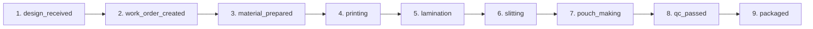
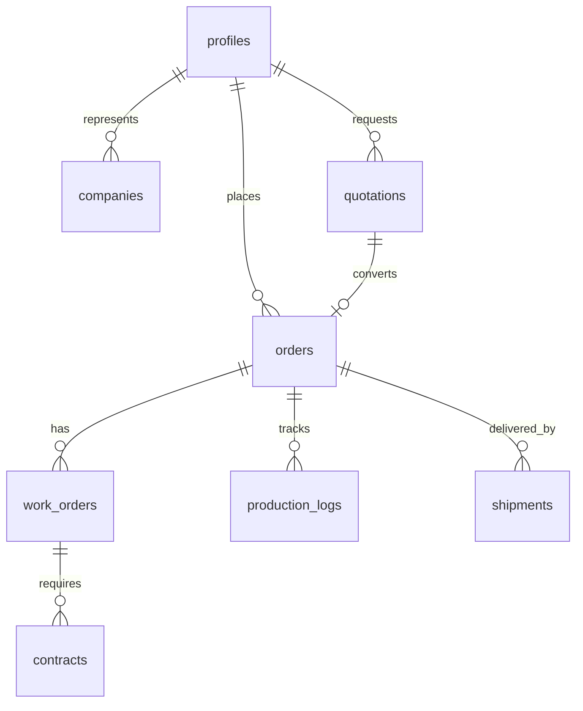

# EPACKAGE Lab B2B API 설계 요약

## 문서 개요 (Document Overview)

이 문서는 EPACKAGE Lab의 10단계 B2B 주문 프로세스를 위한 API 설계 문서 모음입니다.

### 문서 구조

```
docs/api/
├── B2B_WORKFLOW_API_SPECIFICATION.md    # 메인 API 명세서 (이 문서)
├── openapi-b2b-workflow.yaml            # OpenAPI 3.0 사양
└── B2B_DATABASE_ERD.md                  # 데이터베이스 ERD 및 스키마
```

---

## 10단계 워크플로우 개요 (10-Step Workflow Overview)

```
Registration (1)
       |
       v
Quotation (2) -----> Order (3)
                              |
                              v
                       Data Entry (4) --> Work Order (5)
                                                     |
                                                     v
                                               Contract (6) --> Signing (7)
                                                                     |
                                                                     v
                                                               Production (8)
                                                                     |
                                                                     v
                                                              Stock In (9)
                                                                     |
                                                                     v
                                                             Shipment (10)
```

### 각 단계별 주요 엔드포인트

| 단계 | 프로세스 | 주요 엔드포인트 | 상태 전이 |
|------|----------|----------------|-----------|
| 1 | Registration | POST /auth/register | - |
| 2 | Quotation | POST /quotations | PENDING -> QUOTATION |
| 3 | Order | POST /orders | QUOTATION -> DATA_RECEIVED |
| 4 | Data Entry | POST /orders/:id/files | DATA_RECEIVED -> WORK_ORDER |
| 5 | Work Order | POST /work-orders | WORK_ORDER -> CONTRACT_SENT |
| 6 | Contract | POST /contracts | CONTRACT_SENT -> CONTRACT_SIGNED |
| 7 | Signing | POST /contracts/:id/sign | CONTRACT_SIGNED -> PRODUCTION |
| 8 | Production | POST /orders/:id/production/logs | PRODUCTION (9 sub-stages) |
| 9 | Stock In | POST /orders/:id/stock-in | PRODUCTION -> STOCK_IN |
| 10 | Shipment | POST /orders/:id/shipment | STOCK_IN -> SHIPPED -> DELIVERED |

---

## 상태 머신 (State Machine)

### 주요 상태 및 전이


### Production 하위 상태 (9단계)



---

## API 경로 구조 (API Route Structure)

### 인증 및 사용자 관리
```
POST   /api/v1/auth/register
GET    /api/v1/auth/verify-email
POST   /api/v1/auth/approve-user
```

### 견적 관리
```
POST   /api/v1/quotations
GET    /api/v1/quotations
GET    /api/v1/quotations/:id
POST   /api/v1/quotations/:id/calculate
POST   /api/v1/quotations/:id/approve
GET    /api/v1/quotations/:id/pdf
```

### 주문 관리
```
POST   /api/v1/orders
GET    /api/v1/orders
GET    /api/v1/orders/:id
PATCH  /api/v1/orders/:id/status
GET    /api/v1/orders/:id/timeline
```

### 파일 및 데이터 입고
```
POST   /api/v1/orders/:id/files
POST   /api/v1/orders/:id/files/extract
POST   /api/v1/orders/:id/files/validate
GET    /api/v1/orders/:id/files
```

### 작업표준서
```
POST   /api/v1/work-orders
GET    /api/v1/work-orders/:id
GET    /api/v1/work-orders/:id/pdf
POST   /api/v1/work-orders/:id/approve
```

### 계약서
```
POST   /api/v1/contracts
GET    /api/v1/contracts/:id
POST   /api/v1/contracts/:id/sign
GET    /api/v1/contracts/:id/pdf
GET    /api/v1/contracts/:id/verify
```

### 생산 관리
```
GET    /api/v1/orders/:id/production
POST   /api/v1/orders/:id/production/logs
POST   /api/v1/orders/:id/production/photos
```

### 재고 관리
```
POST   /api/v1/orders/:id/stock-in
GET    /api/v1/inventory
POST   /api/v1/inventory/adjust
```

### 출하 관리
```
POST   /api/v1/orders/:id/shipment
POST   /api/v1/shipments/:id/tracking
GET    /api/v1/shipments/:id/tracking
```

### 관리자
```
GET    /api/v1/admin/dashboard
GET    /api/v1/admin/approvals
```

---

## 데이터베이스 테이블 관계도 (Database Relationships)

### 핵심 테이블

| 테이블 | 용도 | 주요 관계 |
|--------|------|-----------|
| profiles | 사용자 프로필 | companies, orders, quotations |
| companies | 기업 정보 | profiles, orders, contracts |
| orders | 주문 | order_items, order_status_history |
| quotations | 견적 | quotation_items, orders |
| work_orders | 작업표준서 | orders, spec_sheets |
| contracts | 계약서 | orders, work_orders |
| production_logs | 생산 진척 | orders, production_jobs |
| files | 파일 관리 | orders, work_orders |
| inventory | 재고 | products, inventory_transactions |
| shipments | 출하 | orders, shipment_tracking |

### ER 다이어그램 요약



---

## 보안 정책 (Security Policy)

### 인증/인가

| 역할 | 권한 범위 | 특별 권한 |
|------|----------|-----------|
| MEMBER | 자신의 주문/견적/계약서 조회 | - |
| COMPANY_ADMIN | 회사 전체 주문/견적/계약서 조회 | 생산 현황 조회 |
| ADMIN | 모든 데이터 접근 | 승인, 감사 로그 접근 |

### RLS (Row Level Security) 정책

```sql
-- 사용자는 자신의 데이터만 조회
CREATE POLICY "Users can view own data"
ON orders FOR SELECT
USING (user_id = auth.uid());

-- 관리자는 모든 데이터 조회
CREATE POLICY "Admins can view all"
ON orders FOR SELECT
USING (
  EXISTS (
    SELECT 1 FROM profiles
    WHERE id = auth.uid() AND role = 'ADMIN'
  )
);
```

---

## 데이터 검증 규칙 (Validation Rules)

### Registration (회원가입)
- 이메일: 유효한 이메일 형식, 최대 255자
- 법인 번호: 정확히 13자리 숫자
- 비밀번호: 최소 8자, 영문+숫자 포함

### Quotation (견적)
- 유효 기간: 7-90일
- 최소 주문 금액: 10,000엔
- 항목 수: 최소 1개

### Files (파일)
- 파일 크기: 최대 50MB
- AI 추출 신뢰도: 최소 0.7
- 허용 형식: AI, PDF, PSD, PNG, JPG, EXCEL

---

## 에러 처리 (Error Handling)

### 표준 에러 응답 형식

```typescript
interface ErrorResponse {
  success: false;
  error: {
    code: string;           // 에러 코드
    message: string;        // 사용자용 메시지
    details?: Array<{
      field: string;
      message: string;
    }>;
  };
}
```

### HTTP 상태 코드

| 상태 코드 | 의미 | 사용 예시 |
|----------|------|-----------|
| 200 | OK | 성공 |
| 201 | Created | 리소스 생성 |
| 400 | Bad Request | 잘못된 입력 |
| 401 | Unauthorized | 인증 안 됨 |
| 403 | Forbidden | 권한 없음 |
| 404 | Not Found | 리소스 없음 |
| 409 | Conflict | 중복 리소스 |
| 422 | Unprocessable Entity | 비즈니스 규칙 위배 |
| 429 | Too Many Requests | Rate limit 초과 |
| 500 | Internal Server Error | 서버 에러 |

---

## Rate Limiting

| 역할 | 요청 제한 | 시간 윈도우 |
|------|----------|------------|
| MEMBER | 100 요청 | 15분 |
| COMPANY_ADMIN | 300 요청 | 15분 |
| ADMIN | 제한 없음 | - |

---

## 감사 로깅 (Audit Logging)

모든 데이터 변경은 `order_audit_log` 테이블에 기록됩니다.

```typescript
interface AuditLogEntry {
  table_name: string;
  record_id: string;
  action: 'INSERT' | 'UPDATE' | 'DELETE';
  old_data: Record<string, any> | null;
  new_data: Record<string, any> | null;
  changed_fields: string[] | null;
  changed_by: string;
  changed_at: string;
  ip_address: string | null;
  user_agent: string | null;
}
```

---

## 웹훅 (Webhooks)

### 지원 이벤트

| 이벤트 | 설명 |
|--------|------|
| order.created | 주문 생성 |
| order.status_changed | 주문 상태 변경 |
| contract.signed | 계약서 서명 완료 |
| production.progress_updated | 생산 진척 업데이트 |
| shipment.delivered | 배송 완료 |

---

## 구현 체크리스트 (Implementation Checklist)

### Phase 1: Infrastructure
- [ ] Supabase 프로젝트 설정
- [ ] 데이터베이스 테이블 생성
- [ ] RLS 정책 적용
- [ ] 인덱스 생성
- [ ] 트리거 및 뷰 생성

### Phase 2: Authentication
- [ ] 회원가입 API
- [ ] 이메일 인증 시스템
- [ ] JWT 토큰 발급/검증
- [ ] 관리자 승인 API

### Phase 3: Quotation & Order
- [ ] 견적 생성/조회/수정 API
- [ ] 견적 승인 및 주문 변환
- [ ] 주문 상태 관리
- [ ] 타임라인 추적

### Phase 4: Data Entry
- [ ] 파일 업로드 시스템
- [ ] AI 데이터 추출
- [ ] 데이터 검증
- [ ] 버전 관리

### Phase 5: Work Order & Contract
- [ ] 작업표준서 생성
- [ ] PDF 생성
- [ ] 계약서 생성
- [ ] 전자 서명

### Phase 6: Production
- [ ] 생산 로그 기록
- [ ] 진척률 추적
- [ ] 사진 업로드
- [ ] 생산 작업 관리

### Phase 7: Inventory & Shipment
- [ ] 입고 처리
- [ ] 재고 관리
- [ ] 배송 생성
- [ ] 배송 추적

### Phase 8: Admin
- [ ] 대시보드 API
- [ ] 승인 시스템
- [ ] 감사 로그 조회

### Phase 9: Testing
- [ ] 단위 테스트
- [ ] 통합 테스트
- [ ] 부하 테스트
- [ ] 보안 테스트

### Phase 10: Documentation
- [ ] API 사용 가이드
- [ ] SDK/라이브러리
- [ ] 에러 코드 매뉴얼
- [ ] 웹훅 가이드

---

## 참고 문헌 (References)

1. **OpenAPI 사양**: `openapi-b2b-workflow.yaml`
2. **API 상세 명세**: `B2B_WORKFLOW_API_SPECIFICATION.md`
3. **데이터베이스 ERD**: `B2B_DATABASE_ERD.md`
4. **Supabase 타입 정의**: `src/types/database.ts`

---

_이 요약 문서는 EPACKAGE Lab B2B 시스템 API 설계의 전체적인 구조를 제공합니다._
