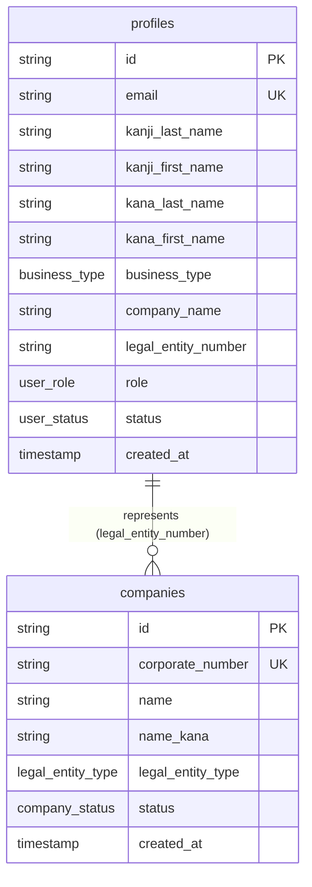
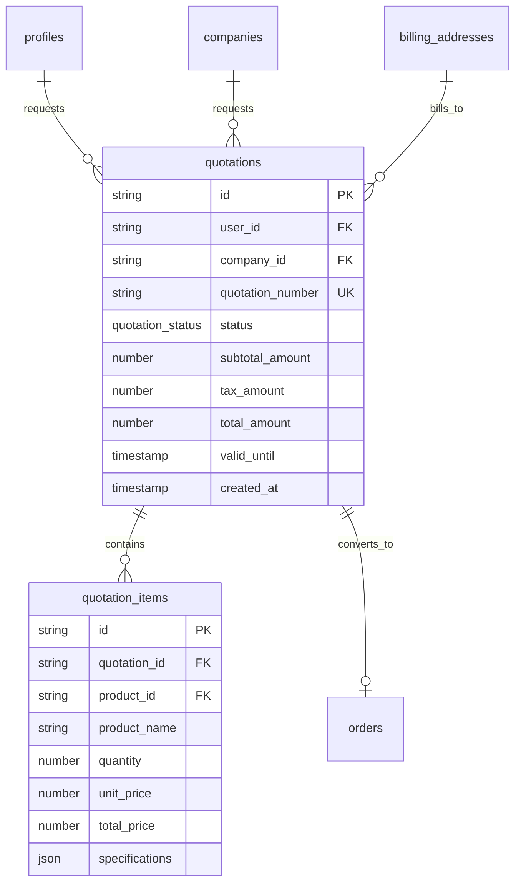
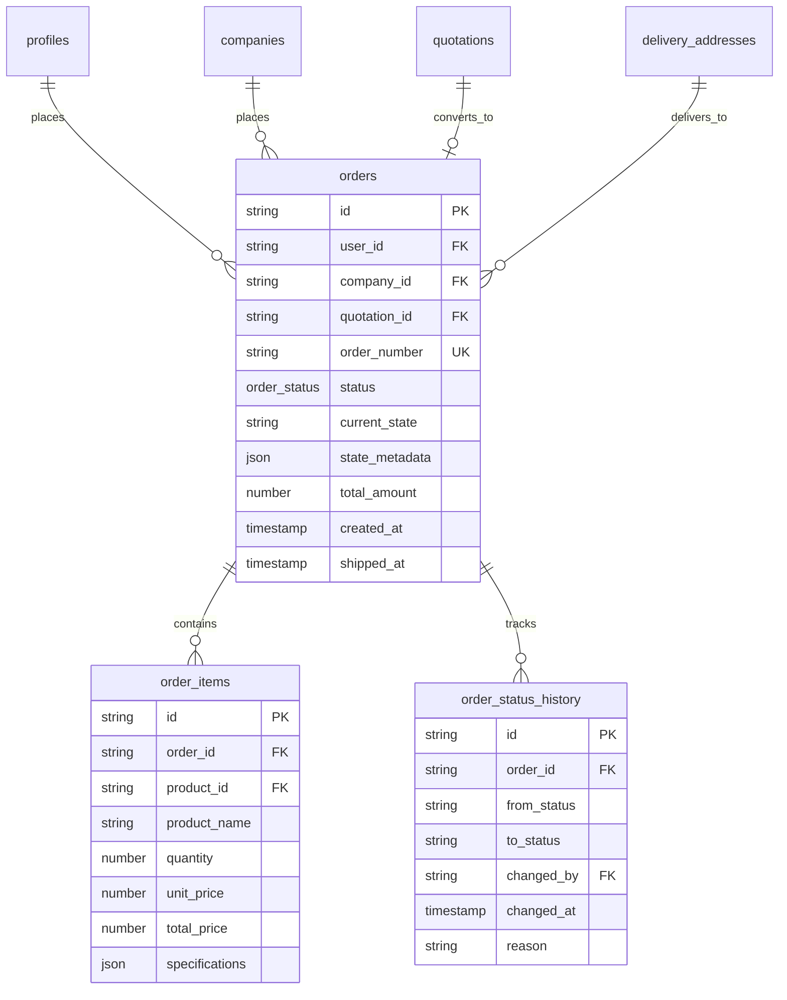
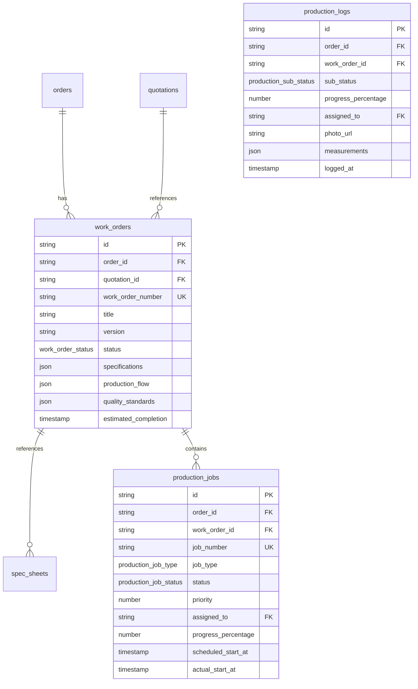
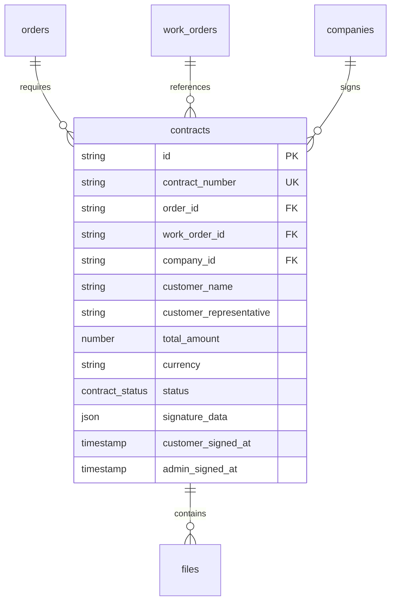
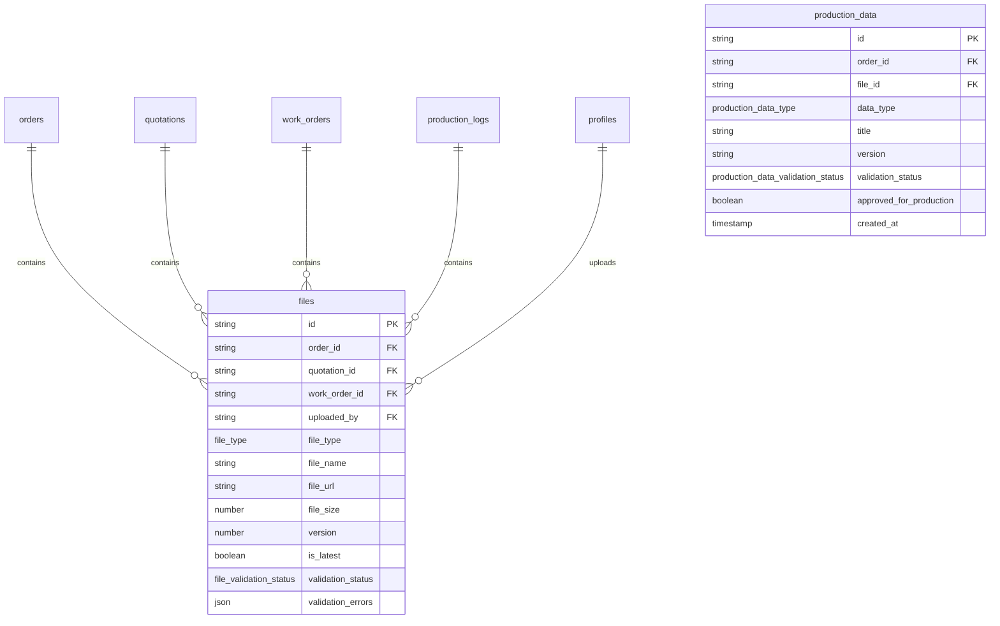
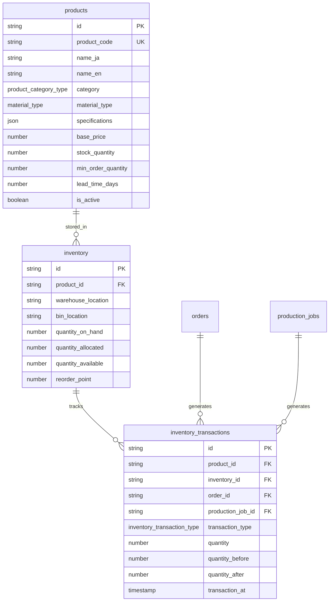
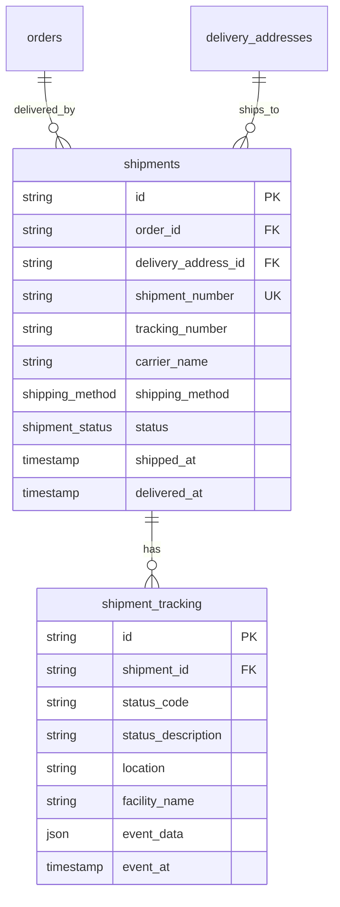

# EPACKAGE Lab B2B 데이터베이스 ERD

## 전체 ER 다이어그램 (Mermaid)

```mermaid
erDiagram
    %% ============================================================
    %% USER & COMPANY MANAGEMENT
    %% ============================================================
    profiles ||--o{ orders : places
    profiles ||--o{ quotations : requests
    profiles ||--o{ delivery_addresses : owns
    profiles ||--o{ billing_addresses : owns
    profiles ||--o{ companies : represents
    profiles ||--o{ production_logs : creates
    profiles ||--o{ files : uploads
    profiles ||--o{ order_audit_log : performs

    companies ||--o{ orders : places
    companies ||--o{ quotations : requests
    companies ||--o{ contracts : signs

    %% ============================================================
    %% QUOTATION SYSTEM
    %% ============================================================
    quotations ||--o{ quotation_items : contains
    quotations ||--o| orders : converts_to
    quotations ||--o{ files : contains
    quotations ||--o| work_orders : generates

    %% ============================================================
    %% ORDER SYSTEM
    %% ============================================================
    orders ||--o{ order_items : contains
    orders ||--o{ order_status_history : tracks
    orders ||--o{ contracts : requires
    orders ||--o{ work_orders : has
    orders ||--o{ production_logs : tracks
    orders ||--o{ production_data : contains
    orders ||--o{ production_jobs : contains
    orders ||--o{ files : contains
    orders ||--o{ shipments : delivered_by
    orders ||--o{ inventory_transactions : generates

    %% ============================================================
    %% ADDRESS SYSTEM
    %% ============================================================
    delivery_addresses ||--o{ orders : delivers_to
    delivery_addresses ||--o{ shipments : ships_to

    billing_addresses ||--o{ quotations : bills_to
    billing_addresses ||--o{ contracts : bills_to

    %% ============================================================
    %% WORK ORDER & PRODUCTION
    %% ============================================================
    work_orders ||--o{ contracts : requires
    work_orders ||--o{ spec_sheets : references
    work_orders ||--o{ production_jobs : contains
    work_orders ||--o{ files : contains

    production_logs ||--o{ files : contains
    production_logs ||--o{ production_jobs : updates

    production_jobs ||--o{ inventory_transactions : generates

    production_data ||--o{ files : contains

    %% ============================================================
    %% SPECIFICATIONS
    %% ============================================================
    spec_sheets ||--o{ spec_sections : contains

    %% ============================================================
    %% CONTRACTS
    %% ============================================================
    contracts ||--o{ files : contains

    %% ============================================================
    %% SHIPMENT
    %% ============================================================
    shipments ||--o{ shipment_tracking : has

    %% ============================================================
    %% INVENTORY
    %% ============================================================
    products ||--o{ inventory : stored_in
    products ||--o{ quotation_items : referenced_by
    products ||--o{ order_items : referenced_by
    products ||--o{ inventory_transactions : tracked_by
    products ||--o{ spec_sheets : has

    inventory ||--o{ inventory_transactions : updates
```



---

## 테이블 상세 관계도 (Table Relationships)

### 1. User & Company Management



### 2. Quotation System



### 3. Order System



### 4. Work Order & Production



### 5. Contracts



### 6. Files & Data Entry



### 7. Inventory & Stock



### 8. Shipments



---

## 인덱스 설계 (Index Design)

### 주요 인덱스 목록

```sql
-- Profiles
CREATE INDEX idx_profiles_email ON profiles(email);
CREATE INDEX idx_profiles_company_number ON profiles(legal_entity_number);
CREATE INDEX idx_profiles_status ON profiles(status);
CREATE INDEX idx_profiles_role ON profiles(role);

-- Orders
CREATE INDEX idx_orders_user_id ON orders(user_id);
CREATE INDEX idx_orders_company_id ON orders(company_id);
CREATE INDEX idx_orders_status ON orders(status);
CREATE INDEX idx_orders_created_at ON orders(created_at DESC);
CREATE INDEX idx_orders_order_number ON orders(order_number);

-- Quotations
CREATE INDEX idx_quotations_user_id ON quotations(user_id);
CREATE INDEX idx_quotations_status ON quotations(status);
CREATE INDEX idx_quotations_valid_until ON quotations(valid_until);

-- Production Logs
CREATE INDEX idx_production_logs_order_id ON production_logs(order_id);
CREATE INDEX idx_production_logs_logged_at ON production_logs(logged_at DESC);

-- Files
CREATE INDEX idx_files_order_id ON files(order_id);
CREATE INDEX idx_files_validation_status ON files(validation_status);

-- Inventory
CREATE INDEX idx_inventory_product_id ON inventory(product_id);
CREATE INDEX idx_inventory_warehouse ON inventory(warehouse_location);
CREATE INDEX idx_inventory_quantity_available ON inventory(quantity_available);

-- Shipments
CREATE INDEX idx_shipments_tracking_number ON shipments(tracking_number);
CREATE INDEX idx_shipments_status ON shipments(status);
```

---

## 데이터베이스 제약조건 (Constraints)

### Foreign Key Constraints

```sql
-- Orders to Quotations
ALTER TABLE orders
ADD CONSTRAINT fk_orders_quotation
FOREIGN KEY (quotation_id) REFERENCES quotations(id)
ON DELETE SET NULL;

-- Orders to Users
ALTER TABLE orders
ADD CONSTRAINT fk_orders_user
FOREIGN KEY (user_id) REFERENCES profiles(id)
ON DELETE RESTRICT;

-- Production Logs to Orders
ALTER TABLE production_logs
ADD CONSTRAINT fk_production_logs_order
FOREIGN KEY (order_id) REFERENCES orders(id)
ON DELETE CASCADE;

-- Contracts to Orders
ALTER TABLE contracts
ADD CONSTRAINT fk_contracts_order
FOREIGN KEY (order_id) REFERENCES orders(id)
ON DELETE RESTRICT;

-- Files to Orders
ALTER TABLE files
ADD CONSTRAINT fk_files_order
FOREIGN KEY (order_id) REFERENCES orders(id)
ON DELETE CASCADE;
```

### Check Constraints

```sql
-- Order Status Validation
ALTER TABLE orders
ADD CONSTRAINT chk_order_status
CHECK (status IN (
  'PENDING', 'QUOTATION', 'DATA_RECEIVED', 'WORK_ORDER',
  'CONTRACT_SENT', 'CONTRACT_SIGNED', 'PRODUCTION',
  'STOCK_IN', 'SHIPPED', 'DELIVERED', 'CANCELLED'
));

-- Production Progress Range
ALTER TABLE production_logs
ADD CONSTRAINT chk_progress_range
CHECK (progress_percentage >= 0 AND progress_percentage <= 100);

-- Inventory Non-negative
ALTER TABLE inventory
ADD CONSTRAINT chk_quantity_non_negative
CHECK (quantity_on_hand >= 0 AND quantity_allocated >= 0);
```

---

## 트리거 (Triggers)

### Audit Log Trigger

```sql
-- Order Status Change Audit
CREATE OR REPLACE FUNCTION log_order_status_change()
RETURNS TRIGGER AS $$
BEGIN
  INSERT INTO order_status_history (
    order_id,
    from_status,
    to_status,
    changed_by,
    changed_at,
    reason
  ) VALUES (
    NEW.id,
    OLD.status,
    NEW.status,
    NEW.state_metadata->>'changed_by',
    NOW(),
    NEW.state_metadata->>'reason'
  );
  RETURN NEW;
END;
$$ LANGUAGE plpgsql;

CREATE TRIGGER trigger_order_status_change
AFTER UPDATE OF status ON orders
FOR EACH ROW
WHEN (OLD.status IS DISTINCT FROM NEW.status)
EXECUTE FUNCTION log_order_status_change();
```

### Inventory Update Trigger

```sql
-- Auto-update quantity_available
CREATE OR REPLACE FUNCTION update_inventory_available()
RETURNS TRIGGER AS $$
BEGIN
  NEW.quantity_available := NEW.quantity_on_hand - NEW.quantity_allocated;
  RETURN NEW;
END;
$$ LANGUAGE plpgsql;

CREATE TRIGGER trigger_update_inventory_available
BEFORE INSERT OR UPDATE ON inventory
FOR EACH ROW
EXECUTE FUNCTION update_inventory_available();
```

---

## 뷰 (Views)

### Order Summary View

```sql
CREATE OR REPLACE VIEW v_order_summary AS
SELECT
  o.id,
  o.order_number,
  o.status,
  o.current_state,
  o.total_amount,
  o.customer_name,
  p.company_name,
  COUNT(DISTINCT oi.id) as item_count,
  o.created_at,
  o.estimated_delivery_date
FROM orders o
LEFT JOIN profiles p ON o.user_id = p.id
LEFT JOIN order_items oi ON o.id = oi.order_id
GROUP BY o.id, p.company_name;
```

### Production Status View

```sql
CREATE OR REPLACE VIEW v_production_status AS
SELECT
  o.id as order_id,
  o.order_number,
  o.status as order_status,
  pl.sub_status,
  MAX(pl.progress_percentage) as progress_percentage,
  MAX(pl.logged_at) as last_update,
  COUNT(DISTINCT pj.id) as total_jobs,
  SUM(CASE WHEN pj.status = 'completed' THEN 1 ELSE 0 END) as completed_jobs
FROM orders o
LEFT JOIN production_logs pl ON o.id = pl.order_id
LEFT JOIN production_jobs pj ON o.id = pj.order_id
WHERE o.status = 'PRODUCTION'
GROUP BY o.id, o.order_number, o.status, pl.sub_status;
```

### Inventory Alert View

```sql
CREATE OR REPLACE VIEW v_inventory_alerts AS
SELECT
  i.id,
  p.product_code,
  p.name_ja as product_name,
  i.quantity_available,
  i.reorder_point,
  i.warehouse_location,
  CASE
    WHEN i.quantity_available <= 0 THEN 'OUT_OF_STOCK'
    WHEN i.quantity_available <= i.reorder_point THEN 'REORDER_NEEDED'
    ELSE 'OK'
  END as alert_level
FROM inventory i
JOIN products p ON i.product_id = p.id
WHERE i.quantity_available <= i.reorder_point OR i.quantity_available <= 0;
```

---

## 파티셔닝 전략 (Partitioning Strategy)

### Production Logs Partitioning (by month)

```sql
-- Partition production_logs by month for better query performance
CREATE TABLE production_logs (
  -- columns
) PARTITION BY RANGE (logged_at);

-- Create monthly partitions
CREATE TABLE production_logs_2025_01 PARTITION OF production_logs
FOR VALUES FROM ('2025-01-01') TO ('2025-02-01');

CREATE TABLE production_logs_2025_02 PARTITION OF production_logs
FOR VALUES FROM ('2025-02-01') TO ('2025-03-01');

-- Auto-create future partitions
CREATE OR REPLACE FUNCTION create_monthly_partitions()
RETURNS void AS $$
DECLARE
  start_date date := date_trunc('month', CURRENT_DATE + interval '1 month');
  end_date date := start_date + interval '1 month';
  partition_name text := 'production_logs_' || to_char(start_date, 'YYYY_MM');
BEGIN
  EXECUTE format(
    'CREATE TABLE IF NOT EXISTS %I PARTITION OF production_logs
     FOR VALUES FROM (%L) TO (%L)',
    partition_name, start_date, end_date
  );
END;
$$ LANGUAGE plpgsql;
```

---

## 백업 및 복구 전략 (Backup & Recovery)

### Daily Backup Strategy

```bash
#!/bin/bash
# Daily backup script

DATE=$(date +%Y%m%d)
BACKUP_DIR="/backups/daily"
DATABASE="epackage_b2b"

# Full backup
pg_dump -h localhost -U postgres -d $DATABASE \
  --format=custom \
  --file="$BACKUP_DIR/epackage_$DATE.backup"

# Schema-only backup (for disaster recovery)
pg_dump -h localhost -U postgres -d $DATABASE \
  --schema-only \
  --file="$BACKUP_DIR/epackage_schema_$DATE.sql"

# Retain last 30 days
find $BACKUP_DIR -name "epackage_*.backup" -mtime +30 -delete
```

---

_이 ERD 문서는 EPACKAGE Lab B2B 시스템의 데이터베이스 구조를 설명합니다._
