# EPACKAGE Lab B2B 워크플로우 API 명세서

## 개요 (Overview)

이 문서는 EPACKAGE Lab의 10단계 B2B 주문 프로세스를 위한 RESTful API 설계 명세서입니다.

### 10단계 워크플로우

```
1. Registration (회원가입) → 2. Quotation (견적) → 3. Order (주문)
→ 4. Data Entry (데이터입고) → 5. Work Order (작업표준서)
→ 6. Contract (계약서) → 7. Signing (전자서명) → 8. Production (생산)
→ 9. Stock In (입고) → 10. Shipment (출하)
```

---

## 1. API 경로 구조도 (API Route Structure)

```mermaid
graph TB
    API[/api/v1]

    API --> AUTH[/auth]
    API --> QUOTATIONS[/quotations]
    API --> ORDERS[/orders]
    API --> FILES[/files]
    API --> WORK_ORDERS[/work-orders]
    API --> CONTRACTS[/contracts]
    API --> PRODUCTION[/production]
    API --> INVENTORY[/inventory]
    API --> SHIPMENTS[/shipments]
    API --> ADMIN[/admin]

    AUTH --> REGISTER[POST /register]
    AUTH --> VERIFY[GET /verify-email]
    AUTH --> APPROVE[POST /approve-user]

    QUOTATIONS --> Q_CREATE[POST /]
    QUOTATIONS --> Q_LIST[GET /]
    QUOTATIONS --> Q_GET[GET /:id]
    QUOTATIONS --> Q_CALC[POST /:id/calculate]
    QUOTATIONS --> Q_APPR[POST /:id/approve]
    QUOTATIONS --> Q_PDF[GET /:id/pdf]

    ORDERS --> O_CREATE[POST /]
    ORDERS --> O_LIST[GET /]
    ORDERS --> O_GET[GET /:id]
    ORDERS --> O_STATUS[PATCH /:id/status]
    ORDERS --> O_TIME[GET /:id/timeline]

    FILES --> F_UPLOAD[POST /orders/:id/files]
    FILES --> F_EXTRACT[POST /orders/:id/files/extract]
    FILES --> F_VALID[POST /orders/:id/files/validate]
    FILES --> F_LIST[GET /orders/:id/files]

    WORK_ORDERS --> W_CREATE[POST /]
    WORK_ORDERS --> W_GET[GET /:id]
    WORK_ORDERS --> W_PDF[GET /:id/pdf]
    WORK_ORDERS --> W_APPR[POST /:id/approve]

    CONTRACTS --> C_CREATE[POST /]
    CONTRACTS --> C_GET[GET /:id]
    CONTRACTS --> C_SIGN[POST /:id/sign]
    CONTRACTS --> C_PDF[GET /:id/pdf]
    CONTRACTS --> C_VERIFY[GET /:id/verify]

    PRODUCTION --> P_STATUS[GET /orders/:id/production]
    PRODUCTION --> P_LOGS[POST /orders/:id/production/logs]
    PRODUCTION --> P_PHOTO[POST /orders/:id/production/photos]

    INVENTORY --> I_STOCK[POST /orders/:id/stock-in]
    INVENTORY --> I_LIST[GET /]
    INVENTORY --> I_ADJ[POST /adjust]

    SHIPMENTS --> S_CREATE[POST /orders/:id/shipment]
    SHIPMENTS --> S_TRACK[POST /:id/tracking]
    SHIPMENTS --> S_GET[GET /:id/tracking]

    ADMIN --> A_DASH[GET /dashboard]
    ADMIN --> A_APPR[GET /approvals]

    style API fill:#e1f5ff
    style AUTH fill:#fff4e1
    style QUOTATIONS fill:#e8f5e9
    style ORDERS fill:#fce4ec
    style PRODUCTION fill:#f3e5f5
```

---

## 2. 주문 상태 전이 다이어그램 (Order State Machine)

```mermaid
stateDiagram-v2
    [*] --> PENDING: Registration Complete

    PENDING --> QUOTATION: Request Quotation
    QUOTATION --> PENDING: Reject
    QUOTATION --> QUOTATION: Revise
    QUOTATION --> DATA_RECEIVED: Approve & Convert to Order

    DATA_RECEIVED --> WORK_ORDER: Data Validated
    DATA_RECEIVED --> DATA_RECEIVED: Resubmit Data

    WORK_ORDER --> CONTRACT_SENT: Work Order Approved
    WORK_ORDER --> WORK_ORDER: Revision Needed

    CONTRACT_SENT --> CONTRACT_SIGNED: Customer Signs
    CONTRACT_SENT --> PENDING: Contract Cancelled
    CONTRACT_SIGNED --> PRODUCTION: Admin Signs

    PRODUCTION --> PRODUCTION: Production Update
    PRODUCTION --> STOCK_IN: Production Complete

    STOCK_IN --> SHIPPED: Ship Order
    SHIPPED --> DELIVERED: Delivery Confirmed

    PENDING --> CANCELLED: Cancel Request
    QUOTATION --> CANCELLED: Timeout (30 days)
    CONTRACT_SENT --> CANCELLED: Customer Rejects

    CANCELLED --> [*]
    DELIVERED --> [*]

    note right of PENDING
        Initial state after
        user registration
    end note

    note right of PRODUCTION
        9 sub-stages:
        1. design_received
        2. work_order_created
        3. material_prepared
        4. printing
        5. lamination
        6. slitting
        7. pouch_making
        8. qc_passed
        9. packaged
    end note
```



### 상태 전이 규칙 (State Transition Rules)

| 현재 상태 | 다음 상태 | 조건 | 롤백 가능 |
|-----------|----------|------|-----------|
| PENDING | QUOTATION | 고객 견적 요청 | O |
| QUOTATION | DATA_RECEIVED | 견적 승인 및 주문 전환 | O |
| QUOTATION | CANCELLED | 30일 경과 또는 명시적 거부 | X |
| DATA_RECEIVED | WORK_ORDER | 데이터 검증 완료 | X |
| WORK_ORDER | CONTRACT_SENT | 작업표준서 승인 | O |
| CONTRACT_SENT | CONTRACT_SIGNED | 고객 서명 완료 | X |
| CONTRACT_SIGNED | PRODUCTION | 관리자 서명 완료 | X |
| PRODUCTION | STOCK_IN | 생산 완료 및 QC 통과 | X |
| STOCK_IN | SHIPPED | 출하 처리 | X |
| SHIPPED | DELIVERED | 배송 완료 확인 | - |

---

## 3. API 엔드포인트 상세 (Endpoint Specifications)

### 3.1 Authentication & Registration (회원가입)

#### POST /api/v1/auth/register

기업 회원가입을 처리합니다.

**Request Body:**
```typescript
interface RegisterRequest {
  email: string;              // 이메일 (unique, required)
  password: string;           // 비밀번호 (min 8 chars, required)

  // 개인 정보
  kanji_last_name: string;    // 한글 성 (required)
  kanji_first_name: string;   // 한글 이름 (required)
  kana_last_name: string;     // 카타카나 성 (required)
  kana_first_name: string;    // 카타카나 이름 (required)
  personal_phone?: string;    // 개인 전화번호

  // 기업 정보
  business_type: 'INDIVIDUAL' | 'CORPORATION';  // 사업자 유형
  company_name?: string;      // 회사명 (CORPORATION 시 필수)
  legal_entity_number?: string; // 법인 번호 (13자리)
  position?: string;          // 직책
  department?: string;        // 부서
  company_url?: string;       // 회사 URL

  // 산업 분류
  product_category: 'COSMETICS' | 'CLOTHING' | 'ELECTRONICS' | 'KITCHEN' | 'FURNITURE' | 'OTHER';

  // 주소 정보
  postal_code: string;        // 우편번호
  prefecture: string;         // 도도부현
  city: string;               // 시구군
  street: string;             // 번지

  // 기타
  acquisition_channel?: string;  // 유입 경로
}
```

**Response (201 Created):**
```typescript
interface RegisterResponse {
  success: true;
  data: {
    user_id: string;
    email: string;
    status: 'PENDING';  // 승인 대기 상태
    message: string;    // 'Registration successful. Awaiting admin approval.'
  };
}
```

**Error Responses:**
- `400 Bad Request`: 유효하지 않은 입력 데이터
- `409 Conflict`: 이메일 중복
- `422 Unprocessable Entity`: 비즈니스 규칙 위배

---

#### GET /api/v1/auth/verify-email

이메일 인증을 처리합니다.

**Query Parameters:**
```typescript
interface VerifyEmailQuery {
  token: string;  // 이메일 인증 토큰
}
```

**Response (200 OK):**
```typescript
interface VerifyEmailResponse {
  success: true;
  data: {
    message: string;
  };
}
```

---

#### POST /api/v1/auth/approve-user

관리자가 회원가입을 승인합니다. (관리자 전용)

**Request Body:**
```typescript
interface ApproveUserRequest {
  user_id: string;
  approve: boolean;
  rejection_reason?: string;  // 거부 시 사유
}
```

**Response (200 OK):**
```typescript
interface ApproveUserResponse {
  success: true;
  data: {
    user_id: string;
    status: 'ACTIVE' | 'REJECTED';
  };
}
```

---

### 3.2 Quotations (견적)

#### POST /api/v1/quotations

새 견적을 생성합니다.

**Request Body:**
```typescript
interface CreateQuotationRequest {
  customer_name: string;      // 고객명 (required)
  customer_email: string;     // 고객 이메일 (required)
  customer_phone?: string;    // 고객 전화번호

  // 견적 항목
  items: Array<{
    product_name: string;     // 제품명 (required)
    product_code?: string;    // 제품 코드
    category?: string;        // 카테고리
    quantity: number;         // 수량 (required, min 1)
    unit_price: number;       // 단가 (required, JPY)
    specifications?: Record<string, any>;  // 제품 스펙
    notes?: string;           // 항목 메모
  }>;

  // 유효 기간
  valid_days?: number;        // 유효 기간 (일, 기본값 30)

  notes?: string;             // 견적 메모
};
```

**Response (201 Created):**
```typescript
interface CreateQuotationResponse {
  success: true;
  data: {
    id: string;
    quotation_number: string;  // QT-2025-0001
    status: 'DRAFT';
    subtotal_amount: number;
    tax_amount: number;
    total_amount: number;
    valid_until: string;       // ISO 8601 date
    created_at: string;
  };
}
```

---

#### GET /api/v1/quotations

견적 목록을 조회합니다.

**Query Parameters:**
```typescript
interface ListQuotationsQuery {
  status?: 'DRAFT' | 'SENT' | 'APPROVED' | 'REJECTED' | 'EXPIRED' | 'CONVERTED';
  user_id?: string;
  company_id?: string;
  from_date?: string;    // ISO 8601 date
  to_date?: string;      // ISO 8601 date
  page?: number;         // 기본값 1
  limit?: number;        // 기본값 20, 최대 100
  sort?: 'created_at' | 'total_amount' | 'valid_until';
  order?: 'asc' | 'desc';
}
```

**Response (200 OK):**
```typescript
interface ListQuotationsResponse {
  success: true;
  data: {
    quotations: Array<{
      id: string;
      quotation_number: string;
      status: string;
      customer_name: string;
      total_amount: number;
      valid_until: string;
      created_at: string;
    }>;
    pagination: {
      page: number;
      limit: number;
      total: number;
      total_pages: number;
    };
  };
}
```

---

#### GET /api/v1/quotations/:id

견적 상세를 조회합니다.

**Response (200 OK):**
```typescript
interface GetQuotationResponse {
  success: true;
  data: {
    id: string;
    quotation_number: string;
    status: string;
    customer_name: string;
    customer_email: string;
    customer_phone?: string;
    items: Array<{
      id: string;
      product_name: string;
      quantity: number;
      unit_price: number;
      total_price: number;
      specifications?: Record<string, any>;
    }>;
    subtotal_amount: number;
    tax_amount: number;
    total_amount: number;
    valid_until: string;
    notes?: string;
    pdf_url?: string;
    created_at: string;
    updated_at: string;
  };
}
```

---

#### POST /api/v1/quotations/:id/calculate

가격을 재계산합니다.

**Request Body:**
```typescript
interface CalculateQuotationRequest {
  items?: Array<{
    id?: string;              // 기존 항목 ID (수정 시)
    product_name: string;
    quantity: number;
    unit_price?: number;      // null이면 자동 계산
    specifications?: Record<string, any>;
  }>;
}
```

**Response (200 OK):**
```typescript
interface CalculateQuotationResponse {
  success: true;
  data: {
    subtotal_amount: number;
    tax_amount: number;
    tax_rate: number;         // 0.1 (10%)
    total_amount: number;
    items: Array<{
      product_name: string;
      quantity: number;
      unit_price: number;
      total_price: number;
    }>;
  };
}
```

---

#### POST /api/v1/quotations/:id/approve

견적을 승인하고 주문으로 변환합니다.

**Request Body:**
```typescript
interface ApproveQuotationRequest {
  delivery_address_id: string;  // 배송지 ID
  billing_address_id: string;   // 청구지 ID
  notes?: string;
}
```

**Response (200 OK):**
```typescript
interface ApproveQuotationResponse {
  success: true;
  data: {
    quotation_id: string;
    quotation_status: 'CONVERTED';
    order_id: string;
    order_number: string;       // ORD-2025-0001
    order_status: 'DATA_RECEIVED';
  };
}
```

---

#### GET /api/v1/quotations/:id/pdf

견적서 PDF를 생성하고 다운로드합니다.

**Response (200 OK):**
- Content-Type: application/pdf
- Content-Disposition: attachment; filename="QT-2025-0001.pdf"

---

### 3.3 Orders (주문)

#### POST /api/v1/orders

새 주문을 생성합니다. (견적에서 변환)

**Request Body:**
```typescript
interface CreateOrderRequest {
  quotation_id: string;        // 변환할 견적 ID
  delivery_address_id: string;
  billing_address_id: string;
  notes?: string;
}
```

**Response (201 Created):**
```typescript
interface CreateOrderResponse {
  success: true;
  data: {
    id: string;
    order_number: string;
    quotation_id: string;
    status: 'DATA_RECEIVED';
    total_amount: number;
    customer_name: string;
    estimated_delivery_date?: string;
    created_at: string;
  };
}
```

---

#### GET /api/v1/orders

주문 목록을 조회합니다.

**Query Parameters:**
```typescript
interface ListOrdersQuery {
  status?: 'PENDING' | 'QUOTATION' | 'DATA_RECEIVED' | 'WORK_ORDER' |
          'CONTRACT_SENT' | 'CONTRACT_SIGNED' | 'PRODUCTION' |
          'STOCK_IN' | 'SHIPPED' | 'DELIVERED' | 'CANCELLED';
  user_id?: string;
  company_id?: string;
  from_date?: string;
  to_date?: string;
  page?: number;
  limit?: number;
  sort?: 'created_at' | 'total_amount' | 'estimated_delivery_date';
  order?: 'asc' | 'desc';
}
```

---

#### GET /api/v1/orders/:id

주문 상세를 조회합니다.

**Response (200 OK):**
```typescript
interface GetOrderResponse {
  success: true;
  data: {
    id: string;
    order_number: string;
    status: string;
    current_state: string;
    state_metadata?: Record<string, any>;
    customer_name: string;
    total_amount: number;
    items: Array<{
      product_name: string;
      quantity: number;
      unit_price: number;
      total_price: number;
    }>;
    delivery_address: {
      name: string;
      postal_code: string;
      prefecture: string;
      city: string;
      address: string;
    };
    billing_address: {
      company_name: string;
      postal_code: string;
      prefecture: string;
      city: string;
      address: string;
    };
    timeline: Array<{
      status: string;
      changed_at: string;
      changed_by: string;
      notes?: string;
    }>;
    notes?: string;
    created_at: string;
    updated_at: string;
  };
}
```

---

#### PATCH /api/v1/orders/:id/status

주문 상태를 변경합니다.

**Request Body:**
```typescript
interface UpdateOrderStatusRequest {
  status: string;
  reason?: string;
  metadata?: Record<string, any>;
}
```

**Response (200 OK):**
```typescript
interface UpdateOrderStatusResponse {
  success: true;
  data: {
    id: string;
    previous_status: string;
    current_status: string;
    changed_at: string;
  };
}
```

---

#### GET /api/v1/orders/:id/timeline

주문 타임라인을 조회합니다.

**Response (200 OK):**
```typescript
interface GetOrderTimelineResponse {
  success: true;
  data: {
    order_id: string;
    timeline: Array<{
      status: string;
      from_status?: string;
      changed_at: string;
      changed_by: string;
      reason?: string;
      metadata?: Record<string, any>;
    }>;
  };
}
```

---

### 3.4 Files & Data Entry (데이터입고)

#### POST /api/v1/orders/:id/files

파일을 업로드합니다.

**Request:**
- Content-Type: multipart/form-data

**Form Data:**
```typescript
interface UploadFileRequest {
  file: File;                 // 파일 (required)
  file_type: 'AI' | 'PDF' | 'PSD' | 'PNG' | 'JPG' | 'EXCEL' | 'OTHER';
  data_type?: 'design_file' | 'specification' | 'approval' |
              'material_data' | 'layout_data' | 'color_data' | 'other';
  title?: string;             // 파일 제목
  description?: string;       // 파일 설명
  version?: string;           // 버전 (기본값 "1.0")
}
```

**Response (201 Created):**
```typescript
interface UploadFileResponse {
  success: true;
  data: {
    id: string;
    file_name: string;
    file_url: string;
    file_size: number;
    file_type: string;
    validation_status: 'PENDING';
    version: string;
    uploaded_at: string;
  };
}
```

---

#### POST /api/v1/orders/:id/files/extract

AI를 사용하여 파일에서 데이터를 추출합니다.

**Request Body:**
```typescript
interface ExtractDataRequest {
  file_id: string;
  extract_type?: 'specifications' | 'dimensions' | 'colors' | 'materials' | 'all';
}
```

**Response (200 OK):**
```typescript
interface ExtractDataResponse {
  success: true;
  data: {
    file_id: string;
    extracted_data: {
      specifications?: Record<string, any>;
      dimensions?: {
        width?: number;
        height?: number;
        depth?: number;
        unit?: string;
      };
      colors?: Array<{
        name: string;
        hex?: string;
        pantone?: string;
      }>;
      materials?: Array<{
        type: string;
        thickness?: string;
        description?: string;
      }>;
    };
    confidence: number;        // 0-1
    processed_at: string;
  };
}
```

---

#### POST /api/v1/orders/:id/files/validate

데이터를 검증합니다.

**Request Body:**
```typescript
interface ValidateDataRequest {
  production_data_id?: string;  // production_data ID
  file_id?: string;             // file ID
  validation_rules?: Array<{
    field: string;
    rule: string;
    required: boolean;
    min_value?: number;
    max_value?: number;
    allowed_values?: string[];
  }>;
}
```

**Response (200 OK):**
```typescript
interface ValidateDataResponse {
  success: true;
  data: {
    validation_status: 'VALID' | 'INVALID' | 'NEEDS_REVISION';
    errors: Array<{
      field: string;
      message: string;
      severity: 'error' | 'warning';
    }>;
    warnings?: Array<{
      field: string;
      message: string;
    }>;
    validated_at: string;
  };
}
```

---

#### GET /api/v1/orders/:id/files

파일 목록을 조회합니다.

**Query Parameters:**
```typescript
interface ListFilesQuery {
  file_type?: string;
  validation_status?: 'PENDING' | 'VALID' | 'INVALID';
  data_type?: string;
}
```

**Response (200 OK):**
```typescript
interface ListFilesResponse {
  success: true;
  data: {
    files: Array<{
      id: string;
      file_name: string;
      file_type: string;
      file_size: number;
      validation_status: string;
      version: string;
      is_latest: boolean;
      created_at: string;
    }>;
  };
}
```

---

### 3.5 Work Orders (작업표준서)

#### POST /api/v1/work-orders

작업표준서를 생성합니다.

**Request Body:**
```typescript
interface CreateWorkOrderRequest {
  order_id: string;
  quotation_id?: string;
  title: string;
  specifications: Record<string, any>;
  production_flow: Array<{
    step_number: number;
    step_name: string;
    description: string;
    estimated_duration: number;  // minutes
  }>;
  quality_standards: Record<string, any>;
  packaging_specs: Record<string, any>;
  estimated_completion?: string;
}
```

**Response (201 Created):**
```typescript
interface CreateWorkOrderResponse {
  success: true;
  data: {
    id: string;
    work_order_number: string;  // WO-2025-0001
    order_id: string;
    title: string;
    version: string;
    status: 'DRAFT';
    estimated_completion: string;
    created_at: string;
  };
}
```

---

#### GET /api/v1/work-orders/:id

작업표준서 상세를 조회합니다.

**Response (200 OK):**
```typescript
interface GetWorkOrderResponse {
  success: true;
  data: {
    id: string;
    work_order_number: string;
    order_id: string;
    title: string;
    version: string;
    status: string;
    specifications: Record<string, any>;
    production_flow: Array<{
      step_number: number;
      step_name: string;
      description: string;
      estimated_duration: number;
    }>;
    quality_standards: Record<string, any>;
    packaging_specs: Record<string, any>;
    estimated_completion: string;
    pdf_url?: string;
    approved_by?: string;
    approved_at?: string;
    created_at: string;
    updated_at: string;
  };
}
```

---

#### GET /api/v1/work-orders/:id/pdf

작업표준서 PDF를 생성하고 다운로드합니다.

**Response (200 OK):**
- Content-Type: application/pdf

---

#### POST /api/v1/work-orders/:id/approve

작업표준서를 승인합니다.

**Request Body:**
```typescript
interface ApproveWorkOrderRequest {
  approved: boolean;
  notes?: string;
}
```

**Response (200 OK):**
```typescript
interface ApproveWorkOrderResponse {
  success: true;
  data: {
    id: string;
    status: 'APPROVED' | 'DRAFT';
    approved_by: string;
    approved_at: string;
  };
}
```

---

### 3.6 Contracts (계약서)

#### POST /api/v1/contracts

계약서를 생성합니다.

**Request Body:**
```typescript
interface CreateContractRequest {
  order_id: string;
  work_order_id?: string;
  company_id: string;
  customer_name: string;
  customer_representative: string;
  total_amount: number;
  currency?: string;  // 기본값 'JPY'
  terms: {
    payment_terms: string;
    delivery_terms: string;
    warranty_terms?: string;
    special_terms?: string;
  };
}
```

**Response (201 Created):**
```typescript
interface CreateContractResponse {
  success: true;
  data: {
    id: string;
    contract_number: string;  // CTR-2025-0001
    order_id: string;
    status: 'DRAFT';
    total_amount: number;
    currency: string;
    created_at: string;
  };
}
```

---

#### GET /api/v1/contracts/:id

계약서 상세를 조회합니다.

**Response (200 OK):**
```typescript
interface GetContractResponse {
  success: true;
  data: {
    id: string;
    contract_number: string;
    order_id: string;
    customer_name: string;
    customer_representative: string;
    total_amount: number;
    currency: string;
    status: string;
    terms: Record<string, any>;
    customer_signed_at?: string;
    admin_signed_at?: string;
    signature_data?: {
      customer_signature?: string;
      admin_signature?: string;
    };
    pdf_url?: string;
    created_at: string;
    updated_at: string;
  };
}
```

---

#### POST /api/v1/contracts/:id/sign

전자 서명을 처리합니다.

**Request Body:**
```typescript
interface SignContractRequest {
  signer: 'customer' | 'admin';
  signature_data: string;  // Base64 encoded signature image
  ip_address?: string;     // 자동 수집
  user_agent?: string;     // 자동 수집
}
```

**Response (200 OK):**
```typescript
interface SignContractResponse {
  success: true;
  data: {
    id: string;
    status: 'CUSTOMER_SIGNED' | 'ADMIN_SIGNED' | 'ACTIVE';
    signed_at: string;
    signature_verified: boolean;
  };
}
```

---

#### GET /api/v1/contracts/:id/pdf

계약서 PDF를 다운로드합니다.

**Response (200 OK):**
- Content-Type: application/pdf

---

#### GET /api/v1/contracts/:id/verify

서명을 검증합니다.

**Response (200 OK):**
```typescript
interface VerifyContractResponse {
  success: true;
  data: {
    contract_id: string;
    customer_signature: {
      is_valid: boolean;
      signed_at: string;
      ip_address: string;
    };
    admin_signature: {
      is_valid: boolean;
      signed_at: string;
      ip_address: string;
    };
    contract_status: string;
  };
}
```

---

### 3.7 Production (생산)

#### GET /api/v1/orders/:id/production

생산 현황을 조회합니다.

**Response (200 OK):**
```typescript
interface GetProductionStatusResponse {
  success: true;
  data: {
    order_id: string;
    order_number: string;
    current_status: string;
    sub_status: string;
    progress_percentage: number;
    production_logs: Array<{
      id: string;
      sub_status: string;
      progress_percentage: number;
      assigned_to?: string;
      notes?: string;
      logged_at: string;
      photo_url?: string;
    }>;
    jobs: Array<{
      id: string;
      job_number: string;
      job_name: string;
      status: string;
      progress_percentage: number;
      assigned_to?: string;
      scheduled_start_at?: string;
      scheduled_end_at?: string;
    }>;
    estimated_completion: string;
  };
}
```

---

#### POST /api/v1/orders/:id/production/logs

생산 진척을 업데이트합니다.

**Request Body:**
```typescript
interface CreateProductionLogRequest {
  sub_status: 'design_received' | 'work_order_created' | 'material_prepared' |
              'printing' | 'lamination' | 'slitting' | 'pouch_making' |
              'qc_passed' | 'packaged';
  progress_percentage: number;  // 0-100
  assigned_to?: string;
  notes?: string;
  photo_url?: string;
  measurements?: Record<string, any>;
}
```

**Response (201 Created):**
```typescript
interface CreateProductionLogResponse {
  success: true;
  data: {
    id: string;
    order_id: string;
    sub_status: string;
    progress_percentage: number;
    logged_at: string;
  };
}
```

---

#### POST /api/v1/orders/:id/production/photos

생산 사진을 업로드합니다.

**Request:**
- Content-Type: multipart/form-data

**Form Data:**
```typescript
interface UploadProductionPhotoRequest {
  photo: File;
  production_log_id?: string;
  caption?: string;
  sub_status?: string;
}
```

**Response (201 Created):**
```typescript
interface UploadProductionPhotoResponse {
  success: true;
  data: {
    photo_url: string;
    uploaded_at: string;
  };
}
```

---

### 3.8 Inventory & Stock In (입고)

#### POST /api/v1/orders/:id/stock-in

입고를 처리합니다.

**Request Body:**
```typescript
interface StockInRequest {
  items: Array<{
    product_id: string;
    quantity: number;
    warehouse_location: string;
    bin_location?: string;
    lot_number?: string;
    expiry_date?: string;
  }>;
  notes?: string;
  performed_by: string;
}
```

**Response (201 Created):**
```typescript
interface StockInResponse {
  success: true;
  data: {
    order_id: string;
    transaction_id: string;
    items_processed: number;
    total_quantity: number;
    transaction_at: string;
  };
}
```

---

#### GET /api/v1/inventory

재고 현황을 조회합니다.

**Query Parameters:**
```typescript
interface GetInventoryQuery {
  product_id?: string;
  warehouse_location?: string;
  low_stock?: boolean;  // 재주문 필요 재고만 표시
}
```

**Response (200 OK):**
```typescript
interface GetInventoryResponse {
  success: true;
  data: {
    inventory: Array<{
      id: string;
      product_id: string;
      product_name: string;
      warehouse_location: string;
      bin_location?: string;
      quantity_on_hand: number;
      quantity_allocated: number;
      quantity_available: number;
      reorder_point: number;
      needs_reorder: boolean;
    }>;
  };
}
```

---

#### POST /api/v1/inventory/adjust

재고를 조정합니다.

**Request Body:**
```typescript
interface AdjustInventoryRequest {
  product_id: string;
  quantity: number;  // 양수: 증가, 음수: 감소
  transaction_type: 'adjustment' | 'return' | 'transfer';
  reason: string;
  notes?: string;
  warehouse_location?: string;
}
```

**Response (200 OK):**
```typescript
interface AdjustInventoryResponse {
  success: true;
  data: {
    transaction_id: string;
    product_id: string;
    quantity_before: number;
    quantity_after: number;
    transaction_at: string;
  };
}
```

---

### 3.9 Shipments (출하)

#### POST /api/v1/orders/:id/shipment

배송을 생성합니다.

**Request Body:**
```typescript
interface CreateShipmentRequest {
  delivery_address_id: string;
  carrier_name: string;  // e.g., "Yamato Transport"
  carrier_code?: string;
  service_level?: string;
  shipping_method: 'ground' | 'air' | 'sea' | 'rail' | 'courier';
  shipping_cost: number;
  currency?: string;
  estimated_delivery_date?: string;
  package_details: Array<{
    weight: number;
    width?: number;
    height?: number;
    depth?: number;
    quantity?: number;
  }>;
  notes?: string;
}
```

**Response (201 Created):**
```typescript
interface CreateShipmentResponse {
  success: true;
  data: {
    id: string;
    shipment_number: string;  // SHP-20251231-0001
    order_id: string;
    tracking_number?: string;
    carrier_name: string;
    status: 'pending';
    estimated_delivery_date: string;
    created_at: string;
  };
}
```

---

#### POST /api/v1/shipments/:id/tracking

배송 추적 정보를 업데이트합니다.

**Request Body:**
```typescript
interface UpdateShipmentTrackingRequest {
  status_code: string;
  status_description: string;
  location?: string;
  facility_name?: string;
  event_data?: Record<string, any>;
  event_at: string;
  source: 'api' | 'manual' | 'webhook';
}
```

**Response (201 Created):**
```typescript
interface UpdateShipmentTrackingResponse {
  success: true;
  data: {
    tracking_id: string;
    shipment_id: string;
    status_description: string;
    received_at: string;
  };
}
```

---

#### GET /api/v1/shipments/:id/tracking

배송 추적 정보를 조회합니다.

**Response (200 OK):**
```typescript
interface GetShipmentTrackingResponse {
  success: true;
  data: {
    shipment_id: string;
    shipment_number: string;
    tracking_number: string;
    carrier_name: string;
    current_status: string;
    estimated_delivery_date?: string;
    tracking_history: Array<{
      status_code: string;
      status_description: string;
      location?: string;
      facility_name?: string;
      event_at: string;
    }>;
  };
}
```

---

### 3.10 Admin Endpoints (관리자)

#### GET /api/v1/admin/dashboard

대시보드 통계를 조회합니다. (관리자 전용)

**Query Parameters:**
```typescript
interface DashboardQuery {
  from_date?: string;
  to_date?: string;
}
```

**Response (200 OK):**
```typescript
interface DashboardResponse {
  success: true;
  data: {
    overview: {
      total_orders: number;
      pending_orders: number;
      in_production: number;
      shipped_this_month: number;
      revenue: number;
      revenue_growth: number;  // percentage
    };
    orders_by_status: Array<{
      status: string;
      count: number;
      percentage: number;
    }>;
    recent_orders: Array<{
      order_number: string;
      customer_name: string;
      status: string;
      total_amount: number;
      created_at: string;
    }>;
    pending_approvals: {
      registrations: number;
      quotations: number;
      work_orders: number;
    };
    production_summary: {
      active_jobs: number;
      completed_today: number;
      average_progress: number;
    };
  };
}
```

---

#### GET /api/v1/admin/approvals

승인 대상 목록을 조회합니다. (관리자 전용)

**Query Parameters:**
```typescript
interface GetApprovalsQuery {
  type?: 'registrations' | 'quotations' | 'work_orders' | 'all';
  status?: 'pending' | 'approved' | 'rejected';
}
```

**Response (200 OK):**
```typescript
interface GetApprovalsResponse {
  success: true;
  data: {
    registrations: Array<{
      user_id: string;
      email: string;
      company_name: string;
      business_type: string;
      created_at: string;
    }>;
    quotations: Array<{
      id: string;
      quotation_number: string;
      customer_name: string;
      total_amount: number;
      valid_until: string;
    }>;
    work_orders: Array<{
      id: string;
      work_order_number: string;
      order_number: string;
      title: string;
      status: string;
    }>;
  };
}
```

---

## 4. 데이터 검증 규칙 (Data Validation Rules)

### 4.1 공통 검증 규칙

| 필드 | 규칙 | 에러 메시지 (일본어) |
|------|------|---------------------|
| email | 이메일 형식, 최대 255자 | 有効なメールアドレスを入力してください |
| phone | 10-11자리 숫자, 하이픈 선택 | 電話番号の形式が正しくありません |
| postal_code | 7자리 숫자 (XXX-XXXX) | 郵便番号は7桁で入力してください |
| quantity | 정수, 최소 1 | 数量は1以上で入力してください |
| price | 양수, 최소 0 | 価格は0以上で入力してください |

### 4.2 비즈니스 규칙 검증

#### Registration (회원가입)
```typescript
const registrationRules = {
  // 법인 번호: 정확히 13자리 숫자
  legal_entity_number: {
    pattern: /^\d{13}$/,
    message: '法人番号は13桁の数字で入力してください'
  },

  // 비밀번호: 최소 8자, 영문+숫자 포함
  password: {
    minLength: 8,
    pattern: /^(?=.*[A-Za-z])(?=.*\d)/,
    message: 'パスワードは8文字以上で、英字と数字を含めてください'
  },

  // 사업자 유형이 CORPORATION인 경우 회사명 필수
  company_name: {
    requiredIf: (data) => data.business_type === 'CORPORATION',
    message: '法人の場合、会社名は必須です'
  }
};
```

#### Quotation (견적)
```typescript
const quotationRules = {
  // 유효 기간: 최소 7일, 최대 90일
  valid_days: {
    min: 7,
    max: 90,
    message: '見積有効期限は7日から90日の間で設定してください'
  },

  // 최소 주문 금액: 10,000 엔
  total_amount: {
    min: 10000,
    message: '最小注文金額は10,000円からです'
  },

  // 견적 항목: 최소 1개
  items: {
    minLength: 1,
    message: '見積項目は最低1つ必要です'
  }
};
```

#### Order (주문)
```typescript
const orderRules = {
  // 주문 상태 전이 검증
  status_transition: {
    allowed: {
      'PENDING': ['QUOTATION', 'CANCELLED'],
      'QUOTATION': ['DATA_RECEIVED', 'CANCELLED'],
      'DATA_RECEIVED': ['WORK_ORDER'],
      'WORK_ORDER': ['CONTRACT_SENT'],
      'CONTRACT_SENT': ['CONTRACT_SIGNED', 'CANCELLED'],
      'CONTRACT_SIGNED': ['PRODUCTION'],
      'PRODUCTION': ['STOCK_IN'],
      'STOCK_IN': ['SHIPPED'],
      'SHIPPED': ['DELIVERED']
    },
    message: '無効なステータス変更です'
  },

  // 견적에서 주문 변환 시 견적 상태 검증
  from_quotation: {
    allowedStatuses: ['APPROVED'],
    message: '承認された見積のみ注文に変換できます'
  }
};
```

#### Files & Data Entry (파일 및 데이터)
```typescript
const fileRules = {
  // 파일 크기: 최대 50MB
  file_size: {
    max: 50 * 1024 * 1024,  // 50MB in bytes
    message: 'ファイルサイズは最大50MBです'
  },

  // 허용된 파일 형식
  file_type: {
    allowed: ['AI', 'PDF', 'PSD', 'PNG', 'JPG', 'EXCEL'],
    message: '許可されていないファイル形式です'
  },

  // AI 파일 추출 신뢰도: 최소 0.7
  extraction_confidence: {
    min: 0.7,
    message: '抽出データの信頼度が低いため、手動確認が必要です'
  }
};
```

#### Production (생산)
```typescript
const productionRules = {
  // 진척률: 0-100
  progress_percentage: {
    min: 0,
    max: 100,
    message: '進捗率は0から100の間で入力してください'
  },

  // 생산 하위 상태 순서 검증
  sub_status_order: {
    sequence: [
      'design_received',
      'work_order_created',
      'material_prepared',
      'printing',
      'lamination',
      'slitting',
      'pouch_making',
      'qc_passed',
      'packaged'
    ],
    message: '生産ステータスの順序が正しくありません'
  }
};
```

---

## 5. 보안 정책 (Security Policy)

### 5.1 인증/인가 규칙 (Authentication/Authorization)

#### JWT 토큰 구조
```typescript
interface JWTPayload {
  sub: string;          // user_id
  email: string;
  role: 'ADMIN' | 'MEMBER';
  company_id?: string;
  iat: number;          // issued at
  exp: number;          // expiration
}
```

#### 권한 레벨 별 액세스 제어

| 엔드포인트 그룹 | MEMBER | COMPANY_ADMIN | ADMIN |
|-----------------|--------|---------------|-------|
| /auth/register  | -      | -             | -     |
| /auth/approve-user | X  | X             | O     |
| /quotations/*   | O (own) | O (company)  | O     |
| /orders/*       | O (own) | O (company)  | O     |
| /work-orders/*  | O (own) | O (company)  | O     |
| /contracts/*    | O (own) | O (company)  | O     |
| /production/*   | X      | O             | O     |
| /inventory/*    | X      | O             | O     |
| /shipments/*    | O (own) | O (company)  | O     |
| /admin/*        | X      | X             | O     |

---

### 5.2 RLS 정책 매핑 (Row Level Security)

#### Profiles Table
```sql
-- 회원은 자신의 프로필만 조회/수정 가능
CREATE POLICY "Users can view own profile"
ON profiles FOR SELECT
USING (auth.uid() = id);

-- 관리자는 모든 프로필 조회 가능
CREATE POLICY "Admins can view all profiles"
ON profiles FOR SELECT
USING (
  EXISTS (
    SELECT 1 FROM profiles
    WHERE id = auth.uid() AND role = 'ADMIN'
  )
);
```

#### Orders Table
```sql
-- 회원은 자신의 주문만 조회 가능
CREATE POLICY "Users can view own orders"
ON orders FOR SELECT
USING (user_id = auth.uid());

-- 같은 회사 사용자는 회사 주문 조회 가능
CREATE POLICY "Company users can view company orders"
ON orders FOR SELECT
USING (
  company_id IN (
    SELECT company_id FROM profiles WHERE id = auth.uid()
  )
);

-- 관리자는 모든 주문 조회 가능
CREATE POLICY "Admins can view all orders"
ON orders FOR ALL
USING (
  EXISTS (
    SELECT 1 FROM profiles
    WHERE id = auth.uid() AND role = 'ADMIN'
  )
);
```

#### Production Data Table
```sql
-- 생산 데이터는 관리자와 관리자만 접근 가능
CREATE POLICY "Only admins can access production data"
ON production_logs FOR ALL
USING (
  EXISTS (
    SELECT 1 FROM profiles
    WHERE id = auth.uid() AND role = 'ADMIN'
  )
);
```

#### Files Table
```sql
-- 파일 업로더는 자신의 파일 관리 가능
CREATE POLICY "Users can manage own files"
ON files FOR ALL
USING (uploaded_by = auth.uid());

-- 주문 소유자는 주문 관련 파일 조회 가능
CREATE POLICY "Order owners can view order files"
ON files FOR SELECT
USING (
  order_id IN (
    SELECT id FROM orders WHERE user_id = auth.uid()
  )
);
```

---

### 5.3 API Rate Limiting

| 역할 | 요청 제한 | 시간 윈도우 |
|------|----------|------------|
| MEMBER | 100 요청 | 15분 |
| COMPANY_ADMIN | 300 요청 | 15분 |
| ADMIN | 제한 없음 | - |

#### Rate Limit 응답 헤더
```
X-RateLimit-Limit: 100
X-RateLimit-Remaining: 95
X-RateLimit-Reset: 1704067200
```

---

### 5.4 감사 로그 (Audit Logging)

모든 데이터 변경은 `order_audit_log` 테이블에 기록됩니다.

```typescript
interface AuditLogEntry {
  table_name: string;
  record_id: string;
  action: 'INSERT' | 'UPDATE' | 'DELETE';
  old_data: Record<string, any> | null;
  new_data: Record<string, any> | null;
  changed_fields: string[] | null;
  changed_by: string;      // user_id
  changed_at: string;      // timestamp
  ip_address: string | null;
  user_agent: string | null;
}
```

---

## 6. 에러 응답 형식 (Error Response Format)

### 표준 에러 응답
```typescript
interface ErrorResponse {
  success: false;
  error: {
    code: string;           // 에러 코드
    message: string;        // 사용자용 메시지
    details?: Array<{       // 상세 검증 에러
      field: string;
      message: string;
    }>;
    stack_trace?: string;   // 개발 환경에서만
  };
}
```

### HTTP 상태 코드 매핑

| 상태 코드 | 의미 | 사용 예시 |
|----------|------|-----------|
| 200 | OK | 성공적인 조회/업데이트 |
| 201 | Created | 리소스 생성 성공 |
| 400 | Bad Request | 잘못된 입력 데이터 |
| 401 | Unauthorized | 인증되지 않음 |
| 403 | Forbidden | 권한 없음 |
| 404 | Not Found | 리소스 없음 |
| 409 | Conflict | 중복 리소스 |
| 422 | Unprocessable Entity | 비즈니스 규칙 위배 |
| 429 | Too Many Requests | Rate limit 초과 |
| 500 | Internal Server Error | 서버 에러 |

---

## 7. API 버전 관리 (API Versioning)

- **현재 버전**: v1
- **Base URL**: `/api/v1`
- **버전 정책**: URI 버전닝

### 버전 간 호환성
- 주요 버전 변경 시 breaking changes 발생
- 마이너 버전은 backward-compatible 기능 추가
- 클라이언트는 최소 6개월 전에 deprecation 공지

---

## 8. 웹훅 (Webhooks)

### 웹훅 이벤트

| 이벤트 | 설명 | 페이로드 |
|--------|------|---------|
| order.created | 주문 생성 | Order object |
| order.status_changed | 주문 상태 변경 | {order_id, from, to, timestamp} |
| contract.signed | 계약서 서명 완료 | Contract object |
| production.progress_updated | 생산 진척 업데이트 | ProductionLog object |
| shipment.delivered | 배송 완료 | Shipment object |

### 웹훅 등록
```typescript
interface WebhookRegistration {
  url: string;
  events: string[];
  secret: string;  // HMAC 서명 검증용
}
```

---

## 부록: API 경로 전체 목록

```
POST   /api/v1/auth/register
GET    /api/v1/auth/verify-email
POST   /api/v1/auth/approve-user

POST   /api/v1/quotations
GET    /api/v1/quotations
GET    /api/v1/quotations/:id
POST   /api/v1/quotations/:id/calculate
POST   /api/v1/quotations/:id/approve
GET    /api/v1/quotations/:id/pdf

POST   /api/v1/orders
GET    /api/v1/orders
GET    /api/v1/orders/:id
PATCH  /api/v1/orders/:id/status
GET    /api/v1/orders/:id/timeline

POST   /api/v1/orders/:id/files
POST   /api/v1/orders/:id/files/extract
POST   /api/v1/orders/:id/files/validate
GET    /api/v1/orders/:id/files

POST   /api/v1/work-orders
GET    /api/v1/work-orders/:id
GET    /api/v1/work-orders/:id/pdf
POST   /api/v1/work-orders/:id/approve

POST   /api/v1/contracts
GET    /api/v1/contracts/:id
POST   /api/v1/contracts/:id/sign
GET    /api/v1/contracts/:id/pdf
GET    /api/v1/contracts/:id/verify

GET    /api/v1/orders/:id/production
POST   /api/v1/orders/:id/production/logs
POST   /api/v1/orders/:id/production/photos

POST   /api/v1/orders/:id/stock-in
GET    /api/v1/inventory
POST   /api/v1/inventory/adjust

POST   /api/v1/orders/:id/shipment
POST   /api/v1/shipments/:id/tracking
GET    /api/v1/shipments/:id/tracking

GET    /api/v1/admin/dashboard
GET    /api/v1/admin/approvals
```

---

_이 API 명세서는 EPACKAGE Lab B2B 시스템의 기술적 구현을 위한 참고 문서입니다._
