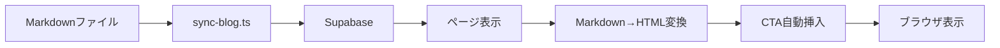
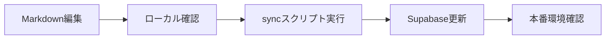

# Epackage Lab 専門家レベル ブログ作成ガイド

> **対象**: コンテンツクリエイター、ライター、開発者  
> **更新日**: 2025-04-11  
> **バージョン**: 2.0

---

## 目次

1. [ブログシステム概要](#1-ブログシステム概要)
2. [記事タイプとカテゴリー設計](#2-記事タイプとカテゴリー設計)
3. [コンテンツ構成のベストプラクティス](#3-コンテンツ構成のベストプラクティス)
4. [SEOとメタデータ戦略](#4-seoとメタデータ戦略)
5. [CTA配置とコンバージョン最適化](#5-cta配置とコンバージョン最適化)
6. [画像とメディア戦略](#6-画像とメディア戦略)
7. [関連記事と内部リンク構造](#7-関連記事と内部リンク構造)
8. [開発・公開ワークフロー](#8-開発公開ワークフロー)
9. [記事テンプレート](#9-記事テンプレート)
10. [品質チェックリスト](#10-品質チェックリスト)

---

## 1. ブログシステム概要

### 1.1 技術スタック

```
┌─────────────────────────────────────────────────────────────┐
│                     Epackage Lab ブログシステム                   │
├─────────────────────────────────────────────────────────────┤
│  フロントエンド                                               │
│  - Next.js 14+ (App Router)                                │
│  - React 18+                                               │
│  - TypeScript                                              │
│  - Tailwind CSS                                            │
├─────────────────────────────────────────────────────────────┤
│  コンテンツ管理                                              │
│  - Supabase (PostgreSQL)                                  │
│  - Markdown ファイル (`docs/blog/articles/`)              │
│  - sync-blog.ts (同期スクリプト)                            │
├─────────────────────────────────────────────────────────────┤
│  主要モジュール                                              │
│  - src/lib/blog/queries.ts (データ取得)                     │
│  - src/lib/blog/content.ts (Markdown解析)                   │
│  - src/lib/blog/cta.ts (CTA自動挿入)                        │
│  - src/lib/blog/seo.ts (SEOメタデータ)                       │
│  - src/lib/types/blog.ts (型定義)                           │
├─────────────────────────────────────────────────────────────┤
│  コンポーネント                                               │
│  - ArticleCTA (CTA表示)                                     │
│  - TableOfContents (目次)                                  │
│  - ShareButtons (シェア)                                    │
│  - RelatedPosts (関連記事)                                  │
└─────────────────────────────────────────────────────────────┘
```

### 1.2 データフロー



### 1.3 記事のライフサイクル

| ステータス | 説明 | API対応 |
|-----------|------|---------|
| `draft` | 下書き（非公開） | 管理者のみ閲覧可能 |
| `review` | レビュー中 | 管理者・編集者閲覧可能 |
| `published` | 公開済み | 一般公開 |
| `scheduled` | 予約公開 | 指定日時に自動公開 |
| `archived` | アーカイブ | 非表示 |

---

## 2. 記事タイプとカテゴリー設計

### 2.1 記事タイプ別ガイドライン

#### A. 製品紹介記事

**目的**: 製品の特徴・メリットを伝え、問い合わせを獲得

**基本構造**:
```markdown
1. リード文（読者の悩み）
2. 製品定義（基本情報）
3. メリット・デメリット
4. 活用シーン・用途
5. 選び方のポイント
   - サイズ選定
   - 素材選定
   - オプション選定
6. 発注フロー（STEP形式）
7. まとめ
8. CTA
```

**トーン**: 専門的かつ親しみやすく、実用性重視

**文字数**: 3,000〜5,000文字

**既存記事例**:
- `07-stand-pouch-v2.md` - スタンドパウチ
- `08-gazette-pouch-v2.md` - ガゼットパウチ

---

#### B. 実践的ノウハウ記事

**目的**: 読者の課題解決に役立つ実践的知識を提供

**基本構造**:
```markdown
1. リード文（読者の状況・悩み）
2. ノウハウの定義・基本
3. 具体的手法・テクニック
4. 実践ステップ
5. 成功事例・失敗事例
6. チェックリスト
7. まとめ
8. CTA
```

**トーン**: 教育的、具体的、アクション可能

**文字数**: 4,000〜7,000文字

**既存記事例**:
- `12-package-design-tips.md` - パッケージデザイン
- `13-small-lot-printing.md` - 小ロット印刷

---

#### C. 印刷技術記事

**目的**: 専門知識を分かりやすく解説し、信頼性を構築

**基本構造**:
```markdown
1. リード文（技術への関心）
2. 技術の定義・歴史
3. 仕組み・原理
4. メリット・デメリット
5. 比較検討
6. 活用事例
7. まとめ
8. CTA
```

**トーン**: 専門的、分かりやすい、客観的

**文字数**: 2,500〜4,000文字

**既存記事例**:
- `02-variable-printing.md` - バリアブル印刷
- `05-printing-comparison.md` - 印刷方式比較

---

#### D. 導入事例記事

**目的**: お客様の成功事例を通じて、信頼性を構築

**基本構造**:
```markdown
1. リード文（読者の課題）
2. 会社概要・導入背景
3. 導入前の課題
4. 選定理由・決定要因
5. 具体的活用方法
6. 成果と効果
7. 今後の展望
8. まとめ
9. CTA
```

**トーン**: 語り口調、リアリティのあるお客様の声

**文字数**: 5,000〜10,000文字

**既存記事例**:
- `16-customer-interview.md` - 顧客インタビュー

---

### 2.2 カテゴリー設計

| カテゴリーID | 日本語名 | 記事タイプ | 優先度 |
|-------------|---------|-----------|--------|
| `product-intro` | 製品紹介 | 製品紹介 | ★★★★★ |
| `practical-tips` | 実践的ノウハウ | ノウハウ | ★★★★☆ |
| `printing-tech` | 印刷技術 | 技術解説 | ★★★★☆ |
| `customer-stories` | 導入事例 | 事例紹介 | ★★★☆☆ |
| `news` | ニュース | お知らせ | ★★☆☆☆ |
| `technical` | 技術情報 | 技術情報 | ★★☆☆☆ |
| `industry` | 業界情報 | 業界情報 | ★★★☆☆ |
| `company` | 会社情報 | 会社情報 | ★★☆☆☆ |

---

## 3. コンテンツ構成のベストプラクティス

### 3.1 記事の冒頭構成

#### リード文の型

**基本パターン**:
```
[読者の状況・悩み] + [現状の課題] + [この記事で得られる価値]
```

**良い例**:
```markdown
「商品が棚に埋もれて目立たない...」「パッケージで商品価値を伝えたい」
そんな悩みを抱えていませんか？

パッケージは商品の「顔」であり、店頭での訴求力を左右する重要な要素です。
従来の平袋では、商品が倒れてしまったり、棚の奥に隠れてしまったりして、
せっかくの商品魅力が伝わらないことも少なくありません。

スタンドパウチ（自立袋）は、底部がW字型に折りたたまれた構造で、
内容物を充填すると自立する袋です。陳列効果を最大化し、商品の価値を
最大限に引き出します。
```

**リード文のチェックポイント**:
- [ ] 読者の悩みに共感している
- [ ] 具体的な状況を描写している
- [ ] 記事を読むメリットが明確
- [ ] 文字数は200〜400文字

### 3.2 目次の作成

#### 目次の基本構造

```markdown
## 目次

1. [セクション1](#1-セクション1)
2. [セクション2](#2-セクション2)
3. [セクション3](#3-セクション3)
```

**目次作成のポイント**:
- セクション数は5〜7個が最適
- アンカーリンクは `#` + 小文字・ハイフン区切り
- 箇条書き形式で見やすく

### 3.3 セクション構成

#### H2セクションの型

製品紹介記事のセクション構成:
```markdown
## 1. 製品名とは
### 基本的な特徴
### 主な種類

## 2. メリット・デメリット
### メリット1: 〇〇
### メリット2: 〇〇
### デメリットと対策

## 3. 選び方のポイント
### サイズ選定
### 素材選び

## 4. 発注から納品まで
### STEP1: 〇〇
### STEP2: 〇〇

## 5. まとめ
```

#### 表の活用

情報整理には表を積極的に活用:

```markdown
| 素材構成 | 特徴 | 適した商品 |
|---------|------|-----------|
| PET AL | 最強のバリア性、完全遮光 | コーヒー豆、保存食 |
| PET VMPET | 高いバリア性、金属光沢 | 一般的な食品 |
| PET LLDPE | 透明性、ヒートシール性 | ナッツ類、乾燥食品 |
```

**表作成のポイント**:
- 3〜5列が最適
- 見出しは太字で
- セル内は簡潔に

### 3.4 段落と読みやすさ

**段落の基本ルール**:
- 短い段落: 2〜4文で区切る
- 1文1段落も多用（強調効果）
- 箇条書きを頻繁に使用

**良い例**:
```markdown
スタンドパウチは、底部が特殊な形状で、内容物を入れると自立する袋です。
自立性によって、店頭での陳列効果が飛躍的に向上します。

基本的な特徴は以下の通りです。

- **自立性**: 内容物を入れると自立する
- **陳列効果**: 商品の顔を常に見せられる
- **省スペース**: 空の時はコンパクトに収納可能

特に陳列効果の高さが大きなメリットです。
```

---

## 4. SEOとメタデータ戦略

### 4.1 タイトル最適化

#### タイトル構成の基本型

```
【カテゴリー】メインキーワード｜サブタイトル（魅力を伝える）
```

**例**:
```markdown
【製品紹介】スタンドパウチ｜陳列効果を最大化する自立袋
【実践的ノウハウ】パッケージデザインの基本｜売れるパッケージを作る3つのコツ
【印刷知識】バリアブル印刷とは？｜小ロット多品種を実現する印刷技術
```

**タイトルの文字数目安**:
- 最適: 30〜40文字
- 最大: 60文字以内（Google検索結果）

### 4.2 メタディスクリプション

```markdown
スタンドパウチは底部がW字型に折りたたまれた構造で、
内容物を充填すると自立する袋です。陳列効果を最大化し、
商品の価値を最大限に引き出します。選び方のポイントから
発注フローまで詳しく解説します。
```

**メタディスクリプションの要件**:
- 文字数: 120〜160文字
- メインキーワードを含める
- 読者のメリットを明確に
- アクションを促す要素

### 4.3 キーワード戦略

#### キーワード配置

| 位置 | メインキーワード | 関連キーワード |
|------|------------------|----------------|
| タイトル | 必須（先頭） | 1〜2個 |
| メタディスクリプション | 必須 | 2〜3個 |
| H2 | 関連キーワード | - |
| 本文 | 自然に分散 | - |
| 画像alt | 関連キーワード | - |

#### 主要キーワード例

製品記事:
- メイン: 製品名（例: スタンドパウチ）
- 関連: 自立袋、パッケージ、陳列効果

ノウハウ記事:
- メイン: 課題解決キーワード（例: パッケージデザイン）
- 関連: デザイン、売れる、ノウハウ

### 4.4 構造化データ

#### BlogPosting スキーマ

ブログ記事ページには以下の構造化データを自動的に生成されます:

```json
{
  "@context": "https://schema.org",
  "@type": "BlogPosting",
  "headline": "記事タイトル",
  "description": "記事説明",
  "image": "OGP画像URL",
  "author": {
    "@type": "Organization",
    "name": "Epackage Lab"
  },
  "publisher": {
    "@type": "Organization",
    "name": "Epackage Lab",
    "logo": {
      "@type": "ImageObject",
      "url": "ロゴURL"
    }
  },
  "datePublished": "2025-02-25",
  "dateModified": "2025-02-25"
}
```

---

## 5. CTA配置とコンバージョン最適化

### 5.1 CTA自動挿入システム

ブログシステムでは、CTAが自動的に挿入されます:

```typescript
// src/lib/blog/cta.ts
const CTA_PLACEHOLDERS = {
  MID: '<!-- CTA:mid-article -->',
  END: '<!-- CTA:end-article -->',
};
```

**挿入位置**:
- 中盤CTA: 記事の50%位置（最初のH2見出しの後）
- 終了CTA: 記事の最後

### 5.2 CTAコンポーネント

#### 中盤CTA

```tsx
// ArticleCTA variant="mid-article"
<div className="rounded-2xl border border-[#8380FF]/20 bg-gradient-to-r from-[#8380FF]/5 to-[#8380FF]/10 p-4 sm:p-6">
  <h3>お気軽にご相談ください</h3>
  <p>最適なパッケージソリューションをご提案いたします。</p>
  <div className="flex gap-3">
    <Link href="/contact">お問い合わせ</Link>
    <Link href="/quote">見積もり依頼</Link>
  </div>
</div>
```

#### 終了CTA

```tsx
// ArticleCTA variant="end-article"
<div className="rounded-2xl border border-[#8380FF]/20 bg-gradient-to-r from-[#8380FF]/5 to-[#8380FF]/10 p-6 sm:p-8">
  <h3>パッケージ制作のご相談はこちら</h3>
  <p>お客様のニーズに合わせた最適なパッケージをご提案いたします。お気軽にお問い合わせください。</p>
  <div className="flex gap-3">
    <Link href="/contact">お問い合わせ</Link>
    <Link href="/quote">見積もり依頼</Link>
  </div>
</div>
```

### 5.3 コンバージョン最適化のポイント

1. **CTAの数**: 記事中2〜3個が最適
2. **配置**: 中盤1個、終了1個
3. **文言**: 具体的でアクション可能に
4. **デザイン**: 目立つが邪魔にならない程度に

---

## 6. 画像とメディア戦略

### 6.1 画像配置の基本

#### ヒーロー画像

```markdown

```

- 配置: リード文の直後
- サイズ: 1200x630px（OGP対応）
- 形式: WebP（PNG/JPGも可）

#### セクション画像

```markdown

```

- 配置: 各セクションの説明後
- サイズ: 800x450px（16:9）
- 用途: 図解、比較、事例画像

### 6.2 画像命名規則

```
/images/blog/
├── {記事番号}-{記事slug}/
│   ├── {記事番号}-hero-01.{ext}     # ヒーロー画像
│   ├── {記事番号}-section-01.{ext}  # セクション画像
│   ├── {記事番号}-product-01.{ext}  # 製品画像
│   ├── {記事番号}-products-grid-01.{ext}  # 製品グリッド
│   ├── {記事番号}-problems-01.{ext}  # 課題図解
│   ├── {記事番号}-results-01.{ext}   # 成果画像
│   └── {記事番号}-future-01.{ext}    # 将来像
```

### 6.3 アクセシビリティ

#### 代替テキスト

- **良い例**: `スタンドパウチの製品イメージ。底部がW字型に折りたたまれ、自立する様子を示す`
- **悪い例**: `画像`、`image`、``

---

## 7. 関連記事と内部リンク構造

### 7.1 関連記事の自動選択

```typescript
// src/lib/blog/queries.ts
export async function getRelatedPosts(
  currentPostId: string,
  category: BlogCategoryId,
  limit = 3
): Promise<BlogPostListItem[]>
```

**選択ロジック**:
1. 同じカテゴリーの記事
2. 公開済み（status = 'published'）
3. 現在の記事を除外
4. 公開日が新しい順
5. 最大3件

### 7.2 内部リンク戦略

#### 記事内リンク

```markdown
関連記事:
- [【製品紹介】平袋｜コストパフォーマンス最強の定番パッケージ](/blog/articles/06-flat-pouch.md)
- [【製品紹介】ガゼットパウチ（BOX型）｜大容量商品を自立させる箱型パッケージ](/blog/articles/08-gazette-pouch-v2.md)
```

**リンクの要件**:
- 3件の関連記事を記載
- 同じカテゴリーまたは関連性の高い記事
- 絶対パスで記述

#### コンテンツ間の関連性

```
                        [03: 小ロットOEMガイド]
                                     │
        ┌────────────────┬─────────┼─────────┬────────────────┐
        │                 │         │         │                │
 [06: 平袋] [07: スタンド] [08: ガゼット] [05: 印刷比較] [02: バリアブル]
        │                 │         │         │                │
        └────────────────┼─────────┼─────────┴────────────────┘
                         │         │
                   [12: デザイン] [13: 小ロット印刷]
                         │         │
                   [14: 白版] [15: 型抜き]
                         │
                   [16: 顧客インタビュー]
```

---

## 8. 開発・公開ワークフロー

### 8.1 記事作成のステップ

#### STEP1: 記事の企画

```
企画書の作成
├── 記事タイプ
├── カテゴリー
├── ターゲット読者
├── メインキーワード
├── 記事の目的
└── CTA目標
```

#### STEP2: コンテンツ作成

```
docs/blog/articles/
└── {番号}-{slug}.md
```

**ファイル命名規則**:
```
{2桁番号}-{kebab-case-slug}.md
例: 17-new-package-type.md
```

#### STEP3: Markdown記述

基本テンプレート（次章参照）を使用

#### STEP4: 画像準備

```bash
public/images/blog/{記事番号}-{slug}/
```

#### STEP5: Supabaseへの登録

**方法1: SQLで登録（推奨）**
```bash
# Supabase DashboardでSQLを実行
```

**方法2: syncスクリプト実行**
```bash
npm run sync:blog
```

### 8.2 公開前チェック

```markdown
## パブリッシングチェックリスト

### コンテンツ
- [ ] リード文で読者の悩みに共感している
- [ ] 目次のリンクが正しく機能している
- [ ] 全ての表が正しく表示されている
- [ ] 関連記事のリンクが有効

### SEO
- [ ] メインタイトルにキーワードを含んでいる
- [ ] メタディスクリプションを設定済み（120〜160文字）
- [ ] H2見出しに関連キーワードを配置

### 画像
- [ ] ヒーロー画像がある（1200x630px）
- [ ] 全ての画像にalt属性がある
- [ ] 画像パスが正しい

### CTA
- [ ] CTAリンクが正しいURLを指している
- [ ] 少なくとも2つのCTAがある

### 技術
- [ ] ステータスが'published'になっている
- [ ] 公開日時が設定されている
- [ ] スラッグが一意である
```

### 8.3 更新フロー



---

## 9. 記事テンプレート

### 9.1 製品紹介記事テンプレート

```markdown
# 【製品紹介】{製品名}｜{サブタイトル}

**YYYY.MM.DD** | #{製品紹介} #{関連タグ}

---

## リード文

「読者の悩み...」そんなお悩みを抱えていませんか？

現在の課題を説明。この記事で得られる価値を提示。


---

## 目次

1. [{製品名}とは](#1-{製品名})
2. [特徴と種類](#2-特徴と種類)
3. [メリット・デメリット](#3-メリットデメリット)
4. [主な用途](#4-主な用途)
5. [選び方のポイント](#5-選び方のポイント)
6. [発注から納品まで](#6-発注から納品まで)
7. [まとめ](#7-まとめ)

---

## 1. {製品名}とは

製品の定義と基本情報。

### 基本的な特徴

- **特徴1**: 説明
- **特徴2**: 説明
- **特徴3**: 説明

### 仕組みの詳細

1. 工程1
2. 工程2
3. 工程3


---

## 2. 特徴と種類

### 基本構造

| 部位 | 役割 |
|------|------|
| **前面** | ブランドロゴ、商品名 |
| **背面** | 成分表示、使用方法 |
| **底部** | 自立を支える構造 |

### 主な種類

#### 1. タイプ1

**特徴:**
- 特徴1
- 特徴2

**適した商品:**
- 商品例1
- 商品例2

---

## 3. メリット・デメリット

### メリット1: 〇〇

具体的な効果を説明。

**具体的な効果:**
- 効果1
- 効果2
- 効果3

### デメリット

| デメリット | 説明 | 対策 |
|-----------|------|------|
| **課題** | 説明 | 解決策 |

---

## 4. 主な用途

### 食品分野

| カテゴリー | 具体例 |
|-----------|--------|
| **カテゴリー** | 具体例 |

---

## 5. 選び方のポイント

### サイズ選定

商品の大きさに合わせて選びます。

#### サイズの選び方

```
袋の幅 = 商品幅 + 10〜20mm（余白）
袋の高さ = 商品高さ + 50〜80mm
```

### 素材選び

| 素材構成 | 特徴 | 適した商品 |
|---------|------|-----------|
| **PET AL** | 最強のバリア性 | コーヒー豆 |


---

## 6. 発注から納品まで

### STEP1: スマート見積り

サイズ、素材、数量を入力し、即座に見積もりを取得します。

- サイズ: 幅×高さ
- 素材構成
- 印刷色数
- 数量

**所要時間: 約1分**

### STEP2: 仕様決定

必要に応じて以下のオプションを決定します。

- チャックの有無
- ハングホールの有無

### STEP3: デザイン入稿

デザインデータをアップロードします。

#### デザイン仕様

| 項目 | 推奨仕様 |
|------|----------|
| **フォーマット** | PDF, AI形式 |
| **カラーモード** | CMYK |
| **解像度** | 300dpi以上 |

### STEP4: 製造・納品

- データチェック（無料）
- 見本確認（オプション）
- 製造（最短21日、平均28日）
- 納品

---

## 7. まとめ

{製品名}は、〇〇を実現する優れたパッケージソリューションです。

**ポイントをおさらい:**

- ポイント1
- ポイント2
- ポイント3

Epackage Labでは、500枚から製造可能な{製品名}を、国内最安値級の価格で提供しています。

---

## 関連記事

- [【製品紹介】関連記事1](/blog/articles/XX.md)
- [【製品紹介】関連記事2](/blog/articles/XX.md)
- [【製品紹介】関連記事3](/blog/articles/XX.md)

---

**パッケージに関するお問い合わせはEpackage Labまで！**

[スマート見積りを試す] | [お問い合わせフォーム]
```

### 9.2 実践的ノウハウ記事テンプレート

```markdown
# 【実践的ノウハウ】{テーマ}｜{サブタイトル}

**YYYY.MM.DD** | #{実践的ノウハウ} #{関連タグ}

---

## リード文

「読者の状況...」そんなお悩みを抱えていませんか？

多くの事業者が、〇〇という課題を抱えています。

この記事では、〇〇の具体的な方法を解説します。


---

## 目次

1. [{テーマ}の基本](#1-{テーマ}の基本)
2. [具体的な手法](#2-具体的な手法)
3. [実践ステップ](#3-実践ステップ)
4. [成功事例](#4-成功事例)
5. [まとめ](#5-まとめ)

---

## 1. {テーマ}の基本

定義と基本情報。

### なぜ重要か

- 理由1
- 理由2
- 理由3

---

## 2. 具体的な手法

### 手法1: 〇〇

具体的な方法を説明。

#### 実践方法

1. ステップ1
2. ステップ2
3. ステップ3

### 手法2: 〇〇

詳しい説明。

---

## 3. 実践ステップ

### STEP1: 準備

必要な準備事項。

### STEP2: 実行

実行の具体的な方法。

### STEP3: 振り返り

結果の分析方法。

---

## 4. 成功事例

実際の成功事例を紹介。

### 事例1: 〇〇

**課題**: 具体的な課題
**対策**: 具体的な対策
**結果**: 具体的な結果

---

## 5. まとめ

{テーマ}は、以下のような効果が期待できます。

**ポイントをおさらい:**

1. ポイント1
2. ポイント2
3. ポイント3

まずは小さなステップから始めてみましょう。

---

## 関連記事

- [関連記事1](/blog/articles/XX.md)
- [関連記事2](/blog/articles/XX.md)
- [関連記事3](/blog/articles/XX.md)

---

**パッケージに関するお問い合わせはEpackage Labまで！**

[スマート見積りを試す] | [お問い合わせフォーム]
```

---

## 10. 品質チェックリスト

### 10.1 記事完成度チェック

#### コンテンツ品質

| 項目 | チェックポイント | 状態 |
|------|------------------|------|
| **タイトル** | メインキーワードを含む | ☐ |
| | 30〜40文字 | ☐ |
| **リード文** | 読者の悩みに共感 | ☐ |
| | 記事の価値が明確 | ☐ |
| **構成** | 目次がある | ☐ |
| | セクションが論理的 | ☐ |
| **内容** | 具体的な例がある | ☐ |
| | 表・箇条書きで整理 | ☐ |
| **まとめ** | ポイントが明確 | ☐ |
| | アクション可能 | ☐ |

#### SEO品質

| 項目 | チェックポイント | 状態 |
|------|------------------|------|
| **キーワード** | タイトルに含まれる | ☐ |
| | H2に含まれる | ☐ |
| | 自然に配置 | ☐ |
| **メタデータ** | ディスクリプション設定済み | ☐ |
| | 120〜160文字 | ☐ |
| **内部リンク** | 関連記事3件 | ☐ |
| | リンクが有効 | ☐ |

#### 技術品質

| 項目 | チェックポイント | 状態 |
|------|------------------|------|
| **フォーマット** | Markdown形式 | ☐ |
| | ファイル名規則遵守 | ☐ |
| **画像** | パスが正しい | ☐ |
| | alt属性がある | ☐ |
| **CTA** | 中盤CTAがある | ☐ |
| | 終了CTAがある | ☐ |
| | リンクが正しい | ☐ |

### 10.2 公開前チェック

#### Supabase登録確認

```sql
-- 記事が正しく登録されたか確認
SELECT 
  title,
  slug,
  category,
  status,
  published_at,
  reading_time_minutes
FROM blog_posts
WHERE slug = 'your-slug'
ORDER BY created_at DESC;
```

#### 画像確認

```bash
# 画像ファイルが存在するか確認
ls -la public/images/blog/{記事番号}-{slug}/
```

#### 表示確認

```bash
# ローカルで確認
npm run dev

# 記事URLにアクセス
http://localhost:3000/blog/your-slug
```

---

## 付録

### A. クイックリファレンス

#### タイトル例

```markdown
【製品紹介】{製品名}｜{魅力を伝えるサブタイトル}
【実践的ノウハウ】{テーマ}｜{ベネフィット}
【印刷知識】{技術名}｜{分かりやすく説明}
【導入事例】{企業名}×{キーワード}｜{魅力的なサブタイトル}
```

#### リード文の型

```
「読者の悩み」...そんなお悩みを抱えていませんか？

現状の課題を説明。

この記事では、{解決策}を解説します。{得られる価値}。
```

#### セクション構成（製品紹介）

```
1. 製品とは
2. 特徴と種類
3. メリット・デメリット
4. 主な用途
5. 選び方のポイント
6. 発注から納品まで
7. まとめ
```

### B. よくある質問

**Q: 記事の文字数はどのくらい？**
A: 製品紹介 3,000〜5,000文字、ノウハウ 4,000〜7,000文字

**Q: 画像は必須？**
A: ヒーロー画像は必須。セクション画像は推奨

**Q: CTAは何個必要？**
A: 自動挿入されるため、最低2個（中盤・終了）

**Q: 関連記事はいくつ？**
A: 3件を推奨

### C. 参考資料

- `docs/blog/blog-writing-guidelines.md` - 基本ガイドライン
- `docs/blog/ROADMAP.md` - 記事ロードマップ
- `src/lib/types/blog.ts` - 型定義
- `src/lib/blog/queries.ts` - データ取得

---

*最終更新: 2025-04-11*  
*Epackage Lab ブログ編集部*
