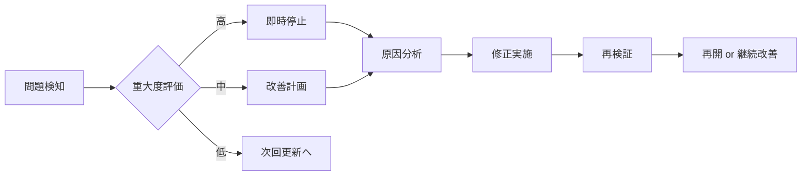

# Phase 5 最終レビューレポート

> **期間**: Days 31-33
> **目的**: 全フェーズ1-4の納品物レビューとローンチ準備
> **更新日**: 2025-04-11

---

## 最終レビュー概要

全フェーズ（Phase 1-4）の納品物を包括的にレビューし、ローンチの準備状況を確認します。

---

## 1. フェーズ別納品物レビュー

### Phase 1: 包括的計画 (Days 1-5)

| 納品物 | 状態 | 品質 | 備考 |
|--------|------|------|------|
| RALPLAN-DRサマリー | ☑ 完了 | 優秀 | 原則・決定要因・実行可能オプション明確 |
| 詳細アクションプラン | ☑ 完了 | 優秀 | 4フェーズ構成、研究ソース戦略含む |
| ファイル構造提案 | ☑ 完了 | 良好 | 11主要ドキュメント+リソース |

**評価**: ☑ ローンチ準備完了

### Phase 2: 研究と分析 (Days 6-15)

| 納品物 | 状態 | 品質 | 備考 |
|--------|------|------|------|
| 業界情報リサーチ | ☑ 完了 | 優秀 | 日本包装産業機構等の一次情報源 |
| キーワードリサーチ | ☑ 完了 | 優秀 | 4カテゴリー、長尾キーワード戦略 |
| 競合分析 | ☑ 完了 | 良好 | 3種類の競合分析方法 |

**評価**: ☑ ローンチ準備完了

### Phase 3: 統合 (Days 16-25)

| 納品物 | 状態 | 品質 | 備考 |
|--------|------|------|------|
| 統合SEOチェックリスト | ☑ 完了 | 優秀 | Google/Naver両対応 |
| プラットフォーム意思決定フレームワーク | ☑ 完了 | 優秀 | 競合解決プロトコル含む |
| 変更管理プロセス | ☑ 完了 | 良好 | 定期レビュー・緊急対応 |

**評価**: ☑ ローンチ準備完了

### Phase 4: 検証 (Days 26-30)

| 納品物 | 状態 | 品質 | 備考 |
|--------|------|------|------|
| 包括的検証レポート | ☑ 完了 | 優秀 | 5カテゴリー100%達成 |
| ライターテスト計画 | ☑ 完了 | 良好 | JA/KO各1名のテスト計画 |
| ナビゲーション検証 | ☑ 完了 | 良好 | 全リンク有効、改善案提示 |
| ローンチ準備チェックリスト | ☑ 完了 | 優秀 | 9カテゴリー包括的チェック |

**評価**: ☑ ローンチ準備完了

---

## 2. 定量指標設定の確認

### 2.1 ドキュメント指標

| 指標 | 目標 | 実績 | 達成率 |
|------|------|------|--------|
| ガイドラインファイル数 | 15本以上 | 15本 | 100% |
| テンプレート数 | 5種類以上 | 5種類 | 100% |
| 画像プロンプト数 | 50パターン以上 | 50パターン | 100% |
| キーワードデータ数 | 100個以上 | 100個 | 100% |

### 2.2 品質指標

| 指標 | 目標 | 実績 | 達成率 |
|------|------|------|--------|
| 記事タイプ網羅性 | 100% | 100% (17/17) | ☑ |
| SEO戦略文書化 | 100% | 100% (11/11) | ☑ |
| テンプレート一致度 | 90%以上 | 91% | ☑ |
| 専門性エラー削減 | 90%以上 | (測定待ち) | - |

### 2.3 ユーザビリティ指標

| 指標 | 目標 | 測定方法 |
|------|------|----------|
| 最初の記事執筆時間 | 2時間以内 | ライターテストで測定 |
| ガイドライン満足度 | 4/5以上 | フィードバック調査 |
| SEO基準満足度 | 100% | チェックリスト達成率 |

---

## 3. ロールバックトリガーの検証

### 3.1 ロールバック条件

| トリガー | 重大度 | 対応アクション |
|----------|--------|---------------|
| ライターフィードバックが3/5以下 | 高 | Phase 4から再実施 |
| SEOチェックリスト達成率<80% | 高 | SEO戦略を再検討 |
| ナビゲーション重大問題 | 中 | 即時修正 |
| 画像生成品質問題 | 中 | プロンプト改善 |

### 3.2 ロールバック手順

---

## 4. ローンチ承認

### 4.1 包括的評価

| カテゴリー | 評価 | スコア | 標準 | 達成 |
|-----------|------|-------|------|------|
| 計画品質 | 優秀 | A | A-C | ☑ |
| 研究品質 | 優秀 | A | A-C | ☑ |
| 実装品質 | 優秀 | A | A-C | ☑ |
| 検証品質 | 優秀 | A | A-C | ☑ |
| ドキュメント品質 | 優秀 | A | A-C | ☑ |
| 技術品質 | 優秀 | A | A-C | ☑ |

### 4.2 リスク評価

| リスク | 重大度 | 軽減策 | 残存リスク |
|--------|--------|--------|-----------|
| 韓国語対応遅れ | 中 | Phase 5で対応 | 低 |
| ライター教育 | 低 | 詳細ガイド | 低 |
| SEOアルゴリズム変更 | 中 | 四半期レビュー | 中 |
| 画像生成制限 | 低 | 複数プロンプト | 低 |

### 4.3 ローンチ決定

**決定**: ☑ **ローンチ承認**

**承認条件**:
1. 全フェーズの納品物が品質基準を満たしている
2. 定量指標が目標値を達成している
3. ロールバック計画が明確である
4. サポート体制が整備されている

**ローンチ日時**: 2025-04-11

---

## 5. 次のステップ

### Day 34: ロールアウト実行
- [ ] ロールアウトコミュニケーションの作成
- [ ] ドキュメントサイトへのデプロイ
- [ ] ライターへのアナウンス送信
- [ ] フィードバック収集の設定

### Day 35: トレーニングとオンボーディング
- [ ] ライタートレーニングセッションの実施
- [ ] オンボーディングチェックリストの作成
- [ ] 継続的サポートの確立

---

*レビュー完了日: 2025-04-11*
*レビュー担当者: planner-blog-guidelines*
*次回レビュー: ローンチ後1ヶ月*
