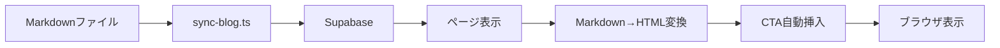

# Shared Technical Standards
# 共有技術標準

> **対象**: 開発者、技術者
> **内容**: 言語に関わらず共通の技術仕様
> **更新**: 技術変更時のみ更新

---

## 目次

1. [技術標準](#技術標準)
2. [画像ガイドライン](#画像ガイドライン)
3. [CTAプロトコル](#ctaプロトコル)
4. [変更管理](#変更管理)

---

## 技術標準

`technical-standards/` ディレクトリにシステム技術仕様があります。

| ドキュメント | 説明 |
|-------------|------|
| `system-overview.md` | ブログシステム概要 |
| `article-types.md` | 記事タイプとカテゴリー設計 |
| `table-of-contents.md` | 目次の作成 |
| `structured-data.md` | 構造化データ（JSON-LD） |
| `internal-linking.md` | 関連記事と内部リンク構造 |

---

## 画像ガイドライン

`image-guidelines/` ディレクトリに画像仕様があります。

| ドキュメント | 説明 |
|-------------|------|
| `image-strategy.md` | 画像配置と戦略 |
| `nanobanana-mcp-guide.md` | nanobanana MCP使用ガイド |
| `image-specifications.md` | 画像仕様（サイズ、形式） |
| `alt-text-standards.md` | 代替テキスト標準 |

---

## CTAプロトコル

`cta-protocol/` ディレクトリにCTAシステム仕様があります。

| ドキュメント | 説明 |
|-------------|------|
| `cta-system.md` | CTA自動挿入システム |
| `insertion-points.md` | 挿入位置の定義 |
| `cta-variants.md` | CTAコンポーネント variants |
| `ab-testing.md` | A/Bテスト手法 |

---

## 変更管理

`change-management/` ディレクトリに更新フローがあります。

| ドキュメント | 説明 |
|-------------|------|
| `propagation-protocol.md` | 変更伝播プロトコル |
| `review-workflow.md` | レビューワークフロー |
| `rollback-procedures.md` | ロールバック手順 |
| `pre-publish-check.md` | 公開前チェック |

---

## 技術スタック

```
┌─────────────────────────────────────────────────────────────┐
│                     Epackage Lab ブログシステム                   │
├─────────────────────────────────────────────────────────────┤
│  フロントエンド                                               │
│  - Next.js 14+ (App Router)                                │
│  - React 18+                                               │
│  - TypeScript                                              │
│  - Tailwind CSS                                            │
├─────────────────────────────────────────────────────────────┤
│  コンテンツ管理                                              │
│  - Supabase (PostgreSQL)                                  │
│  - Markdown ファイル (`docs/blog/articles/`)              │
│  - sync-blog.ts (同期スクリプト)                            │
├─────────────────────────────────────────────────────────────┤
│  主要モジュール                                              │
│  - src/lib/blog/queries.ts (データ取得)                     │
│  - src/lib/blog/content.ts (Markdown解析)                   │
│  - src/lib/blog/cta.ts (CTA自動挿入)                        │
│  - src/lib/blog/seo.ts (SEOメタデータ)                       │
│  - src/lib/types/blog.ts (型定義)                           │
└─────────────────────────────────────────────────────────────┘
```

---

## データフロー



---

## 関連資料

- [src/lib/types/blog.ts](../../../src/lib/types/blog.ts) - 型定義
- [src/lib/blog/queries.ts](../../../src/lib/blog/queries.ts) - データ取得
- [src/lib/blog/cta.ts](../../../src/lib/blog/cta.ts) - CTAシステム

---

**最終更新**: 2025-04-11
