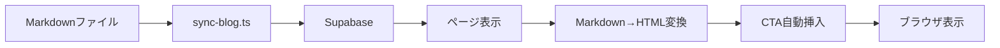

# Blog System Overview
# ブログシステム概要

> **対象**: 開発者、技術者
> **目的**: ブログシステムの技術構造を理解する
> **更新**: 技術変更時のみ

---

## 技術スタック

```
┌─────────────────────────────────────────────────────────────┐
│                     Epackage Lab ブログシステム                   │
├─────────────────────────────────────────────────────────────┤
│  フロントエンド                                               │
│  - Next.js 14+ (App Router)                                │
│  - React 18+                                               │
│  - TypeScript                                              │
│  - Tailwind CSS                                            │
├─────────────────────────────────────────────────────────────┤
│  コンテンツ管理                                              │
│  - Supabase (PostgreSQL)                                  │
│  - Markdown ファイル (`docs/blog/articles/`)              │
│  - sync-blog.ts (同期スクリプト)                            │
├─────────────────────────────────────────────────────────────┤
│  主要モジュール                                              │
│  - src/lib/blog/queries.ts (データ取得)                     │
│  - src/lib/blog/content.ts (Markdown解析)                   │
│  - src/lib/blog/cta.ts (CTA自動挿入)                        │
│  - src/lib/blog/seo.ts (SEOメタデータ)                       │
│  - src/lib/types/blog.ts (型定義)                           │
├─────────────────────────────────────────────────────────────┤
│  コンポーネント                                               │
│  - ArticleCTA (CTA表示)                                     │
│  - TableOfContents (目次)                                  │
│  - ShareButtons (シェア)                                    │
│  - RelatedPosts (関連記事)                                  │
└─────────────────────────────────────────────────────────────┘
```

---

## データフロー



---

## 記事のライフサイクル

| ステータス | 説明 | API対応 |
|-----------|------|---------|
| `draft` | 下書き（非公開） | 管理者のみ閲覧可能 |
| `review` | レビュー中 | 管理者・編集者閲覧可能 |
| `published` | 公開済み | 一般公開 |
| `scheduled` | 予約公開 | 指定日時に自動公開 |
| `archived` | アーカイブ | 非表示 |

---

## 主要モジュール

### src/lib/blog/queries.ts

データ取得とクエリを担当。

```typescript
// 主な関数
export async function getPublishedPosts(): Promise<BlogPostListItem[]>
export async function getPublishedPostBySlug(slug: string): Promise<BlogPost | null>
export async function getRelatedPosts(id: string, category: string, limit?: number): Promise<BlogPostListItem[]>
export async function incrementViewCount(id: string): Promise<void>
```

### src/lib/blog/content.ts

Markdownの解析とHTML変換を担当。

```typescript
// 主な関数
export async function parseMarkdown(content: string): Promise<{
  html: string
  headings: Heading[]
  wordCount: number
  readingTime: number
}>
```

### src/lib/blog/cta.ts

CTAの自動挿入を担当。

```typescript
// 定数
export const CTA_PLACEHOLDERS = {
  MID: '<!-- CTA:mid-article -->',
  END: '<!-- CTA:end-article -->',
} as const;

// 関数
export function insertCTAPlaceholders(html: string, options?: CTAOptions): string
export function splitContentByCTA(html: string): SplitContentResult
```

### src/lib/blog/seo.ts

SEOメタデータの生成を担当。

```typescript
// 主な関数
export function generateBlogPostingSchema(data: SchemaData): BlogPostingSchema
export function generateBreadcrumbSchema(breadcrumbs: Breadcrumb[]): BreadcrumbSchema
```

### src/lib/types/blog.ts

型定義。

```typescript
// 主な型
export type BlogPostStatus = 'draft' | 'review' | 'published' | 'scheduled' | 'archived'
export type BlogCategoryId = 'product-intro' | 'practical-tips' | 'printing-tech' | 'customer-stories' | 'news' | 'technical' | 'industry' | 'company'

export interface BlogPost {
  id: string
  title: string
  slug: string
  content: string
  category: BlogCategoryId
  status: BlogPostStatus
  // ...
}
```

---

## コンポーネント

### ArticleCTA

CTA表示コンポーネント。

```typescript
interface ArticleCTAProps {
  variant: 'mid-article' | 'end-article'
}
```

**variants**:
- `mid-article`: 記事の50%位置に挿入
- `end-article`: 記事の最後に挿入

### TableOfContents

目次表示コンポーネント。

```typescript
interface TableOfContentsProps {
  headings: Heading[]
}
```

### ShareButtons

ソーシャルシェアボタン。

```typescript
interface ShareButtonsProps {
  url: string
  title: string
  description?: string
}
```

### RelatedPosts

関連記事表示。

```typescript
interface RelatedPostsProps {
  posts: BlogPostListItem[]
  currentPostId: string
  category: string
}
```

---

## ファイル構造

```
src/
├── app/
│   └── blog/
│       ├── page.tsx                 # ブログ一覧
│       └── [slug]/
│           └── page.tsx             # ブログ記事詳細
├── lib/
│   └── blog/
│       ├── queries.ts               # データ取得
│       ├── content.ts               # Markdown解析
│       ├── cta.ts                   # CTA処理
│       ├── seo.ts                   # SEO処理
│       └── markdown.ts              # Markdownユーティリティ
├── components/
│   └── blog/
│       ├── ArticleCTA.tsx           # CTAコンポーネント
│       ├── TableOfContents.tsx      # 目次コンポーネント
│       ├── ShareButtons.tsx         # シェアボタン
│       └── RelatedPosts.tsx         # 関連記事
└── types/
    └── blog.ts                      # 型定義
```

---

## 関連資料

- [記事タイプとカテゴリー](./article-types.md)
- [目次の作成](./table-of-contents.md)
- [構造化データ](./structured-data.md)

---

**最終更新**: 2025-04-11
