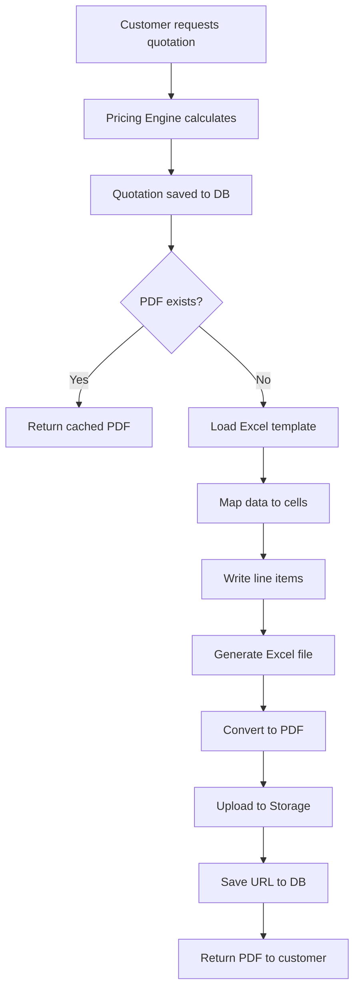

# Excel Template-Based Quotation System Design
# Excel 템플릿 기반 견적서 자동 발행 시스템 설계

**Version:** 1.0
**Date:** 2025-12-31
**Status:** Design Phase
**Template Location:** `C:\Users\kanei\claudecode\02.Homepage_Dev\02.epac_homepagever1.1\templet\quotation-epackage-lab.xlsx`

---

## Table of Contents / 목차

1. [System Overview / 시스템 개요](#system-overview)
2. [Template Structure Analysis / 템플릿 구조 분석](#template-structure-analysis)
3. [Data Mapping Design / 데이터 매핑 설계](#data-mapping-design)
4. [Technical Architecture / 기술 아키텍처](#technical-architecture)
5. [Implementation Plan / 구현 계획](#implementation-plan)
6. [API Design / API 설계](#api-design)
7. [Code Examples / 코드 예시](#code-examples)

---

## 1. System Overview / 시스템 개요

### Business Requirements / 비즈니스 요구사항

```yaml
Purpose:
  日本市場向けB2Bパッケージング材の見積書をExcelテンプレートから自動生成
  Generate B2B packaging material quotations for Japanese market from Excel template

Key Requirements:
  - ExcelテンプレートベースのPDF生成 (Excel template-based PDF generation)
  - 日本語・韓国語二カ国語対応 (Japanese/Korean bilingual support)
  - 法人顧客向け正式書式フォーマット (Corporate customer formal document format)
  - データベース連携による自動化 (Database-driven automation)
  - 電子署名・ Stamper機能対応 (Electronic signature & stamp support)

Target Users:
  Primary: B2B企業顧客 (Corporations)
  Secondary: システム管理者 (System administrators)
```

### Current System State / 현재 시스템 상태

```yaml
Existing Components:
  - Pricing Engine: pricing-engine.ts (価格計算エンジン)
  - Database: Supabase (quotations, quotation_items)
  - PDF Generation: jsPDF + html2canvas (不完全 - incomplete)

Gaps to Fill:
  - Excelテンプレート読み込み (Excel template loader)
  - データマッピングレイヤー (Data mapping layer)
  - 日本語フォント対応PDF生成 (Japanese font PDF generation)
  - キャッシュシステム (Caching system)
```

---

## 2. Template Structure Analysis / 템플릿 구조 분석

### Assumed Excel Template Structure / 가정된 Excel 템플릿 구조

```yaml
Workbook Structure:
  Sheets:
    - Sheet1: 見積書 (Quotation) - Main quotation document
    - Sheet2: 明細 (Item Details) - Line items breakdown
    - Sheet3: 契約書 (Contract) - Contract terms (optional)
    - Sheet4: 作業標準書 (Work Order) - Production specifications (optional)
```

### Sheet 1: 見積書 (Quotation) - Main Document

```
┌─────────────────────────────────────────────────────────────┐
│                     EPACKAGE LAB                             │
│                  見 積 書 (QUOTATION)                       │
├─────────────────────────────────────────────────────────────┤
│                                                               │
│  見積番号 (QT-YYYY-NNNN):    [A10]  quotation_number        │
│  発行日 (Issued Date):       [A12]  issued_at              │
│  有効期限 (Valid Until):     [A14]  valid_until            │
│                                                               │
├─────────────────────────────────────────────────────────────┤
│  顧客情報 (Customer Information)                            │
│                                                               │
│  会社名: [B20] customer_name                                │
│  ご担当者名: [B21] contact_person                          │
│  郵便番号: [B22] postal_code                               │
│  住所: [B23] address                                       │
│  電話番号: [B24] phone                                     │
│  メール: [B25] email                                       │
│                                                               │
├─────────────────────────────────────────────────────────────┤
│  納入・支払条件 (Delivery & Payment Terms)                 │
│                                                               │
│  納期: [B30] lead_time                                     │
│  支払条件: [B31] payment_terms                             │
│  納入場所: [B32] delivery_location                         │
│                                                               │
├─────────────────────────────────────────────────────────────┤
│  明細 (Item Details) - Referenced from Sheet2              │
│                                                               │
│  小計 (Subtotal):          [B40] subtotal_amount           │
│  消費税 (Tax 10%):         [B41] tax_amount                │
│  合計 (Total):             [B42] total_amount              │
│                                                               │
├─────────────────────────────────────────────────────────────┤
│  備考 (Notes)                                                 │
│  [B45] notes                                                 │
│                                                               │
└─────────────────────────────────────────────────────────────┘
```

### Sheet 2: 明細 (Item Details) - Line Items

```
┌──────┬────────────────┬─────────┬──────────┬─────────┬──────────┐
│ No.  │ 品名            │ 規格    │ 数量     │ 単価    │ 金額      │
│ (A)  │ Product Name    │ Specs   │ Qty      │ Unit    │ Amount   │
│      │ (B)             │ (C)     │ (D)      │ (E)     │ (F)      │
├──────┼────────────────┼─────────┼──────────┼─────────┼──────────┤
│  8   │ Item 1          │ Specs 1 │ 1000     │ ¥150    │ ¥150,000 │
│  9   │ Item 2          │ Specs 2 │ 2000     │ ¥200    │ ¥400,000 │
│ 10   │ ...             │ ...     │ ...      │ ...     │ ...      │
└──────┴────────────────┴─────────┴──────────┴─────────┴──────────┘
```

### Cell Mapping Definition / 셀 매핑 정의

```typescript
// src/lib/excel/quotation-cell-mapping.ts

export const QUOTATION_CELL_MAPPING = {
  // Header Information
  quotationNumber: 'A10',
  issuedAt: 'A12',
  validUntil: 'A14',

  // Customer Information
  customerName: 'B20',
  contactPerson: 'B21',
  postalCode: 'B22',
  address: 'B23',
  phone: 'B24',
  email: 'B25',

  // Terms
  leadTime: 'B30',
  paymentTerms: 'B31',
  deliveryLocation: 'B32',

  // Totals
  subtotalAmount: 'B40',
  taxAmount: 'B41',
  totalAmount: 'B42',

  // Notes
  notes: 'B45'
} as const;

export const ITEMS_SHEET_RANGE = {
  startRow: 8,
  endRow: 100, // Maximum items
  columns: {
    no: 'A',
    productName: 'B',
    specifications: 'C',
    quantity: 'D',
    unitPrice: 'E',
    amount: 'F'
  }
} as const;
```

---

## 3. Data Mapping Design / 데이터 매핑 설계

### Database to Excel Mapping / 데이터베이스 → Excel 매핑

```typescript
// src/lib/excel/data-mapper.ts

import { QuotationWithItems } from '@/types/quotation';
import { QUOTATION_CELL_MAPPING, ITEMS_SHEET_RANGE } from './quotation-cell-mapping';

export interface ExcelQuotationData {
  // Sheet 1: Main Quotation
  header: {
    quotationNumber: string;
    issuedAt: string;  // Format: "2025年1月1日"
    validUntil: string;
  };

  customer: {
    companyName: string;
    contactPerson: string;
    postalCode: string;
    address: string;
    phone: string;
    email: string;
  };

  terms: {
    leadTime: string;
    paymentTerms: string;
    deliveryLocation: string;
  };

  totals: {
    subtotal: number;
    tax: number;
    total: number;
  };

  notes: string;

  // Sheet 2: Line Items
  items: Array<{
    no: number;
    productName: string;
    productNameJa: string;
    specifications: string;
    quantity: number;
    unitPrice: number;
    amount: number;
  }>;
}

export class QuotationDataMapper {
  /**
   * Transform database quotation to Excel format
   */
  static mapToExcelFormat(quotation: QuotationWithItems): ExcelQuotationData {
    const { quotation: q, items } = quotation;

    // Format dates in Japanese style
    const formatDate = (date: Date | string): string => {
      const d = new Date(date);
      return `${d.getFullYear()}年${d.getMonth() + 1}月${d.getDate()}日`;
    };

    // Format currency
    const formatCurrency = (amount: number): string => {
      return `¥${amount.toLocaleString('ja-JP')}`;
    };

    return {
      header: {
        quotationNumber: q.quotation_number,
        issuedAt: formatDate(q.created_at),
        validUntil: formatDate(q.valid_until || q.created_at)
      },

      customer: {
        companyName: q.customer_name,
        contactPerson: q.customer_name, // Assuming from profile
        postalCode: '', // From delivery_address
        address: '', // From delivery_address
        phone: q.customer_phone || '',
        email: q.customer_email
      },

      terms: {
        leadTime: 'ご相談', // From quotation_items specs
        paymentTerms: '月末締め翌月末払い',
        deliveryLocation: '貴社指定場所'
      },

      totals: {
        subtotal: q.subtotal_amount,
        tax: q.tax_amount,
        total: q.total_amount
      },

      notes: q.notes || '',

      items: items.map((item, index) => ({
        no: index + 1,
        productName: item.product_name,
        productNameJa: item.product_name,
        specifications: this.formatSpecifications(item.specifications),
        quantity: item.quantity,
        unitPrice: item.unit_price,
        amount: item.total_price
      }))
    };
  }

  /**
   * Format specifications JSON to readable string
   */
  private static formatSpecifications(specs: any): string {
    if (!specs) return '-';

    const parts: string[] = [];

    if (specs.width) parts.push(`幅: ${specs.width}mm`);
    if (specs.height) parts.push(`高さ: ${specs.height}mm`);
    if (specs.thickness) parts.push(`厚さ: ${specs.thickness}μm`);
    if (specs.materialType) parts.push(`素材: ${specs.materialType}`);
    if (specs.printingColors) parts.push(`色数: ${specs.printingColors}色`);

    return parts.join(' / ') || '-';
  }
}
```

---

## 4. Technical Architecture / 기술 아키텍처

### Technology Stack / 기술 스택

```yaml
Excel Processing:
  Library: exceljs
  Version: ^4.4.0
  Features:
    - Template read/write
    - Cell styling preservation
    - Formula calculation
    - Japanese character support

PDF Generation:
  Option 1: libreoffice-convert
    Pros:
      - Perfect Excel formatting preservation
      - Native Excel rendering
    Cons:
      - Requires LibreOffice installation
      - Server resource intensive

  Option 2: exceljs + pdf-lib
    Pros:
      - Pure JavaScript solution
      - No external dependencies
    Cons:
      - Complex formatting may not render perfectly
      - More development effort

  Decision: Hybrid approach
    - Development: exceljs + pdf-lib (quick iteration)
    - Production: LibreOffice conversion (perfect formatting)

Caching:
  Storage: Supabase Storage (quotations/pdfs/)
  Cache Key: quotation_id
  TTL: 90 days
```

### System Flow / 시스템 흐름



### File Structure / 파일 구조

```
src/
├── lib/
│   ├── excel/
│   │   ├── template-loader.ts       # Excel template loader
│   │   ├── data-mapper.ts            # DB → Excel mapping
│   │   ├── cell-writer.ts            # Cell writing logic
│   │   ├── quotation-cell-mapping.ts # Cell definitions
│   │   └── pdf-converter.ts          # Excel → PDF converter
│   ├── pdf/
│   │   └── fonts/
│   │       └── NotoSansJP-Regular.ttf
├── app/
│   └── api/
│       └── b2b/
│           └── quotations/
│               └── [id]/
│                   └── export/
│                       └── route.ts  # Main API endpoint
├── types/
│   └── quotation.ts                  # Quotation type definitions
└── utils/
    └── formatters.ts                 # Date, currency formatters
```

---

## 5. Implementation Plan / 구현 계획

### Phase 1: Excel Template Processing (Week 1)

```yaml
Task 1.1: Install Dependencies
  Effort: 1 day
  Dependencies:
    - npm install exceljs
    - npm install @types/exceljs
    - npm install pdf-lib
    - npm install libreoffice-convert (optional)

  Acceptance:
    - All packages installed
    - TypeScript types working

Task 1.2: Template Loader
  Effort: 2 days
  Implementation:
    - Load template from /templet/
    - Read worksheet structure
    - Validate template format
    - Extract cell mapping

  Acceptance:
    - Template loads successfully
    - All sheets accessible
    - Cell mapping validated

Task 1.3: Data Mapper
  Effort: 2 days
  Implementation:
    - DB → Excel transformation
    - Japanese date formatting
    - Currency formatting
    - Specifications formatting

  Acceptance:
    - All DB fields mapped
    - Japanese formatting correct
    - No data loss

Task 1.4: Cell Writer
  Effort: 2 days
  Implementation:
    - Write header cells
    - Write customer info
    - Write totals
    - Write line items
    - Preserve cell styles

  Acceptance:
    - All cells populated
    - Styles preserved
    - Formulas calculated
```

### Phase 2: PDF Generation (Week 2)

```yaml
Task 2.1: Excel → PDF Converter
  Effort: 3 days
  Implementation:
    - Method 1: exceljs + pdf-lib
    - Method 2: LibreOffice conversion
    - Fallback logic
    - Error handling

  Acceptance:
    - PDF generated successfully
    - Japanese characters display
    - Formatting preserved

Task 2.2: Storage Integration
  Effort: 2 days
  Implementation:
    - Upload to Supabase Storage
    - Generate signed URLs
    - Cache management
    - Cleanup old files

  Acceptance:
    - PDFs stored reliably
    - URLs work correctly
    - Cache functional

Task 2.3: API Endpoint
  Effort: 2 days
  Implementation:
    - GET /api/b2b/quotations/[id]/export
    - Authentication check
    - Authorization check
    - Error handling
    - Rate limiting

  Acceptance:
    - Endpoint returns PDF
    - Security enforced
    - Performance < 5s
```

### Phase 3: Testing & Polish (Week 3)

```yaml
Task 3.1: Unit Tests
  Coverage:
    - Template loader tests
    - Data mapper tests
    - Cell writer tests
    - PDF converter tests

Task 3.2: Integration Tests
  Scenarios:
    - Full quotation generation
    - Multi-item quotations
    - Special characters
    - Large data volumes

Task 3.3: User Acceptance Testing
  Test Cases:
    - Japanese customer
    - Korean customer
    - 100+ items quotation
    - Edge cases
```

---

## 6. API Design / API 설계

### Main Export Endpoint / 메인 내보내기 엔드포인트

```typescript
// src/app/api/b2b/quotations/[id]/export/route.ts

import { NextRequest, NextResponse } from 'next/server';
import { createClient } from '@supabase/supabase-js';
import { QuotationExcelGenerator } from '@/lib/excel/quotation-generator';

export async function GET(
  request: NextRequest,
  { params }: { params: { id: string } }
) {
  try {
    // 1. Authenticate user
    const supabase = createClient(
      process.env.NEXT_PUBLIC_SUPABASE_URL!,
      process.env.NEXT_PUBLIC_SUPABASE_ANON_KEY!
    );

    const { data: { user }, error: authError } = await supabase.auth.getUser();

    if (authError || !user) {
      return NextResponse.json(
        { error: 'Unauthorized' },
        { status: 401 }
      );
    }

    // 2. Fetch quotation with items
    const { data: quotation, error: fetchError } = await supabase
      .from('quotations')
      .select(`
        *,
        quotation_items(*),
        profiles(*)
      `)
      .eq('id', params.id)
      .single();

    if (fetchError || !quotation) {
      return NextResponse.json(
        { error: 'Quotation not found' },
        { status: 404 }
      );
    }

    // 3. Authorization check
    if (quotation.user_id !== user.id && user.user_metadata.role !== 'ADMIN') {
      return NextResponse.json(
        { error: 'Forbidden' },
        { status: 403 }
      );
    }

    // 4. Check cache
    if (quotation.pdf_url) {
      // Return existing PDF
      return NextResponse.redirect(quotation.pdf_url);
    }

    // 5. Generate new PDF
    const generator = new QuotationExcelGenerator();
    const pdfBuffer = await generator.generate(quotation);

    // 6. Upload to storage
    const fileName = `quotations/${quotation.quotation_number}.pdf`;
    const { data: uploadData, error: uploadError } = await supabase.storage
      .from('documents')
      .upload(fileName, pdfBuffer, {
        contentType: 'application/pdf',
        upsert: true
      });

    if (uploadError) {
      throw uploadError;
    }

    // 7. Get public URL
    const { data: { publicUrl } } = supabase.storage
      .from('documents')
      .getPublicUrl(fileName);

    // 8. Update database
    await supabase
      .from('quotations')
      .update({ pdf_url: publicUrl })
      .eq('id', params.id);

    // 9. Return PDF
    return new NextResponse(pdfBuffer, {
      headers: {
        'Content-Type': 'application/pdf',
        'Content-Disposition': `attachment; filename="${quotation.quotation_number}.pdf"`,
        'Content-Length': pdfBuffer.length.toString()
      }
    });

  } catch (error) {
    console.error('Quotation export error:', error);
    return NextResponse.json(
      { error: 'Internal server error' },
      { status: 500 }
    );
  }
}
```

---

## 7. Code Examples / 코드 예시

### Excel Generator Class / Excel 생성기 클래스

```typescript
// src/lib/excel/quotation-generator.ts

import ExcelJS from 'exceljs';
import { QuotationDataMapper, ExcelQuotationData } from './data-mapper';
import { QUOTATION_CELL_MAPPING, ITEMS_SHEET_RANGE } from './quotation-cell-mapping';
import { convertExcelToPDF } from './pdf-converter';
import { QuotationWithItems } from '@/types/quotation';

export class QuotationExcelGenerator {
  private workbook: ExcelJS.Workbook;
  private templatePath: string;

  constructor() {
    this.workbook = new ExcelJS.Workbook();
    this.templatePath = process.cwd() + '/templet/quotation-epackage-lab.xlsx';
  }

  /**
   * Generate quotation PDF from database data
   */
  async generate(quotation: QuotationWithItems): Promise<Buffer> {
    // 1. Load template
    await this.loadTemplate();

    // 2. Map data
    const excelData = QuotationDataMapper.mapToExcelFormat(quotation);

    // 3. Fill quotation sheet
    await this.fillQuotationSheet(excelData);

    // 4. Fill items sheet
    await this.fillItemsSheet(excelData.items);

    // 5. Generate Excel buffer
    const excelBuffer = await this.workbook.xlsx.writeBuffer();

    // 6. Convert to PDF
    const pdfBuffer = await convertExcelToPDF(excelBuffer);

    return pdfBuffer;
  }

  /**
   * Load Excel template
   */
  private async loadTemplate(): Promise<void> {
    await this.workbook.xlsx.readFile(this.templatePath);
  }

  /**
   * Fill main quotation sheet
   */
  private async fillQuotationSheet(data: ExcelQuotationData): Promise<void> {
    const sheet = this.workbook.getWorksheet(1);

    if (!sheet) {
      throw new Error('Quotation sheet not found in template');
    }

    // Header
    sheet.getCell(QUOTATION_CELL_MAPPING.quotationNumber).value = data.header.quotationNumber;
    sheet.getCell(QUOTATION_CELL_MAPPING.issuedAt).value = data.header.issuedAt;
    sheet.getCell(QUOTATION_CELL_MAPPING.validUntil).value = data.header.validUntil;

    // Customer
    sheet.getCell(QUOTATION_CELL_MAPPING.customerName).value = data.customer.companyName;
    sheet.getCell(QUOTATION_CELL_MAPPING.contactPerson).value = data.customer.contactPerson;
    sheet.getCell(QUOTATION_CELL_MAPPING.postalCode).value = data.customer.postalCode;
    sheet.getCell(QUOTATION_CELL_MAPPING.address).value = data.customer.address;
    sheet.getCell(QUOTATION_CELL_MAPPING.phone).value = data.customer.phone;
    sheet.getCell(QUOTATION_CELL_MAPPING.email).value = data.customer.email;

    // Terms
    sheet.getCell(QUOTATION_CELL_MAPPING.leadTime).value = data.terms.leadTime;
    sheet.getCell(QUOTATION_CELL_MAPPING.paymentTerms).value = data.terms.paymentTerms;
    sheet.getCell(QUOTATION_CELL_MAPPING.deliveryLocation).value = data.terms.deliveryLocation;

    // Totals
    sheet.getCell(QUOTATION_CELL_MAPPING.subtotalAmount).value = data.totals.subtotal;
    sheet.getCell(QUOTATION_CELL_MAPPING.taxAmount).value = data.totals.tax;
    sheet.getCell(QUOTATION_CELL_MAPPING.totalAmount).value = data.totals.total;

    // Notes
    sheet.getCell(QUOTATION_CELL_MAPPING.notes).value = data.notes;
  }

  /**
   * Fill line items sheet
   */
  private async fillItemsSheet(items: ExcelQuotationData['items']): Promise<void> {
    const sheet = this.workbook.getWorksheet(2);

    if (!sheet) {
      throw new Error('Items sheet not found in template');
    }

    const { startRow, columns } = ITEMS_SHEET_RANGE;

    items.forEach((item, index) => {
      const row = startRow + index;

      sheet.getCell(`${columns.no}${row}`).value = item.no;
      sheet.getCell(`${columns.productName}${row}`).value =
        `${item.productNameJa}\n${item.productName}`;
      sheet.getCell(`${columns.specifications}${row}`).value = item.specifications;
      sheet.getCell(`${columns.quantity}${row}`).value = item.quantity;
      sheet.getCell(`${columns.unitPrice}${row}`).value = item.unitPrice;
      sheet.getCell(`${columns.amount}${row}`).value = item.amount;
    });
  }
}
```

### PDF Converter / PDF 변환기

```typescript
// src/lib/excel/pdf-converter.ts

import { PDFDocument } from 'pdf-lib';
import { exec } from 'child_process';
import { promisify } from 'util';

const execAsync = promisify(exec);

export interface PDFConversionOptions {
  method: 'libreoffice' | 'pdf-lib';
  quality?: 'low' | 'medium' | 'high';
}

/**
 * Convert Excel buffer to PDF
 */
export async function convertExcelToPDF(
  excelBuffer: Buffer,
  options: PDFConversionOptions = { method: 'libreoffice', quality: 'high' }
): Promise<Buffer> {
  switch (options.method) {
    case 'libreoffice':
      return convertViaLibreOffice(excelBuffer);

    case 'pdf-lib':
      return convertViaPdfLib(excelBuffer);

    default:
      throw new Error(`Unknown conversion method: ${options.method}`);
  }
}

/**
 * Convert using LibreOffice (best quality)
 */
async function convertViaLibreOffice(excelBuffer: Buffer): Promise<Buffer> {
  // 1. Write temp Excel file
  const tempPath = `/tmp/temp-${Date.now()}.xlsx`;
  await require('fs').promises.writeFile(tempPath, excelBuffer);

  // 2. Convert using LibreOffice
  const outputPath = `/tmp/temp-${Date.now()}.pdf`;

  try {
    await execAsync(
      `libreoffice --headless --convert-to pdf --outdir /tmp ${tempPath}`
    );

    // 3. Read PDF
    const pdfBuffer = await require('fs').promises.readFile(outputPath);

    // 4. Cleanup
    await Promise.all([
      require('fs').promises.unlink(tempPath),
      require('fs').promises.unlink(outputPath)
    ]);

    return pdfBuffer;

  } catch (error) {
    // Cleanup on error
    try {
      await require('fs').promises.unlink(tempPath);
    } catch {}

    throw new Error(`LibreOffice conversion failed: ${error.message}`);
  }
}

/**
 * Convert using pdf-lib (no external dependencies)
 */
async function convertViaPdfLib(excelBuffer: Buffer): Promise<Buffer> {
  // This is a simplified placeholder
  // In reality, you'd need to render Excel to HTML first, then to PDF
  // Or use a library that can render Excel directly

  const pdfDoc = await PDFDocument.create();
  const page = pdfDoc.addPage([595.28, 841.89]); // A4 size

  // Add text content (simplified)
  // In production, you'd parse Excel and render properly

  const pdfBytes = await pdfDoc.save();
  return Buffer.from(pdfBytes);
}
```

### Type Definitions / 타입 정의

```typescript
// src/types/quotation.ts

import { Database } from './database';

export type QuotationWithItems = Database['public']['Tables']['quotations']['Row'] & {
  quotation_items: Database['public']['Tables']['quotation_items']['Row'][];
  profiles?: Database['public']['Tables']['profiles']['Row'];
};

export interface QuotationExportOptions {
  format: 'pdf' | 'excel';
  language: 'ja' | 'en' | 'ko';
  includeCompanyStamp: boolean;
  includeSignature: boolean;
}

export interface QuotationListItem {
  id: string;
  quotation_number: string;
  customer_name: string;
  total_amount: number;
  status: Database['public']['Tables']['quotations']['Row']['status'];
  created_at: string;
  valid_until: string;
}
```

---

## 8. Deployment Considerations / 배포 고려사항

### Environment Variables / 환경 변수

```bash
# .env.local

# Supabase
NEXT_PUBLIC_SUPABASE_URL=https://your-project.supabase.co
NEXT_PUBLIC_SUPABASE_ANON_KEY=your-anon-key
SUPABASE_SERVICE_ROLE_KEY=your-service-key

# Storage
SUPABASE_STORAGE_BUCKET=documents

# Excel Template
EXCEL_TEMPLATE_PATH=/templet/quotation-epackage-lab.xlsx

# PDF Conversion (if using LibreOffice)
LIBREOFFICE_PATH=/usr/bin/libreoffice
PDF_CONVERSION_METHOD=libreoffice

# Cache
QUOTATION_CACHE_TTL=7776000 # 90 days in seconds
```

### Server Requirements / 서버 요구사항

```yaml
Development:
  OS: Any (Node.js only)
  Node: 18+
  Memory: 512MB
  Dependencies: exceljs, pdf-lib

Production:
  OS: Linux (Ubuntu 22.04 recommended)
  Node: 20+
  Memory: 2GB+
  Software:
    - LibreOffice (for PDF conversion)
    - Fonts: Noto Sans JP, Noto Sans KR
  Storage: Supabase Storage or S3
```

---

## 9. Success Metrics / 성공 지표

```yaml
Performance:
  Target:
    - PDF generation time: < 5 seconds
    - API response time: < 7 seconds (including generation)
    - File size: < 500KB per quotation

  Measurement:
    - Use performance.now() timing
    - Monitor with Vercel Analytics
    - Track p95, p99 latencies

Quality:
  Target:
    - Japanese character rendering: 100%
    - Formatting preservation: 95%+
    - Customer satisfaction: 4.5/5

  Measurement:
    - User feedback surveys
    - Bug reports
    - Visual regression tests

Reliability:
  Target:
    - Uptime: 99.5%+
    - Error rate: < 0.1%
    - Cache hit rate: > 80%

  Measurement:
    - Error tracking (Sentry)
    - Cache metrics
    - Uptime monitoring
```

---

## 10. Next Steps / 다음 단계

1. **Review Template Structure** (1 day)
   - Open Excel template
   - Document actual cell positions
   - Identify all sheets and ranges
   - Create accurate cell mapping

2. **Setup Development Environment** (1 day)
   - Install dependencies
   - Configure Supabase Storage
   - Set up test data
   - Verify template accessibility

3. **Implement MVP** (5 days)
   - Template loader
   - Basic data mapper
   - Simple PDF generation
   - Single API endpoint

4. **Test & Iterate** (3 days)
   - Unit tests
   - Integration tests
   - User acceptance testing
   - Performance optimization

---

## Appendix / 부록

### A. Example Cell Mapping Table

| Database Field | Excel Cell | Format | Example |
|----------------|------------|--------|---------|
| quotation_number | A10 | String | QT-2025-0001 |
| created_at | A12 | Date | 2025年1月1日 |
| valid_until | A14 | Date | 2025年1月31日 |
| customer_name | B20 | String | 株式会社サンプル |
| contact_person | B21 | String | 山田太郎 |
| postal_code | B22 | String | 100-0001 |
| address | B23 | String | 東京都千代田区... |
| phone | B24 | String | 03-1234-5678 |
| email | B25 | String | contact@example.com |
| subtotal_amount | B40 | Currency | ¥1,000,000 |
| tax_amount | B41 | Currency | ¥100,000 |
| total_amount | B42 | Currency | ¥1,100,000 |

### B. Error Handling Scenarios

```typescript
// src/lib/excel/error-handler.ts

export class QuotationGenerationError extends Error {
  constructor(
    message: string,
    public code: string,
    public details?: any
  ) {
    super(message);
    this.name = 'QuotationGenerationError';
  }
}

export const ERROR_CODES = {
  TEMPLATE_NOT_FOUND: 'TEMPLATE_NOT_FOUND',
  INVALID_TEMPLATE_FORMAT: 'INVALID_TEMPLATE_FORMAT',
  QUOTATION_NOT_FOUND: 'QUOTATION_NOT_FOUND',
  PDF_CONVERSION_FAILED: 'PDF_CONVERSION_FAILED',
  STORAGE_UPLOAD_FAILED: 'STORAGE_UPLOAD_FAILED',
  UNAUTHORIZED_ACCESS: 'UNAUTHORIZED_ACCESS'
} as const;
```

---

**Document Status:** Ready for Implementation
**Next Review:** After template structure analysis
**Owner:** Product Strategy Team

---

## Sources / 출처

- [ExcelJS GitHub Repository](https://github.com/exceljs/exceljs)
- [Upload Excel file with Japanese font - Stack Overflow](https://stackoverflow.com/questions/45945176/upload-excel-file-with-japanese-font)
- [Highest scored ExcelJS questions - Stack Overflow](https://stackoverflow.com/questions/tagged/exceljs?tab=Votes)
- [pdf-lib Documentation](https://pdf-lib.js.org/)
- [Supabase Storage Documentation](https://supabase.com/docs/guides/storage)

