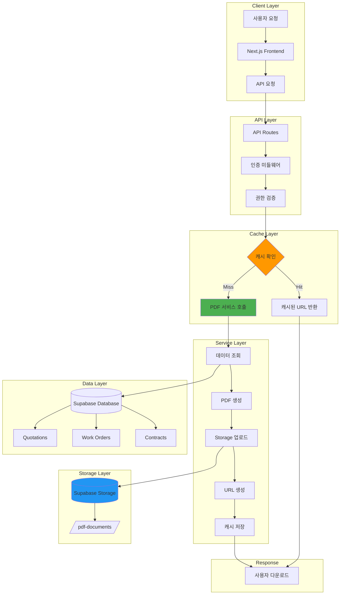
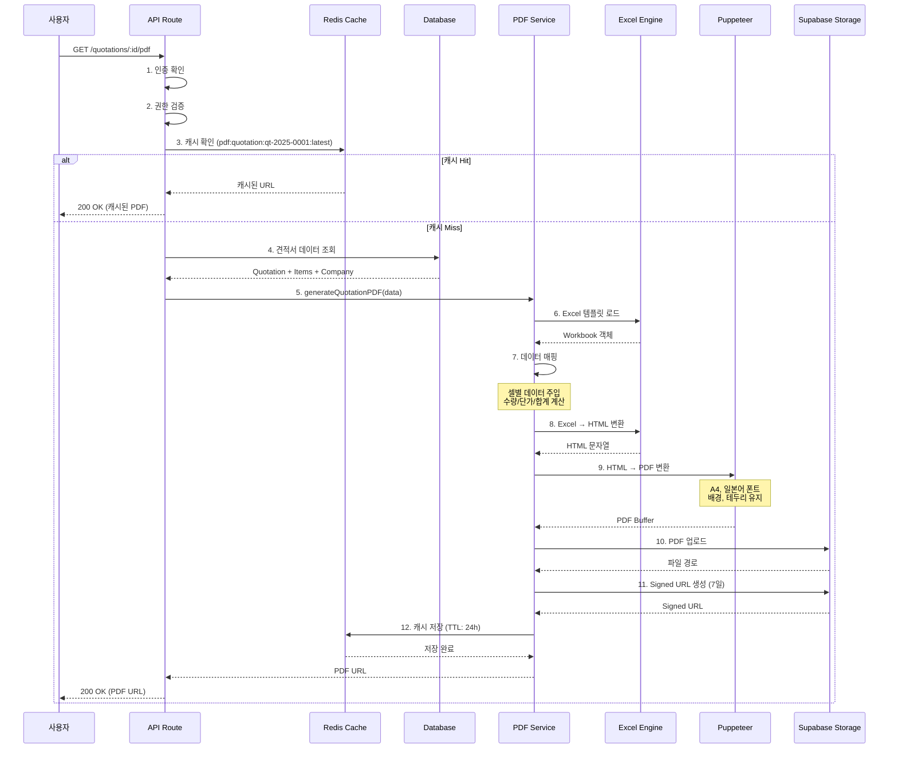
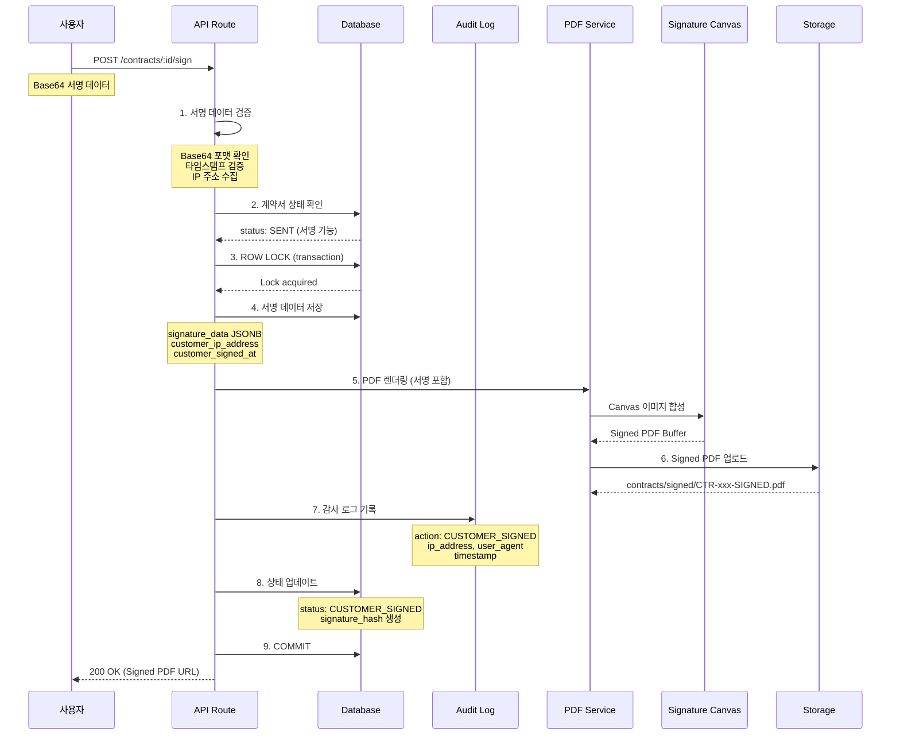
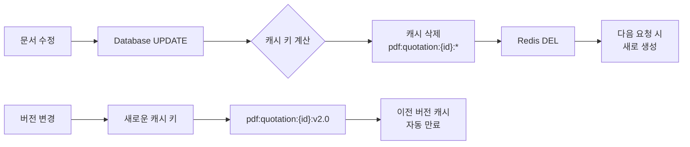

# PDF 데이터 흐름 및 스토리지 설계

**버전**: 1.0
**작성일**: 2025-12-31
**목적**: PDF 생성 시스템의 데이터 흐름, 캐싱, 스토리지 관리 정책

---

## 목차

1. [데이터 흐름 아키텍처](#1-데이터-흐름-아키텍처)
2. [캐싱 전략](#2-캐싱-전략)
3. [Supabase Storage 구조](#3-supabase-storage-구조)
4. [파일 관리 정책](#4-파일-관리-정책)
5. [감사 및 로깅](#5-감사-및-로깅)
6. [백업 및 복구](#6-백업-및-복구)

---

## 1. 데이터 흐름 아키텍처

### 1.1 전체 데이터 흐름



### 1.2 견적서 PDF 생성 상세 흐름



### 1.3 계약서 서명 상세 흐름



### 1.4 캐시 무효화 흐름



---

## 2. 캐싱 전략

### 2.1 캐시 키 설계

```yaml
Key Format: "pdf:{document_type}:{document_id}:{version}"

Examples:
  견적서: "pdf:quotation:qt-2025-0001:latest"
  사양서: "pdf:work-order:wo-2025-0042:v1.0"
  계약서: "pdf:contract:ctr-2025-0123:signed"

Version Patterns:
  - latest: 최신 버전
  - v{MAJOR}.{MINOR}: 특정 버전 (예: v1.0, v2.1)
  - draft: 초안 상태
  - signed: 서명 완료
```

### 2.2 TTL (Time To Live) 정책

```yaml
문서 상태별 TTL:
  Draft (임시저장):
    TTL: 1 hour
    이유: 자주 변경됨

  Sent (발송됨):
    TTL: 24 hours
    이유: 안정적이지만 변경 가능

  Approved/Active (승인/활성):
    TTL: 7 days
    이유: 거의 변경 안됨

  Signed (서명 완료):
    TTL: 30 days
    이유: 영구 보관 대상

캐시 만료 전략:
  - LRU (Least Recently Used) Eviction
  - 최대 10,000개 키 저장
  - 메모리 한도: 256MB (Vercel KV 무료 플랜)
```

### 2.3 캐시 무효화 트리거

```yaml
자동 무효화:
  - 문서 UPDATE/DELETE 시
  - 버전 변경 시
  - 상태 변경 (DRAFT → SENT)

수동 무효화:
  - API: POST /api/admin/cache/clear
  - 특정 문서: POST /api/admin/cache/clear/:type/:id

무효화 범위:
  - 특정 문서: pdf:quotation:qt-2025-0001:*
  - 전체 유형: pdf:quotation:*
  - 전체 캐시: pdf:*
```

### 2.4 캐시 워밍 (Cache Warming)

```typescript
// 인기 문서 사전 캐싱
async function warmCache() {
  const popularDocs = await getPopularDocuments();

  for (const doc of popularDocs) {
    await generatePDF(doc.id);
    await new Promise(resolve => setTimeout(resolve, 1000));
  }
}

// 스케줄 (매일 새벽 2시)
// Vercel Cron Jobs
```

---

## 3. Supabase Storage 구조

### 3.1 버킷 구조

```
pdf-documents/                     (Bucket)
├── quotations/                    (Folder)
│   ├── 2025/                      (Year)
│   │   ├── QT-2025-0001.pdf
│   │   ├── QT-2025-0001.xlsx
│   │   ├── QT-2025-0002.pdf
│   │   └── ...
│   ├── 2026/
│   └── archive/                   (1년 경과 문서)
│       ├── 2024/
│       │   └── QT-2024-1234.pdf
│       └── 2023/
│
├── work-orders/                   (Folder)
│   ├── 2025/
│   │   ├── WO-2025-0042-v1.0.pdf
│   │   ├── WO-2025-0042-v1.1.pdf
│   │   ├── WO-2025-0043-v1.0.pdf
│   │   └── ...
│   └── archive/
│
├── contracts/                     (Folder)
│   ├── drafts/                    (초안)
│   │   ├── CTR-2025-0123-DRAFT.pdf
│   │   └── ...
│   ├── signed/                    (서명 완료)
│   │   ├── CTR-2025-0123-SIGNED.pdf
│   │   └── ...
│   └── archive/
│
├── batch/                         (일괄 처리)
│   ├── 2025-12-31_quotations.zip
│   └── ...
│
└── temp/                          (임시 파일, 1시간 자동 삭제)
    └── upload_*.pdf
```

### 3.2 파일 명명 규칙

```yaml
Quotation:
  Pattern: "QT-{YYYY}-{NNNN}.{ext}"
  Example: "QT-2025-0001.pdf"
  Excel: "QT-2025-0001.xlsx"

Work Order:
  Pattern: "WO-{YYYY}-{NNNN}-v{VERSION}.{ext}"
  Example: "WO-2025-0042-v1.0.pdf"
  Version: Semantic versioning (v1.0, v1.1, v2.0)

Contract:
  Draft: "CTR-{YYYY}-{NNNN}-DRAFT.pdf"
  Signed: "CTR-{YYYY}-{NNNN}-SIGNED.pdf"
  Cancelled: "CTR-{YYYY}-{NNNN}-CANCELLED.pdf"

Batch:
  Pattern: "{DATE}_{TYPE}.zip"
  Example: "2025-12-31_quotations.zip"

Temp:
  Pattern: "{PREFIX}_{UUID}.{ext}"
  Example: "upload_a1b2c3d4.pdf"
```

### 3.3 RLS (Row Level Security) 정책

```sql
-- Bucket: pdf-documents

-- 공용 읽기 정책 (서명된 URL로만 접근)
CREATE POLICY "Public read via signed URL"
ON storage.objects FOR SELECT
USING (bucket_id = 'pdf-documents');

-- 인증된 쓰기 정책
CREATE POLICY "Authenticated insert"
ON storage.objects FOR INSERT
WITH CHECK (
  bucket_id = 'pdf-documents'
  AND auth.role() = 'authenticated'
);

-- 소유자 업데이트 정책
CREATE POLICY "Owner update"
ON storage.objects FOR UPDATE
USING (
  bucket_id = 'pdf-documents'
  AND auth.uid()::text = (storage.foldername(name))[1]
);

-- 관리자 모든 권한
CREATE POLICY "Admin all access"
ON storage.objects ALL
USING (
  bucket_id = 'pdf-documents'
  AND auth.jwt()->>'role' = 'admin'
);
```

---

## 4. 파일 관리 정책

### 4.1 수명 주기 관리

```yaml
Creation (생성):
  - API 요청 시 즉시 생성
  - temp/ 폴더에 임시 저장
  - 검증 후 이동

Active (활성):
  - 0-12개월: 일반 폴더
  - 빠른 접근, 자주 다운로드

Archive (보관):
  - 12개월 경과: archive/ 폴더
  - 느린 접근, 드물게 다운로드
  - 저렴한 스토리지 (S3 Glacier 대안)

Cold Storage (장기 보관):
  - 5년 경과: Cold Storage 이동
  - 복구 시간: 몇 시간
  - 법적 보관 의무 준수

Deletion (삭제):
  - 10년 경과: 안전 삭제
  - 감사 로그만 보관
```

### 4.2 URL 생성 전략

```typescript
// 1. Signed URL (기본)
// 권한 있는 사용자만 접근, 만료 기간 있음
const signedUrl = await supabase.storage
  .from('pdf-documents')
  .createSignedUrl(path, 60 * 60 * 24 * 7); // 7일

// 2. Public URL (보관된 문서만)
//任何人 접근 가능, CDN 캐싱
const publicUrl = await supabase.storage
  .from('pdf-documents')
  .getPublicUrl(path);

// 3. Presigned URL (업로드용)
// 클라이언트 직접 업로드
const presignedUrl = await supabase.storage
  .from('pdf-documents')
  .createPresignedUploadUrl(path, {
    upsert: false,
    contentType: 'application/pdf'
  });
```

### 4.3 파일 크기 제한

```yaml
최대 파일 크기:
  - 단일 PDF: 50MB
  - 단일 Excel: 10MB
  - 일괄 ZIP: 500MB

압축:
  - PDF 생성 시 자동 압축
  - 이미지 최적화 (WebP 변환)
  - 폰트 서브셋 (사용하는 문자만)

제한 초과 시:
  - 에러 코드: FILE_SIZE_EXCEEDED
  - 메시지: "ファイルサイズが大きすぎます。"
  - 해결: 관리자에게 문의
```

### 4.4 버전 관리

```yaml
Quotation (견적서):
  - 버전 관리 안함
  - 최신만 유지
  - 수정 시 이전 버전 삭제

Work Order (사양서):
  - 모든 버전 보관
  - 주요 변경 시 MAJOR 증가
  - 사소한 수정 시 MINOR 증가
  - 버전 간 비교 기능 제공

Contract (계약서):
  - 서명된 버전만 보관
  - DRAFT는 재작성 가능
  - SIGNED는 수정 불가
  - 폐기 시 CANCELLED 상태

버전 표시:
  - v1.0: 초기 릴리스
  - v1.1: 버그 수정, 문서 수정
  - v2.0: 주요 사양 변경
```

---

## 5. 감사 및 로깅

### 5.1 이벤트 로깅

```yaml
Logging Levels:
  - INFO: 일반 작업 (생성, 다운로드)
  - WARN: 비정상 작업 (재시도, 지연)
  - ERROR: 실패 작업 (생성 실패, 서명 실패)

Logged Events:
  - pdf.generated: PDF 생성
  - pdf.cached: 캐시 저장
  - pdf.downloaded: 다운로드
  - pdf.signed: 서명 완료
  - pdf.archived: 보관
  - pdf.deleted: 삭제
```

### 5.2 감사 테이블

```sql
-- pdf_audit_logs 테이블 생성
CREATE TABLE pdf_audit_logs (
  id UUID PRIMARY KEY DEFAULT gen_random_uuid(),
  event_type TEXT NOT NULL,              -- 이벤트 유형
  document_type TEXT NOT NULL,           -- quotation, work_order, contract
  document_id TEXT NOT NULL,             -- 문서 ID
  document_version TEXT,                 -- 버전
  performed_by UUID REFERENCES profiles(id), -- 수행자
  performed_at TIMESTAMP WITH TIME ZONE DEFAULT NOW(),
  ip_address INET,
  user_agent TEXT,
  metadata JSONB,                        -- 추가 정보
  created_at TIMESTAMP WITH TIME ZONE DEFAULT NOW()
);

-- 인덱스 생성
CREATE INDEX idx_pdf_audit_document ON pdf_audit_logs(document_type, document_id);
CREATE INDEX idx_pdf_audit_performed_by ON pdf_audit_logs(performed_by);
CREATE INDEX idx_pdf_audit_performed_at ON pdf_audit_logs(performed_at DESC);
```

### 5.3 추적 가능성

```typescript
// 감사 로그 예시
interface AuditLog {
  eventType: 'pdf.generated' | 'pdf.downloaded' | 'pdf.signed';
  documentType: 'quotation' | 'work_order' | 'contract';
  documentId: string;
  documentVersion?: string;
  performedBy: string;
  performedAt: Date;
  ipAddress: string;
  userAgent: string;
  metadata: {
    fileSize?: number;
    processingTime?: number;
    cacheHit?: boolean;
    signatureHash?: string;
  };
}

// 사용 예시
await logEvent({
  eventType: 'pdf.generated',
  documentType: 'quotation',
  documentId: 'qt-2025-0001',
  performedBy: 'user_abc123',
  performedAt: new Date(),
  ipAddress: '203.0.113.42',
  userAgent: 'Mozilla/5.0...',
  metadata: {
    fileSize: 245678,
    processingTime: 2340,
    cacheHit: false
  }
});
```

---

## 6. 백업 및 복구

### 6.1 백업 전략

```yaml
Database Backup:
  - 주기: 매일 (새벽 3시)
  - 보관 기간: 30일
  - 방식: Supabase 자동 백업

Storage Backup:
  - 주기: 매주 (일요일 새벽 4시)
  - 대상: pdf-documents bucket
  - 보관 기간: 영구
  - 방식: AWS S3로 복제

Point-in-Time Recovery:
  - 최소 1초 단위 복구
  - 최대 7일 보관
  - 비용: $0.20/GB/월
```

### 6.2 재해 복구

```yaml
RTO (Recovery Time Objective):
  - 목표: 1시간 이내
  - 주요 서비스: 30분 이내

RPO (Recovery Point Objective):
  - 목표: 5분 데이터 손실
  - 재난 복구: 1일 데이터 손실

Failover:
  - Primary: ap-northeast-1 (Tokyo)
  - Standby: ap-northeast-2 (Osaka)
  - 자동 장애 조치: 5분 이내
```

### 6.3 복구 절차

```yaml
1. 데이터베이스 복구:
   - Supabase Dashboard → Backup → Restore
   - 또는 API: supabase.db.restore()

2. Storage 복구:
   - S3에서 Supabase로 복사
   - RSYNC를 사용한 증분 복구

3. 캐시 재구축:
   - Redis 플러시
   - 인기 문서 재생성

4. 검증:
   - 스크립트로 무결성 확인
   - 샘플 다운로드 테스트
```

---

## 7. 모니터링

### 7.1 주요 메트릭

```yaml
Performance:
  - PDF 생성 시간 (p50, p95, p99)
  - API 응답 시간
  - 캐시 적중률

Reliability:
  - 가용성 (Uptime)
  - 오류율 (Error Rate)
  - 다운로드 성공률

Storage:
  - 사용량 (GB)
  - 파일 개수
  - 평균 파일 크기

Cost:
  - PDF 생성 비용/건
  - Storage 비용/월
  - 대역폭 비용/월
```

### 7.2 알림 규칙

```yaml
Alerts:
  - PDF 생성 실패율 > 5%
  - Storage 사용량 > 80%
  - API 응답 시간 > 5s
  - 캐시 적중률 < 50%

Notification:
  - Slack: #devops-alerts
  - Email: ops@epackage-lab.com
  - PagerDuty: 주요 장애 시
```

---

**문서 끝**
