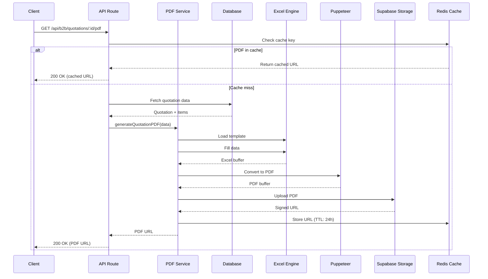
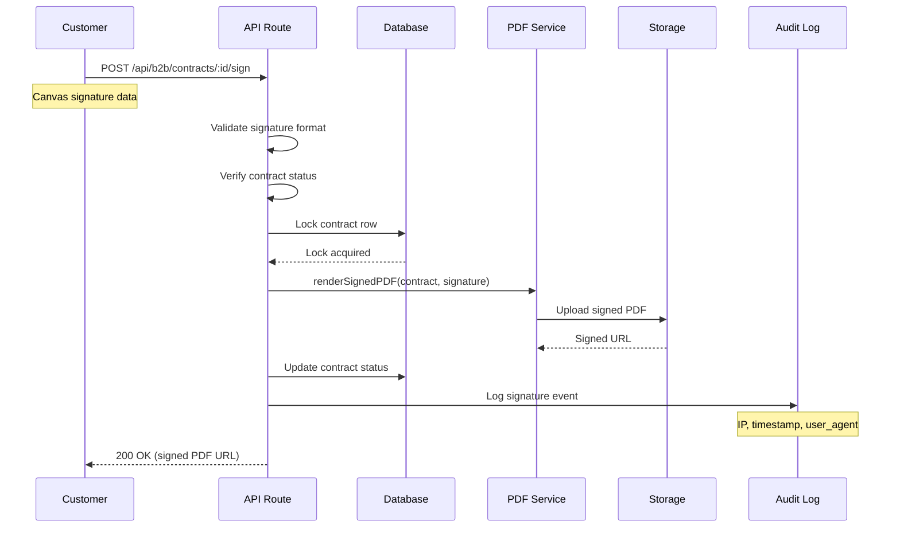

# EPACKAGE Lab PDF 문서 생성 시스템 설계서

**버전**: 1.0
**작성일**: 2025-12-31
**작성자**: Claude (Frontend Developer Agent)

---

## 목차 (Table of Contents)

1. [시스템 개요](#1-시스템-개요)
2. [기술 스택 선정](#2-기술-스택-선정)
3. [API 엔드포인트 설계](#3-api-엔드포인트-설계)
4. [데이터 흐름 설계](#4-데이터-흐름-설계)
5. [파일 관리 정책](#5-파일-관리-정책)
6. [구현 로드맵](#6-구현-로드맵)

---

## 1. 시스템 개요

### 1.1 문서 유형

| 문서 유형 | 템플릿 형식 | 언어 | 페이지 크기 | 복잡도 |
|----------|------------|------|-----------|--------|
| **견적서 (Quotation)** | Excel (.xlsx) | 일본어 | A4 | 중간 |
| **사양서 (Spec Sheet)** | HTML/React | 일본어 | A4 | 높음 |
| **계약서 (Contract)** | HTML | 일본어 | A4 | 높음 (전자 서명) |

### 1.2 비즈니스 요구사항

- **견적서**: Excel 기반, 정확한 계산, 일본어 비즈니스 형식
- **사양서**: 기술 문서, 표/도면 포함, 버전 관리
- **계약서**: 법적 효력, 전자 서명, 타임스탬프, IP 로깅

### 1.3 기술적 제약사항

- Next.js 16 App Router 환경
- Serverless 함수 (Vercel/Edge Functions)
- Japanese SEO 최적화
- Supabase Storage 연동
- 일본어 폰트 렌더링 (Noto Sans JP)

---

## 2. 기술 스택 선정

### 2.1 기술 스택 비교표

#### 견적서 (Quotation) - Excel 기반

| 기술 | 장점 | 단점 | 복잡도 | 추천도 |
|------|------|------|--------|--------|
| **ExcelJS + LibreOffice** | 완벽한 Excel 호환성 | LibreOffice 설치 필요 | 높음 | ⭐⭐ |
| **ExcelJS + xlsx-render** | 순수 JavaScript, 설치 불필요 | PDF 품질 중간 | 중간 | ⭐⭐⭐⭐⭐ |
| **ExcelJS + Puppeteer** | HTML 변환, 유연함 | 2단계 변환 | 중간 | ⭐⭐⭐⭐ |
| **Google Sheets API** | 클라우드 기반, 협업 | API 의존성, 비용 | 낮음 | ⭐⭐⭐ |

**선정**: **ExcelJS + xlsx-render** (순수 JavaScript, Vercel 친화적)

#### 사양서 (Spec Sheet) - HTML 기반

| 기술 | 장점 | 단점 | 복잡도 | 추천도 |
|------|------|------|--------|--------|
| **@react-pdf/renderer** | React 기반, 타입 안전성 | 한글 폰트 지원 제한 | 중간 | ⭐⭐⭐ |
| **Puppeteer + HTML** | 완벽한 HTML/CSS 지원 | Chromium 실행 필요 | 낮음 | ⭐⭐⭐⭐⭐ |
| **jsPDF + html2canvas** | 간단한 사용 | 이미지 기반, 품질 저하 | 낮음 | ⭐⭐ |
| **PDFKit** | 낮은 레벨 API, 유연함 | 직접 레이아웃 작성 | 높음 | ⭐⭐⭐ |

**선정**: **Puppeteer + HTML** (기존 jsPDF 사용 경험, 완벽한 일본어 지원)

#### 계약서 (Contract) - HTML + 전자 서명

| 기술 | 장점 | 단점 | 복잡도 | 추천도 |
|------|------|------|--------|--------|
| **Puppeteer + HTML Canvas** | 완벽한 제어, 오프라인 | 서명 저장 관리 필요 | 중간 | ⭐⭐⭐⭐⭐ |
| **DocuSign API** | 법적 완결성 | 높은 비용, 외부 의존성 | 낮음 | ⭐⭐⭐ |
| **HelloSign API** | 개발자 친화적 | 월 $29+ | 낮음 | ⭐⭐⭐ |
| **Adobe Sign API** | 엔터프라이즈급 | 복잡함, 비용 | 높음 | ⭐⭐ |

**선정**: **Puppeteer + HTML Canvas** (비용 효율, 완전한 제어)

### 2.2 최종 기술 스택

```yaml
PDF 생성:
  견적서: ExcelJS 4.4.0 + xlsx-render + Puppeteer
  사양서: Puppeteer + HTML Template + Noto Sans JP
  계약서: Puppeteer + HTML Template + Canvas Signature

Storage:
  - Supabase Storage (pdf-documents bucket)
  - URL 만료: 7일 (signed URLs)

Caching:
  - Redis (Vercel KV) - 생성된 PDF 캐싱
  - 키: pdf:{document_type}:{id}:{version}

Fonts:
  - 일본어: Noto Sans JP (Google Fonts)
  - 영어: Inter (기본)

Security:
  - 서명: SHA-256 해시 + 타임스탬프
  - IP 로깅: X-Forwarded-For 헤더
```

### 2.3 라이브러리 추가 필요사항

```bash
# PDF 생성
npm install exceljs@4.4.0
npm install puppeteer@22.0.0
npm install xlsx-render@1.3.0
npm install pdf-lib@1.17.1

# 유틸리티
npm install date-fns@4.1.0
npm install uuid@13.0.0
```

---

## 3. API 엔드포인트 설계

### 3.1 견적서 PDF API

#### `GET /api/b2b/quotations/:id/pdf`

**설명**: 견적서 Excel 파일에서 PDF 생성

**Query Parameters**:
| Parameter | Type | Required | Description |
|-----------|------|----------|-------------|
| `format` | string | No | `pdf` (default), `excel` |
| `language` | string | No | `ja` (default), `en` |
| `version` | string | No | 문서 버전 (default: `latest`) |

**Response**:
```typescript
// Success (200)
{
  success: true,
  data: {
    url: string,           // Supabase Storage URL
    fileName: string,      // e.g., "QT-2025-0001.pdf"
    fileSize: number,      // bytes
    generatedAt: string,   // ISO 8601
    expiresAt: string      // ISO 8601
  }
}

// Error (400/401/404/500)
{
  success: false,
  error: {
    code: string,
    message: string,       // 일본어/한국어
    details?: any
  }
}
```

**예시**:
```bash
# PDF 생성
GET /api/b2b/quotations/qt-2025-0001/pdf?format=pdf&language=ja

# Excel 다운로드
GET /api/b2b/quotations/qt-2025-0001/pdf?format=excel
```

---

### 3.2 사양서 PDF API

#### `GET /api/b2b/work-orders/:id/pdf`

**설명**: 작업 지시서/사양서 PDF 생성

**Query Parameters**:
| Parameter | Type | Required | Description |
|-----------|------|----------|-------------|
| `includeSpecs` | boolean | No | 사양서 포함 (default: `true`) |
| `includeFlow` | boolean | No | 제조 공정 흐름 포함 (default: `true`) |
| `version` | string | No | 버전 (default: `latest`) |

**Response**:
```typescript
{
  success: true,
  data: {
    url: string,
    fileName: string,      // e.g., "WO-2025-0001-v1.0.pdf"
    pageCount: number,
    generatedAt: string
  }
}
```

---

### 3.3 계약서 PDF API

#### `GET /api/b2b/contracts/:id/pdf`

**설명**: 계약서 PDF 생성 (미서명)

**Response**:
```typescript
{
  success: true,
  data: {
    url: string,
    fileName: string,      // e.g., "CTR-2025-0001-DRAFT.pdf"
    status: 'DRAFT' | 'SENT' | 'SIGNED',
    generatedAt: string
  }
}
```

---

### 3.4 전자 서명 API

#### `POST /api/b2b/contracts/:id/sign`

**설명**: 계약서 전자 서명 처리

**Request Body**:
```typescript
{
  party: 'customer' | 'admin',    // 서명 당사자
  signatureData: {
    imageData: string,            // Base64 Canvas 데이터
    timestamp: string,            // ISO 8601
    ipAddress: string,            // 자동 수집
    userAgent: string             // 자동 수집
  },
  acceptance: true                // 약관 동의
}
```

**Response**:
```typescript
{
  success: true,
  data: {
    contractId: string,
    status: 'CUSTOMER_SIGNED' | 'ADMIN_SIGNED' | 'ACTIVE',
    signedAt: string,
    pdfUrl: string,               // 서명된 PDF URL
    signatureHash: string         // SHA-256 해시
  }
}
```

**서명 검증**:
- 타임스탬프 검증 (유효 기간 내)
- IP 주소 로깅 (감사 추적)
- 서명 데이터 무결성 (SHA-256)

---

### 3.5 문서 다운로드 API

#### `GET /api/b2b/documents/:id/download`

**설명**: 서명된 URL로 직접 다운로드

**Headers**:
```
Authorization: Bearer {token}
```

**Response**:
```
Content-Type: application/pdf
Content-Disposition: attachment; filename="{document_name}.pdf"
Content-Length: {file_size}

{PDF binary data}
```

---

## 4. 데이터 흐름 설계

### 4.1 전체 아키텍처 다이어그램

```mermaid
graph TB
    subgraph "Client Side"
        A[사용자 요청] --> B[Next.js App Router]
    end

    subgraph "API Layer"
        B --> C[/api/b2b/quotations/:id/pdf]
        B --> D[/api/b2b/work-orders/:id/pdf]
        B --> E[/api/b2b/contracts/:id/pdf]
        B --> F[/api/b2b/contracts/:id/sign]
    end

    subgraph "PDF Generation Service"
        C --> G[PDFService]
        D --> G
        E --> G
        G --> H[Excel Templating]
        G --> I[HTML Templating]
        G --> J[Puppeteer Renderer]
    end

    subgraph "Data Layer"
        G --> K[(Supabase Database)]
        K --> L[Quotations Table]
        K --> M[Work Orders Table]
        K --> N[Contracts Table]
    end

    subgraph "Storage Layer"
        J --> O[(Supabase Storage)]
        O --> P[/pdf-documents bucket]
    end

    subgraph "Cache Layer"
        G --> Q[(Vercel KV Redis)]
        Q --> R[PDF Cache]
    end

    subgraph "Response"
        P --> S[Signed URL]
        S --> T[사용자 다운로드]
    end

    style G fill:#4CAF50
    style O fill:#2196F3
    style Q fill:#FF9800
```

### 4.2 견적서 PDF 생성 흐름



### 4.3 계약서 서명 흐름



### 4.4 캐싱 전략

```yaml
Cache Keys:
  견적서: "pdf:quotation:{quotation_id}:{version}"
  사양서: "pdf:work-order:{work_order_id}:{version}"
  계약서: "pdf:contract:{contract_id}:{status}"

TTL (Time To Live):
  Draft 문서: 1 hour
  Sent 문서: 24 hours
  Signed 문서: 7 days

Invalidation:
  - 문서 수정 시 자동 무효화
  - 버전 변경 시 키 변경
  - 수동 갱신 API 제공
```

---

## 5. 파일 관리 정책

### 5.1 Supabase Storage 구조

```
pdf-documents/
├── quotations/
│   ├── 2025/
│   │   ├── QT-2025-0001.pdf
│   │   ├── QT-2025-0001.xlsx
│   │   └── QT-2025-0002.pdf
│   └── 2026/
├── work-orders/
│   ├── 2025/
│   │   ├── WO-2025-0001-v1.0.pdf
│   │   └── WO-2025-0001-v1.1.pdf
│   └── archive/
└── contracts/
    ├── drafts/
    │   └── CTR-2025-0001-DRAFT.pdf
    ├── signed/
    │   └── CTR-2025-0001-SIGNED.pdf
    └── archive/
```

### 5.2 파일 명명 규칙

```yaml
Quotation: "QT-{YYYY}-{NNNN}.pdf"
Work Order: "WO-{YYYY}-{NNNN}-v{VERSION}.pdf"
Contract: "CTR-{YYYY}-{NNNN}-{STATUS}.pdf"

Example:
  - QT-2025-0001.pdf
  - WO-2025-0042-v2.1.pdf
  - CTR-2025-0123-SIGNED.pdf
```

### 5.3 URL 생성 전략

```typescript
// Signed URL (기본 만료: 7일)
const signedUrl = await supabase.storage
  .from('pdf-documents')
  .createSignedUrl(path, 60 * 60 * 24 * 7);

// Public URL (Archieved 문서만)
const publicUrl = await supabase.storage
  .from('pdf-documents')
  .getPublicUrl(path);
```

### 5.4 버전 관리

```yaml
Version Format: "v{MAJOR}.{MINOR}"
  - MAJOR: 주요 사양 변경
  - MINOR: 오타 수정, 미세 변경

Versioning Strategy:
  - 견적서: 버전 관리 안함 (최신만 유지)
  - 사양서: 모든 버전 보관
  - 계약서: 서명된 버전만 보관

Archive Policy:
  - 1년 지난 문서: archive/ 폴더로 이동
  - 5년 지난 문서: 冷 저장소 (Cold Storage) 이동
```

### 5.5 보안 정책

```yaml
Access Control:
  - 인증된 사용자만 접근
  - RLS (Row Level Security) 적용
  - 문서 소유자 또는 관리자 확인

Encryption:
  - 전송: TLS 1.3
  - 저장: AES-256 (Supabase 기본)

Audit:
  - 모든 다운로드 기록
  - IP 주소, 타임스탬프, 사용자 ID
  - 3년 보관

Compliance:
  - 일본 전자 서명법 준수
  - 일본 개인정보 보호법 (APPI) 준수
```

---

## 6. 구현 로드맵

### 6.1 Phase 1: 기반 구축 (Week 1-2)

#### Week 1: Core Infrastructure

- [ ] **Day 1-2: 라이브러리 설치 및 설정**
  ```bash
  npm install exceljs puppeteer pdf-lib
  npm install @types/puppeteer -D
  ```

- [ ] **Day 3-4: Supabase Storage 설정**
  - `pdf-documents` bucket 생성
  - RLS 정책 설정
  - 폴더 구조 생성

- [ ] **Day 5: 기본 PDF 서비스 구조**
  - `src/lib/pdf/pdf.service.ts` 생성
  - 공통 유틸리티 함수

#### Week 2: Quotation PDF

- [ ] **Day 1-3: Excel 템플릿 처리**
  - ExcelJS로 템플릿 로드
  - 데이터 매핑 함수
  - Puppeteer 변환

- [ ] **Day 4-5: API 엔드포인트**
  - `GET /api/b2b/quotations/:id/pdf`
  - 캐싱 로직
  - 에러 처리

---

### 6.2 Phase 2: 사양서 PDF (Week 3)

#### Week 3: Spec Sheet Generation

- [ ] **Day 1-2: HTML 템플릿**
  - React 컴포넌트 기반 템플릿
  - Noto Sans JP 폰트 통합
  - 테이블/도면 렌더링

- [ ] **Day 3-4: Puppeteer 렌더링**
  - 서버 사이드 렌더링
  - A4 페이지 최적화
  - 다중 페이지 지원

- [ ] **Day 5: Work Order API**
  - `GET /api/b2b/work-orders/:id/pdf`
  - 버전 관리 통합

---

### 6.3 Phase 3: 계약서 및 서명 (Week 4)

#### Week 4: Contract & Signature

- [ ] **Day 1-2: 계약서 HTML**
  - 기존 `contract_ja_kanei_trade_improved.html` 변환
  - React 컴포넌트화
  - 동적 데이터 바인딩

- [ ] **Day 3-4: 전자 서명**
  - Canvas 시그니처 컴포넌트
  - 서명 데이터 검증
  - 타임스탬프/IP 로깅

- [ ] **Day 5: 서명 API**
  - `POST /api/b2b/contracts/:id/sign`
  - PDF 병합 (pdf-lib)
  - 감사 로그

---

### 6.4 Phase 4: 최적화 및 배포 (Week 5)

#### Week 5: Optimization & Deployment

- [ ] **Day 1-2: 성능 최적화**
  - Vercel KV 캐싱
  - PDF 생성 타임 아웃 설정 (60s)
  - 메모리 최적화

- [ ] **Day 3: 테스트**
  - E2E 테스트 (Playwright)
  - 부하 테스트
  - 일본어 렌더링 검증

- [ ] **Day 4-5: 모니터링 및 배포**
  - Vercel 배포 설정
  - Puppeteer Lambda 설정
  - 에러 모니터링

---

### 6.5 추후 확장 (Future Enhancements)

```yaml
Phase 5: 대시보드 및 분석
  - PDF 생성 통계
  - 다운로드 추적
  - 사용자 행동 분석

Phase 6: 고급 기능
  - 대량 PDF 생성 (Batch)
  - 이메일 자동 발송
  - 문서 비교 (Diff)
  - 다국어 지원 확대
```

---

## 7. 코드 예시

### 7.1 PDF 서비스 기본 구조

```typescript
// src/lib/pdf/pdf.service.ts

import { Workbook } from 'exceljs';
import puppeteer from 'puppeteer';
import { createClient } from '@supabase/supabase-js';

export class PDFService {
  private supabase = createClient(
    process.env.NEXT_PUBLIC_SUPABASE_URL!,
    process.env.SUPABASE_SERVICE_ROLE_KEY!
  );

  /**
   * 견적서 PDF 생성
   */
  async generateQuotationPDF(quotationId: string) {
    // 1. 데이터 조회
    const quotation = await this.fetchQuotation(quotationId);

    // 2. Excel 템플릿 로드
    const workbook = new Workbook();
    await workbook.xlsx.readFile('templet/quotation-epackage-lab.xlsx');

    // 3. 데이터 매핑
    this.mapQuotationData(workbook, quotation);

    // 4. Excel → HTML 변환
    const html = await this.excelToHTML(workbook);

    // 5. HTML → PDF 변환
    const pdf = await this.htmlToPDF(html);

    // 6. Storage 업로드
    const url = await this.uploadPDF(
      `quotations/2025/QT-${quotation.quotation_number}.pdf`,
      pdf
    );

    return url;
  }

  /**
   * 사양서 PDF 생성
   */
  async generateSpecSheetPDF(workOrderId: string) {
    const workOrder = await this.fetchWorkOrder(workOrderId);
    const html = this.renderSpecSheetHTML(workOrder);
    const pdf = await this.htmlToPDF(html);

    return this.uploadPDF(
      `work-orders/2025/WO-${workOrder.work_order_number}-v${workOrder.version}.pdf`,
      pdf
    );
  }

  /**
   * 계약서 PDF 생성 (서명 포함)
   */
  async generateSignedContractPDF(
    contractId: string,
    signatureData: SignatureData
  ) {
    const contract = await this.fetchContract(contractId);
    const html = this.renderContractHTML(contract, signatureData);
    const pdf = await this.htmlToPDF(html);

    return this.uploadPDF(
      `contracts/signed/CTR-${contract.contract_number}-SIGNED.pdf`,
      pdf
    );
  }

  /**
   * HTML → PDF 변환 (Puppeteer)
   */
  private async htmlToPDF(html: string): Promise<Buffer> {
    const browser = await puppeteer.launch({
      headless: true,
      args: ['--no-sandbox', '--disable-setuid-sandbox']
    });

    const page = await browser.newPage();

    // 일본어 폰트 설정
    await page.setFont('Noto Sans JP');

    await page.setContent(html, {
      waitUntil: 'networkidle0'
    });

    const pdf = await page.pdf({
      format: 'A4',
      printBackground: true,
      margin: {
        top: '15mm',
        right: '15mm',
        bottom: '15mm',
        left: '15mm'
      }
    });

    await browser.close();

    return pdf;
  }

  /**
   * Supabase Storage 업로드
   */
  private async uploadPDF(path: string, buffer: Buffer): Promise<string> {
    const { data, error } = await this.supabase.storage
      .from('pdf-documents')
      .upload(path, buffer, {
        contentType: 'application/pdf',
        upsert: false
      });

    if (error) throw error;

    // Signed URL 생성 (7일 유효)
    const { data: { signedUrl } } = await this.supabase.storage
      .from('pdf-documents')
      .createSignedUrl(path, 60 * 60 * 24 * 7);

    return signedUrl!;
  }
}
```

### 7.2 API 엔드포인트 예시

```typescript
// src/app/api/b2b/quotations/[id]/pdf/route.ts

import { NextRequest, NextResponse } from 'next/server';
import { createRouteHandlerClient } from '@supabase/auth-helpers-nextjs';
import { cookies } from 'next/headers';
import { PDFService } from '@/lib/pdf/pdf.service';

export async function GET(
  request: NextRequest,
  { params }: { params: { id: string } }
) {
  try {
    const supabase = createRouteHandlerClient({ cookies });
    const { id } = params;

    // 인증 확인
    const { data: { user } } = await supabase.auth.getUser();
    if (!user) {
      return NextResponse.json(
        { error: '인증되지 않은 요청입니다.' },
        { status: 401 }
      );
    }

    // 견적서 접근 권한 확인
    const { data: quotation } = await supabase
      .from('quotations')
      .select('user_id, company_id')
      .eq('id', id)
      .single();

    if (!quotation || quotation.user_id !== user.id) {
      return NextResponse.json(
        { error: '접근 권한이 없습니다.' },
        { status: 403 }
      );
    }

    // PDF 생성
    const pdfService = new PDFService();
    const pdfUrl = await pdfService.generateQuotationPDF(id);

    return NextResponse.json({
      success: true,
      data: {
        url: pdfUrl,
        fileName: `QT-${id}.pdf`,
        generatedAt: new Date().toISOString()
      }
    });

  } catch (error) {
    console.error('PDF generation error:', error);
    return NextResponse.json(
      { error: 'PDF 생성 중 오류가 발생했습니다.' },
      { status: 500 }
    );
  }
}
```

---

## 8. 테스트 전략

### 8.1 단위 테스트

```typescript
// src/lib/pdf/__tests__/pdf.service.test.ts

import { PDFService } from '../pdf.service';

describe('PDFService', () => {
  describe('generateQuotationPDF', () => {
    it('should generate PDF with correct data', async () => {
      const service = new PDFService();
      const url = await service.generateQuotationPDF('qt-2025-0001');

      expect(url).toContain('https://');
      expect(url).toContain('.pdf');
    });

    it('should handle missing quotation', async () => {
      const service = new PDFService();

      await expect(
        service.generateQuotationPDF('invalid-id')
      ).rejects.toThrow('Quotation not found');
    });
  });
});
```

### 8.2 E2E 테스트

```typescript
// tests/pdf/quotation-pdf.spec.ts

import { test, expect } from '@playwright/test';

test.describe('Quotation PDF Generation', () => {
  test('should generate and download PDF', async ({ page }) => {
    await page.goto('/b2b/quotations/qt-2025-0001');

    // PDF 생성 버튼 클릭
    await page.click('[data-testid="generate-pdf-button"]');

    // 다운로드 확인
    const downloadPromise = page.waitForEvent('download');
    await page.click('[data-testid="download-pdf-button"]');
    const download = await downloadPromise;

    expect(download.suggestedFilename()).toMatch(/QT-2025-0001\.pdf/);
  });
});
```

---

## 9. 모니터링 및 로깅

### 9.1 성능 메트릭

```yaml
Metrics:
  - PDF 생성 시간 (Target: < 30s)
  - API 응답 시간 (Target: < 500ms for cached)
  - 다운로드 성공률 (Target: > 99%)
  - 스토리지 사용량 (Alert: > 80%)

Monitoring Tools:
  - Vercel Analytics
  - Supabase Dashboard
  - Custom error tracking (Sentry)
```

### 9.2 에러 핸들링

```typescript
// src/lib/pdf/errors.ts

export class PDFError extends Error {
  constructor(
    public code: string,
    public message: string,
    public details?: any
  ) {
    super(message);
    this.name = 'PDFError';
  }
}

export const ErrorCodes = {
  QUOTATION_NOT_FOUND: 'QUOTATION_NOT_FOUND',
  TEMPLATE_MISSING: 'TEMPLATE_MISSING',
  GENERATION_FAILED: 'GENERATION_FAILED',
  STORAGE_UPLOAD_FAILED: 'STORAGE_UPLOAD_FAILED',
  SIGNATURE_INVALID: 'SIGNATURE_INVALID'
};
```

---

## 10. 참고 자료

### 10.1 문서 템플릿

- Excel 견적서: `templet/quotation-epackage-lab.xlsx`
- 데이터 매핑: `templet/quote_data_mapping.md`
- 사양서: `templet/final_spec_sheet.md`
- 계약서: `templet/contract_ja_kanei_trade_improved.html`

### 10.2 외부 참고자료

- [ExcelJS Documentation](https://github.com/exceljs/exceljs)
- [Puppeteer PDF Options](https://pptr.dev/api/puppeteer.pagepdfoptions)
- [Supabase Storage Guide](https://supabase.com/docs/guides/storage)
- [Japanese Electronic Signature Law](https://elaws.e-gov.go.jp/document?lawid=426AC0000000102_20220401_503AC0000000069)

---

**문서 끝**
