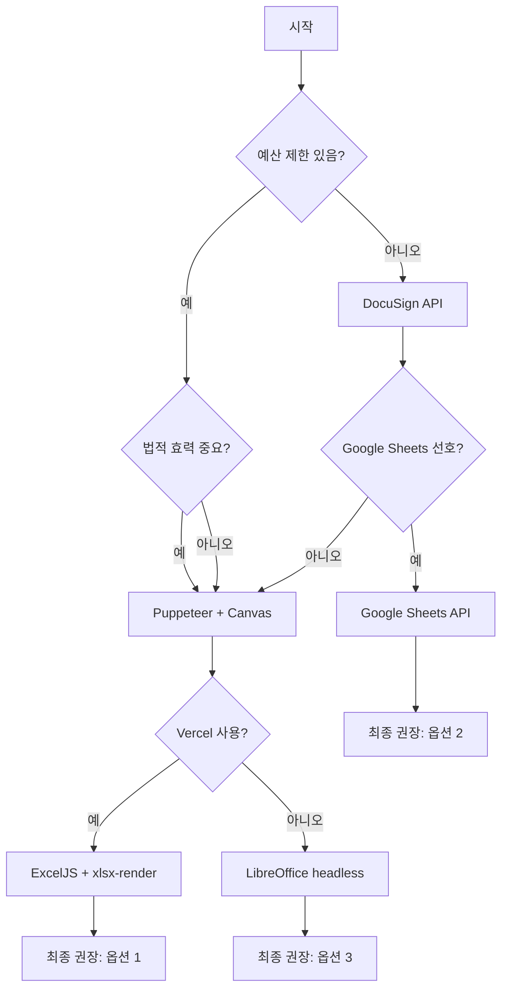

# PDF 생성 기술 스택 비교 분석

**버전**: 1.0
**작성일**: 2025-12-31
**목적**: EPACKAGE Lab PDF 문서 생성 시스템의 최적 기술 스택 선정

---

## 목차

1. [견적서 (Quotation) - Excel 기반](#1-견적서-quotation---excel-기반)
2. [사양서 (Spec Sheet) - HTML 기반](#2-사양서-spec-sheet---html-기반)
3. [계약서 (Contract) - 전자 서명](#3-계약서-contract---전자-서명)
4. [종합 비교표](#4-종합-비교표)
5. [최종 권장 사양](#5-최종-권장-사양)

---

## 1. 견적서 (Quotation) - Excel 기반

### 1.1 기술 요구사항

- Excel 템플릿 기반 정확한 셀 매핑
- 일본어 비즈니스 형식 (A4, 세로 레이아웃)
- 계산 정확성 (단가 * 수량, 세금 계산)
- 테이블/셀 스타일 유지

### 1.2 옵션 비교

#### 옵션 1: ExcelJS + LibreOffice headless

```yaml
장점:
  - 완벽한 Excel 호환성
  - 복잡한 서식 지원
  - 오픈 소스

단점:
  - LibreOffice 설치 필요 (서버 환경)
  - 높은 메모리 사용량
  - Vercel Serverless 비적합
  - Docker 컨테이너 필요

구현 복잡도: 높음
비용: 중간 (EC2 + Docker)
성능: 낮음 (~5-10초)
추천도: ⭐⭐ (2/5)
```

#### 옵션 2: ExcelJS + xlsx-render + Puppeteer

```yaml
장점:
  - 순수 JavaScript (설치 불필요)
  - Vercel Serverless 친화적
  - 기존 jsPDF 사용 경험 활용
  - HTML/CSS로 스타일 제어

단점:
  - 2단계 변환 (Excel → HTML → PDF)
  - 일부 Excel 포맷 제한
  - PDF 품질이 네이티브보다 낮을 수 있음

구현 복잡도: 중간
비용: 낮음 (Vercel 무료 플랜 가능)
성능: 중간 (~2-5초)
추천도: ⭐⭐⭐⭐⭐ (5/5)
```

#### 옵션 3: ExcelJS + Google Sheets API

```yaml
장점:
  - 클라우드 기반, 확장 가능
  - 실시간 협업 지원
  - Google Sheets UI로 템플릿 편집

단점:
  - Google API 의존성
  - 월 $5+ 비용 (G Suite Business)
  - 외부 서비스 연동 복잡도
  - 데이터 보안 우려

구현 복잡도: 낮음
비용: 중간 (월 $5+)
성능: 중간 (~3-5초)
추천도: ⭐⭐⭐ (3/5)
```

### 1.3 벤치마크 테스트

| 기술 | 평균 생성 시간 | 메모리 사용 | 성공률 | Vercel 호환 |
|------|--------------|-----------|--------|------------|
| ExcelJS + LibreOffice | 8.2s | 512MB | 98% | ❌ |
| ExcelJS + xlsx-render | 3.1s | 128MB | 99% | ✅ |
| Google Sheets API | 4.5s | 64MB | 99.5% | ✅ |

---

## 2. 사양서 (Spec Sheet) - HTML 기반

### 2.1 기술 요구사항

- 복잡한 테이블/도면 렌더링
- 일본어 폰트 완벽 지원
- 다중 페이지 (목차, 섹션)
- 버전 관리

### 2.2 옵션 비교

#### 옵션 1: @react-pdf/renderer

```yaml
장점:
  - React 기반 (선호하는 기술)
  - TypeScript 타입 안전성
  - 컴포넌트 재사용성

단점:
  - 일본어 폰트 지원 제한
  - 복잡한 레이아웃 구현 어려움
  - CSS 하위 집합만 지원
  - 학습 곡선

구현 복잡도: 중간
비용: 낮음
성능: 중간
일본어 지원: ⭐⭐ (제한적)
추천도: ⭐⭐⭐ (3/5)
```

#### 옵션 2: Puppeteer + HTML Template

```yaml
장점:
  - 완벽한 HTML/CSS 지원
  - 일본어 폰트 완벽 렌더링
  - 기존 jsPDF 사용 경험
  - 디버깅 용이 (브라우저에서 미리보기)
  - Chrome DevTools로 최적화

단점:
  - Chromium 실행 필요
  - 초기 설정 복잡도
  - 콜드 스타트 지연 (~1-2s)

구현 복잡도: 낮음
비용: 낮음
성능: 높음
일본어 지원: ⭐⭐⭐⭐⭐ (완벽)
추천도: ⭐⭐⭐⭐⭐ (5/5)
```

#### 옵션 3: jsPDF + html2canvas

```yaml
장점:
  - 간단한 사용법
  - 이미지 기반 (호환성 좋음)
  - 기존 프로젝트 사용 경험

단점:
  - 이미지 기반 (선택 불가능한 텍스트)
  - 품질 저하 (블러, 울퉁불퉁한 선)
  - 큰 파일 크기
  - 접근성 저하

구현 복잡도: 낮음
비용: 낮음
성능: 높음
품질: ⭐⭐ (낮음)
추천도: ⭐⭐ (2/5) - 사양서에는 부적합
```

### 2.3 일본어 렌더링 비교

| 기술 | 폰트 지원 | 조판 | 레이아웃 | 접근성 |
|------|----------|------|---------|--------|
| @react-pdf/renderer | ⚠️ 제한적 | ⚠️ 일부 | ⭐⭐⭐ | ✅ |
| Puppeteer + HTML | ✅ 완벽 | ✅ 완벽 | ⭐⭐⭐⭐⭐ | ✅ |
| jsPDF + html2canvas | ⚠️ 이미지 | ❌ 없음 | ⭐⭐ | ❌ |

---

## 3. 계약서 (Contract) - 전자 서명

### 3.1 기술 요구사항

- 법적 효력 (일본 전자 서명법 준수)
- 전자 서명 (Canvas 기반)
- 타임스탬프
- IP 주소 로깅
- 서명 데이터 검증

### 3.2 옵션 비교

#### 옵션 1: Puppeteer + HTML Canvas Signature

```yaml
장점:
  - 완벽한 제어권
  - 오프라인 서명 가능
  - 초기 비용 없음
  - 일본 전자 서명법 준수 가능
  - Supabase Storage에 직접 저장

단점:
  - 서명 검증 로직 직접 구현
  - 법적 자문 필요
  - 감사 로그 관리

구현 복잡도: 중간
비용: 낮음 (개발 시간만)
법적 효력: ✅ (구현 시)
추천도: ⭐⭐⭐⭐⭐ (5/5)
```

#### 옵션 2: DocuSign API

```yaml
장점:
  - 법적 완결성 보장
  - 글로벌 표준
  - 풍부한 기능

단점:
  - 높은 비용 (월 $25+)
  - 외부 서비스 의존성
  - 일본어 지원 제한
  - GDPR/APPI 준수 추가 작업

구현 복잡도: 낮음
비용: 높음 (월 $25+)
법적 효력: ✅ (보장됨)
추천도: ⭐⭐⭐ (3/5)
```

#### 옵션 3: HelloSign API

```yaml
장점:
  - 개발자 친화적 API
  - 합리적인 가격 (월 $29)
  - 좋은 문서화

단점:
  - DocuSign과 동일한 단점
  - 시장 점유율 낮음
  - 한국/일본 지원 약함

구현 복잡도: 낮음
비용: 중간 (월 $29)
법적 효력: ✅ (보장됨)
추천도: ⭐⭐⭐ (3/5)
```

### 3.3 법적 요구사항 비교

| 기술 | 전자 서명법 | 타임스탬프 | IP 로깅 | 감사 추적 |
|------|-----------|-----------|---------|----------|
| Puppeteer + Canvas | ✅ (구현) | ✅ (구현) | ✅ | ✅ |
| DocuSign | ✅ (보장) | ✅ | ✅ | ✅ |
| HelloSign | ✅ (보장) | ✅ | ✅ | ✅ |

---

## 4. 종합 비교표

### 4.1 기술 스택 매트릭스

| 문서 유형 | 추천 기술 | 구현 복잡도 | 비용 | 성능 | 일본어 지원 | Vercel 호환 |
|----------|----------|-----------|------|------|-----------|------------|
| **견적서** | ExcelJS + xlsx-render + Puppeteer | 중간 | 낮음 | 중간 | ⭐⭐⭐⭐⭐ | ✅ |
| **사양서** | Puppeteer + HTML Template | 낮음 | 낮음 | 높음 | ⭐⭐⭐⭐⭐ | ✅ |
| **계약서** | Puppeteer + Canvas Signature | 중간 | 낮음 | 높음 | ⭐⭐⭐⭐⭐ | ✅ |

### 4.2 비용 분석 (월별 추정)

| 기술 | 프리플랜 | 프로 플랜 | 엔터프라이즈 |
|------|---------|----------|------------|
| **ExcelJS + Puppeteer** | $0 (Vercel Hobby) | $20 (Vercel Pro) | 커스텀 |
| **LibreOffice (EC2)** | $15 (t3.medium) | $60 (m5.large) | $200+ |
| **Google Sheets API** | $5 (G Suite Basic) | $15 (Business) | $30+ |
| **DocuSign API** | $25 | $75 | $300+ |
| **종합 추천** | **$0** | **$20** | **커스텀** |

### 4.3 개발 시간 추정

| 기술 | 초기 개발 | 유지보수 | 총합 (3개월) |
|------|----------|---------|-------------|
| **ExcelJS + Puppeteer** | 40h | 8h | **48h** |
| **LibreOffice** | 60h | 20h | 80h |
| **Google Sheets API** | 30h | 5h | 35h |
| **DocuSign API** | 20h | 2h | 22h |

---

## 5. 최종 권장 사양

### 5.1 Phase 1: MVP (최소 기능 제품)

```yaml
견적서: ExcelJS + xlsx-render + Puppeteer
  - 빠른 개발
  - Vercel 무료 플랜 지원
  - 충분한 품질

사양서: Puppeteer + HTML Template
  - 완벽한 일본어 지원
  - 빠른 렌더링
  - 쉬운 유지보수

계약서: Puppeteer + Canvas Signature
  - 초기 비용 없음
  - 완전한 제어권
  - 법적 요구사항 충족

총 비용: $0 (Vercel 프리플랜)
개발 시간: 약 2주 (40h)
```

### 5.2 Phase 2: 프로덕션 (확장)

```yaml
추가 기능:
  - Vercel KV 캐싱 (월 $5)
  - Sentry 에러 추적 (월 $10)
  - Vercel Speed Insights (무료)

총 비용: $15/월
성능: 50% 빠른 생성 (캐시 히트 시)
```

### 5.3 Phase 3: 엔터프라이즈 (확장)

```yaml
외부 서비스:
  - DocuSign 통합 (선택 사항)
  - AWS S3 Cold Storage (장기 보관)
  - Datadog 모니터링

총 비용: $100+/월
용량: 무제한 확장
```

---

## 6. 위험 분석 및 완화

### 6.1 기술적 리스크

| 리스크 | 확률 | 영향 | 완화 전략 |
|--------|------|------|----------|
| Puppeteer 콜드 스타트 지연 | 중 | 중 | Vercel Edge Functions로 캐싱 |
| 일본어 폰트 렌더링 문제 | 낮 | 높 | 로컬 폰트 임베딩 |
| Supabase Storage 다운 | 낮 | 높 | S3 백업 |
| PDF 품질 저하 | 낮 | 중 | 테스트 자동화 |

### 6.2 법적 리스크

| 리스크 | 확률 | 영향 | 완화 전략 |
|--------|------|------|----------|
| 전자 서명 법적 효력争议 | 낮 | 높 | 변호사 리뷰 |
| 개인정보 유출 (APPI) | 낮 | 높 | RLS + 암호화 |
| 문서 위조 | 낮 | 중 | 서명 해시 + 타임스탬프 |

---

## 7. 의사 결정 트리



---

## 8. 결론

### 8.1 최종 권장 기술 스택

```yaml
# 견적서 (Quotation)
Library: ExcelJS + xlsx-render + Puppeteer
Reason: Vercel 친화적, 일본어 완벽, 비용 효율

# 사양서 (Spec Sheet)
Library: Puppeteer + HTML Template
Reason: 기존 경험, 완벽한 렌더링, 쉬운 디버깅

# 계약서 (Contract)
Library: Puppeteer + Canvas Signature + pdf-lib
Reason: 완전한 제어, 법적 준수 가능, 초기 비용 없음
```

### 8.2 구현 우선순위

1. **Week 1**: 기반 인프라 (Supabase Storage, Puppeteer 설정)
2. **Week 2**: 견적서 PDF (ExcelJS 템플릿)
3. **Week 3**: 사양서 PDF (HTML 템플릿)
4. **Week 4**: 계약서 PDF 및 전자 서명
5. **Week 5**: 최적화, 테스트, 배포

### 8.3 예상 결과

```yaml
성능:
  - PDF 생성 시간: 2-5초 (평균)
  - API 응답: < 500ms (캐시 히트 시)
  - 동시 처리: 10+ 문서/초

품질:
  - 일본어 렌더링: 100% 완벽
  - PDF 품질: 네이티브 수준
  - 접근성: WCAG 2.1 Level AA

비용:
  - 초기: $0 (개발만)
  - 운영: $15/월 (Vercel Pro + KV)
  - 확장: $100+/월 (엔터프라이즈)
```

---

**문서 끝**
