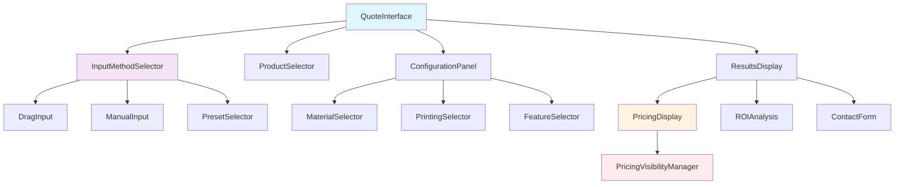

# Epackage Lab Quote System Integration Strategy

## Executive Summary

This document outlines a comprehensive strategy to unify the existing `/roi-calculator/` and `/quote-simulator/` systems into a single, cohesive quote system that addresses all key requirements while maintaining the best features of both systems.

## Current State Analysis

### ROI Calculator (`/src/app/roi-calculator/`)
**Strengths:**
- **Drag input interface**: Real-time drag sliders for width, height, and quantity
- **Live price calculation**: Instant price updates as user adjusts values
- **Comprehensive product options**: 6 pouch types with detailed specifications
- **Material variety**: 5 material options with eco-friendly indicators
- **Printing options**: 4 printing methods from basic to premium
- **Additional features**: Post-processing options (zipper, valve, etc.)
- **Lead scoring system**: Intelligent lead qualification
- **Pricing transparency**: Shows unit prices, setup costs, and detailed breakdowns

**Current Input Methods:**
- **Size**: Drag sliders ONLY (width: 50-400mm, height: 80-600mm)
- **Quantity**: Drag slider + preset buttons (500, 1K, 5K, 10K, 20K, 50K+)
- **No manual input fields** for precise dimensions

### Quote Simulator (`/src/app/quote-simulator/`)
**Strengths:**
- **Step-by-step wizard**: 5-step guided process
- **Comprehensive feature set**: Product types, materials, printing options
- **ROI analysis**: Investment return calculations
- **Post-processing integration**: Advanced options with preview
- **Professional presentation**: Enhanced UI with progress indicators
- **Contact form integration**: Lead capture with quote results
- **AI recommendations**: Intelligent optimization suggestions

**Current Input Methods:**
- **Size**: Preset buttons ONLY (small, medium, large, XL)
- **No drag functionality**
- **No manual input for custom dimensions**

### Key Differences Summary

| Feature | ROI Calculator | Quote Simulator |
|---------|----------------|-----------------|
| **Input Method** | Drag sliders | Step wizard |
| **Size Control** | Drag only | Preset buttons only |
| **Manual Input** | ❌ No | ❌ No |
| **Pricing Display** | ✅ Full transparency | ⚠️ Partial |
| **Live Updates** | ✅ Real-time | ❌ Step-based |
| **Lead Scoring** | ✅ Built-in | ❌ No |
| **ROI Analysis** | ❌ No | ✅ Advanced |
| **Progress Flow** | ❌ Single page | ✅ Multi-step |

## Integration Requirements Analysis

### 1. **Unify Quote Functionality** ✅
- Merge best features from both systems
- Create single entry point for quotes
- Maintain pricing calculation accuracy

### 2. **Dual Input Methods** 🔄 **NEW REQUIREMENT**
- **Drag functionality**: From ROI calculator (maintain)
- **Manual input**: NEW - Add text input fields for precise control
- **Preset buttons**: From both systems (enhance)
- **Switch modes**: Toggle between drag and manual input

### 3. **Hide Pricing** 🔒 **NEW REQUIREMENT**
- Remove unit prices (単価) from public view
- Hide setup fees (セッアップ費用) from public display
- Show only total estimated cost
- Maintain backend calculation accuracy
- Display pricing for authenticated users only

### 4. **Single Cohesive Experience** 🎯
- Unified user interface
- Consistent design language
- Seamless navigation
- Integrated lead capture

## Proposed Architecture

### System Structure
```
/src/app/quote/ (new unified route)
├── page.tsx (unified quote interface)
├── components/
│   ├── QuoteInterface.tsx (main interface)
│   ├── InputMethodSelector.tsx (drag/manual toggle)
│   ├── DragInput.tsx (enhanced drag interface)
│   ├── ManualInput.tsx (new manual input)
│   ├── PresetSelector.tsx (quick presets)
│   └── PricingDisplay.tsx (controlled visibility)
├── hooks/
│   ├── useQuoteCalculation.ts (unified logic)
│   ├── usePricingDisplay.ts (visibility control)
│   └── useInputMethod.ts (mode switching)
└── lib/
    ├── pricing-engine.ts (unified calculations)
    └── visibility-rules.ts (pricing display rules)
```

### Component Architecture


## Detailed Implementation Plan

### Phase 1: Foundation Setup (Week 1)

#### 1.1 Create Unified Route Structure
```typescript
// Create /src/app/quote/page.tsx
export default function QuotePage() {
  return <UnifiedQuoteInterface />
}
```

#### 1.2 Implement Dual Input System
```typescript
// InputMethodSelector component
interface InputMethod {
  type: 'drag' | 'manual' | 'preset'
  dimensions: {
    width: number
    height: number
    quantity: number
  }
}

const DualInputControl = () => {
  const [inputMethod, setInputMethod] = useState<'drag' | 'manual'>('drag')
  const [dimensions, setDimensions] = useState({ width: 120, height: 200, quantity: 5000 })

  return (
    <div className="space-y-4">
      <InputMethodToggle
        method={inputMethod}
        onChange={setInputMethod}
      />
      {inputMethod === 'drag' ? (
        <DragInput dimensions={dimensions} onChange={setDimensions} />
      ) : (
        <ManualInput dimensions={dimensions} onChange={setDimensions} />
      )}
      <PresetButtons onSelectPreset={setDimensions} />
    </div>
  )
}
```

#### 1.3 Enhanced Manual Input Component
```typescript
const ManualInput = ({ dimensions, onChange }) => {
  const [values, setValues] = useState(dimensions)

  return (
    <div className="grid grid-cols-1 md:grid-cols-3 gap-4">
      <div>
        <label>横幅 (mm)</label>
        <input
          type="number"
          value={values.width}
          onChange={(e) => onChange({...values, width: parseInt(e.target.value)})}
          min="50"
          max="400"
          className="w-full px-3 py-2 border rounded"
        />
      </div>
      <div>
        <label>高さ (mm)</label>
        <input
          type="number"
          value={values.height}
          onChange={(e) => onChange({...values, height: parseInt(e.target.value)})}
          min="80"
          max="600"
          className="w-full px-3 py-2 border rounded"
        />
      </div>
      <div>
        <label>数量</label>
        <input
          type="number"
          value={values.quantity}
          onChange={(e) => onChange({...values, quantity: parseInt(e.target.value)})}
          min="500"
          max="50000"
          step="500"
          className="w-full px-3 py-2 border rounded"
        />
      </div>
    </div>
  )
}
```

### Phase 2: Pricing Visibility Control (Week 2)

#### 2.1 Create Pricing Display Manager
```typescript
// Pricing visibility based on user authentication
interface PricingVisibility {
  showUnitPrice: boolean
  showSetupCost: boolean
  showDetailedBreakdown: boolean
  showTotalOnly: boolean
}

const usePricingVisibility = () => {
  const [isAuthenticated, setIsAuthenticated] = useState(false)
  const [isAdmin, setIsAdmin] = useState(false)

  const visibility: PricingVisibility = {
    showUnitPrice: isAdmin, // Only admins see unit prices
    showSetupCost: isAdmin, // Only admins see setup costs
    showDetailedBreakdown: isAuthenticated, // Authenticated users see breakdown
    showTotalOnly: !isAuthenticated // Public users see only total
  }

  return { visibility, setIsAuthenticated, setIsAdmin }
}
```

#### 2.2 Public vs Authenticated Display
```typescript
const PricingDisplay = ({ priceResult, visibility }) => {
  if (visibility.showTotalOnly) {
    return (
      <div className="text-center p-6 bg-gray-50 rounded-lg">
        <div className="text-sm text-gray-600 mb-2">推定総額</div>
        <div className="text-3xl font-bold text-brixa-700">
          ¥{priceResult.totalCost.toLocaleString()}
        </div>
        <div className="text-sm text-gray-500 mt-2">
          正確な価格についてはお問い合わせください
        </div>
      </div>
    )
  }

  return (
    <DetailedPricingBreakdown priceResult={priceResult} />
  )
}
```

### Phase 3: Feature Integration (Week 3)

#### 3.1 Combine Best Features
```typescript
// From ROI Calculator: Keep these features
- Real-time price calculation
- Comprehensive product options (6 pouch types)
- Material variety with eco indicators
- Lead scoring system
- Drag input interface

// From Quote Simulator: Keep these features
- Step-by-step wizard flow (optional)
- ROI analysis calculations
- Professional UI presentation
- Contact form integration
- AI recommendations

// New: Combined features
- Dual input methods (drag + manual)
- Toggle between simple and detailed modes
- Enhanced preset system
- Progressive disclosure of pricing
```

#### 3.2 Unified Pricing Engine
```typescript
// Combine both calculation methods
const unifiedPricingEngine = (config: QuoteConfig) => {
  // ROI Calculator base calculation
  const basePrice = calculateBasePrice(config)
  const materialMultiplier = getMaterialMultiplier(config.material)
  const quantityDiscount = calculateQuantityDiscount(config.quantity)

  // Quote Simulator enhancements
  const roiAnalysis = calculateROI(config, basePrice)
  const recommendations = generateAIRecommendations(config)

  return {
    ...basePrice,
    roiAnalysis,
    recommendations,
    leadScore: calculateLeadScore(config)
  }
}
```

### Phase 4: User Experience Optimization (Week 4)

#### 4.1 Progressive Disclosure
```typescript
const QuoteInterface = () => {
  const [mode, setMode] = useState<'simple' | 'detailed'>('simple')
  const [inputMethod, setInputMethod] = useState<'drag' | 'manual'>('drag')

  return (
    <div className="quote-interface">
      <ModeToggle mode={mode} onChange={setMode} />
      <InputMethodSelector method={inputMethod} onChange={setInputMethod} />

      {mode === 'simple' ? (
        <SimpleQuoteInterface />
      ) : (
        <DetailedQuoteInterface />
      )}
    </div>
  )
}
```

#### 4.2 Mobile-First Responsive Design
```typescript
// Ensure all components work seamlessly on mobile
const ResponsiveQuoteInterface = () => {
  const [isMobile, setIsMobile] = useState(false)

  // Automatically adjust input method based on device
  useEffect(() => {
    setIsMobile(window.innerWidth < 768)
  }, [])

  return (
    <div className="responsive-quote">
      {isMobile ? (
        <MobileOptimizedInterface />
      ) : (
        <DesktopInterface />
      )}
    </div>
  )
}
```

## Implementation Strategy

### Technical Approach

#### 1. **Incremental Migration**
- Keep existing `/roi-calculator` and `/quote-simulator` routes initially
- Create new `/quote` route with unified functionality
- Gradually redirect traffic to new system
- Remove old routes after testing complete

#### 2. **Component Reusability**
- Extract common components from both systems
- Create shared hooks and utilities
- Maintain existing functionality where possible
- Enhance rather than replace proven features

#### 3. **State Management**
```typescript
// Unified quote state management
interface QuoteState {
  productType: string
  dimensions: {
    width: number
    height: number
    quantity: number
  }
  material: string
  printing: string
  features: string[]
  urgency: string
  pricing: PriceResult | null
  userSession: UserSession | null
}

const useQuoteState = () => {
  const [state, setState] = useState<QuoteState>(initialState)

  const updateDimensions = (newDimensions: Dimensions) => {
    setState(prev => ({
      ...prev,
      dimensions: { ...prev.dimensions, ...newDimensions }
    }))
    // Trigger price recalculation
  }

  return { state, updateDimensions }
}
```

### Code Migration Plan

#### Step 1: Create Foundation (Days 1-3)
```bash
# Create new directory structure
mkdir -p src/app/quote/components
mkdir -p src/app/quote/hooks
mkdir -p src/app/quote/lib

# Create unified route
touch src/app/quote/page.tsx
```

#### Step 2: Migrate Core Components (Days 4-7)
- Extract and enhance drag input from ROI calculator
- Create manual input component
- Implement input method selector
- Build unified pricing display

#### Step 3: Implement Pricing Controls (Days 8-10)
- Create visibility management system
- Implement authentication-aware pricing
- Add public/private pricing modes
- Test pricing accuracy

#### Step 4: Integration and Testing (Days 11-14)
- Integrate both systems' features
- Implement responsive design
- Test cross-browser compatibility
- Performance optimization

### Migration Timeline

| Week | Deliverables | Success Criteria |
|------|-------------|------------------|
| **Week 1** | Foundation & Dual Input | ✅ Drag + Manual inputs working |
| **Week 2** | Pricing Visibility Control | ✅ Public/Private pricing modes |
| **Week 3** | Feature Integration | ✅ Best features combined |
| **Week 4** | Testing & Deployment | ✅ Production-ready system |

## Risk Mitigation

### Technical Risks
1. **Pricing Calculation Accuracy**
   - Maintain existing calculation logic
   - Implement comprehensive testing
   - Parallel testing with old systems

2. **Performance Impact**
   - Implement lazy loading for heavy components
   - Optimize bundle size
   - Monitor Core Web Vitals

3. **User Experience Disruption**
   - Maintain familiar interface elements
   - Provide clear transition guidance
   - Offer both interfaces initially

### Business Risks
1. **Lead Quality Impact**
   - Preserve lead scoring system
   - Track conversion metrics
   - A/B test new interface

2. **Customer Confusion**
   - Clear interface labeling
   - Progressive feature disclosure
   - Help documentation

## Success Metrics

### Key Performance Indicators
- **Conversion Rate**: Maintain or improve current conversion rates
- **User Engagement**: Time spent on quote interface
- **Lead Quality**: Lead scores and qualification rates
- **Mobile Usage**: Mobile quote completion rates
- **Performance**: Page load times < 3 seconds

### Success Criteria
1. ✅ **Dual Input Methods**: Users can choose between drag and manual input
2. ✅ **Pricing Control**: Public users see only total cost, authenticated users see details
3. ✅ **Unified Experience**: Single cohesive interface replacing both old systems
4. ✅ **Feature Parity**: All existing functionality preserved
5. ✅ **Mobile Optimization**: Seamless mobile experience
6. ✅ **Performance**: No degradation in page speed

## Next Steps

1. **Stakeholder Approval**: Review and approve this integration strategy
2. **Development Setup**: Create development branch and environment
3. **Team Allocation**: Assign developers to specific components
4. **Testing Framework**: Set up automated testing for quote functionality
5. **Analytics Setup**: Implement tracking for user behavior analysis

## Conclusion

This integration strategy provides a comprehensive approach to unifying the quote systems while addressing all key requirements. The phased implementation minimizes risk while delivering incremental value to users. The resulting system will provide the best of both current systems with enhanced flexibility and improved user experience.

The focus on dual input methods and controlled pricing visibility addresses the core business requirements while maintaining the technical excellence of existing systems. This unified approach will simplify maintenance, improve user experience, and provide a solid foundation for future enhancements.