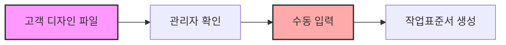
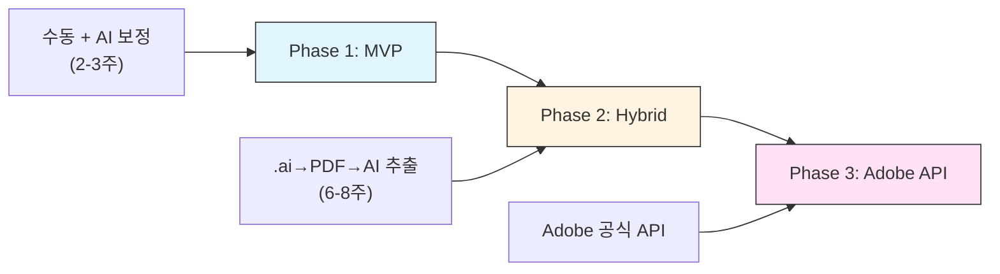
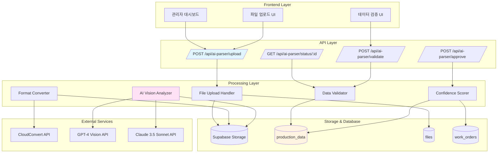
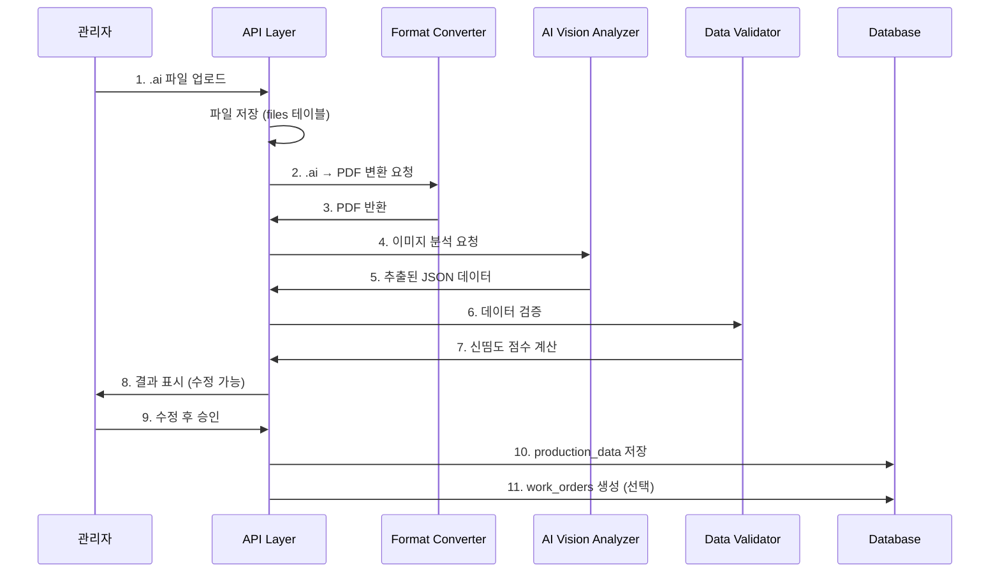

# EPACKAGE Lab AI 데이터 추출 시스템 설계서

## Adobe Illustrator .ai 파일 데이터 추출 시스템

**버전:** 1.0
**작성일:** 2025-12-31
**상태:** 설계 제안

---

## 목차 (Table of Contents)

1. [개요](#1-개요)
2. [기술 솔루션 비교](#2-기술-솔루션-비교)
3. [추천 솔루션](#3-추천-솔루션)
4. [시스템 아키텍처](#4-시스템-아키텍처)
5. [API 명세서](#5-api-명세서)
6. [데이터 모델](#6-데이터-모델)
7. [구현 계획](#7-구현-계획)
8. [비용 분석](#8-비용-분석)
9. [위험 요소 및 완화](#9-위험-요소-및-완화)

---

## 1. 개요

### 1.1 배경

고객이 업로드한 Adobe Illustrator .ai 파일에서 제품 사양 정보를 자동으로 추출하는 시스템이 필요합니다. 추출된 정보는 작업표준서(Work Order) 생성을 자동화하는 데 활용됩니다.

### 1.2 현재 프로세스



**문제점:**
- 관리자 수작업으로 인한 리드타임 증가 (평균 2-4시간)
- 인적 오류 위험 (치수, 재질, 옵션 등)
- 확장성 제한 (주문 증가 시 대응 어려움)

### 1.3 목표


**목표:**
- 리드타임 단축: 2-4시간 → 10-15분
- 정확도: 90% 이상
- 관리자 작업 최소화: 검증 단계만 수행

---

## 2. 기술 솔루션 비교

### 2.1 솔루션 비교표

| 항목 | Option 1: Adobe API | Option 2: Hybrid | Option 3: MVP |
|------|---------------------|------------------|---------------|
| **기술 방식** | Adobe Illustrator API 공식 연동 | .ai → PDF → 이미지 → AI 분석 | 수동 입력 + AI 보정 |
| **초기 비용** | $500/월 + 구축비 | ~$100-200/월 | $0 |
| **정확도** | 95-100% | 70-90% | 90%+ (인간 검증) |
| **구현 난이도** | 중간 | 높음 | 낮음 |
| **처리 시간** | ~30초/파일 | ~2-3분/파일 | ~5분 (수동 포함) |
| **확장성** | 우수 | 우수 | 제한적 |
| **유지보수** | Adobe 의존 | 높음 | 낮음 |
| **추천 단계** | Phase 3 (성숙기) | Phase 2 (성장기) | Phase 1 (도입기) |

### 2.2 상세 분석

#### Option 1: Adobe Illustrator API (공식)

```yaml
구현 방식:
  - Adobe Illustrator CC / Server API 연동
  - .ai 파일 직접 파싱
  - 벡터 데이터, 텍스트, 레이어, 색상 정보 추출

장점:
  - 100% 정확도
  - 모든 .ai 기능 지원 (버전 호환성)
  - 구조화된 데이터 직접 추출
  - Adobe 공식 지원

단점:
  - 높은 비용: $500-1,000/월 (Illustrator Server 라이선스)
  - Adobe CC 구독 필요
  - 서버 인프라 요구 (Windows/macOS 환경)
  - 벤더 종속성

적합 시점:
  - 월 주문량 500건 이상
  - 99% 이상 정확도 요구
  - 자동화 최우선 순위

구현 기간: 4-6주
```

#### Option 2: 변환 후 AI 추출 (하이브리드)

```yaml
구현 방식:
  Step 1: .ai → PDF 변환 (Illustrator Script/CLI)
  Step 2: PDF → 고해상도 이미지 (300-600 DPI)
  Step 3: GPT-4 Vision / Claude Vision 이미지 분석
  Step 4: LLM으로 구조화된 JSON 변환

장점:
  - 중간 비용
  - 유연한 수정 가능 (프롬프트 엔지니어링)
  - 클라우드 네이티브 (확장성)
  - 다양한 파일 형식 지원 가능

단점:
  - 변환 단계 추가 (복잡성)
  - 정확도 70-90% (AI 모델 의존)
  - 처리 시간 2-3분/파일
  - 이미지 품질 의존적
  - AI API 비용 (Vision 모델 고가)

적합 시점:
  - 월 주문량 100-500건
  - 정확도 80%+ 수용 가능
  - 빠른 시장 진입 필요

구현 기간: 6-8주
```

#### Option 3: 수동 입력 + AI 보정 (MVP)

```yaml
구현 방식:
  Step 1: 관리자가 기본 사항 수동 입력
  Step 2: .ai 파일 미리보기 (PDF 변환)
  Step 3: AI가 추천 데이터 제공 (GPT-4 Vision)
  Step 4: 관리자가 최종 확인/수정

장점:
  - 초기 비용 0 (기존 프로세스 활용)
  - 높은 정확도 (인간 검증)
  - 빠른 구현 (2주)
  - 위험 최소화

단점:
  - 관리자 작업 필요
  - 확장성 제한
  - 자동화 부족

적합 시점:
  - 월 주문량 100건 미만
  - 빠른 검증 필요
  - 예산 제약

구현 기간: 2-3주
```

---

## 3. 추천 솔루션

### 3.1 단계별 구현 전략



### 3.2 Phase 1: MVP (최소 기능 제품)

**목표:** 기술 검증 및 사용자 피드백 수집

```yaml
구현 범위:
  파일 업로드:
    - .ai 파일 Supabase Storage 업로드
    - PDF 변환 (Adobe Illustrator CLI/Script)
    - 이미지 미리보기 생성

  AI 보정:
    - GPT-4 Vision으로 이미지 분석
    - 치수, 재질, 옵션 추천 제시
    - 관리자 UI에 표시

  관리자 검증:
    - 추천 데이터 vs 수동 입력 비교
    - 수정 가능한 양식
    - 최종 승인 후 production_data 테이블 저장

기술 스택:
  Backend:
    - Next.js API Routes
    - Supabase Storage
    - OpenAI GPT-4 Vision API

  Frontend:
    - React Hook Form
    - 파일 업로드 컴포넌트
    - 비교/수정 UI

  변환 도구:
    - Adobe Illustrator CLI (serverless)
    - 또는 CloudConvert API ($0.02/변환)

예상 비용:
  개발: 80-120시간
  운영: $50-100/월 (OpenAI API + 변환)

성공 지표:
  - 정확도: 70%+
  - 관리자 작업 시간: 50% 단축
  - 사용자 만족도: 4/5+
```

### 3.3 Phase 2: Hybrid (하이브리드)

**목표:** 자동화 확대 및 정확도 향상

```yaml
추가 기능:
  자동 추출 파이프라인:
    - .ai → PDF 자동 변환
    - PDF → 고해상도 이미지 (600 DPI)
    - 멀티 모달 AI 분석 (GPT-4V + Claude 3.5 Sonnet)
    - 앙상블로 정확도 향상

  데이터 검증:
    - 신뢰도 점수 (confidence score) 계산
    - 누락 필드 감지
    - 오류 수정 제안

  워크플로우 통합:
    - orders 테이블과 연동
    - production_data 자동 생성
    - work_orders 반자동 생성

기술 스택:
  AI/ML:
    - GPT-4 Vision API
    - Claude 3.5 Sonnet (multimodal)
    - LangChain (orchestration)
    - Textract (PDF 텍스트 추출)

  변환:
    - CloudConvert API
    - 또는 자체 Illustrator 서버

예상 비용:
  개발: 200-280시간
  운영: $150-300/월

성공 지표:
  - 정확도: 85%+
  - 자동화율: 70%+
  - 처리 시간: 3분/파일
```

### 3.4 Phase 3: Adobe API (성숙기)

**목표:** 완전 자동화 및 최고 정확도

```yaml
구현 범위:
  Adobe Illustrator API 연동:
    - .ai 파일 직접 파싱
    - 벡터 데이터 추출
    - 레이어, 아트보드, 심볼 정보

  완전 자동화:
    - 파일 업로드 → work_orders 자동 생성
    - 관리자 승인만 필요
    - 예외 처리만 수동

예상 비용:
  개발: 160-240시간
  운영: $500-1,000/월 (Illustrator Server)

성공 지표:
  - 정확도: 98%+
  - 자동화율: 95%+
  - 처리 시간: 30초/파일
```

---

## 4. 시스템 아키텍처

### 4.1 전체 아키텍처 (Phase 2 기준)



### 4.2 데이터 플로우



### 4.3 에러 처리 및 롤백

```yaml
에러 유형별 처리:
  파일 업로드 실패:
    - 사용자에게 즉시 피드백
    - 파일 크기/형식 검증
    - 재시도 메커니즘 (최대 3회)

  변환 실패:
    - CloudConvert 폴백백 (자체 서버)
    - 오류 로그 저장
    - 관리자 알림

  AI 추출 실패:
    - 모델 폴백백 (GPT-4V → Claude)
    - 부분 추출 허용
    - 수동 입력 권장 메시지

  데이터 검증 실패:
    - 누락 필드 표시
    - 수정 제안 제시
    - 재검증 버튼 제공

롤백 메커니즘:
  - 트랜잭션 롤백 (데이터베이스)
  - 파일 삭제 (Storage)
  - 상태 복구 (processing → pending)
```

### 4.4 재처리 메커니즘

```yaml
재처리 트리거:
  - 관리자 요청 (수정 후 재검증)
  - 신뢰도 점수 미달 (재추출)
  - AI 모델 업데이트 (일괄 재처리)

재처리 프로세스:
  1. 이전 데이터 아카이빙
  2. 새로운 추출 실행
  3. 결과 비교 (diff)
  4. 관리자 승인
  5. 데이터 업데이트

버전 관리:
  - files.version 필드 활용
  - 이전 버전 유지 (rollback 가능)
```

---

## 5. API 명세서

### 5.1 파일 업로드 및 추출

```http
POST /api/ai-parser/upload
Content-Type: multipart/form-data
```

**Request:**
```yaml
FormData:
  file: File (required)
    - .ai, .pdf, .psd 지원
    - 최대 크기: 50MB
  order_id: string (required)
    - 주문 ID
  data_type: string (optional)
    - 'design_file' | 'specification'
    - 기본값: 'design_file'
```

**Response (200 OK):**
```json
{
  "success": true,
  "data": {
    "file_id": "uuid",
    "status": "processing",
    "uploaded_at": "2025-12-31T10:00:00Z",
    "estimated_completion": "2025-12-31T10:03:00Z"
  }
}
```

**Response (400 Bad Request):**
```json
{
  "success": false,
  "error": {
    "code": "INVALID_FILE_FORMAT",
    "message": "지원하지 않는 파일 형식입니다. .ai, .pdf, .psd 파일만 업로드 가능합니다."
  }
}
```

### 5.2 추출 상태 확인

```http
GET /api/ai-parser/status/:id
```

**Response (200 OK):**
```json
{
  "success": true,
  "data": {
    "file_id": "uuid",
    "status": "completed",
    "progress": 100,
    "extracted_data": {
      "dimensions": { "width_mm": 130, "height_mm": 130, "gusset_mm": 60 },
      "materials": "PET12μ+AL7μ+PET12μ+LLDPE60μ",
      "options": {
        "zipper": true,
        "notch": "V",
        "corner_round": "R5",
        "hang_hole": false
      },
      "colors": [
        { "name": "PANTONE 185 C", "cmyk": [0, 100, 60, 10] }
      ],
      "confidence_score": 0.87
    },
    "validation_errors": [],
    "warnings": [
      "gusset_mm 값이 표준 범위를 벗어납니다. 확인이 필요합니다."
    ]
  }
}
```

**Response (202 Processing):**
```json
{
  "success": true,
  "data": {
    "file_id": "uuid",
    "status": "processing",
    "progress": 45,
    "current_step": "ai_analysis",
    "estimated_completion": "2025-12-31T10:03:00Z"
  }
}
```

### 5.3 데이터 검증

```http
POST /api/ai-parser/validate
Content-Type: application/json
```

**Request:**
```json
{
  "file_id": "uuid",
  "manual_data": {
    "dimensions": { "width_mm": 140, "height_mm": 130, "gusset_mm": 60 }
  },
  "corrections": [
    {
      "field": "dimensions.width_mm",
      "original_value": 130,
      "corrected_value": 140,
      "reason": "실제 치수 확인 후 수정"
    }
  ]
}
```

**Response (200 OK):**
```json
{
  "success": true,
  "data": {
    "validation_status": "valid",
    "confidence_score": 0.95,
    "missing_fields": [],
    "suggestions": [
      {
        "field": "materials",
        "message": "재질 구성이 일반적이지 않습니다. 확인이 권장됩니다.",
        "severity": "warning"
      }
    ]
  }
}
```

### 5.4 최종 승인 및 저장

```http
POST /api/ai-parser/approve
Content-Type: application/json
```

**Request:**
```json
{
  "file_id": "uuid",
  "approved_data": {
    "dimensions": { "width_mm": 140, "height_mm": 130, "gusset_mm": 60 },
    "materials": "PET12μ+AL7μ+PET12μ+LLDPE60μ",
    "options": {
      "zipper": true,
      "notch": "V",
      "corner_round": "R5"
    }
  },
  "create_work_order": true,
  "notes": "고객과 확인 완료"
}
```

**Response (200 OK):**
```json
{
  "success": true,
  "data": {
    "production_data_id": "uuid",
    "work_order_id": "uuid",
    "status": "approved",
    "approved_at": "2025-12-31T10:05:00Z",
    "approved_by": "user_id"
  }
}
```

### 5.5 일괄 재처리

```http
POST /api/ai-parser/reprocess
Content-Type: application/json
```

**Request:**
```json
{
  "file_ids": ["uuid1", "uuid2", "uuid3"],
  "reason": "AI 모델 업데이트",
  "force_reextract": true
}
```

**Response (200 OK):**
```json
{
  "success": true,
  "data": {
    "batch_id": "uuid",
    "status": "processing",
    "total_files": 3,
    "estimated_completion": "2025-12-31T10:15:00Z"
  }
}
```

---

## 6. 데이터 모델

### 6.1 JSON Schema: 추출된 데이터

```json
{
  "$schema": "http://json-schema.org/draft-07/schema#",
  "title": "AI Extracted Product Specifications",
  "type": "object",
  "required": ["dimensions", "materials"],
  "properties": {
    "dimensions": {
      "type": "object",
      "description": "제품 치수 정보",
      "properties": {
        "width_mm": {
          "type": "number",
          "minimum": 30,
          "maximum": 500,
          "description": "폭 (mm)"
        },
        "height_mm": {
          "type": "number",
          "minimum": 30,
          "maximum": 500,
          "description": "높이 (mm)"
        },
        "gusset_mm": {
          "type": "number",
          "minimum": 0,
          "maximum": 200,
          "description": "게싯 (bottom gusset, mm)"
        }
      }
    },
    "materials": {
      "type": "string",
      "description": "재질 구성 (예: PET12μ+AL7μ+PET12μ+LLDPE60μ)",
      "pattern": "^(PET|AL|CPP|PE|NY|PAPER)[0-9]+μ(\\+(PET|AL|CPP|PE|NY|PAPER)[0-9]+μ)*$"
    },
    "options": {
      "type": "object",
      "description": "제품 옵션",
      "properties": {
        "zipper": {
          "type": "boolean",
          "description": "지퍼 유무"
        },
        "notch": {
          "type": "string",
          "enum": ["V", "U", "round", "none"],
          "description": "노치 형태"
        },
        "corner_round": {
          "type": "string",
          "pattern": "^R[0-9]+$",
          "description": "코너 라운드 (예: R5)"
        },
        "hang_hole": {
          "type": "boolean",
          "description": "행홀 유무"
        }
      }
    },
    "colors": {
      "type": "array",
      "description": "사용 색상 정보",
      "items": {
        "type": "object",
        "properties": {
          "name": {
            "type": "string",
            "description": "색상명 (예: PANTONE 185 C)"
          },
          "cmyk": {
            "type": "array",
            "items": { "type": "number", "minimum": 0, "maximum": 100 },
            "minItems": 4,
            "maxItems": 4,
            "description": "CMYK 값 [C, M, Y, K]"
          }
        }
      }
    },
    "design_elements": {
      "type": "object",
      "description": "디자인 요소 정보",
      "properties": {
        "logo": {
          "type": "object",
          "properties": {
            "position": { "type": "string" },
            "size": { "type": "string" }
          }
        },
        "text": {
          "type": "array",
          "items": {
            "type": "object",
            "properties": {
              "content": { "type": "string" },
              "font": { "type": "string" },
              "size": { "type": "string" }
            }
          }
        }
      }
    },
    "print_specifications": {
      "type": "object",
      "properties": {
        "resolution_dpi": {
          "type": "number",
          "minimum": 150,
          "maximum": 600
        },
        "color_mode": {
          "type": "string",
          "enum": ["CMYK", "PANTONE", "SPOT_COLOR"]
        },
        "bleed_mm": {
          "type": "number",
          "minimum": 0,
          "maximum": 10
        }
      }
    },
    "metadata": {
      "type": "object",
      "properties": {
        "extracted_at": {
          "type": "string",
          "format": "date-time"
        },
        "extraction_method": {
          "type": "string",
          "enum": ["adobe_api", "ai_vision", "manual"]
        },
        "ai_model": {
          "type": "string",
          "description": "사용된 AI 모델 (예: gpt-4-vision-preview)"
        },
        "confidence_score": {
          "type": "number",
          "minimum": 0,
          "maximum": 1,
          "description": "전체 신뢰도 점수"
        },
        "field_confidence": {
          "type": "object",
          "description": "필드별 신뢰도 점수",
          "additionalProperties": {
            "type": "number",
            "minimum": 0,
            "maximum": 1
          }
        }
      }
    }
  }
}
```

### 6.2 Database Schema 확장

```sql
-- files 테이블 확장
ALTER TABLE files
ADD COLUMN ai_extraction_status VARCHAR(20)
  CHECK (ai_extraction_status IN ('pending', 'processing', 'completed', 'failed'));

ALTER TABLE files
ADD COLUMN ai_extraction_data JSONB;

ALTER TABLE files
ADD COLUMN ai_confidence_score DECIMAL(3,2);

ALTER TABLE files
ADD COLUMN ai_extraction_method VARCHAR(50);

ALTER TABLE files
ADD COLUMN ai_extracted_at TIMESTAMP WITH TIME ZONE;

ALTER TABLE files
ADD COLUMN ai_validation_errors JSONB;

-- production_data 테이블 관계
ALTER TABLE production_data
ADD COLUMN ai_extraction_id UUID REFERENCES files(id);

-- 인덱스 생성
CREATE INDEX idx_files_ai_extraction_status ON files(ai_extraction_status);
CREATE INDEX idx_files_ai_confidence_score ON files(ai_confidence_score);
```

---

## 7. 구현 계획

### 7.1 Phase 1: MVP (2-3주)

```yaml
Week 1: 기반 구축
  Day 1-2: 데이터베이스 스키마 확장
    - files 테이블 확장
    - production_data 관계 설정
    - 마이그레이션 작성

  Day 3-4: 파일 업로드 기능
    - Supabase Storage 연동
    - .ai 파일 업로드 API
    - 파일 검증 (형식, 크기)

  Day 5-7: PDF 변환
    - CloudConvert API 연동
    - 또는 Adobe Illustrator CLI
    - 이미지 미리보기 생성

Week 2: AI 추출 기능
  Day 8-10: GPT-4 Vision 연동
    - 이미지 분석 프롬프트 작성
    - JSON 파싱 및 검증
    - 에러 처리

  Day 11-12: 데이터 검증 로직
    - 신뢰도 점수 계산
    - 기본 유효성 검사
    - 누락 필드 감지

  Day 13-14: 관리자 UI
    - 추출 결과 표시
    - 수정 가능한 양식
    - 승인/거절 버튼

Week 3: 통합 및 테스트
  Day 15-17: 통합 테스트
    - 엔드 투 엔드 플로우
    - 에러 시나리오
    - 성능 테스트

  Day 18-19: 배포
    - 스테이징 배포
    - 사용자 테스트
    - 버그 수정

  Day 20-21: 문서화
    - API 문서
    - 사용자 매뉴얼
    - 운영 가이드
```

### 7.2 Phase 2: Hybrid (6-8주)

```yaml
Month 1: 자동화 파이프라인
  Week 1-2: 고급 변환 기능
    - 고해상도 이미지 생성 (600 DPI)
    - 멀티 페이지 처리
    - 배치 변환

  Week 3-4: 앙상블 AI 추출
    - GPT-4V + Claude 3.5 Sonnet
    - 결과 병합 전략
    - 앙상블 가중치 최적화

Month 2: 고급 검증
  Week 5-6: 스마트 검증
    - 규칙 기반 검증 엔진
    - ML 기반 이상 감지
    - 자동 수정 제안

  Week 7-8: 워크플로우 통합
    - orders 테이블 연동
    - work_orders 자동 생성
    - 알림 시스템

Month 2: 배포 및 최적화
  Week 9-10: 성능 최적화
    - 캐싱 전략
    - 병렬 처리
    - 대기열 시스템

  Week 11-12: 배포
    - 프로덕션 배포
    - 모니터링 설정
    - 피드백 수집
```

### 7.3 Phase 3: Adobe API (4-6주)

```yaml
Week 1-2: Adobe API 연동
  - Illustrator Server 설정
  - API 인증
  - .ai 파일 직접 파싱

Week 3-4: 데이터 추출
  - 벡터 데이터 추출
  - 레이어 정보 파싱
  - 아트보드 데이터

Week 5-6: 완전 자동화
  - work_orders 자동 생성
  - 예외 처리 로직
  - 관리자 대시보드

Week 7-8: 테스트 및 배포
  - 정확도 검증
  - 성능 테스트
  - 프로덕션 배포
```

---

## 8. 비용 분석

### 8.1 Phase 1 (MVP) 비용

```yaml
초기 개발비:
  개발 인건비: 80-120시간 × ¥15,000 = ¥1,200,000 - ¥1,800,000
  (엔지니어 1명, 2-3주)

월 운영비:
  OpenAI GPT-4 Vision API:
    - 입력: $0.01/이미지
    - 출력: $0.03/1K tokens
    - 월 100건: ~$30-50

  CloudConvert:
    - $0.02/변환
    - 월 100건: $2

  Supabase Storage:
    - 1GB 무료
    - 초과분: $0.021/GB
    - 월 1GB: ~$0

  총 월 운영비: ¥5,000 - ¥10,000

총 1년 비용: ¥1,260,000 - ¥1,920,000
```

### 8.2 Phase 2 (Hybrid) 비용

```yaml
추가 개발비:
  개발 인건비: 200-280시간 × ¥15,000 = ¥3,000,000 - ¥4,200,000
  (엔지니어 1-2명, 6-8주)

월 운영비:
  AI API:
    - GPT-4 Vision: $50-100
    - Claude 3.5 Sonnet: $30-60
    - 소계: ¥10,000 - ¥20,000

  변환:
    - CloudConvert: $5-10
    - ¥1,000

  인프라:
    - Supabase Pro: $25
    - ¥4,000

  총 월 운영비: ¥15,000 - ¥25,000

총 1년 비용: ¥3,180,000 - ¥4,500,000
```

### 8.3 Phase 3 (Adobe API) 비용

```yaml
추가 개발비:
  개발 인건비: 160-240시간 × ¥15,000 = ¥2,400,000 - ¥3,600,000
  (엔지니어 1명, 4-6주)

월 운영비:
  Adobe Illustrator Server:
    - 라이선스: $500-1,000/월
    - ¥70,000 - ¥150,000

  서버 인프라:
    - Windows/macOS EC2: $100-200
    - ¥15,000 - ¥30,000

  AI API (폴백백):
    - ¥5,000 - ¥10,000

  총 월 운영비: ¥90,000 - ¥190,000

총 1년 비용: ¥3,480,000 - ¥5,880,000
```

### 8.4 ROI 분석

```yaml
비용 절감 효과:
  관리자 작업 시간:
    - 기존: 2-4시간/건
    - Phase 1: 1시간/건 (50% 단축)
    - Phase 2: 20분/건 (80% 단축)
    - Phase 3: 5분/건 (95% 단축)

  시간 가치:
    - 관리자 시급: ¥3,000/시간
    - 월 100건 기준:
      - 기존: ¥600,000 - ¥1,200,000
      - Phase 1: ¥300,000 (절감 ¥300,000-¥900,000)
      - Phase 2: ¥100,000 (절감 ¥500,000-¥1,100,000)
      - Phase 3: ¥25,000 (절감 ¥575,000-¥1,175,000)

ROI 계산:
  Phase 1: 2-4개월 회수
  Phase 2: 3-6개월 회수
  Phase 3: 4-9개월 회수
```

---

## 9. 위험 요소 및 완화

### 9.1 기술적 위험

| 위험 요소 | 영향 | 확률 | 완화 전략 |
|----------|------|------|----------|
| AI 추출 정확도 미달 | 높음 | 중 | 다중 모델 앙상블, 관리자 검증 단계 유지 |
| 변환 실패 | 중간 | 낮 | 다중 변환 도구 (CloudConvert + 자체 서버) |
| AI API 장애 | 높음 | 중 | 폴백백 모델, 재시도 메커니즘 |
| 파일 형식 호환성 | 중간 | 중 | 다중 형식 지원 (.ai, .pdf, .psd) |
| 성능 병목 | 중간 | 중 | 큐 시스템, 병렬 처리 |

### 9.2 운영적 위험

| 위험 요소 | 영향 | 확률 | 완화 전략 |
|----------|------|------|----------|
| 비용 초과 | 중간 | 중 | 예산 모니터링, 사용량 제한 |
| 사용자 저항 | 중간 | 낮 | 교육, 점진적 롤아웃, 피드백 수집 |
| 데이터 유출 | 높음 | 낮 | 암호화, 접근 제어, 감사 로그 |

### 9.3 법적 위험

| 위험 요소 | 영향 | 확률 | 완화 전략 |
|----------|------|------|----------|
| 지식재산권 | 중간 | 낮 | 데이터 삭제 정책, 고객 동의 |
| 개인정보 보호 | 높음 | 낮 | 일본 개인정보 보호법 준수 |

---

## 10. 결론

### 10.1 추천 전략

**단계적 접근:**
1. **Phase 1 (MVP)**로 빠른 검증 및 가치 입증
2. **Phase 2 (Hybrid)**로 자동화 확대
3. **Phase 3 (Adobe API)**로 완성도 향상

**성공 요인:**
- 사용자 피드백 빠른 반영
- 정확도 모니터링 및 개선
- 비용 효율적 운영

### 10.2 다음 단계

1. **기술 검증:** 샘플 .ai 파일로 AI 추출 테스트
2. **예산 승인:** Phase 1 개발비 확보
3. **팀 구성:** 엔지니어 1명 + 디자이너 1명
4. **일정 수립:** Phase 1 개발 시작 (2-3주)

---

**문서 버전:** 1.0
**최종 수정:** 2025-12-31
**승인자:** [승인 필요]

---

## 부록

### A. 참고 자료

- [Adobe Illustrator API Documentation](https://www.adobe.com/devnet/illustrator/scripting.html)
- [OpenAI GPT-4 Vision API](https://platform.openai.com/docs/guides/vision)
- [Claude 3.5 Sonnet Documentation](https://docs.anthropic.com/claude/docs)
- [CloudConvert API](https://cloudconvert.com/api/v2)

### B. 테스트 시나리오

```yaml
정상 시나리오:
  1. .ai 파일 업로드
  2. 변환 완료 (PDF)
  3. AI 추출 성공
  4. 관리자 승인
  5. production_data 저장

예외 시나리오:
  1. 파일 형식 오류 → 즉시 거절
  2. 변환 실패 → 재시도 후 관리자 알림
  3. AI 추출 실패 → 수동 입력 권장
  4. 낮은 신뢰도 → 관리자 검증 강화
  5. 누락 필드 → 수정 요청
```

### C. 용어 정의

- **.ai 파일:** Adobe Illustrator 전용 파일 형식
- **신뢰도 점수 (confidence score):** AI 추출 결과의 신뢰도를 0-1로 표현
- **앙상블 (ensemble):** 다중 AI 모델의 결과를 결합하여 정확도 향상
- **production_data:** 제품 사양 데이터를 저장하는 테이블
- **work_orders:** 작업표준서

---

**문서 끝**
