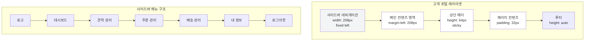
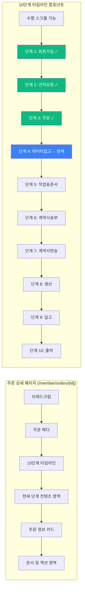
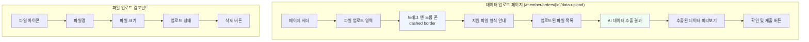
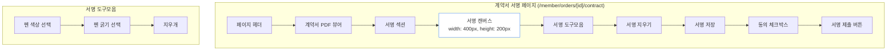

# EPACKAGE B2B 워크플로우 UI/UX 설계

## 1. 사이트맵 구조

### 고객 포털 사이트맵

| 경로 | 페이지명 | 설명 | 접근 권한 |
|------|---------|------|-----------|
| `/member/registration` | 기업 회원가입 | 기업 정보 입력 및 회원가입 | 비회원 |
| `/member/quotations` | 견적 목록 | 요청한 견적 리스트, 상태별 필터링 | 인증 회원 |
| `/member/quotations/request` | 견적 요청 | 새 견적 요청 폼 (기존 quote-simulator 활용) | 인증 회원 |
| `/member/quotations/[id]` | 견적 상세 | 견적서 PDF 보기, 승인/거절 | 인증 회원 |
| `/member/orders` | 주문 목록 | 주문 내역, 10단계 진척도 요약 | 인증 회원 |
| `/member/orders/[id]` | 주문 상세 | 전체 타임라인, 문서, 액션 버튼 | 인증 회원 |
| `/member/orders/[id]/data-upload` | 데이터 업로드 | AI/PDF 파일 업로드 (.ai 데이터 추출) | 인증 회원 |
| `/member/orders/[id]/work-order` | 작업표준서 | 사양서 PDF 보기, 확인 서명 | 인증 회원 |
| `/member/orders/[id]/contract` | 계약서 | 계약서 PDF 보기, 전자 서명 | 인증 회원 |
| `/member/orders/[id]/production` | 생산 진척 | 9단계 생산 타임라인, 사진 첨부 | 인증 회원 |
| `/member/orders/[id]/shipment` | 배송 추적 | 배송 상태, 송장 번호, 추적 링크 | 인증 회원 |

### 관리자 포털 사이트맵

| 경로 | 페이지명 | 설명 | 접근 권한 |
|------|---------|------|-----------|
| `/admin/dashboard` | 관리자 대시보드 | 전체 현황, 주요 지표, 알림 | 관리자 |
| `/admin/quotations` | 견적 관리 | 견적 요청 승인/거절, 가격 수정 | 관리자 |
| `/admin/orders` | 주문 관리 | 주문 목록, 상태별 필터링, 단계 이동 | 관리자 |
| `/admin/orders/[id]` | 주문 상세 | 주문 상세 보기, 단계별 조치 | 관리자 |
| `/admin/production` | 생산 관리 | 생산 일정, 공정별 진척 관리 | 관리자 |
| `/admin/contracts` | 계약 관리 | 계약서 발송, 서명 상태 확인 | 관리자 |

## 2. 와이어프레임 다이어그램

### 2.1 레이아웃 구조 (전체 페이지 공통)



### 2.2 주문 상세 페이지 와이어프레임



### 2.3 데이터 업로드 페이지 와이어프레임



### 2.4 계약서 서명 페이지 와이어프레임



### 2.5 생산 진척 페이지 와이어프레임

```mermaid
graph TB
    subgraph "생산 진척 페이지 (/member/orders/[id]/production)"
        A[페이지 헤더] --> B[9단계 생산 타임라인<br/>vertical]
        B --> C[현재 공정 상태]
        C --> D[공정 사진 갤러리]
        D --> E[예상 완료일]
        E --> F[담당자 정보]
    end

    subgraph "9단계 생산 공정"
        G[1. 디자인 검토] --> H[2. 데이터 가공]
        H --> I[3. 인쇄 준비]
        I --> J[4. 재단]
        J --> K[5. 박스 제작]
        K --> L[6. 조립]
        L --> M[7. 품질 검사]
        M --> N[8. 포장]
        N --> O[9. 출하 준비]
    end

    style C fill:#dbeafe
```



## 3. 핵심 페이지 목업

### 3.1 회원가입 페이지 (/member/registration)

**레이아웃:**
- 2단 컬럼 레이아웃 (데스크톱) / 1단 (모바일)
- 왼쪽: 폼 영역 (60%)
- 오른쪽: 안내 및 혜택 정보 (40%)

**필드 구성:**
```
┌─────────────────────────────────────────────────────────────┐
│  기업 회원가입                                                    │
├─────────────────────────────────────────────────────────────┤
│                                                                  │
│  ┌─ 기업 정보 ───────────────────────────────────────┐        │
│  │                                                     │        │
│  │  기업명 * [____________________]                   │        │
│  │                                                     │        │
│  │  사업자등록번호 * [__________] - [___]              │        │
│  │                                                     │        │
│  │  산업분류 * [선택하세요 ▼]                          │        │
│  │                                                     │        │
│  │  기업형태 * [주식회사 ▼]                            │        │
│  │                                                     │        │
│  └─────────────────────────────────────────────────┘         │
│                                                                  │
│  ┌─ 담당자 정보 ───────────────────────────────────┐        │
│  │                                                     │        │
│  │  담당자명 * [____________________]                │        │
│  │                                                     │        │
│  │  이메일 * [____________________]                   │        │
│  │                                                     │        │
│  │  연락처 * [____________________]                   │        │
│  │                                                     │        │
│  └─────────────────────────────────────────────────┘         │
│                                                                  │
│  ┌─ 주소 정보 ─────────────────────────────────────┐        │
│  │                                                     │        │
│  │  우편번호 * [______] [검색]                      │        │
│  │                                                     │        │
│  │  주소 * [________________________________]        │        │
│  │                                                     │        │
│  │  상세주소 [________________________________]       │        │
│  │                                                     │        │
│  └─────────────────────────────────────────────────┘         │
│                                                                  │
│  [ ] 이용약관 동의 *                                    │
│  [ ] 개인정보 수집 및 이용 동의 *                        │
│  [ ] 마케팅 정보 수신 동의 (선택)                        │
│                                                                  │
│  ┌────────────────┐  ┌───────────────┐                      │
│  │   취소하기       │  │  회원가입 완료   │                       │
│  └────────────────┘  └───────────────┘                      │
└─────────────────────────────────────────────────────────────┘
```

**반응형 대응:**
- 데스크톱 (>= 1024px): 2단 컬럼, max-width: 1200px
- 태블릿 (768px - 1023px): 1단, max-width: 768px
- 모바일 (< 768px): 1단, padding: 16px

---

### 3.2 견적 요청 페이지 (/member/quotations/request)

**레이아웃:**
- 기존 `quote-simulator` 페이지 활용
- 3단계 위저드 형태

**위저드 단계:**
```
┌─────────────────────────────────────────────────────────────┐
│  견적 요청                                                        │
├─────────────────────────────────────────────────────────────┤
│                                                                  │
│  ┌─ 1. 제품 선택 ─────────────────────────────────────┐       │
│   ○ 2. 사양 입력                                              │
│   ○ 3. 추가 정보                                               │
│                                                                 │
│  ┌─────────────────────────────────────────────────┐          │
│  │ 제품 카탈로그에서 선택하세요                                   │          │
│  │                                                        │          │
│  │ [검색: _____________________________] [검색]          │          │
│  │                                                        │          │
│  │ ┌──────┐ ┌──────┐ ┌──────┐ ┌──────┐              │          │
│  │ │제품1 │ │제품2 │ │제품3 │ │제품4 │              │          │
│  │ │이미지│ │이미지│ │이미지│ │이미지│              │          │
│  │ │      │ │      │ │      │ │      │              │          │
│  │ └──────┘ └──────┘ └──────┘ └──────┘              │          │
│  │                                                        │          │
│  │ ┌──────┐ ┌──────┐ ┌──────┐ ┌──────┐              │          │
│  │ │제품5 │ │제품6 │ │제품7 │ │제품8 │              │          │
│  │ └──────┘ └──────┘ └──────┘ └──────┘              │          │
│  │                                                        │          │
│  └─────────────────────────────────────────────────┘          │
│                                                                 │
│  선택한 제품: 3개                                              │
│                                                                 │
│           ┌─────────┐  ┌────────────┐                         │
│           │  이전단계  │  │  다음단계 →   │                          │
│           └─────────┘  └────────────┘                         │
└─────────────────────────────────────────────────────────────┘
```

---

### 3.3 주문 상세 페이지 (/member/orders/[id])

**레이아웃:**
- 상단: 주문 헤더 + 타임라인
- 중간: 현재 단계 액션 영역
- 하단: 주문 정보 요약

```
┌─────────────────────────────────────────────────────────────┐
│  대시보드 > 주문관리 > 주문 #ORD-2024-001                         │
├─────────────────────────────────────────────────────────────┤
│                                                                  │
│  ┌─ 주문 정보 ─────────────────────────────────────────┐       │
│  주문번호: ORD-2024-001  |  주문일: 2024-12-31                        │
│  고객사: (주)에피패키지  |  담당자: 홍길동                         │
│                                                                  │
│  ┌─ 주문 진행 현황 ─────────────────────────────────────┐       │
│                                                                  │
│  ✓ 회원가입 → ✓ 견적요청 → ✓ 주문 → ← 데이터입고 → 작업표준서       │
│                                             → 계약서송부 → 계약서반송  │
│                                             → 생산 → 입고 → 출하     │
│                                                                 │
│  ┌─────────────────────────────────────────────────┐          │
│  │ 현재 단계: 데이터 입고                                        │          │
│  │                                                        │          │
│  │ .ai 파일 또는 PDF 파일을 업로드해주세요.                      │          │
│  │                                                        │          │
│  │ ┌─ 파일 업로드 영역 ───────────────────────────┐       │          │
│  │ │                                              │       │          │
│  │ │     📁                                        │       │          │
│  │ │  파일을 드래그하거나 클릭하여 업로드             │       │          │
│  │ │                                              │       │          │
│  │ │  지원 파일: .ai, .pdf (최대 50MB)            │       │          │
│  │ │                                              │       │          │
│  │ └──────────────────────────────────────────────┘       │          │
│  │                                                        │          │
│  │ 업로드된 파일:                                           │          │
│  │ - package-design.ai (2.3 MB) ✓                         │          │
│  │                                                        │          │
│  │                ┌────────┐  ┌──────────┐               │          │
│  │                │  취소    │  │  데이터 제출  │                │          │
│  │                └────────┘  └──────────┘               │          │
│  └─────────────────────────────────────────────────┘          │
│                                                                 │
│  ┌─ 주문 요약 ─────────────────────────────────────────┐       │
│  ┌────────────┐ ┌────────────┐ ┌────────────┐               │
│  │  제품 수량  │ │  총 금액    │ │  예상 납기일 │               │
│  │  5,000개   │ │  ¥1,500,000│ │  2025-02-15 │               │
│  └────────────┘ └────────────┘ └────────────┘               │
│                                                                 │
└─────────────────────────────────────────────────────────────┘
```

**타임라인 인터랙션:**
- 완료된 단계: 녹색 (클릭 가능 - 해당 단계 페이지로 이동)
- 현재 단계: 파란색 + 애니메이션
- 대기 중인 단계: 회색 (클릭 불가)
- 호버 시: 툴팁 표시 (단계명 + 상태)

---

### 3.4 작업표준서 확인 페이지 (/member/orders/[id]/work-order)

**레이아웃:**
- 중앙: PDF 뷰어
- 우측: 확인 버튼 + 메모

```
┌─────────────────────────────────────────────────────────────┐
│  주문 #ORD-2024-001 > 작업표준서 확인                              │
├─────────────────────────────────────────────────────────────┤
│                                                                  │
│  ┌─ 작업표준서 미리보기 ─────────────────────────────────┐      │
│  ┌──────────────────────────┐ ┌──────────────────┐          │
│  │                          │ │  문서 정보        │          │
│  │                          │ │  ──────────      │          │
│  │     [PDF 뷰어]            │ │                  │          │
│  │                          │ │  문서명: 작업표준서│          │
│  │   (스크롤 가능)           │ │  버전: v1.0      │          │
│  │                          │ │  생성일: 2025-01-05│          │
│  │                          │ │                  │          │
│  │                          │ │  ──────────      │          │
│  │                          │ │                  │          │
│  │                          │ │  ┌─ 작업 메모 ──┐│          │
│  │                          │ │  │              ││          │
│  │                          │ │  │ [_________  ││          │
│  │                          │ │  │ _________  ││          │
│  │                          │ │  │ _________  ││          │
│  │                          │ │  │              ││          │
│  │                          │ │  └──────────────┘│          │
│  │                          │ │                  │          │
│  │                          │ │  ┌─ 다운로드 ───┐│          │
│  │                          │ │  │ 📥 PDF 다운로드│         │
│  │                          │ │  └──────────────┘│          │
│  │                          │ │                  │          │
│  │                          │ │  ┌─ 확인 액션 ──┐│          │
│  │                          │ │  │              ││          │
│  │                          │ │  │ [내용 확인]   ││          │
│  │                          │ │  │              ││          │
│  │                          │ │  └──────────────┘│          │
│  │                          │ └──────────────────┘          │
│  └──────────────────────────┘                              │
│                                                                 │
└─────────────────────────────────────────────────────────────┘
```

---

### 3.5 계약서 서명 페이지 (/member/orders/[id]/contract)

**레이아웃:**
- 상단: 계약서 PDF 뷰어 (축소)
- 하단: 전자 서명 영역

```
┌─────────────────────────────────────────────────────────────┐
│  주문 #ORD-2024-001 > 계약서 서명                                  │
├─────────────────────────────────────────────────────────────┤
│                                                                  │
│  ┌─ 계약서 미리보기 ──────────────────────────────────────┐     │
│  ┌───────────────────────────────────────────────────┐         │
│  │                                                   │         │
│  │   [계약서 PDF 뷰어 - 50% height]                   │         │
│  │                                                   │         │
│  │   (전체 보기 버튼 제공)                             │         │
│  │                                                   │         │
│  └───────────────────────────────────────────────────┘         │
│                                                                 │
│  ┌─ 전자 서명 ─────────────────────────────────────────┐       │
│  ┌───────────────────────────────────────────────────┐         │
│  │  서명 캔버스                                        │         │
│  │  ┌─────────────────────────────────────────────┐   │         │
│  │  │                                             │   │         │
│  │  │  (여기에 서명해주세요)                        │   │         │
│  │  │                                             │   │         │
│  │  │                                             │   │         │
│  │  │                                             │   │         │
│  │  └─────────────────────────────────────────────┘   │         │
│  │                                                     │         │
│  │  색상: ⚫ ⚪ 🔵 🟢  굵기: ○ ● ●●                    │         │
│  │  [지우개]                                           │         │
│  │                                                     │         │
│  └───────────────────────────────────────────────────┘         │
│                                                                 │
│  [ ] 계약서 내용을 확인했으며, 동의합니다.                     │
│  [ ] 전자 서명에 대한 법적 효력을 확인했습니다.                 │
│                                                                 │
│           ┌─────────┐  ┌──────────┐                            │
│           │  지우기   │  │  서명 제출   │                             │
│           └─────────┘  └──────────┘                            │
│                                                                 │
└─────────────────────────────────────────────────────────────┘
```

**전자 서명 기능:**
- 마우스/터치로 자유 서명
- 서명 이미지 저장 (PNG)
- 서명 시간戳 기록
- IP 주소 기록 (법적 효력)

---

### 3.6 생산 진척 페이지 (/member/orders/[id]/production)

**레이아웃:**
- 좌측: 9단계 생산 타임라인 (수직)
- 우측: 현재 공정 상세 + 사진

```
┌─────────────────────────────────────────────────────────────┐
│  주문 #ORD-2024-001 > 생산 진척 현황                               │
├─────────────────────────────────────────────────────────────┤
│                                                                  │
│  ┌─ 9단계 생산 공정 ──────────────────────────────────────┐      │
│  ┌──────────────────┐ ┌──────────────────────────┐            │
│  │ 1. 디자인 검토 ✓  │ │  공정 사진               │            │
│  │                  │ │  ─────────              │            │
│  │ 완료일: 01-10    │ │  ┌─────┐ ┌─────┐        │            │
│  └──────────────────┘  │ │사진1│ │사진2│        │            │
│       ↓                  │ └─────┘ └─────┘        │            │
│  ┌──────────────────┐  │                        │            │
│  │ 2. 데이터 가공 ✓  │ │  공정 메모               │            │
│  │                  │ │  ─────────              │            │
│  │ 완료일: 01-12    │ │  디자인 검토 완료.      │            │
│  └──────────────────┘  │  특이사항 없음.        │            │
│       ↓                  └──────────────────────────┘            │
│  ┌──────────────────┐                                         │
│  │ 3. 인쇄 준비 ✓   │                                         │
│  │                  │                                         │
│  │ 완료일: 01-14    │                                         │
│  └──────────────────┘                                         │
│       ↓                                                        │
│  ┌──────────────────┐  ┌──────────────────────────┐            │
│  │ 4. 재단 ← 진행중  │ │  현재 공정 정보           │            │
│  │                  │ │  ─────────────           │            │
│  │ 진척도: 60%      │ │  시작일: 2025-01-15       │            │
│  │                  │ │  예상완료: 2025-01-17     │            │
│  │ ┌────────────┐  │ │  담당자: 김제작           │            │
│  │ │███████░░░░░│  │ │  연락처: 02-1234-5678    │            │
│  │ └────────────┘  │ │                          │            │
│  └──────────────────┘  └──────────────────────────┘            │
│       ↓                                                        │
│  ┌──────────────────┐                                         │
│  │ 5. 박스 제작      │                                         │
│  └──────────────────┘                                         │
│       ↓                                                        │
│  ┌──────────────────┐                                         │
│  │ 6. 조립          │                                         │
│  └──────────────────┘                                         │
│       ↓                                                        │
│  ┌──────────────────┐                                         │
│  │ 7. 품질 검사      │                                         │
│  └──────────────────┘                                         │
│       ↓                                                        │
│  ┌──────────────────┐                                         │
│  │ 8. 포장          │                                         │
│  └──────────────────┘                                         │
│       ↓                                                        │
│  ┌──────────────────┐                                         │
│  │ 9. 출하 준비      │                                         │
│  └──────────────────┘                                         │
│                                                                 │
└─────────────────────────────────────────────────────────────┘
```

**인터랙션:**
- 완료된 공정 클릭: 해당 공정 사진/메모 보기
- 진행 중인 공정: 실시간 업데이트
- 사진 클릭: 라이트박스로 확대
- 전체 진척도: 프로그레스 바 표시

---

## 4. UI 컴포넌트 명세

### 4.1 타임라인 컴포넌트

**컴포넌트명:** `WorkflowTimeline`

**Props:**
```typescript
interface WorkflowTimelineProps {
  currentStep: number; // 1-10
  steps: WorkflowStep[];
  onStepClick?: (stepId: string) => void;
  variant?: 'horizontal' | 'vertical';
  responsive?: boolean; // 모바일에서 축소형 표시
}

interface WorkflowStep {
  id: string;
  number: number;
  title: string;
  description: string;
  status: 'completed' | 'current' | 'pending' | 'blocked';
  date?: string;
  icon?: React.ReactNode;
}
```

**스타일 명세:**
- completed: bg-green-500, text-white
- current: bg-blue-500, text-white, pulse animation
- pending: bg-gray-200, text-gray-500
- blocked: bg-red-100, text-red-500

**반응형:**
- Desktop (>= 1024px): 수평 타임라인, 모든 정보 표시
- Tablet (768-1023px): 수평 타임라인, 일부 정보 툴팁
- Mobile (< 768px): 수직 타임라인 또는 축소형 (숫자만)

---

### 4.2 문서 뷰어 컴포넌트

**컴포넌트명:** `DocumentViewer`

**Props:**
```typescript
interface DocumentViewerProps {
  documentUrl: string;
  documentType: 'pdf' | 'image';
  title: string;
  downloadUrl?: string;
  height?: string; // 기본: '600px'
  showControls?: boolean;
  onConfirm?: () => void;
}
```

**기능:**
- PDF 임베드 뷰어 (iframe + PDF.js)
- 줌 인/아웃
- 페이지 네비게이션
- 전체 화면 모드
- 다운로드 버튼
- 인쇄 버튼

**스타일:**
- border: 1px solid #e5e7eb
- border-radius: 8px
- shadow: 0 1px 3px rgba(0,0,0,0.1)

---

### 4.3 파일 업로드 컴포넌트

**컴포넌트명:** `FileUploader`

**Props:**
```typescript
interface FileUploaderProps {
  accept: string[]; // ['.ai', '.pdf']
  maxSize: number; // bytes
  multiple?: boolean;
  onUpload: (files: File[]) => Promise<void>;
  value?: File[];
  onRemove?: (index: number) => void;
}

interface UploadedFile {
  file: File;
  status: 'uploading' | 'success' | 'error';
  progress: number;
  error?: string;
}
```

**기능:**
- 드래그 앤 드롭
- 클릭 업로드
- 파일 크기/형식 검증
- 업로드 진척도 표시
- 에러 메시지
- 삭제 버튼

**스타일:**
- 드롭 존: dashed border, hover 시 blue-50 bg
- 성공: green-500 icon
- 에러: red-500 icon + 메시지

---

### 4.4 전자 서명 컴포넌트

**컴포넌트명:** `SignatureCanvas`

**Props:**
```typescript
interface SignatureCanvasProps {
  width: number; // 기본: 400
  height: number; // 기본: 200
  onSave: (signatureData: string) => void;
  onClear: () => void;
  penColor?: string; // 기본: '#000000'
  penWidth?: number; // 기본: 2
}

interface SignatureData {
  dataUrl: string; // base64 PNG
  timestamp: string;
  ipAddress: string;
}
```

**기능:**
- 캔버스 API 기반 자유 서명
- 펜 색상/굵기 선택
- 지우개 모드
- 서명 지우기
- 서명 저장 (PNG)
- 터치/마우스 지원

**스타일:**
- 캔버스: white bg, gray-300 border
- 도구모음: flex, gap-2, bottom

---

### 4.5 상태 배지 컴포넌트

**컴포넌트명:** `WorkflowStatusBadge`

**Props:**
```typescript
interface WorkflowStatusBadgeProps {
  status: WorkflowStatus;
  size?: 'sm' | 'md' | 'lg';
  showIcon?: boolean;
}

type WorkflowStatus =
  | 'draft' // 초안
  | 'pending' // 대기 중
  | 'in_progress' // 진행 중
  | 'review' // 검토 중
  | 'approved' // 승인됨
  | 'rejected' // 거절됨
  | 'completed' // 완료
  | 'cancelled'; // 취소
```

**스타일:**
```typescript
const statusVariants = {
  draft: { bg: 'bg-gray-100', text: 'text-gray-700', icon: FileText },
  pending: { bg: 'bg-yellow-100', text: 'text-yellow-700', icon: Clock },
  in_progress: { bg: 'bg-blue-100', text: 'text-blue-700', icon: Loader2 },
  review: { bg: 'bg-purple-100', text: 'text-purple-700', icon: Eye },
  approved: { bg: 'bg-green-100', text: 'text-green-700', icon: CheckCircle },
  rejected: { bg: 'bg-red-100', text: 'text-red-700', icon: XCircle },
  completed: { bg: 'bg-emerald-100', text: 'text-emerald-700', icon: CheckCircle2 },
  cancelled: { bg: 'bg-gray-200', text: 'text-gray-500', icon: Ban },
};
```

---

### 4.6 알림 컴포넌트

**컴포넌트명:** `WorkflowNotification`

**Props:**
```typescript
interface WorkflowNotificationProps {
  type: 'info' | 'success' | 'warning' | 'error';
  title: string;
  message: string;
  actions?: NotificationAction[];
  duration?: number; // ms, 0 = manual close
  onClose?: () => void;
}

interface NotificationAction {
  label: string;
  onClick: () => void;
  variant?: 'primary' | 'secondary';
}
```

**스타일:**
- info: blue bg, blue icon
- success: green bg, check icon
- warning: yellow bg, alert icon
- error: red bg, x-circle icon

---

## 5. 사용자 시나리오

### 5.1 신규 고객 주문 시나리오

**Step 1: 회원가입**
```
[홈페이지 방문]
  ↓
[회원가입 버튼 클릭]
  ↓
[기업 정보 입력]
  - 기업명, 사업자번호, 산업분류
  - 담당자 정보
  - 주소 정보
  ↓
[이용약관 동의]
  ↓
[가입 완료]
  - 이메일 인증
  - 로그인 자동
```

**Step 2: 첫 견적 요청**
```
[로그인 완료 상태]
  ↓
[대시보드 진입]
  - "새 견적 요청하기" CTA
  ↓
[견적 요청 폼]
  - 제품 선택 (카탈로그)
  - 사양 입력 (크기, 재질, 인쇄)
  - 수량 선택
  - 추가 요구사항
  ↓
[견적서 생성]
  - 자동 계산
  - PDF 생성
```

**Step 3: 견적 승인 및 주문 전환**
```
[견적 목록 페이지]
  ↓
[견적 상세 보기]
  - PDF 미리보기
  - 가격 확인
  - 납기 확인
  ↓
[견적 승인 클릭]
  - 주문 전환 확인 팝업
  ↓
[주문 생성 완료]
  - 주문번호 부여
  - 타임라인 시작
```

---

### 5.2 데이터 업로드 시나리오

```
[주문 상세 페이지]
  - 현재 단계: "데이터 입고"
  ↓
[데이터 업로드 페이지 진입]
  - 안내 메시지 표시
  ↓
[파일 선택]
  - .ai 파일 또는 PDF 파일
  - 드래그 앤 드롭
  ↓
[업로드 진행]
  - 프로그레스 바
  - 완료 알림
  ↓
[AI 데이터 추출]
  - 자동으로 .ai 파일 분석
  - 디자인 요소 추출
  - 사양서 자동 생성
  ↓
[추출 결과 확인]
  - 미리보기
  - 수정 요청 가능
  ↓
[확인 및 제출]
  - 다음 단계 이동
```

---

### 5.3 계약서 서명 시나리오

```
[주문 상세 페이지]
  - 현재 단계: "계약서 반송"
  ↓
[계약서 서명 페이지 진입]
  - 계약서 PDF 표시
  - 전자 서명 영역 표시
  ↓
[계약서 검토]
  - 스크롤하여 전체 확인
  - PDF 다운로드 가능
  ↓
[전자 서명]
  - 서명 캔버스에 서명
  - 색상/굵기 선택
  - 수정 가능
  ↓
[동의 체크]
  - 계약 내용 확인 체크
  - 전자 서명 효력 확인 체크
  ↓
[서명 제출]
  - 서명 데이터 저장
  - 타임스탬프 기록
  - IP 주소 기록
  ↓
[서명 완료]
  - 자동으로 다음 단계 이동
  - 이메일 알림 발송
```

---

### 5.4 생산 진척 모니터링 시나리오

```
[주문 상세 페이지]
  - 현재 단계: "생산 중"
  ↓
[생산 진척 페이지 진입]
  - 9단계 공정 표시
  - 현재 공정 하이라이트
  ↓
[공정 상세 확인]
  - 완료된 공정 클릭
  - 공정 사진 보기
  - 공정 메모 확인
  ↓
[진행 중인 공정 모니터링]
  - 실시간 진척도
  - 예상 완료일
  - 담당자 연락처
  ↓
[알림 수신]
  - 공정 완료 시 이메일
  - 다음 공정 시작 알림
  - 전체 완료 알림
```

---

### 5.5 배송 추적 시나리오

```
[주문 상세 페이지]
  - 현재 단계: "출하"
  ↓
[배송 추적 페이지 진입]
  - 송장 번호 표시
  - 배송업체 로고
  ↓
[배송 경로 지도]
  - 발송지 → 현재 위치 → 도착지
  - 예상 도착일
  ↓
[배송 상태 타임라인]
  1. 상품 준비 완료 ✓
  2. 택배 회사 접수 ✓
  3. 상품 이동 중 ← 현재
  4. 지역 택배사 도착
  5. 배송 기사 배정
  6. 고객 전달 완료
  ↓
[배송 정보]
  - 택배사: CJ대한통운
  - 송장번호: 1234567890123
  - 연락처: 1588-1255
  ↓
[배송 완료 확인]
  - 수령 확인 버튼
  - 리뷰 작성 유도
```

---

## 6. 상태 관리 설계

### 6.1 주문 상태 기계

```typescript
type OrderStatus =
  | 'draft' // 초안 (견적 전)
  | 'quotation_pending' // 견적 대기 중
  | 'quotation_approved' // 견적 승인
  | 'data_entry_pending' // 데이터 입고 대기
  | 'data_processing' // 데이터 가공 중
  | 'work_order_pending' // 작업표준서 대기
  | 'work_order_approved' // 작업표준서 승인
  | 'contract_pending' // 계약서 대기
  | 'contract_signed' // 계약서 서명 완료
  | 'production_in_progress' // 생산 중
  | 'quality_check' // 품질 검사
  | 'stocked' // 입고 완료
  | 'shipped' // 출하 완료
  | 'delivered' // 배송 완료
  | 'cancelled'; // 취소

interface OrderState {
  status: OrderStatus;
  currentStep: number; // 1-10
  completedSteps: number[];
  metadata: {
    createdAt: string;
    updatedAt: string;
    estimatedCompletion?: string;
  };
}
```

### 6.2 타임라인 상태 매핑

| 주문 상태 | 현재 단계 | 완료 단계 | 다음 액션 |
|----------|----------|----------|----------|
| `draft` | 2 | [1] | 견적 요청 완료 |
| `quotation_pending` | 2 | [1] | 관리자 승인 대기 |
| `quotation_approved` | 3 | [1,2] | 주문 확정 |
| `data_entry_pending` | 4 | [1,2,3] | 데이터 업로드 |
| `data_processing` | 4 | [1,2,3] | AI 추출 대기 |
| `work_order_pending` | 5 | [1,2,3,4] | 작업표준서 확인 |
| `work_order_approved` | 6 | [1,2,3,4,5] | 계약서 대기 |
| `contract_pending` | 7 | [1,2,3,4,5,6] | 계약서 서명 |
| `contract_signed` | 8 | [1,2,3,4,5,6,7] | 생산 시작 |
| `production_in_progress` | 8 | [1,2,3,4,5,6,7] | 생산 진행 중 |
| `quality_check` | 8 | [1,2,3,4,5,6,7] | 품질 검사 |
| `stocked` | 9 | [1,2,3,4,5,6,7,8] | 입고 완료 |
| `shipped` | 10 | [1,2,3,4,5,6,7,8,9] | 배송 시작 |
| `delivered` | 10 | [1,2,3,4,5,6,7,8,9,10] | 배송 완료 |

---

## 7. 접근성 (Accessibility)

### 7.1 키보드 내비게이션
- `Tab`: 포커스 이동
- `Enter/Space`: 버튼/링크 활성화
- `Escape`: 모달/드롭다운 닫기
- `Arrow Keys`: 타임라인 단계 이동

### 7.2 스크린 리더 지원
- ARIA 라벨: 모든 인터랙티브 요소
- 랜드마크: banner, navigation, main
- 라이브 리전: 동적 업데이트 알림

### 7.3 색상 대비
- 텍스트: WCAG AA (4.5:1)
- 큰 텍스트: WCAG AA (3:1)
- UI 컴포넌트: WCAG AA (3:1)

### 7.4 초점 표시
- 모든 포커스 가능한 요소에 visible focus
- high-contrast 모드 지원

---

## 8. 반응형 디자인

### 8.1 브레이크포인트

```css
/* Mobile First */
/* Default: < 768px (Mobile) */

@media (min-width: 768px) {
  /* Tablet */
}

@media (min-width: 1024px) {
  /* Desktop */
}

@media (min-width: 1280px) {
  /* Wide Desktop */
}
```

### 8.2 레이아웃 변화

| 요소 | Mobile (<768px) | Tablet (768-1023px) | Desktop (>=1024px) |
|------|-----------------|---------------------|-------------------|
| 사이드바 | 햄버거 메뉴 | 축소형 사이드바 | 전체 사이드바 |
| 타임라인 | 수직, 축소 | 수평 스크롤 | 수평 전체 |
| PDF 뷰어 | 100% width | 80% width | 고정 width |
| 파일 업로드 | 단일 | 단일 | 다중 |
| 테이블 | 카드 뷰 | 테이블 | 테이블 |

---

## 9. 성능 최적화

### 9.1 코드 스플리팅
```typescript
// 페이지별 동적 임포트
const QuotationRequest = dynamic(() =>
  import('./quotations/request/page').then(mod => mod.default)
);

const DocumentViewer = dynamic(() =>
  import('@/components/workflow/DocumentViewer'),
  { ssr: false }
);
```

### 9.2 이미지 최적화
- Next.js Image 컴포넌트
- WebP/AVIF 형식
- lazy loading
- responsive sizes

### 9.3 PDF 최적화
- PDF.js lazy loading
- 페이지별 렌더링
- 캐싱 전략

---

## 10. 구현 우선순위

### Phase 1: 기본 인프라 (Week 1-2)
1. 라우팅 구조 설정
2. 레이아웃 컴포넌트 (사이드바, 헤더)
3. 타임라인 컴포넌트
4. 상태 배지 컴포넌트

### Phase 2: 핵심 페이지 (Week 3-4)
1. 회원가입 페이지
2. 견적 요청 페이지 (기존 것 활용)
3. 주문 상세 페이지
4. 파일 업로드 컴포넌트

### Phase 3: 문서 관리 (Week 5-6)
1. 문서 뷰어 컴포넌트
2. 작업표준서 확인 페이지
3. 계약서 서명 페이지
4. 전자 서명 컴포넌트

### Phase 4: 생산 및 배송 (Week 7-8)
1. 생산 진척 페이지
2. 배송 추적 페이지
3. 알림 시스템
4. 실시간 업데이트

### Phase 5: 관리자 포털 (Week 9-10)
1. 관리자 대시보드
2. 견적 관리 페이지
3. 주문 관리 페이지
4. 생산 관리 페이지

---

## 11. 기술 스택

### 프론트엔드
- Next.js 16 (App Router)
- React 19
- TypeScript
- Tailwind CSS 4
- Radix UI (Primitives)
- Lucide React (Icons)

### PDF 및 문서
- PDF.js (PDF 뷰어)
- React-Signature-Canvas (전자 서명)
- jsPDF (PDF 생성)

### 상태 관리
- React Context API
- Zustand (글로벌 상태)
- TanStack Query (서버 상태)

### 폼 관리
- React Hook Form
- Zod (밸리데이션)

### 파일 업로드
- React Dropzone
- Supabase Storage

### 알림
- Sonner (Toast)
- React Hot Toast

---

## 12. 다음 단계

이 설계 문서를 바탕으로 다음 작업을 진행할 수 있습니다:

1. **디자인 시스템 확장**: 기존 UI 컴포넌트에 워크플로우 전용 컴포넌트 추가
2. **프로토타이핑**: Figma/Framer로 인터랙티브 프로토타입 제작
3. **API 설계**: 각 단계별 필요한 API 엔드포인트 정의
4. **개발 시작**: Phase 1부터 순차적 구현

---

_문서 버전: 1.0_
_작성일: 2024-12-31_
_마지막 수정: 2024-12-31_
