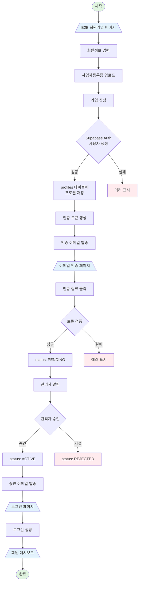
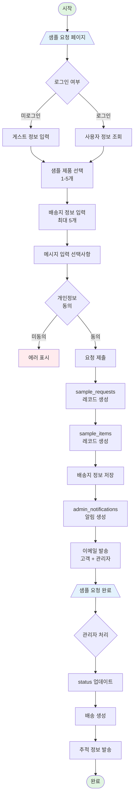
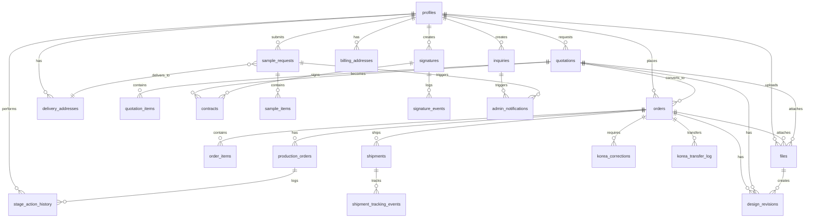

# 크로스 레퍼런스 (Cross-Reference Indices)

Epackage Lab Web 시스템의 전체 페이지, API, 데이터베이스 테이블 간의 관계를 문서화합니다.

**최종 업데이트**: 2026-01-06

---

## 요약 통계 (Summary Statistics)

| 항목 | 개수 |
|------|------|
| **전체 페이지** | 82개 |
| **데이터베이스 테이블** | 33개 |
| **API 엔드포인트** | ~183개 |
| **버튼/액션 플로우** | ~165개 |
| **성능 인덱스** | 28개 |
| **외래 키 제약조건** | 19개 |
| **데이터베이스 트리거** | 19개 |

---

## 1. 페이지 → 테이블 매핑 (Page → Database Tables)

### 공개 페이지 (Public Pages)

| 페이지 URL | 사용 테이블 | 설명 |
|-----------|-----------|------|
| `/` | products | 메인 페이지 - 제품 카탈로그 |
| `/about` | - | 회사 소개 |
| `/catalog` | products | 제품 카탈로그 목록 |
| `/catalog/[slug]` | products | 제품 상세 페이지 |
| `/service` | - | 서비스 소개 |
| `/guide/*` | - | 가이드 페이지 (색상, 사이즈, 이미지 등) |
| `/contact` | inquiries | 연락처 페이지 |
| `/contact/thank-you` | inquiries | 문의 완료 페이지 |
| `/samples` | products, sample_requests | 샘플 신청 페이지 |
| `/samples/thank-you` | sample_requests | 샘플 신청 완료 |
| `/quote-simulator` | - | 견적 시뮬레이터 |
| `/smart-quote` | - | 스마트 견적 |
| `/roi-calculator` | - | ROI 계산기 |
| `/compare` | products | 제품 비교 |
| `/pricing` | - | 가격 정책 |
| `/privacy` | - | 개인정보 처리방침 |
| `/terms` | - | 이용약관 |
| `/csr` | - | CSR 활동 |
| `/legal` | - | 법적 정보 |
| `/news` | announcements | 뉴스/공지사항 |
| `/print` | - | 인쇄 안내 |
| `/flow` | - | 업무 흐름 |
| `/data-templates` | - | 데이터 템플릿 |
| `/premium-content` | - | 프리미엄 콘텐츠 |
| `/simulation` | - | 시뮬레이션 |
| `/inquiry/detailed` | inquiries | 상세 문의 |
| `/cart` | - | 장바구니 |

### 인증 페이지 (Authentication Pages)

| 페이지 URL | 사용 테이블 | 설명 |
|-----------|-----------|------|
| `/auth/signin` | profiles | 로그인 |
| `/auth/register` | profiles | 일반 회원가입 |
| `/auth/pending` | profiles | 승인 대기 중 |
| `/auth/suspended` | profiles | 계정 정지됨 |
| `/auth/forgot-password` | profiles | 비밀번호 찾기 |
| `/auth/reset-password` | profiles | 비밀번호 재설정 |
| `/auth/signout` | - | 로그아웃 |
| `/auth/error` | - | 인증 에러 |

### B2B 페이지 (B2B Pages)

| 페이지 URL | 사용 테이블 | 설명 |
|-----------|-----------|------|
| `/b2b/register` | profiles | B2B 회원가입 |
| `/b2b/register/verify` | profiles | 이메일 인증 |
| `/b2b/register/sent` | profiles | 인증 메일 발송 완료 |
| `/b2b/login` | profiles | B2B 전용 로그인 |
| `/b2b/contracts` | contracts, signatures, quotations, orders | B2B 계약 목록 |

### 회원 포털 페이지 (Member Portal Pages)

| 페이지 URL | 사용 테이블 | 설명 |
|-----------|-----------|------|
| `/member/dashboard` | profiles, orders, quotations, sample_requests, inquiries, announcements | 회원 대시보드 |
| `/member/profile` | profiles, delivery_addresses, billing_addresses | 회원 프로필 |
| `/member/edit` | profiles | 프로필 수정 |
| `/member/settings` | profiles | 계정 설정 |
| `/member/orders` | orders, order_items | 주문 목록 |
| `/member/orders/new` | - | 새 주문 |
| `/member/orders/reorder` | orders, order_items | 재주문 |
| `/member/orders/[id]` | orders, order_items, production_orders, shipments | 주문 상세 |
| `/member/orders/[id]/confirmation` | orders | 주문 확인 |
| `/member/orders/[id]/data-receipt` | files, design_revisions | 데이터 수령 |
| `/member/orders/history` | orders | 주문 내역 |
| `/member/quotations` | quotations, quotation_items | 견적 목록 |
| `/member/quotations/[id]` | quotations, quotation_items | 견적 상세 |
| `/member/quotations/[id]/confirm` | quotations | 견적 확인 |
| `/member/quotations/request` | products | 견적 요청 |
| `/member/samples` | sample_requests, sample_items | 샘플 요청 목록 |
| `/member/deliveries` | delivery_addresses, shipments | 배송지 관리 |
| `/member/invoices` | - | 청구서 |
| `/member/inquiries` | inquiries | 문의 내역 |

### 관리자 페이지 (Admin Pages)

| 페이지 URL | 사용 테이블 | 설명 |
|-----------|-----------|------|
| `/admin/dashboard` | profiles, orders, quotations, sample_requests, inquiries, production_orders, shipments | 관리자 대시보드 |
| `/admin/orders` | orders, order_items, production_orders | 주문 관리 |
| `/admin/orders/[id]` | orders, order_items, production_orders, files, design_revisions | 주문 상세 |
| `/admin/approvals` | profiles, quotations | 승인 대기 목록 |
| `/admin/contracts` | contracts, signatures | 계약 관리 |
| `/admin/contracts/[id]` | contracts, signatures, quotations, orders | 계약 상세 |
| `/admin/production` | production_orders, stage_action_history | 생산 현황 |
| `/admin/production/[id]` | production_orders, stage_action_history, files, design_revisions | 생산 상세 |
| `/admin/inventory` | - | 재고 관리 |
| `/admin/shipments` | shipments, shipment_tracking_events | 배송 관리 |
| `/admin/shipments/[id]` | shipments, shipment_tracking_events | 배송 상세 |
| `/admin/shipping` | - | 배송 설정 |
| `/admin/leads` | inquiries, sample_requests | 리드 관리 |

### 포털 페이지 (Portal Pages)

| 페이지 URL | 사용 테이블 | 설명 |
|-----------|-----------|------|
| `/portal` | - | 포털 메인 |
| `/portal/orders` | orders | 주문 목록 |
| `/portal/orders/[id]` | orders | 주문 상세 |
| `/portal/profile` | profiles | 프로필 |
| `/portal/documents` | files, contracts, quotations | 문서 |
| `/portal/support` | inquiries | 지원 |

### 기타 페이지 (Other Pages)

| 페이지 URL | 사용 테이블 | 설명 |
|-----------|-----------|------|
| `/members` | profiles | 회원 목록 |
| `/profile` | profiles | 프로필 |
| `/archives` | - | 아카이브 |

---

## 2. API → 테이블 매핑 (API → Database Tables)

### 연락처/문의 APIs (Contact/Inquiry APIs)

| API 엔드포인트 | HTTP | 사용 테이블 | 설명 |
|---------------|------|-----------|------|
| `/api/contact` | POST | inquiries | 문의 제출 |
| `/api/errors/log` | POST | - | 에러 로그 |
| `/api/ai/review` | POST | - | AI 검토 |

### B2B APIs

| API 엔드포인트 | HTTP | 사용 테이블 | 설명 |
|---------------|------|-----------|------|
| `/api/b2b/register` | POST | profiles, auth.users | B2B 회원가입 |
| `/api/b2b/verify-email` | POST | profiles | 이메일 인증 |
| `/api/b2b/resend-verification` | POST | profiles | 인증 메일 재발송 |
| `/api/b2b/login` | POST | profiles | B2B 로그인 |
| `/api/b2b/invite` | POST | profiles | 초대장 발송 |
| `/api/b2b/invite/accept` | POST | profiles | 초대 수락 |
| `/api/b2b/admin/pending-users` | GET | profiles | 대기 중인 회원 목록 |
| `/api/b2b/admin/approve-user` | POST | profiles | 회원 승인 |
| `/api/b2b/admin/reject-user` | POST | profiles | 회원 거절 |
| `/api/b2b/dashboard/stats` | GET | orders, quotations, sample_requests, inquiries | 대시보드 통계 |
| `/api/b2b/orders` | GET/POST | orders, order_items | 주문 목록/생성 |
| `/api/b2b/orders/confirm` | POST | orders | 주문 확정 |
| `/api/b2b/orders/[id]/tracking` | GET | shipments | 배송 추적 |
| `/api/b2b/orders/[id]/production-logs` | GET | production_orders, stage_action_history | 생산 로그 |
| `/api/b2b/quotations/[id]` | GET | quotations, quotation_items | 견적 상세 |
| `/api/b2b/quotations/[id]/approve` | POST | quotations | 견적 승인 |
| `/api/b2b/quotations/[id]/export` | GET | quotations | 견적 내보내기 |
| `/api/b2b/quotations/[id]/convert-to-order` | POST | orders, quotations, order_items | 견적 → 주문 변환 |
| `/api/b2b/samples` | GET/POST | sample_requests, sample_items | 샘플 목록/생성 |
| `/api/b2b/contracts` | GET | contracts, signatures | 계약 목록 |
| `/api/b2b/contracts/sign` | POST | contracts, signatures | 계약 서명 |
| `/api/b2b/contracts/[id]/sign` | POST | contracts, signatures | 특정 계약 서명 |
| `/api/b2b/files/upload` | POST | files | 파일 업로드 |
| `/api/b2b/files/[id]/extract` | GET | files, design_revisions | 파일 추출 |
| `/api/b2b/ai-extraction/status` | GET | files, design_revisions | AI 추출 상태 |
| `/api/b2b/ai-extraction/upload` | POST | files | AI 추출 업로드 |
| `/api/b2b/ai-extraction/approve` | POST | design_revisions | AI 추출 승인 |
| `/api/b2b/spec-sheets/generate` | POST | design_revisions, files | 스펙 시트 생성 |
| `/api/b2b/spec-sheets/[id]/approve` | POST | design_revisions | 스펙 시트 승인 |
| `/api/b2b/spec-sheets/[id]/reject` | POST | design_revisions | 스펙 시트 거절 |
| `/api/b2b/invoices` | GET | - | 청구서 목록 |
| `/api/b2b/invoices/[id]` | GET | - | 청구서 상세 |
| `/api/b2b/shipments` | GET/POST | shipments | 배송 목록/생성 |
| `/api/b2b/stock-in` | POST | - | 입고 |
| `/api/b2b/work-orders` | POST | - | 작업 지시 |
| `/api/b2b/state-machine/transition` | POST | orders, quotations, production_orders | 상태 전이 |
| `/api/b2b/certificate/generate` | POST | - | 증명서 생성 |
| `/api/b2b/korea/send-data` | POST | korea_transfer_log | 한국 데이터 전송 |
| `/api/b2b/korea/corrections` | GET | korea_corrections | 한국 수정 목록 |
| `/api/b2b/korea/corrections/[id]/upload` | POST | korea_corrections | 수정 파일 업로드 |
| `/api/b2b/documents/[id]/download` | GET | files, contracts | 문서 다운로드 |
| `/api/b2b/hanko/upload` | POST | files | Hanko 서명 업로드 |
| `/api/b2b/products` | GET | products | 제품 목록 |
| `/api/b2b/timestamp/verify` | POST | - | 타임스탬프 검증 |

### 샘플/문의 APIs (Sample/Inquiry APIs)

| API 엔드포인트 | HTTP | 사용 테이블 | 설명 |
|---------------|------|-----------|------|
| `/api/samples/request` | POST | sample_requests, sample_items, admin_notifications, delivery_addresses | 샘플 요청 |

### 견적/계약 APIs (Quotation/Contract APIs)

| API 엔드포인트 | HTTP | 사용 테이블 | 설명 |
|---------------|------|-----------|------|
| `/api/quotations/[id]/convert` | POST | orders, order_items, quotations, quotation_items | 견적 → 주문 변환 |
| `/api/quotitions/[id]/confirm-transfer` | POST | quotations | 견적 이전 확인 |
| `/api/quotes/pdf` | POST | quotations, quotation_items | PDF 견적서 생성 |
| `/api/quotes/excel` | POST | quotations, quotation_items | 엑셀 견적서 생성 |
| `/api/quotation/pdf` | GET | quotations | 견적 PDF |
| `/api/contract/pdf` | POST | contracts, orders, quotations | 계약 PDF 생성 |
| `/api/contract/workflow/action` | POST | contracts | 계약 워크플로우 액션 |
| `/api/contract/timestamp` | POST | - | 계약 타임스탬프 |
| `/api/contract/timestamp/validate` | POST | - | 타임스탬프 검증 |
| `/api/specsheet/pdf` | POST | design_revisions, files | 스펙 시트 PDF |

### 서명 APIs (Signature APIs)

| API 엔드포인트 | HTTP | 사용 테이블 | 설명 |
|---------------|------|-----------|------|
| `/api/signature/send` | POST | signatures, signature_events | 서명 요청 전송 |
| `/api/signature/cancel` | POST | signatures, signature_events | 서명 취소 |
| `/api/signature/status/[id]` | GET | signatures, signature_events | 서명 상태 |
| `/api/signature/local/save` | POST | signatures | 로컬 서명 저장 |
| `/api/signature/webhook` | POST | signatures, signature_events, contracts | 서명 웹훅 |

### 배송 APIs (Shipment APIs)

| API 엔드포인트 | HTTP | 사용 테이블 | 설명 |
|---------------|------|-----------|------|
| `/api/shipments` | GET | shipments, shipment_tracking_events | 배송 목록 |
| `/api/shipments/create` | POST | shipments | 배송 생성 |
| `/api/shipments/bulk-create` | POST | shipments | 대량 배송 생성 |
| `/api/shipments/[id]` | GET/PUT | shipments | 배송 상세/업데이트 |
| `/api/shipments/[id]/track` | GET | shipment_tracking_events | 배송 추적 |
| `/api/shipments/[id]/schedule-pickup` | POST | shipments | 픽업 예약 |
| `/api/shipments/[id]/label` | GET | shipments | 배송 라벨 |
| `/api/shipments/[id]/[trackingId]/update-tracking` | POST | shipment_tracking_events | 추적 정보 업데이트 |
| `/api/shipments/tracking` | GET | shipments, shipment_tracking_events | 전체 추적 |

### 고객 포털 APIs (Customer Portal APIs)

| API 엔드포인트 | HTTP | 사용 테이블 | 설명 |
|---------------|------|-----------|------|
| `/api/customer/dashboard` | GET | orders, quotations, sample_requests, inquiries, announcements | 대시보드 데이터 |
| `/api/customer/profile` | GET/PUT | profiles, delivery_addresses, billing_addresses | 프로필 관리 |
| `/api/customer/orders` | GET | orders, order_items | 주문 목록 |
| `/api/customer/orders/[id]` | GET | orders, order_items, production_orders, shipments | 주문 상세 |
| `/api/customer/documents` | GET | files, contracts, quotations | 문서 목록 |
| `/api/customer/notifications` | GET/POST | customer_notifications | 알림 |

### 제품 APIs (Product APIs)

| API 엔드포인트 | HTTP | 사용 테이블 | 설명 |
|---------------|------|-----------|------|
| `/api/products` | GET | products | 제품 목록 |
| `/api/products/categories` | GET | products | 카테고리 목록 |
| `/api/products/search` | GET | products | 제품 검색 |
| `/api/products/filter` | POST | products | 제품 필터링 |

### 파일/문서 APIs (File/Document APIs)

| API 엔드포인트 | HTTP | 사용 테이블 | 설명 |
|---------------|------|-----------|------|
| `/api/files/validate` | POST | files | 파일 검증 |
| `/api/templates` | GET | - | 템플릿 목록 |
| `/api/download/templates/excel` | GET | - | 엑셀 템플릿 다운로드 |
| `/api/download/templates/pdf` | GET | - | PDF 템플릿 다운로드 |

### AI 파서 APIs (AI Parser APIs)

| API 엔드포인트 | HTTP | 사용 테이블 | 설명 |
|---------------|------|-----------|------|
| `/api/ai-parser/extract` | POST | files, design_revisions | AI 추출 |
| `/api/ai-parser/reprocess` | POST | design_revisions | 재처리 |
| `/api/ai-parser/approve` | POST | design_revisions | 승인 |
| `/api/ai-parser/validate` | POST | design_revisions | 검증 |
| `/api/ai/parse` | POST | files | AI 파싱 |
| `/api/ai/specs` | POST | design_revisions | 스펙 추출 |

### 설정/기타 APIs (Settings/Misc APIs)

| API 엔드포인트 | HTTP | 사용 테이블 | 설명 |
|---------------|------|-----------|------|
| `/api/settings` | GET/PUT | profiles | 설정 |
| `/api/notes` | GET/POST | - | 메모 |
| `/api/notes/[id]` | GET/PUT/DELETE | - | 메모 관리 |
| `/api/comparison/save` | POST | - | 비교 저장 |
| `/api/analytics/vitals` | POST | - | 웹 비탈 수집 |
| `/api/registry/corporate-number` | GET | - | 법인 등록번호 조회 |
| `/api/registry/postal-code` | GET | - | 우편번호 조회 |
| `/api/supabase-mcp/execute` | POST | - | Supabase MCP 실행 |

---

## 3. 데이터베이스 테이블 → 페이지 매핑 (Database Tables → Pages)

### profiles (회원 프로필)

| 관련 페이지 | 설명 |
|-----------|------|
| `/member/dashboard` | 회원 대시보드 |
| `/member/profile` | 프로필 조회 |
| `/member/edit` | 프로필 수정 |
| `/member/settings` | 계정 설정 |
| `/auth/register` | 회원가입 |
| `/auth/signin` | 로그인 |
| `/b2b/register` | B2B 회원가입 |
| `/admin/approvals` | 회원 승인 |
| `/admin/dashboard` | 관리자 대시보드 |

### orders (주문)

| 관련 페이지 | 설명 |
|-----------|------|
| `/member/orders` | 주문 목록 |
| `/member/orders/[id]` | 주문 상세 |
| `/member/orders/new` | 새 주문 |
| `/member/orders/reorder` | 재주문 |
| `/admin/orders` | 주문 관리 |
| `/admin/orders/[id]` | 주문 상세 |
| `/admin/dashboard` | 주문 통계 |
| `/portal/orders` | 포털 주문 |

### quotations (견적)

| 관련 페이지 | 설명 |
|-----------|------|
| `/member/quotations` | 견적 목록 |
| `/member/quotations/[id]` | 견적 상세 |
| `/member/quotations/request` | 견적 요청 |
| `/b2b/contracts` | 계약 관련 견적 |
| `/admin/approvals` | 견적 승인 |
| `/admin/contracts` | 계약 견적 |
| `/quote-simulator` | 견적 시뮬레이터 |
| `/smart-quote` | 스마트 견적 |

### sample_requests (샘플 요청)

| 관련 페이지 | 설명 |
|-----------|------|
| `/samples` | 샘플 신청 |
| `/samples/thank-you` | 신청 완료 |
| `/member/samples` | 샘플 목록 |
| `/admin/leads` | 리드 관리 |
| `/member/dashboard` | 대시보드 요약 |

### inquiries (문의)

| 관련 페이지 | 설명 |
|-----------|------|
| `/contact` | 문의하기 |
| `/contact/thank-you` | 문의 완료 |
| `/member/inquiries` | 문의 내역 |
| `/admin/leads` | 리드 관리 |
| `/inquiry/detailed` | 상세 문의 |

### production_orders (생산 주문)

| 관련 페이지 | 설명 |
|-----------|------|
| `/admin/production` | 생산 현황 |
| `/admin/production/[id]` | 생산 상세 |
| `/member/orders/[id]` | 주문 생산 현황 |
| `/admin/dashboard` | 생산 통계 |

### shipments (배송)

| 관련 페이지 | 설명 |
|-----------|------|
| `/member/deliveries` | 배송지 관리 |
| `/member/orders/[id]` | 배송 추적 |
| `/admin/shipments` | 배송 관리 |
| `/admin/shipments/[id]` | 배송 상세 |
| `/portal/orders/[id]` | 포털 배송 |

### contracts (계약)

| 관련 페이지 | 설명 |
|-----------|------|
| `/b2b/contracts` | 계약 목록 |
| `/admin/contracts` | 계약 관리 |
| `/admin/contracts/[id]` | 계약 상세 |
| `/portal/documents` | 계약 문서 |

### design_revisions (디자인 수정)

| 관련 페이지 | 설명 |
|-----------|------|
| `/admin/orders/[id]` | 디자인 수정 내역 |
| `/member/orders/[id]/data-receipt` | 데이터 수령 |
| `/admin/production/[id]` | 디자인 파일 관리 |

### files (파일)

| 관련 페이지 | 설명 |
|-----------|------|
| `/member/orders/[id]/data-receipt` | 파일 업로드 |
| `/admin/orders/[id]` | 파일 관리 |
| `/portal/documents` | 문서 다운로드 |

### announcements (공지사항)

| 관련 페이지 | 설명 |
|-----------|------|
| `/news` | 뉴스 페이지 |
| `/member/dashboard` | 대시보드 공지 |
| `/portal` | 포털 공지 |

### delivery_addresses (배송지)

| 관련 페이지 | 설명 |
|-----------|------|
| `/member/deliveries` | 배송지 관리 |
| `/member/profile` | 프로필 배송지 |
| `/samples` | 샘플 배송지 |

### billing_addresses (청구지)

| 관련 페이지 | 설명 |
|-----------|------|
| `/member/profile` | 청구지 관리 |
| `/member/quotations/[id]` | 견적 청구지 |

### signatures (서명)

| 관련 페이지 | 설명 |
|-----------|------|
| `/b2b/contracts` | 계약 서명 |
| `/admin/contracts/[id]` | 서명 관리 |

### korea_corrections (한국 수정)

| 관련 페이지 | 설명 |
|-----------|------|
| `/admin/orders/[id]` | 수정 내역 |
| `/admin/production` | 수정 요청 |

---

## 4. 데이터베이스 테이블 → APIs 매핑 (Database Tables → APIs)

### profiles

| 관련 API | 설명 |
|---------|------|
| `/api/b2b/register` | 회원가입 |
| `/api/b2b/verify-email` | 이메일 인증 |
| `/api/b2b/admin/approve-user` | 회원 승인 |
| `/api/b2b/admin/reject-user` | 회원 거절 |
| `/api/b2b/admin/pending-users` | 대기 회원 목록 |
| `/api/customer/profile` | 프로필 관리 |
| `/api/settings` | 설정 |
| `/api/b2b/login` | 로그인 |

### orders, order_items

| 관련 API | 설명 |
|---------|------|
| `/api/b2b/orders` | 주문 CRUD |
| `/api/b2b/orders/confirm` | 주문 확정 |
| `/api/b2b/quotations/[id]/convert-to-order` | 견적 → 주문 |
| `/api/quotations/[id]/convert` | 견적 변환 |
| `/api/customer/orders` | 고객 주문 목록 |
| `/api/customer/orders/[id]` | 주문 상세 |

### quotations, quotation_items

| 관련 API | 설명 |
|---------|------|
| `/api/b2b/quotations/[id]` | 견적 상세 |
| `/api/b2b/quotations/[id]/approve` | 견적 승인 |
| `/api/b2b/quotations/[id]/export` | 견적 내보내기 |
| `/api/b2b/quotations/[id]/convert-to-order` | 주문 변환 |
| `/api/quotes/pdf` | PDF 생성 |
| `/api/quotes/excel` | 엑셀 생성 |

### sample_requests, sample_items

| 관련 API | 설명 |
|---------|------|
| `/api/samples/request` | 샘플 요청 |
| `/api/b2b/samples` | 샘플 목록 |

### inquiries

| 관련 API | 설명 |
|---------|------|
| `/api/contact` | 문의 제출 |

### production_orders, stage_action_history

| 관련 API | 설명 |
|---------|------|
| `/api/b2b/orders/[id]/production-logs` | 생산 로그 |
| `/api/b2b/state-machine/transition` | 상태 전이 |

### shipments, shipment_tracking_events

| 관련 API | 설명 |
|---------|------|
| `/api/shipments` | 배송 CRUD |
| `/api/shipments/create` | 배송 생성 |
| `/api/shipments/bulk-create` | 대량 생성 |
| `/api/shipments/[id]` | 배송 관리 |
| `/api/shipments/[id]/track` | 추적 |
| `/api/shipments/[id]/schedule-pickup` | 픽업 예약 |
| `/api/b2b/orders/[id]/tracking` | 주문 추적 |
| `/api/shipments/tracking` | 전체 추적 |

### contracts, signatures

| 관련 API | 설명 |
|---------|------|
| `/api/b2b/contracts` | 계약 목록 |
| `/api/b2b/contracts/sign` | 계약 서명 |
| `/api/b2b/contracts/[id]/sign` | 특정 계약 서명 |
| `/api/contract/pdf` | PDF 생성 |
| `/api/contract/workflow/action` | 워크플로우 |
| `/api/signature/send` | 서명 전송 |
| `/api/signature/cancel` | 서명 취소 |
| `/api/signature/status/[id]` | 서명 상태 |
| `/api/signature/webhook` | 웹훅 |

### files, design_revisions

| 관련 API | 설명 |
|---------|------|
| `/api/b2b/files/upload` | 파일 업로드 |
| `/api/b2b/files/[id]/extract` | 파일 추출 |
| `/api/b2b/ai-extraction/upload` | AI 추출 |
| `/api/b2b/ai-extraction/approve` | 추출 승인 |
| `/api/b2b/spec-sheets/generate` | 스펙 시트 생성 |
| `/api/files/validate` | 파일 검증 |
| `/api/ai-parser/*` | AI 파싱 |

### announcements

| 관련 API | 설명 |
|---------|------|
| `/api/customer/dashboard` | 대시보드 데이터 포함 |

### customer_notifications

| 관련 API | 설명 |
|---------|------|
| `/api/customer/notifications` | 알림 관리 |

### admin_notifications

| 관련 API | 설명 |
|---------|------|
| `/api/samples/request` | 샘플 알림 생성 |

### korea_corrections, korea_transfer_log

| 관련 API | 설명 |
|---------|------|
| `/api/b2b/korea/send-data` | 데이터 전송 |
| `/api/b2b/korea/corrections` | 수정 목록 |
| `/api/b2b/korea/corrections/[id]/upload` | 파일 업로드 |

### products

| 관련 API | 설명 |
|---------|------|
| `/api/products` | 제품 목록 |
| `/api/products/categories` | 카테고리 |
| `/api/products/search` | 검색 |
| `/api/products/filter` | 필터링 |
| `/api/b2b/products` | B2B 제품 |

### delivery_addresses, billing_addresses

| 관련 API | 설명 |
|---------|------|
| `/api/customer/profile` | 주소 관리 |

---

## 5. 사용자 플로우 다이어그램 (User Flow Diagrams)

### 5.1 회원가입 플로우 (User Registration Flow)

**관련 테이블**: `profiles`, `auth.users`
**관련 API**: `/api/b2b/register`, `/api/b2b/verify-email`, `/api/b2b/admin/approve-user`
**관련 페이지**: `/b2b/register`, `/b2b/register/verify`, `/b2b/login`

---

### 5.2 샘플 요청 플로우 (Sample Request Flow)

**관련 테이블**: `sample_requests`, `sample_items`, `admin_notifications`, `delivery_addresses`, `shipments`
**관련 API**: `/api/samples/request`, `/api/shipments/create`
**관련 페이지**: `/samples`, `/samples/thank-you`, `/admin/shipments`

---

### 5.3 견적 제출 플로우 (Quotation Submission Flow)

```mermaid
flowchart TD
    Start([시작]) --> AccessPage[/견적 요청 페이지\]
    AccessPage --> AuthCheck{로그인 여부}
    AuthCheck -->|미로그인| LoginRequired[로그인 필요]
    AuthCheck -->|로그인| SelectProducts[제품 선택]
    LoginRequired --> Login[/로그인\]
    Login --> SelectProducts
    SelectProducts --> AddSpecs[규격 입력]
    AddSpecs --> CalculatePrice[가격 계산]
    CalculatePrice --> AddMore{추가 제품?}
    AddMore -->|예| SelectProducts
    AddMore -->|아니오| ReviewQuote[견적 검토]
    ReviewQuote --> SelectDelivery[배송지 선택]
    SelectDelivery --> SelectBilling[청구지 선택]
    SelectBilling --> AddNotes[메모 입력 선택사항]
    AddNotes --> SubmitQuote[견적 제출]
    SubmitQuote --> CreateQuotation[quotations 레코드 생성]
    CreateQuotation --> CreateItems[quotation_items<br/>레코드 생성]
    CreateItems --> DraftStatus[status: DRAFT]
    DraftStatus --> AdminReview{관리자 검토}
    AdminReview -->|승인 필요| SentStatus[status: SENT]
    AdminReview -->|즉시 승인| ApprovedStatus[status: APPROVED]
    AdminReview -->|거절| RejectedStatus[status: REJECTED]
    SentStatus --> CustomerReview{고객 검토}
    CustomerReview -->|승인| ApprovedStatus
    CustomerReview -->|거절| RejectedStatus
    ApprovedStatus --> GeneratePDF[PDF 생성]
    GeneratePDF --> SendEmail[이메일 발송]
    SendEmail --> CustomerView[/고객 견적 보기\]
    CustomerView --> ConvertOption{주문 전환?}
    ConvertOption -->|예| ConvertOrder
    ConvertOption -->|아니오| End([완료])

    ConvertOrder[/주문 전환\] --> CreateOrder[orders 레코드 생성]
    CreateOrder --> CopyItems[order_items 복사]
    CopyItems --> ProductionFlow[생산 워크플로우]

    style Start fill:#e1f5e1
    style End fill:#e1f5e1
    style AccessPage fill:#e3f2fd
    style Login fill:#e3f2fd
    style CustomerView fill:#e3f2fd
    style ConvertOrder fill:#e3f2fd
    style RejectedStatus fill:#ffebee
```

**관련 테이블**: `quotations`, `quotation_items`, `orders`, `order_items`, `delivery_addresses`, `billing_addresses`
**관련 API**: `/api/b2b/quotations/[id]`, `/api/b2b/quotations/[id]/approve`, `/api/b2b/quotations/[id]/convert-to-order`, `/api/quotes/pdf`
**관련 페이지**: `/member/quotations/request`, `/member/quotations/[id]`, `/admin/approvals`

---

### 5.4 주문 생성 플로우 (Order Creation Flow)

```mermaid
flowchart TD
    Start([시작]) --> CreateSource{주문 출처}
    CreateSource -->|견적에서| FromQuote[/견적에서 주문\]
    CreateSource -->|직접| DirectOrder[/직접 주문\]
    CreateSource -->|재주문| Reorder[/재주문\]

    FromQuote --> VerifyQuote{견적 검증}
    VerifyQuote -->|유효| CopyQuoteData[견적 데이터 복사]
    VerifyQuote -->|만료| Error1[견적 만료 에러]

    DirectOrder --> SelectProducts[제품 선택]
    Reorder --> LoadOrder[기존 주문 로드]

    LoadOrder --> CopyOrderData[주문 데이터 복사]
    SelectProducts --> AddSpecs[규격 입력]
    AddSpecs --> CalculatePrice[가격 계산]

    CopyQuoteData --> ReviewOrder
    CopyOrderData --> ReviewOrder
    CalculatePrice --> ReviewOrder[주문 검토]

    ReviewOrder --> ConfirmDelivery[배송지 확인]
    ConfirmDelivery --> ConfirmBilling[청구지 확인]
    ConfirmBilling --> FinalNotes[메모 입력]
    FinalNotes --> SubmitOrder[주문 제출]

    SubmitOrder --> CreateOrderRecord[orders 레코드 생성]
    CreateOrderRecord --> CreateOrderItems[order_items 레코드 생성]
    CreateOrderItems --> PendingStatus[status: PENDING]
    PendingStatus --> AdminNotify[관리자 알림]
    AdminNotify --> SendEmail[이메일 발송]
    SendEmail --> OrderConfirm[/주문 확인 페이지\]
    OrderConfirm --> ProductionStart[생산 시작]

    ProductionStart --> CreateProduction[production_orders 생성]
    CreateProduction --> InitStages[9단계 초기화]
    InitStages --> Stage1[data_received]
    Stage1 --> ProcessFlow[공정 진행]

    ProcessFlow --> UpdateProgress[진행률 업데이트]
    UpdateProgress --> CompleteStage[단계 완료]
    CompleteStage --> NextStage{다음 단계?}
    NextStage -->|예| Stage2[inspection]
    Stage2 --> Stage3[design]
    Stage3 --> Stage4[plate_making]
    Stage4 --> Stage5[printing]
    Stage5 --> Stage6[surface_finishing]
    Stage6 --> Stage7[die_cutting]
    Stage7 --> Stage8[lamination]
    Stage8 --> Stage9[final_inspection]
    Stage9 --> CompleteProduction[생산 완료]

    CompleteProduction --> ReadyStatus[status: READY]
    ReadyStatus --> CreateShipment[배송 생성]
    CreateShipment --> ShippedStatus[status: SHIPPED]
    ShippedStatus --> DeliveredStatus[status: DELIVERED]
    DeliveredStatus --> End([완료])

    style Start fill:#e1f5e1
    style End fill:#e1f5e1
    style FromQuote fill:#e3f2fd
    style DirectOrder fill:#e3f2fd
    style Reorder fill:#e3f2fd
    style OrderConfirm fill:#e3f2fd
    style Error1 fill:#ffebee
```

**관련 테이블**: `orders`, `order_items`, `quotations`, `quotation_items`, `production_orders`, `stage_action_history`, `shipments`
**관련 API**: `/api/b2b/orders`, `/api/b2b/orders/confirm`, `/api/b2b/quotations/[id]/convert-to-order`
**관련 페이지**: `/member/orders/new`, `/member/orders/reorder`, `/member/orders/[id]/confirmation`, `/admin/production`

---

### 5.5 계약 서명 플로우 (Contract Signing Flow)

```mermaid
flowchart TD
    Start([시작]) --> ReadyContract[계약 준비 완료]
    ReadyContract --> AdminInit[관리자 계약 시작]
    AdminInit --> GenerateContract[계약서 생성]
    GenerateContract --> CreateContractRecord[contracts 레코드 생성]
    CreateContractRecord --> GeneratePDF[PDF 생성]
    GeneratePDF --> UploadStorage[Storage 업로드]
    UploadStorage --> SelectSigners[서명자 선택]
    SelectSigners --> PrepareSignature[signature 요청 준비]
    PrepareSignature --> CheckProvider{서명 제공자}
    CheckProvider -->|DocuSign| UseDocuSign[DocuSign API]
    CheckProvider -->|HelloSign| UseHelloSign[HelloSign API]
    CheckProvider -->|Local| UseLocal[로컬 서명]

    UseDocuSign --> SendDocuSign[DocuSign 전송]
    UseHelloSign --> SendHelloSign[HelloSign 전송]
    UseLocal --> UploadHanko[Hanko 업로드]
    UploadHanko --> SendLocal[로컬 서명 전송]

    SendDocuSign --> SaveSignature[signatures 레코드 저장]
    SendHelloSign --> SaveSignature
    SendLocal --> SaveSignature

    SaveSignature --> SendEmail[서명 요청 이메일]
    SendEmail --> SignerReceive[/서명자 수신\]
    SignerReceive --> AccessSigning[서명 페이지 접근]
    AccessSigning --> AuthenticateSigner{서명자 인증}
    AuthenticateSigner -->|실패| Error1[인증 에러]
    AuthenticateSigner -->|성공| ViewContract[계약서 보기]
    ViewContract --> ReviewTerms[약관 검토]
    ReviewTerms --> ApplySignature[서명 적용]
    ApplySignature --> UpdateStatus[status: SIGNED]
    UpdateStatus --> WebhookNotify[웹훅 알림]
    WebhookNotify --> AllSigned{모두 서명?}
    AllSigned -->|아니오| WaitOthers[다른 서명자 대기]
    WaitOthers --> SignerReceive
    AllSigned -->|예| CompleteContract[계약 완료]
    CompleteContract --> UpdateContract[contracts 상태 업데이트]
    UpdateContract --> GenerateFinalPDF[최종 PDF 생성]
    GenerateFinalPDF --> StoreFinal[Storage 저장]
    StoreFinal --> SendCompletion[완료 알림 이메일]
    SendCompletion --> OrderStart[주문/생산 시작]
    OrderStart --> End([완료])

    style Start fill:#e1f5e1
    style End fill:#e1f5e1
    style SignerReceive fill:#e3f2fd
    style Error1 fill:#ffebee
```

**관련 테이블**: `contracts`, `signatures`, `signature_events`, `orders`, `quotations`, `files`
**관련 API**: `/api/signature/send`, `/api/signature/status/[id]`, `/api/signature/webhook`, `/api/b2b/contracts/sign`, `/api/contract/pdf`
**관련 페이지**: `/b2b/contracts`, `/admin/contracts/[id]`

---

## 6. 버튼/액션 플로우 카운트 (Button/Action Flow Count)

총 **~165개**의 버튼/액션 플로우가 식별되었습니다.

### 주요 카테고리별 분류

| 카테고리 | 개수 | 주요 액션 |
|---------|------|-----------|
| **네비게이션** | ~30 | 메뉴 이동, 페이지 전환, 탭 전환 |
| **폼 제출** | ~25 | 로그인, 회원가입, 문의, 신청 |
| **CRUD 작업** | ~40 | 생성, 수정, 삭제, 조회 |
| **상태 변경** | ~20 | 승인, 거절, 전이, 취소 |
| **파일 작업** | ~15 | 업로드, 다운로드, 삭제 |
| **모달/팝업** | ~15 | 열기, 닫기, 확인 |
| **검색/필터** | ~10 | 검색, 정렬, 필터링 |
| **기타** | ~10 | 새로고침, 인쇄, 공유 |

---

## 7. 데이터베이스 관계도 (Database Relationship Diagram)

---

## 8. 테이블 그룹별 요약 (Table Group Summary)

### 고객 관리 (Customer Management)
- `profiles`
- `delivery_addresses`
- `billing_addresses`

### 주문 관리 (Order Management)
- `orders`
- `order_items`
- `quotations`
- `quotation_items`

### 생산 워크플로우 (Production Workflow)
- `production_orders`
- `stage_action_history`
- `design_revisions`
- `files`

### 배송 (Shipping)
- `shipments`
- `shipment_tracking_events`

### 고객 서비스 (Customer Service)
- `inquiries`
- `sample_requests`
- `sample_items`
- `announcements`
- `customer_notifications`
- `admin_notifications`

### 계약 (Contracts)
- `contracts`
- `signatures`
- `signature_events`

### 한국 통합 (Korea Integration)
- `korea_corrections`
- `korea_transfer_log`

---

## 9. 인덱스 요약 (Index Summary)

### 총 28개 성능 인덱스

| 우선순위 | 인덱스 수 | 목적 |
|---------|---------|------|
| **Priority 1** | 5 | 핵심 쿼리 패턴 |
| **Priority 2** | 5 | N+1 쿼리 방지 |
| **Priority 3** | 5 | 모니터링 및 알림 |
| **Priority 4** | 4 | 부분 인덱스 |
| **Covering** | 2 | 커버링 인덱스 |
| **Full-Text** | 1 | 전문 검색 |
| **Additional** | 6 | 기타 최적화 |

---

## 10. 트리거 요약 (Trigger Summary)

### 총 19개 데이터베이스 트리거

| 트리거 이름 | 테이블 | 이벤트 | 목적 |
|-----------|--------|--------|------|
| update_announcements_updated_at | announcements | UPDATE | timestamp 자동 업데이트 |
| update_billing_addresses_updated_at | billing_addresses | UPDATE | timestamp 자동 업데이트 |
| update_delivery_addresses_updated_at | delivery_addresses | UPDATE | timestamp 자동 업데이트 |
| generate_inquiry_number_trigger | inquiries | INSERT | inquiry_number 자동 생성 |
| update_inquiries_updated_at | inquiries | UPDATE | timestamp 자동 업데이트 |
| korea_corrections_updated_at | korea_corrections | UPDATE | timestamp 자동 업데이트 |
| generate_order_number_trigger | orders | INSERT | order_number 자동 생성 |
| update_orders_updated_at | orders | UPDATE | timestamp 자동 업데이트 |
| trigger_auto_update_progress | production_orders | INSERT/UPDATE | 진행률 자동 계산 |
| trigger_initialize_stage_data | production_orders | INSERT | stage_data 초기화 |
| trigger_log_stage_actions | production_orders | UPDATE | stage_action_history 로깅 |
| update_production_orders_updated_at | production_orders | UPDATE | timestamp 자동 업데이트 |
| profiles_updated_at | profiles | UPDATE | timestamp 자동 업데이트 |
| generate_quotation_number_trigger | quotations | INSERT | quotation_number 자동 생성 |
| update_quotations_updated_at | quotations | UPDATE | timestamp 자동 업데이트 |
| generate_sample_request_number_trigger | sample_requests | INSERT | request_number 자동 생성 |
| update_sample_requests_updated_at | sample_requests | UPDATE | timestamp 자동 업데이트 |

---

## 부록: 전체 페이지 목록 (Complete Page List)

### 공개 (31)
1. `/` - 홈
2. `/about` - 회사 소개
3. `/catalog` - 카탈로그
4. `/catalog/[slug]` - 제품 상세
5. `/service` - 서비스
6. `/guide/color` - 색상 가이드
7. `/guide/size` - 사이즈 가이드
8. `/guide/image` - 이미지 가이드
9. `/guide/shirohan` - 시로한 가이드
10. `/guide/environmentaldisplay` - 환경 전시 가이드
11. `/contact` - 문의하기
12. `/contact/thank-you` - 문의 완료
13. `/samples` - 샘플 신청
14. `/samples/thank-you` - 샘플 완료
15. `/quote-simulator` - 견적 시뮬레이터
16. `/smart-quote` - 스마트 견적
17. `/roi-calculator` - ROI 계산기
18. `/compare` - 제품 비교
19. `/compare/shared` - 공유 비교
20. `/pricing` - 가격 정책
21. `/privacy` - 개인정보 처리방침
22. `/terms` - 이용약관
23. `/csr` - CSR
24. `/legal` - 법적 정보
25. `/news` - 뉴스
26. `/print` - 인쇄
27. `/flow` - 플로우
28. `/data-templates` - 데이터 템플릿
29. `/premium-content` - 프리미엄 콘텐츠
30. `/simulation` - 시뮬레이션
31. `/inquiry/detailed` - 상세 문의
32. `/cart` - 장바구니

### 인증 (7)
33. `/auth/signin` - 로그인
34. `/auth/register` - 회원가입
35. `/auth/pending` - 승인 대기
36. `/auth/suspended` - 정지됨
37. `/auth/forgot-password` - 비밀번호 찾기
38. `/auth/reset-password` - 비밀번호 재설정
39. `/auth/signout` - 로그아웃
40. `/auth/error` - 인증 에러

### B2B (5)
41. `/b2b/register` - B2B 회원가입
42. `/b2b/register/verify` - 이메일 인증
43. `/b2b/register/sent` - 인증 메일 발송
44. `/b2b/login` - B2B 로그인
45. `/b2b/contracts` - B2B 계약

### 회원 포털 (20)
46. `/member/dashboard` - 대시보드
47. `/member/profile` - 프로필
48. `/member/edit` - 프로필 수정
49. `/member/settings` - 설정
50. `/member/orders` - 주문 목록
51. `/member/orders/new` - 새 주문
52. `/member/orders/reorder` - 재주문
53. `/member/orders/[id]` - 주문 상세
54. `/member/orders/[id]/confirmation` - 주문 확인
55. `/member/orders/[id]/data-receipt` - 데이터 수령
56. `/member/orders/history` - 주문 내역
57. `/member/quotations` - 견적 목록
58. `/member/quotations/[id]` - 견적 상세
59. `/member/quotations/[id]/confirm` - 견적 확인
60. `/member/quotations/request` - 견적 요청
61. `/member/samples` - 샘플 목록
62. `/member/deliveries` - 배송지
63. `/member/invoices` - 청구서
64. `/member/inquiries` - 문의 내역

### 관리자 (13)
65. `/admin/dashboard` - 대시보드
66. `/admin/orders` - 주문 관리
67. `/admin/orders/[id]` - 주문 상세
68. `/admin/approvals` - 승인 대기
69. `/admin/contracts` - 계약 관리
70. `/admin/contracts/[id]` - 계약 상세
71. `/admin/production` - 생산 현황
72. `/admin/production/[id]` - 생산 상세
73. `/admin/inventory` - 재고 관리
74. `/admin/shipments` - 배송 관리
75. `/admin/shipments/[id]` - 배송 상세
76. `/admin/shipping` - 배송 설정
77. `/admin/leads` - 리드 관리

### 포털 (5)
78. `/portal` - 포털 메인
79. `/portal/orders` - 주문 목록
80. `/portal/orders/[id]` - 주문 상세
81. `/portal/profile` - 프로필
82. `/portal/documents` - 문서
83. `/portal/support` - 지원

### 기타 (4)
84. `/members` - 회원 목록
85. `/profile` - 프로필
86. `/archives` - 아카이브
87. `/design-system` - 디자인 시스템

---

**문서 버전**: 1.0
**최종 업데이트**: 2026-01-06
**작성자**: Claude Code (System Analysis Agent)
